# bytes-per-token

**Making small open-weight LLMs serve faster and cheaper on a low-cost cloud GPU, and showing exactly where every gain comes from.**

Starting from a stock vLLM deployment in BF16, this project layers on quantization, KV-cache engineering,
speculative decoding and custom Triton kernels. It measures every step for **speed, cost and quality**.
Each technique is first built from scratch as a readable reference, then tested against the production
implementation, then benchmarked in a real serving engine.

All experiments use **Qwen3-0.6B and Qwen3-1.7B** on a single **NVIDIA L4** (serverless, billed per second), and
everything is reproducible in the cloud with one command.

> **Status:** Milestones M0–M8 are done. M9 (dashboard, write-up, one-command reproduction) is in progress.

---

## The idea in one table

Decoding a token on a GPU is limited by **memory traffic**, not math. Every speedup here is attributed to one of three levers:

| Lever | What it means | Techniques in this project |
|---|---|---|
| **Move fewer bytes** | Shrink what must be read from GPU memory per token | Weight quantization (FP8, INT8, INT4 GPTQ/AWQ), KV-cache quantization |
| **More tokens per byte moved** | Reuse each memory read for more useful work | Batching, prefix caching, speculative decoding |
| **Less waste between bytes and math** | Remove overhead between memory and compute | Fused Triton kernels, CUDA graphs |

If a result can't be explained through these levers plus roofline analysis, it isn't reported until it can.

---

## Results

The headline figure is a **cost waterfall** ($ per 1M output tokens) for both model sizes on five
workloads: stock BF16 vLLM, then one technique per bar.

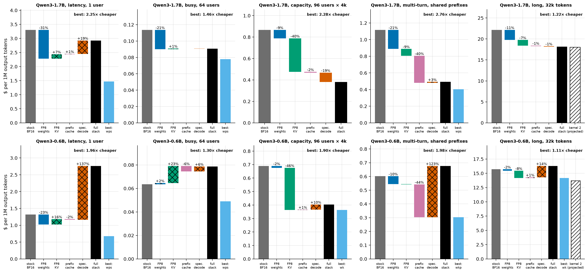

<!-- BEGIN GENERATED: caption-m8_waterfall -->
*The best measured stack serves Qwen3-1.7B at 1.2–2.8× lower cost per token than stock BF16 vLLM on the same L4 (most on multi-turn, least on long); on 8 of 10 model–workload pairs it is not the full stack, because the last technique added made serving dearer (hatched steps).*
<!-- END GENERATED: caption-m8_waterfall -->

A hatched bar is a step that made serving dearer. The light blue bar is the best stack that was measured;
the outlined bar is a projection for the custom kernels, which are not in vLLM (M7).

<!-- BEGIN GENERATED: m8_findings -->
- **The best measured stack, Qwen3-1.7B on one L4, against stock BF16 vLLM:** latency `wps` 2.25×, busy `wps` 1.46×, capacity `wkps` 2.28×, multi-turn `wps` 2.76×, long `wkps` 1.22×. With INT4 weights allowed (lower quality, M4): latency `aps` 3.08×, busy `aps` 1.49×, multi-turn `aps` 3.13×.
- **The full stack (`wkps`: FP8 weights, FP8 KV, prefix caching, speculation) is the best stack on 2 of 5 workloads on Qwen3-1.7B and 0 of 5 on Qwen3-0.6B.** At one user it gives 1.13× where `wps` gives 2.25×; on Qwen3-0.6B it is slower than stock (0.48×).
- **Why: one pair collides.** With an FP8 KV cache and speculation together, vLLM 0.30 gives up its full CUDA graph on this GPU, and a step then waits for the host instead of the GPU: 25.8 ms per step against 4.6 with the graph, for the same GPU work (Qwen3-0.6B, FP8 weights, piecewise graphs forced on a control server).
- **Everything else nearly multiplies:** 17 of 24 pair × workload interactions are within 5% of 1. FP8 KV × speculation is 0.77 at one user.
- **Quality of the lossy part of the stack** (FP8 weights + FP8 KV, Qwen3-1.7B, in vLLM): perplexity ×0.996, needle recall 100%, GSM8K -1.3, MMLU -0.4 and HumanEval -6.1 points. Prefix caching does not change outputs; speculation is lossless in distribution (M6).
- **The serving model, frozen before any M8 server ran:** median error 6.4% over 125 predictions (66% within 15%), 3.5% on servers without speculation. Its large misses are the colliding servers: it had no term for the host. With that one constant fitted on M8, the same points come to 5.1% (71% within 15%).
<!-- END GENERATED: m8_findings -->

Framing: "×" is output tokens per second over stock vLLM 0.30 in BF16 on the same L4 and workload. These are
better configurations of vLLM for a workload, not a faster engine than vLLM. The sections below follow the
milestones in order; [M8](#m8-the-full-stack-and-a-model-that-had-to-predict-it) is where they meet.

Every number in this README is **generated by a script from raw benchmark logs** in `results/raw/`.
None are typed by hand.

### M0: the GPU, measured (not taken from the datasheet)


<!-- BEGIN GENERATED: caption-hw_roofline -->
*Measured BF16 ridge point: 217 FLOPs/byte (FP8: 449); an M=1 matmul (decode at batch 1) sits at 1.0 FLOPs/byte and reaches 0.2% of the measured peak.*
<!-- END GENERATED: caption-hw_roofline -->

Every prediction was committed before measuring, and each gap is explained: the L4 turns out to be power-limited,
running tensor math at about half its maximum clock. Details are in the
[M0 learning doc](docs/learning/M0-foundations.md) and the [gate report](docs/gates/M0-report.md).

### M1: nanoserve, an inference engine from scratch

A readable Qwen3 engine in plain PyTorch (paged KV cache, continuous batching). Its logits match Hugging Face's
**bit for bit** in BF16, with a negative control showing the comparison can detect differences. Profiling it shows
what dominates when nothing is optimized:


<!-- BEGIN GENERATED: caption-m1_anatomy -->
*In a decode, batch 1 step, the attention block takes 61% of the time; tiny ops like RMSNorm cost far more than their arithmetic, because every launch has a fixed cost.*
<!-- END GENERATED: caption-m1_anatomy -->

Details are in the [M1 learning doc](docs/learning/M1-nanoserve.md) and the [gate report](docs/gates/M1-report.md).

### M2: stock vLLM, measured under load

The "before" picture every later technique is judged against: vLLM 0.30 in BF16, driven by an open- and
closed-loop load generator, with vLLM's own Prometheus counters sampled throughout.

<!-- BEGIN GENERATED: m2_summary -->
| Model | Chat TTFT p50 (ms) | Chat TPOT p50 (ms) | Single-stream tokens/s | Sweep peak tokens/s (run average) | Knee (req/s) | $ / 1M tokens at that peak | KV cache (tokens) |
|---|---|---|---|---|---|---|---|
| Qwen3-0.6B | 20.1 | 5.83 | 171 | 2,122 | 12 | 0.105 | 172,640 |
| Qwen3-1.7B | 27.8 | 14.74 | 68 | 1,486 | 4 | 0.150 | 142,928 |
<!-- END GENERATED: m2_summary -->

Held at saturation, the engine is far below the memory-bound ceiling, and the server's own counters show why:


<!-- BEGIN GENERATED: caption-m2_saturation -->
*Held full for 252 s, Qwen3-0.6B decodes 1,849 tokens/s with 252 sequences running, at 54% of the memory-bound ceiling; once the queue drains and no new prompts arrive, steps run at 88% of it.*
<!-- END GENERATED: caption-m2_saturation -->

Two lessons shape the rest of the project:
- **A busy decode step on these small models is mostly KV cache**, so throughput gains will come from KV-cache
  engineering (M5) more than weight quantization (M4).
- **Chunked prefill costs saturated decode about half its speed.** Decode-only steps already run near the memory
  speed.

A quality baseline (perplexity, GSM8K, MMLU, HumanEval, needle-in-a-haystack to 32k) sets the bar every lossy
change must meet. Details are in the [M2 learning doc](docs/learning/M2-baselines.md) and the
[gate report](docs/gates/M2-report.md).

### M3: quantization from scratch

Round-to-nearest, FP8 and NF4 formats, GPTQ, AWQ, Hadamard rotation and SmoothQuant, written in plain PyTorch
and tested against their definitions. Our GPTQ and AWQ match llm-compressor's within a few percent when run on
the same model, grid and calibration data.


<!-- BEGIN GENERATED: caption-m3_pareto -->
*At about 4 bits per weight the method decides the damage, from KL 18 (RTN INT4 per-tensor) down to 0.171 (rotated, GPTQ INT4 g128, full range); the smallest configuration still weighs 0.44 GB, mostly its BF16 embedding.*
<!-- END GENERATED: caption-m3_pareto -->

The outlier atlas explains the spread. A few residual channels are orders of magnitude larger than the rest,
written by one early MLP, and every weight that reads them turns rounding error into large output error:


<!-- BEGIN GENERATED: caption-m3_outlier_atlas -->
*A handful of residual channels (35, 13, 1) reach 1,295× the median channel's maximum; down_proj's input peaks at 629× its median.*
<!-- END GENERATED: caption-m3_outlier_atlas -->

Details, including why rotation *hurt* round-to-nearest here, are in the
[M3 learning doc](docs/learning/M3-quant-reference.md) and the [gate report](docs/gates/M3-report.md).

### M4: quantized checkpoints in vLLM

FP8 and INT8 (W8A8) and INT4 (W4A16, from GPTQ and from AWQ) checkpoints, made with llm-compressor and served by
vLLM with its real low-bit kernels, for both model sizes. Waterfall v1:

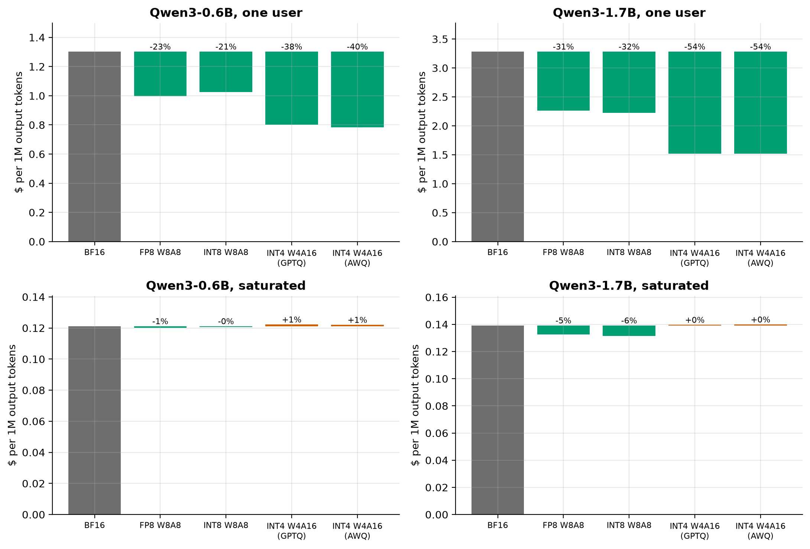

<!-- BEGIN GENERATED: caption-m4_waterfall -->
*On Qwen3-1.7B the cheapest format cuts $ per 1M tokens by 54% for one user (INT4 W4A16 (GPTQ)) but by 6% on a saturated server (INT8 W8A8), where the KV cache dominates every step.*
<!-- END GENERATED: caption-m4_waterfall -->

The cheapest bar isn't free. Quality of each checkpoint, served by vLLM (KL against BF16 on WikiText-2, and M2's
task suite):

<!-- BEGIN GENERATED: m4_quality -->
| Model | Format | KL vs BF16 | GSM8K (%) | MMLU (%) | HumanEval pass@1 (%) |
|---|---|---|---|---|---|
| Qwen3-0.6B | BF16 | 0.000 | 41.7 | 49.6 | 18.9 |
| Qwen3-0.6B | FP8 W8A8 | 0.021 | 40.4 | 46.5 | 20.1 |
| Qwen3-0.6B | INT8 W8A8 | 0.017 | 40.5 | 47.9 | 18.9 |
| Qwen3-0.6B | INT4 W4A16 (GPTQ) | 0.312 | 12.8 | 43.2 | 12.2 |
| Qwen3-0.6B | INT4 W4A16 (AWQ) | 0.232 | 20.6 | 42.5 | 12.2 |
| Qwen3-1.7B | BF16 | 0.000 | 69.0 | 62.8 | 40.2 |
| Qwen3-1.7B | FP8 W8A8 | 0.020 | 67.4 | 62.0 | 36.6 |
| Qwen3-1.7B | INT8 W8A8 | 0.028 | 67.4 | 61.7 | 38.4 |
| Qwen3-1.7B | INT4 W4A16 (GPTQ) | 0.162 | 47.2 | 57.6 | 12.8 |
| Qwen3-1.7B | INT4 W4A16 (AWQ) | 0.186 | 55.4 | 58.9 | 21.3 |
<!-- END GENERATED: m4_quality -->

8-bit formats stay within a few points of BF16. INT4 costs real accuracy on multi-step generation at these sizes.

Which format wins depends on the batch. INT4 reads the fewest bytes; FP8 has the faster math:

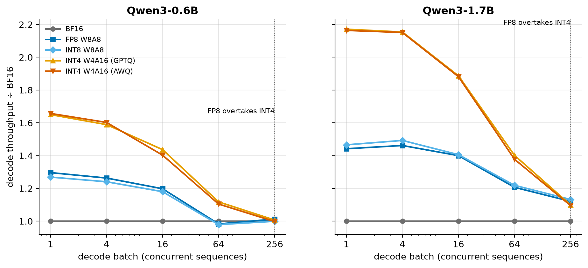

<!-- BEGIN GENERATED: caption-m4_speedup_vs_batch -->
*On Qwen3-1.7B, INT4 decodes 2.2× faster than BF16 at batch 1 but 1.1× at batch 256; FP8 overtakes it from batch 256.*
<!-- END GENERATED: caption-m4_speedup_vs_batch -->

What M4 found:
- **Bytes explain speed.** Bytes read ÷ measured bandwidth, plus one fixed overhead fitted on BF16, predicts
  INT4's batch-1 latency almost exactly. W8A8 runs slower than its bytes predict. M4 blamed the separate pass
  in which vLLM quantizes every layer's input; M7 measured that pass and it covers under half of the gap.
- **The kernels are faithful.** vLLM's perplexity with its low-bit kernels matches our PyTorch simulation of the
  same rounded weights, so M3's quality results carry over to production.
- **A task score can hide *how* a model fails.** Part of GPTQ's GSM8K loss is the model not stopping after its
  answer, and the metric reads the *last* number. Logging every answer found it. On strict-match, GPTQ vs AWQ
  ranks the way KL predicts.

Details are in the [M4 learning doc](docs/learning/M4-quant-production.md) and the
[gate report](docs/gates/M4-report.md).

### M5: the KV cache

At high load and long context the KV cache, not the weights, is the traffic. M5 stores it in fewer bits,
evicts it, and reuses it across requests, judging each change on recall at up to 32k tokens. Waterfall v2
credits each change separately. FP8 KV forces a different attention kernel on this GPU, so the kernel switch
gets a step of its own:

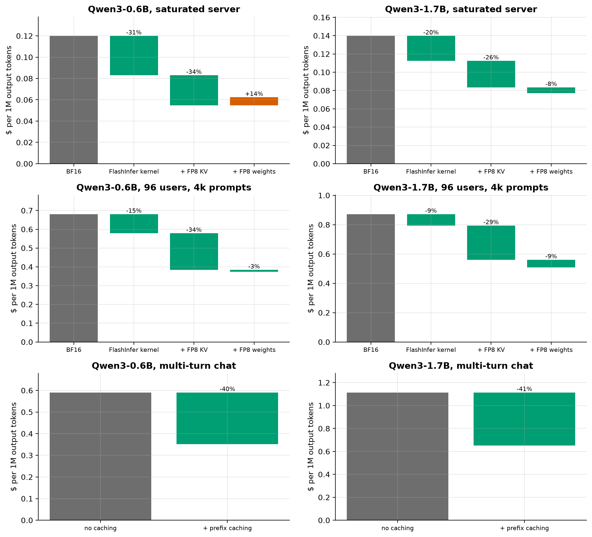

<!-- BEGIN GENERATED: caption-m5_waterfall -->
*Waterfall v2, Qwen3-0.6B, the cheapest setup against BF16: saturated server -54% (FP8 KV; the FlashInfer kernel alone -31%); 96 users, 4k prompts -45% (FP8 weights + FP8 KV; the FlashInfer kernel alone -15%); multi-turn chat -40% (prefix caching).*
<!-- END GENERATED: caption-m5_waterfall -->

At what quality: vLLM with an FP8 cache against BF16 (WikiText-2 perplexity, and the needle grid from 1k to 32k
tokens):

<!-- BEGIN GENERATED: m5_vllm_quality -->
| Model | Perplexity, BF16 KV | Perplexity, FP8 KV | Change | Needle, BF16 KV | Needle, FP8 KV |
|---|---|---|---|---|---|
| Qwen3-0.6B | 19.54 | 19.78 | 1.21% | 100% | 100% |
| Qwen3-1.7B | 15.55 | 15.23 | -2.05% | 100% | 100% |
<!-- END GENERATED: m5_vllm_quality -->

Cheaper formats are only safe with the right grid. Qwen3's keys carry huge outlier channels, so a per-token
integer cache loses the needle while KIVI-style per-channel keys keep it:

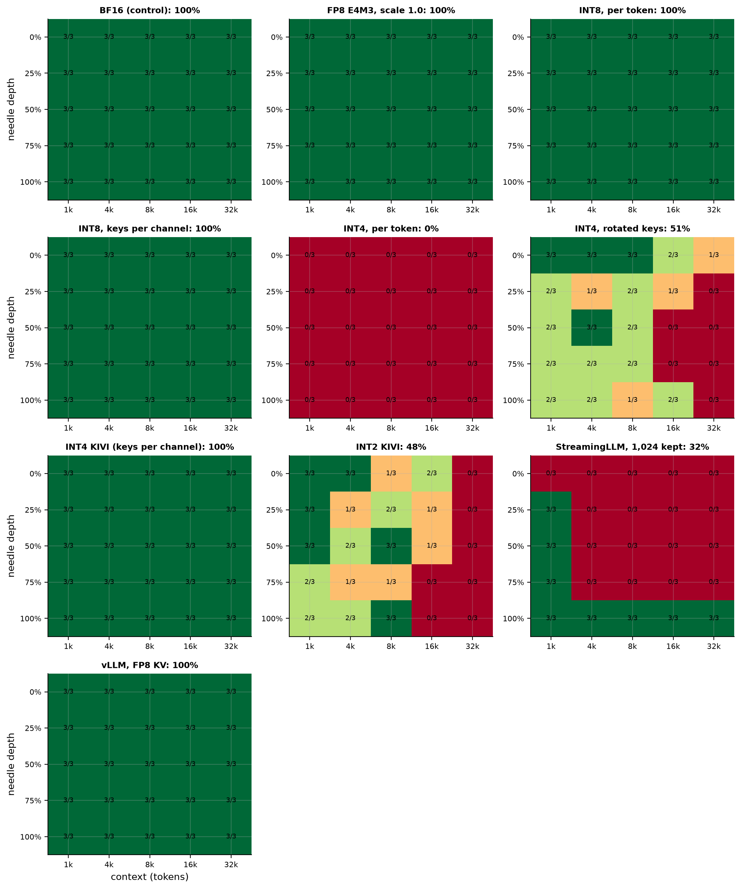

<!-- BEGIN GENERATED: caption-m5_needle -->
*Every policy keeps the needle except INT4, per token (0%), INT4, rotated keys (51%), INT2 KIVI (48%), StreamingLLM, 1,024 kept (32%).*
<!-- END GENERATED: caption-m5_needle -->

What M5 found:
- **Measure the kernel, not just the format.** Much of FP8 KV's gain on a busy server came from the attention
  kernel it switches to. A BF16 control on that kernel separated the two.
- **KL can't see eviction.** StreamingLLM barely moved KL on 2k-token text and lost most needles at long
  context.
- **Prefix caching helps everyone, not just the cached request.** Shorter prefills stop stalling other
  sequences' decode steps. vLLM's block hashing reused nearly all that a reference radix tree says is
  reusable.

Details are in the [M5 learning doc](docs/learning/M5-kv-cache.md) and the [gate report](docs/gates/M5-report.md).

### M6: speculative decoding

A drafter guesses the next few tokens, and the target model checks them all in one pass. The sampler, drafters
and draft-verify loop are written from scratch and **tested to be lossless**: speculative samples match the
target's exact distribution on a toy model and on tiny Qwen3 models, and a deliberately broken sampler fails
the same test. Which tokens a small model guesses for a larger one:

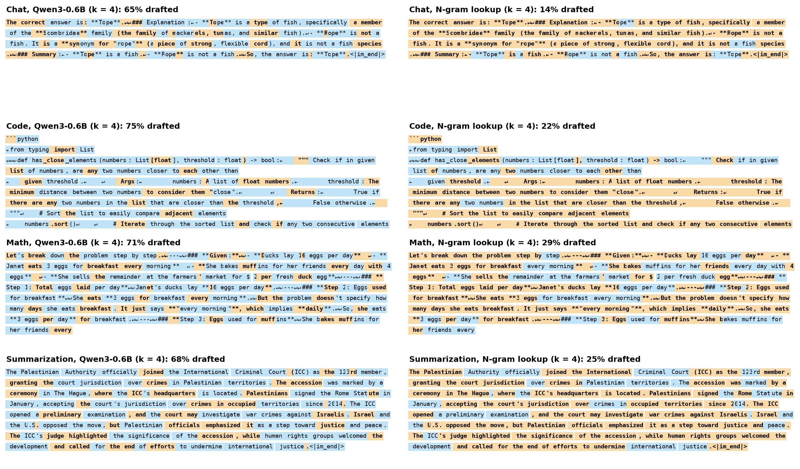

<!-- BEGIN GENERATED: caption-m6_highlight -->
*Blue tokens were drafted and accepted; bold orange ones the target wrote itself. Qwen3-0.6B drafted 75% of the code answer; N-gram lookup drafted 14% of the chat answer.*
<!-- END GENERATED: caption-m6_highlight -->

In vLLM, three kinds of drafter against Qwen3-1.7B, from one user to a busy server:

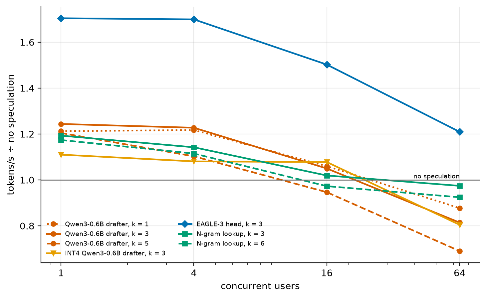

<!-- BEGIN GENERATED: caption-m6_speedup_vs_users -->
*The best method for one user (EAGLE-3 head, k = 3, 1.70×) gives 1.21× at 64 users, and 6 of the 7 setups fall below no speculation there: speculation spends spare compute, and a busy server has little.*
<!-- END GENERATED: caption-m6_speedup_vs_users -->

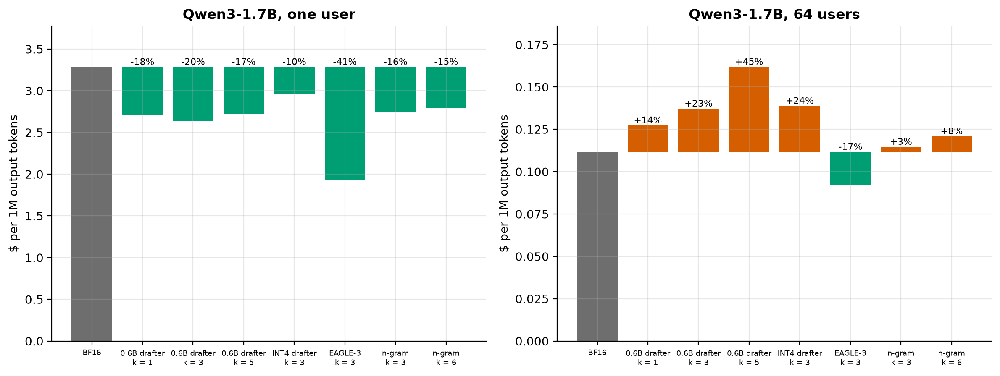

<!-- BEGIN GENERATED: caption-m6_waterfall -->
*Waterfall v3: speculative decoding against BF16 on Qwen3-1.7B: for one user the best method changes cost by -41%; at 64 users every method lands between -17% and +45%.*
<!-- END GENERATED: caption-m6_waterfall -->

The real draft-verify loop against plain greedy decoding, on the real models:

<!-- BEGIN GENERATED: m6_loop -->
| Arithmetic | Prompts | Outputs identical to plain greedy | Rounds identical to the replay | Tokens per pass, real loop | Tokens per pass, replay |
|---|---|---|---|---|---|
| BF16 | 16 | 11 of 16 | 8 of 16 | 3.26 | 3.27 |
| float32 (control) | 16 | 16 of 16 | 16 of 16 | 3.32 | 3.32 |
<!-- END GENERATED: m6_loop -->

What M6 found:
- **Cheap guesses beat good guesses.** The EAGLE-3 head has the lowest acceptance rate and the highest
  speedup, because a guess costs it a small fraction of a target step. A separate draft model guesses better
  and gains little.
- **Speculation spends idle compute, so it competes with everything else that does.** The gain shrinks as
  users are added, and on a quantized (faster) target the same drafter costs throughput.
- **A draft model halves the KV cache.** It keeps its own keys and values for every token.
- **Speculation exposed BF16's rounding.** Outputs that are identical in float32 sometimes differ in BF16:
  passes of different shapes round differently, and near-ties flip. The float32 control separates that from
  the algorithm.

Details are in the [M6 learning doc](docs/learning/M6-speculative-decoding.md) and the
[gate report](docs/gates/M6-report.md).

### M7: custom Triton kernels

Two kernels, each chosen from a profile, each with a plain-PyTorch reference and tests against it:

1. **RMSNorm fused with INT8 activation quantization.** vLLM runs these as two kernels for INT8 checkpoints
   (its fusion pass covers FP8 only).
2. **Decode attention that reads a 4-bit KV cache directly.** M5 showed 4-bit keys and values keep quality,
   by simulation. This kernel reads real codes without ever writing them back out as floats: the keys' grid
   is folded into the query, the values' grid into the attention weights.

One layer's decode attention, over batch and context length. Each panel isolates one thing:

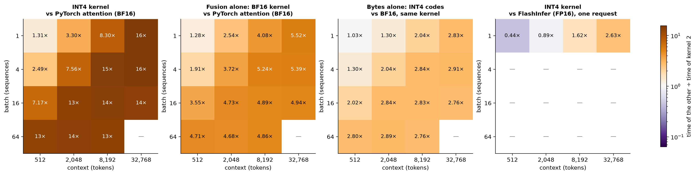

<!-- BEGIN GENERATED: caption-m7_speedup -->
*Kernel 2 on INT4 codes is 1.3–16× the speed of nanoserve's PyTorch attention (0 of 15 shapes slower), and 0.44–2.63× FlashInfer's on a full-precision cache: fewer bytes win at long context, launch overhead decides the short ones.*
<!-- END GENERATED: caption-m7_speedup -->

Both kernels against the memory bandwidth measured in M0:

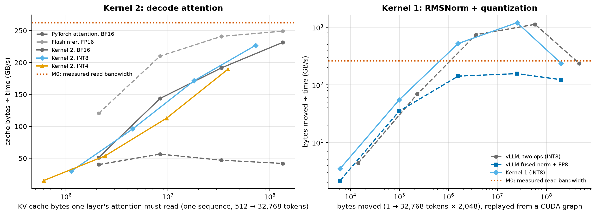

<!-- BEGIN GENERATED: caption-m7_roofline -->
*At 1 × 32,768 tokens kernel 2 reads the BF16 cache at 88% of the measured bandwidth and the INT4 cache at 72%, where PyTorch's path manages 16%; kernel 1 moves its bytes at 90% once they no longer fit in the cache (above the line, the data is in L2).*
<!-- END GENERATED: caption-m7_roofline -->

Quality with the real codes, every token decoded through the kernel:

<!-- BEGIN GENERATED: m7_quality -->
| KV cache and reader | KL vs BF16 cache (nats) | Same top token | Perplexity | BF16 perplexity | M5's simulated KL | Needle recall | M5's simulated recall |
|---|---|---|---|---|---|---|---|
| BF16 + kernel 2 | 0.0011 | 98.3% | 29.29 | 29.28 | — | — | — |
| INT8 codes + kernel 2 | 0.0012 | 98.2% | 29.30 | 29.28 | 0.0014 | — | 100% |
| INT4 codes + kernel 2 | 0.011 | 94.4% | 29.55 | 29.28 | 0.032 | 100% | 100% |
<!-- END GENERATED: m7_quality -->

Inside the from-scratch engine, every GPU kernel of one decode step, before and after:

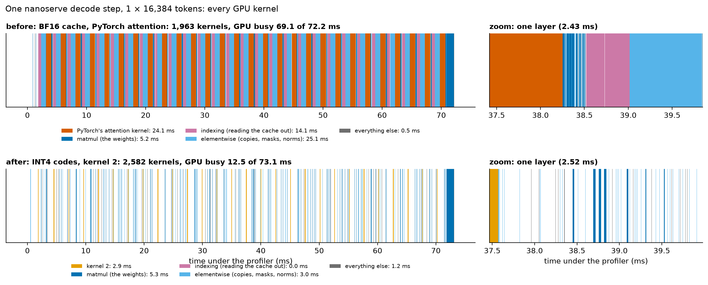

<!-- BEGIN GENERATED: caption-m7_timeline -->
*One decode step at 1 × 16,384 tokens: the GPU works 69 of 72 ms before and 12 of 73 ms after; what is left is 2,582 small kernels with gaps between them (Python between launches), which no attention kernel can shorten.*
<!-- END GENERATED: caption-m7_timeline -->

The kernels are not integrated into vLLM. What their timings imply for it, with the method checked against a
step vLLM really ran (first row; the second row is the same check with the biased cache-eviction method
this milestone found and replaced):

<!-- BEGIN GENERATED: m7_projection -->
*Short-context step: 5.8 ms; 28 layers.*

| Attention kernel and cache | One layer (µs) | Projected vLLM step (ms) | Measured in vLLM (ms) | Projection error |
|---|---|---|---|---|
| FlashInfer, full-precision cache | 539 | 20.9 | 20.6 | 1.4% |
| FlashInfer, timed with the write flush | 691 | 25.1 | 20.6 | 22.0% |
| Kernel 2, BF16 cache | 580 | 22.0 | — | — |
| Kernel 2, INT8 codes | 319 | 14.7 | — | — |
| Kernel 2, INT4 codes | 205 | 11.5 | — | — |
| vLLM's FP8 cache (measured only) | — | — | 13.8 | — |
<!-- END GENERATED: m7_projection -->

What M7 found:
- **Fewer bytes win at long context, launches decide the short ones.** On the same full-precision bytes
  FlashInfer, vLLM's hand-tuned attention library, is slightly faster than the Triton kernel. On 4-bit codes
  the kernel overtakes it once the cache is a few thousand tokens long.
- **"Memory-bound" is a claim to test.** The 4-bit path turned out to be limited by arithmetic per token, not
  memory: replayed warm from a CUDA graph, with its whole cache in L2, it is no faster than cold.
- **A faster kernel only shortens a step that waits on the GPU.** In the reference engine, fusing attention
  cut the GPU's work per step several times over, and then Python between kernel launches became the limit.
- **Measure the measurement.** The project's cold-cache timings carried a constant bias from how the cache
  was evicted. A warm replay that was *faster* than a cold run of data too big for the cache exposed it.
- **Fusing norm and quantization** pays inside a CUDA graph (one launch instead of two; fewer bytes at
  prefill sizes) and not at all when launched from Python on small inputs. In vLLM's decode step the
  ceiling is small.

Details are in [docs/04-kernels.md](docs/04-kernels.md), the
[M7 learning doc](docs/learning/M7-triton-kernels.md) and the [gate report](docs/gates/M7-report.md).

### M8: the full stack, and a model that had to predict it

Every technique from M4–M6 switched on one at a time and in every combination: 16 servers on Qwen3-1.7B (so
the ladder, leave-one-out and every pair come from one design), the ladder on Qwen3-0.6B, five workloads,
and 10 control servers added when the results needed explaining. A performance model built from bytes and
FLOPs was calibrated on M2–M6 and **frozen before any of it ran**.

The best measured stack per workload, against stock BF16 vLLM on the same GPU:

<!-- BEGIN GENERATED: m8_best_large -->
| Workload | Stock BF16 (tokens/s) | Full stack `wkps` | Best measured stack | Its speedup | Its perplexity vs BF16 | Best with INT4 weights, if faster | Its speedup |
|---|---|---|---|---|---|---|---|
| Latency (1 user, real prompts) | 67 | 1.13× | `wps` | 2.25× | +0.0% | `aps` | 3.08× |
| Busy (64 users, real prompts) | 1,955 | 1.25× | `wps` | 1.46× | +0.0% | `aps` | 1.49× |
| Capacity (96 users, 4k-token prompts) | 256 | 2.28× | `wkps` | 2.28× | -0.4% | — | — |
| Multi-turn (8 users, shared prefixes) | 199 | 2.27× | `wps` | 2.76× | +0.0% | `aps` | 3.13× |
| Long (1 user, 32k tokens) | 10 | 1.22× | `wkps` | 1.22× | -0.4% | — | — |
<!-- END GENERATED: m8_best_large -->

**The best stack is not the full stack.** FP8 KV and speculative decoding are each a gain, and together they
are a loss at low load. Four rounds of control servers, each with predictions committed first, traced it to
vLLM's CUDA graphs: with that pair, vLLM 0.30 on this GPU cannot replay a decode pass as one graph, Python
runs between every layer, and the GPU waits for the host.

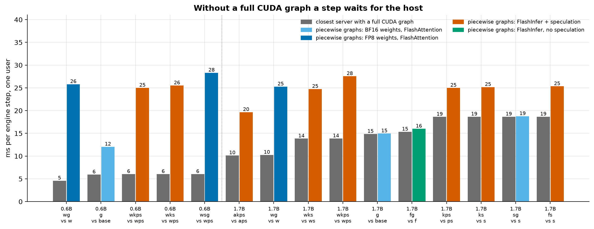

<!-- BEGIN GENERATED: caption-m8_host_chain -->
*12 of 15 servers on piecewise graphs are slower than their full-graph twin, by up to 5.6× (`wg` on Qwen3-0.6B: 26 ms per step against 5). The 3 that are not are the ones whose GPU already needs 15 ms or more per step: the host's time hides behind the GPU's.*
<!-- END GENERATED: caption-m8_host_chain -->

The first explanation was wrong, and the write-up keeps it: forcing the same graph mode on the larger model
showed no loss, because its GPU work per pass is long enough to hide the host. The control could not see what
it was built to see.

Do gains multiply? Mostly:

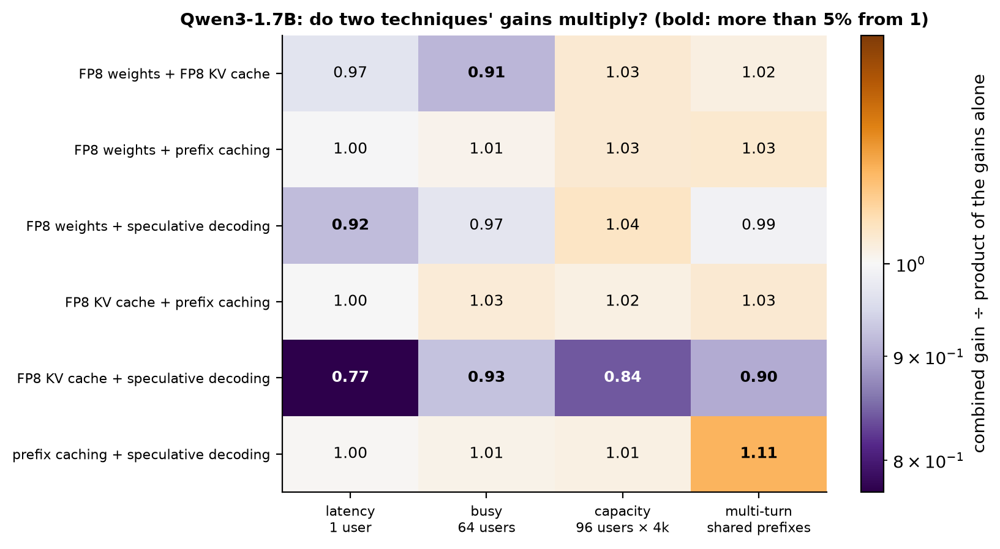

<!-- BEGIN GENERATED: caption-m8_interactions -->
*17 of 24 pairs multiply to within 5%. The pair that competes most is FP8 KV cache with speculative decoding on latency (0.77); the pair that helps each other most is prefix caching with speculative decoding on multi-turn (1.11). Two runs of the stock server differ by up to 1%.*
<!-- END GENERATED: caption-m8_interactions -->

The model's frozen predictions against what was measured:

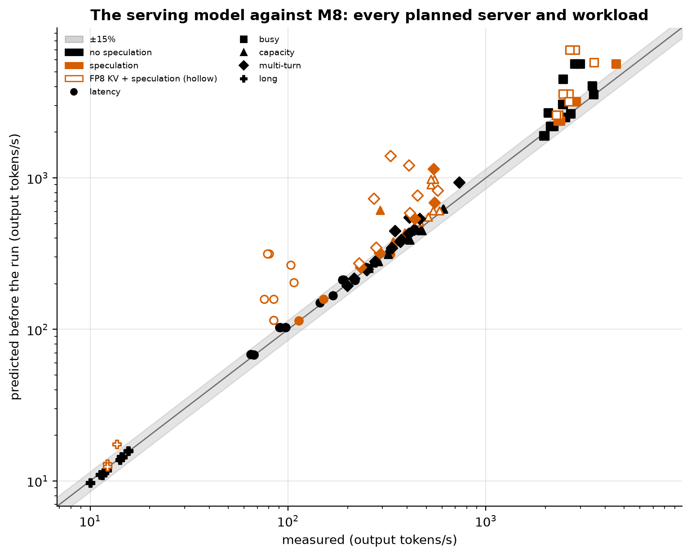

<!-- BEGIN GENERATED: caption-m8_predicted -->
*Frozen before any M8 server ran, the model's 125 predictions have a median error of 6% (66% within 15%): 3% without speculation, 11% with it, and 45% where FP8 KV meets speculation, which the model had no term for.*
<!-- END GENERATED: caption-m8_predicted -->

What M8 found:
- **Report a gain with what else was on.** A technique's speedup alone and its worth inside a stack are
  different numbers, and here one of them changed sign.
- **The third lever works in reverse.** Nothing about the bytes or the math changed between the best server
  and the worst; only the host's work between them did.
- **A null result is only as good as what the measurement could have seen.** A slow GPU pass hides a slow
  host. The same control on a smaller model exposed it.
- **A roofline model bounds the GPU, not the server.** Where a pass waits for the GPU the model is within a
  few percent; where it waits for the host the model had nothing to say until that term was added.
- **Energy follows time.** The stock server sits at the GPU's power limit even with one user; the only
  servers that drew less were the ones waiting for their host, and they were slower.
- **Scope:** this collision is a property of vLLM 0.30 on a GPU older than Hopper, read from vLLM's source.
  It is not a claim about FP8 KV or speculation, and it should not occur on an H100 (not measured here).

Details are in [docs/06-results-analysis.md](docs/06-results-analysis.md) (every bar explained, and the
investigation round by round), [docs/07-performance-model.md](docs/07-performance-model.md) (the model, its
errors, and a map of which stack to deploy for which traffic), the
[M8 learning doc](docs/learning/M8-full-stack.md) and the [gate report](docs/gates/M8-report.md).

---

## Why small models on a small GPU?

Decode speed depends on *bytes moved per token ÷ memory bandwidth*, compared with fixed overheads like kernel
launches. Sub-2B models on an L4 sit in the same memory-bound regime as much larger models on flagship GPUs, so every
optimization lever shows up clearly, at a tiny fraction of the cost. Small models also expose effects that
big-model studies overlook:
- embedding-heavy parameter budgets
- KV-cache traffic that overtakes weight traffic at modest batch sizes
- launch overhead that rivals memory time

Two sizes from one family show **how each gain changes with model size**.

---

## What's being built

| Component | Description |
|---|---|
| **nanoserve** | A minimal Llama-family (Qwen3) inference engine in plain PyTorch (paged KV cache, continuous batching), verified against Hugging Face logits. Used as the testbed for every technique. |
| **Quantization** | From-scratch RTN, GPTQ, AWQ, Hadamard rotation, INT8 and FP8, validated against llm-compressor checkpoints, then served in vLLM. |
| **KV-cache engineering** | INT8/INT4/FP8 KV quantization, a radix-tree prefix cache, and a KV sizing model. Long-context correctness is checked with needle-in-a-haystack. |
| **Speculative decoding** | Rejection sampler and draft/verify loop, with a **statistical test proving outputs are unchanged**. Benchmarks cover n-gram drafting and Qwen3-0.6B drafting for Qwen3-1.7B. |
| **Triton kernels** | At least two kernels chosen by profiling, e.g. fused RMSNorm + quantize and decode attention over a quantized KV cache. |
| **Performance model** | An analytical roofline model that predicts latency, throughput and cost, validated against every measured configuration. |
| **Results dashboard** | Interactive figures and a "what should I deploy?" calculator, hosted on GitHub Pages. |

---

## Engineering principles

- **Reference before fast.** Every optimized path has a plain-PyTorch reference and a test comparing the two.
- **Never speed without quality.** Every lossy change reports KL divergence, task scores and long-context recall.
- **Measured, not estimated.** Warmup, ≥5 runs, and median/p90/p99 reporting with CUDA-event timing. Every result records git commit, GPU, host, driver and library versions, seed and config.
- **Predict, then measure.** Each experiment starts with a back-of-envelope prediction, and the gap to the measured number gets explained.
- **Honest claims.** The claim is always "a better configuration of vLLM for workload X at equal quality", never "faster than vLLM".
- **Failures are documented.** Dead ends are logged in `JOURNAL.md` and never quietly deleted.

---

## Roadmap

| # | Milestone | Status |
|---|---|---|
| M0 | Foundations: cloud environment, measured hardware roofline | ✅ Done |
| M1 | nanoserve: inference from scratch, prefill vs decode | ✅ Done |
| M2 | Baselines: vLLM benchmarks + quality harness | ✅ Done |
| M3 | Quantization from scratch (RTN, GPTQ, AWQ, rotation, INT8/FP8) | ✅ Done |
| M4 | Quantization in production: format crossover vs batch size | ✅ Done |
| M5 | KV-cache quantization and prefix caching | ✅ Done |
| M6 | Speculative decoding, proven lossless | ✅ Done |
| M7 | Custom Triton kernels: fused norm + INT8, attention over a 4-bit KV cache | ✅ Done |
| M8 | Full-stack ablation across model sizes, performance model | ✅ Done |
| M9 | Dashboard, write-up, one-command reproduction | 🚧 In progress |

---

## Tech stack

**Models:** Qwen3-0.6B (main), Qwen3-1.7B · **Serving:** vLLM · **Kernels:** Triton ·
**Quantization:** llm-compressor + own reference code ·
**Evaluation:** lm-evaluation-harness, KL harness, needle-in-a-haystack ·
**Compute:** NVIDIA L4 on Modal (serverless), GitHub Actions for CPU tests ·
**Tooling:** PyTorch, uv, ruff, pytest, GitHub Actions · **Plots:** matplotlib, Plotly

---

## Reproduce

Everything runs in the cloud on [Modal](https://modal.com). Locally you only need [uv](https://docs.astral.sh/uv/).

<!-- BEGIN GENERATED: compute_spend -->
Cloud compute so far: **$41.50** on Modal (L4 $23.77, CPU $9.85, Memory $7.87), billed through 2026-10-02 08:00 UTC.
<!-- END GENERATED: compute_spend -->

```bash
uv sync --only-group local                                   # ~50 MB: the Modal client and ruff, nothing else
uv run --only-group local modal setup                        # log in to Modal once
uv run --only-group local modal run infra/modal_app.py::test       # CPU tests
uv run --only-group local modal run infra/modal_app.py::test_gpu   # GPU tests on an NVIDIA L4
uv run --only-group local modal run infra/modal_app.py::probe      # measure the GPU -> results/raw/
uv run --only-group local modal run infra/modal_app.py::m2         # vLLM serving baselines -> results/raw/
uv run --only-group local modal run infra/modal_app.py::m2q        # quality baselines -> results/raw/
uv run --only-group local modal run infra/modal_app.py::m3         # quantization from scratch -> results/raw/
uv run --only-group local modal run infra/modal_app.py::m8         # the full-stack ablation -> results/raw/
uv run --only-group local modal run infra/modal_app.py::figures    # draw -> results/figures/
uv run --only-group local python scripts/render_docs.py            # refresh generated tables in the docs
```

On Windows, set `PYTHONUTF8=1` first. Linux/macOS users can use the `Makefile` shortcuts (`make probe`, …).

---

## License

[MIT](LICENSE)
