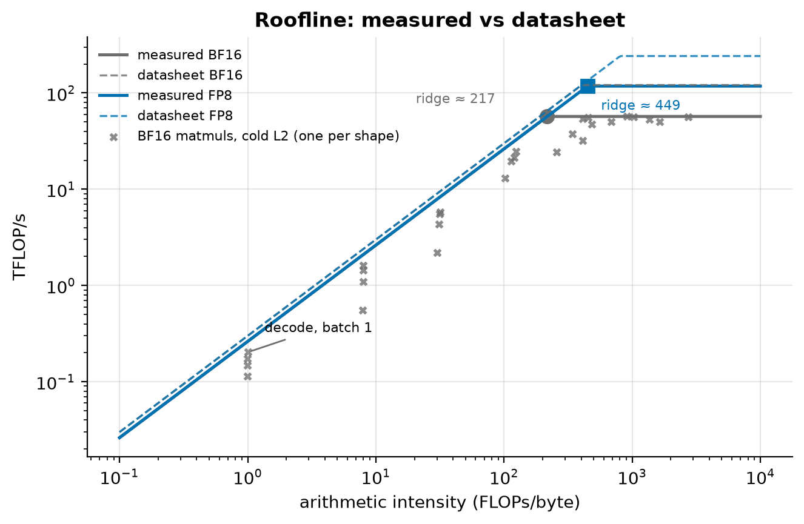
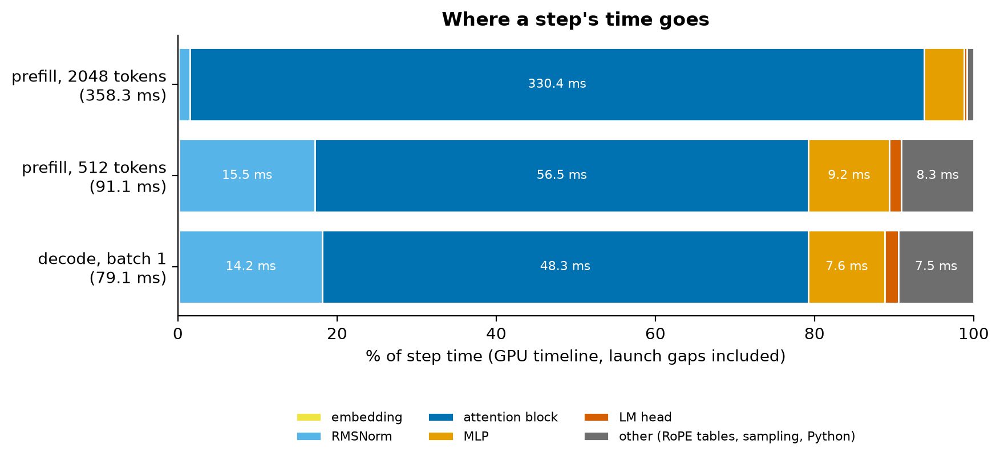
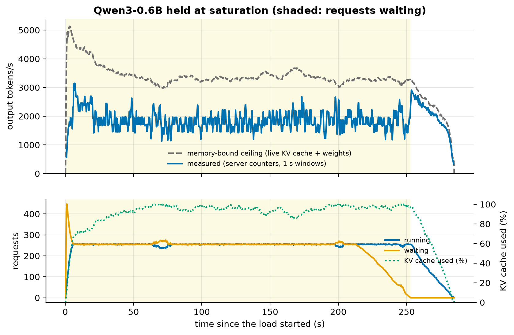

# bytes-per-token

**Making small open-weight LLMs serve faster and cheaper on a low-cost cloud GPU, and showing exactly where every gain comes from.**

Starting from a stock vLLM deployment in BF16, this project layers on quantization, KV-cache engineering,
speculative decoding and custom Triton kernels. It measures every step for **speed, cost and quality**.
Each technique is first built from scratch as a readable reference, then tested against the production
implementation, then benchmarked in a real serving engine.

All experiments use **Qwen3-0.6B and Qwen3-1.7B** on a single **NVIDIA L4** (serverless, billed per second), and
everything is reproducible in the cloud with one command.

> **Status:** 🚧 In progress: Milestone 4 (quantization in production). Results appear below as each milestone lands.

---

## The idea in one table

Decoding a token on a GPU is limited by **memory traffic**, not math. Every speedup here is attributed to one of three levers:

| Lever | What it means | Techniques in this project |
|---|---|---|
| **Move fewer bytes** | Shrink what must be read from GPU memory per token | Weight quantization (FP8, INT8, INT4 GPTQ/AWQ), KV-cache quantization |
| **More tokens per byte moved** | Reuse each memory read for more useful work | Batching, prefix caching, speculative decoding |
| **Less waste between bytes and math** | Remove overhead between memory and compute | Fused Triton kernels, CUDA graphs |

If a result can't be explained through these levers plus roofline analysis, it isn't reported until it can.

---

## Results

*Coming soon.* The headline figure will be a **cost waterfall** ($ per 1M tokens at equal quality) for both model
sizes. It gains one bar per milestone: BF16 baseline → FP8/INT4 weights → KV compression → prefix caching →
speculative decoding → custom kernels.

Every number in this README is **generated by a script from raw benchmark logs** in `results/raw/`.
None are typed by hand.

### M0: the GPU, measured (not taken from the datasheet)



<!-- BEGIN GENERATED: caption-hw_roofline -->
*Measured BF16 ridge point: 217 FLOPs/byte (FP8: 449); an M=1 matmul (decode at batch 1) sits at 1.0 FLOPs/byte and reaches 0.2% of the measured peak.*
<!-- END GENERATED: caption-hw_roofline -->

Every prediction was committed before measuring, and each gap is explained: the L4 turns out to be power-limited,
running tensor math at about half its maximum clock. Details are in the
[M0 learning doc](docs/learning/M0-foundations.md) and the [gate report](docs/gates/M0-report.md).

### M1: nanoserve, an inference engine from scratch

A readable Qwen3 engine in plain PyTorch (paged KV cache, continuous batching). Its logits match Hugging Face's
**bit for bit** in BF16, with a negative control showing the comparison can detect differences. Profiling it shows
what dominates when nothing is optimized:



<!-- BEGIN GENERATED: caption-m1_anatomy -->
*In a decode, batch 1 step, the attention block takes 61% of the time; tiny ops like RMSNorm cost far more than their arithmetic, because every launch has a fixed cost.*
<!-- END GENERATED: caption-m1_anatomy -->

Details are in the [M1 learning doc](docs/learning/M1-nanoserve.md) and the [gate report](docs/gates/M1-report.md).

### M2: stock vLLM, measured under load

The "before" picture every later technique is judged against: vLLM 0.30 in BF16, driven by an open- and
closed-loop load generator, with vLLM's own Prometheus counters sampled throughout.

<!-- BEGIN GENERATED: m2_summary -->
| Model | Chat TTFT p50 (ms) | Chat TPOT p50 (ms) | Single-stream tokens/s | Sweep peak tokens/s (run average) | Knee (req/s) | $ / 1M tokens at that peak | KV cache (tokens) |
|---|---|---|---|---|---|---|---|
| Qwen3-0.6B | 20.1 | 5.83 | 171 | 2,122 | 12 | 0.105 | 172,640 |
| Qwen3-1.7B | 27.8 | 14.74 | 68 | 1,486 | 4 | 0.150 | 142,928 |
<!-- END GENERATED: m2_summary -->

Held at saturation, the engine is far below the memory-bound ceiling, and the server's own counters show why:



<!-- BEGIN GENERATED: caption-m2_saturation -->
*Held full for 252 s, Qwen3-0.6B decodes 1,849 tokens/s with 252 sequences running, at 54% of the memory-bound ceiling; once the queue drains and no new prompts arrive, steps run at 88% of it.*
<!-- END GENERATED: caption-m2_saturation -->

Two lessons shape the rest of the project:
- **A busy decode step on these small models is mostly KV cache**, so throughput gains will come from KV-cache
  engineering (M5) more than weight quantization (M4).
- **Chunked prefill costs saturated decode about half its speed.** Decode-only steps already run near the memory
  speed.

A quality baseline (perplexity, GSM8K, MMLU, HumanEval, needle-in-a-haystack to 32k) sets the bar every lossy
change must meet. Details are in the [M2 learning doc](docs/learning/M2-baselines.md) and the
[gate report](docs/gates/M2-report.md).

### M3: quantization from scratch

Round-to-nearest, FP8 and NF4 formats, GPTQ, AWQ, Hadamard rotation and SmoothQuant, written in plain PyTorch
and tested against their definitions. Our GPTQ and AWQ match llm-compressor's within a few percent when run on
the same model, grid and calibration data.


<!-- BEGIN GENERATED: caption-m3_pareto -->
*At about 4 bits per weight the method decides the damage, from KL 18 (RTN INT4 per-tensor) down to 0.171 (rotated, GPTQ INT4 g128, full range); the smallest configuration still weighs 0.44 GB, mostly its BF16 embedding.*
<!-- END GENERATED: caption-m3_pareto -->

The outlier atlas explains the spread. A few residual channels are orders of magnitude larger than the rest,
written by one early MLP, and every weight that reads them turns rounding error into large output error:


<!-- BEGIN GENERATED: caption-m3_outlier_atlas -->
*A handful of residual channels (35, 13, 1) reach 1,295× the median channel's maximum; down_proj's input peaks at 629× its median.*
<!-- END GENERATED: caption-m3_outlier_atlas -->

Details, including why rotation *hurt* round-to-nearest here, are in the
[M3 learning doc](docs/learning/M3-quant-reference.md) and the [gate report](docs/gates/M3-report.md).

---

## Why small models on a small GPU?

Decode speed depends on *bytes moved per token ÷ memory bandwidth*, compared with fixed overheads like kernel
launches. Sub-2B models on an L4 sit in the same memory-bound regime as much larger models on flagship GPUs, so every
optimization lever shows up clearly, at a tiny fraction of the cost. Small models also expose effects that
big-model studies overlook:
- embedding-heavy parameter budgets
- KV-cache traffic that overtakes weight traffic at modest batch sizes
- launch overhead that rivals memory time

Two sizes from one family show **how each gain changes with model size**.

---

## What's being built

| Component | Description |
|---|---|
| **nanoserve** | A minimal Llama-family (Qwen3) inference engine in plain PyTorch (paged KV cache, continuous batching), verified against Hugging Face logits. Used as the testbed for every technique. |
| **Quantization** | From-scratch RTN, GPTQ, AWQ, Hadamard rotation, INT8 and FP8, validated against llm-compressor checkpoints, then served in vLLM. |
| **KV-cache engineering** | INT8/INT4/FP8 KV quantization, a radix-tree prefix cache, and a KV sizing model. Long-context correctness is checked with needle-in-a-haystack. |
| **Speculative decoding** | Rejection sampler and draft/verify loop, with a **statistical test proving outputs are unchanged**. Benchmarks cover n-gram drafting and Qwen3-0.6B drafting for Qwen3-1.7B. |
| **Triton kernels** | At least two kernels chosen by profiling, e.g. fused RMSNorm + quantize and decode attention over a quantized KV cache. |
| **Performance model** | An analytical roofline model that predicts latency, throughput and cost, validated against every measured configuration. |
| **Results dashboard** | Interactive figures and a "what should I deploy?" calculator, hosted on GitHub Pages. |

---

## Engineering principles

- **Reference before fast.** Every optimized path has a plain-PyTorch reference and a test comparing the two.
- **Never speed without quality.** Every lossy change reports KL divergence, task scores and long-context recall.
- **Measured, not estimated.** Warmup, ≥5 runs, and median/p90/p99 reporting with CUDA-event timing. Every result records git commit, GPU, host, driver and library versions, seed and config.
- **Predict, then measure.** Each experiment starts with a back-of-envelope prediction, and the gap to the measured number gets explained.
- **Honest claims.** The claim is always "a better configuration of vLLM for workload X at equal quality", never "faster than vLLM".
- **Failures are documented.** Dead ends are logged in `JOURNAL.md` and never quietly deleted.

---

## Roadmap

| # | Milestone | Status |
|---|---|---|
| M0 | Foundations: cloud environment, measured hardware roofline | ✅ Done |
| M1 | nanoserve: inference from scratch, prefill vs decode | ✅ Done |
| M2 | Baselines: vLLM benchmarks + quality harness | ✅ Done |
| M3 | Quantization from scratch (RTN, GPTQ, AWQ, rotation, INT8/FP8) | ✅ Done |
| M4 | Quantization in production: format crossover vs batch size | 🚧 In progress |
| M5 | KV-cache quantization and prefix caching | ⏳ |
| M6 | Speculative decoding, proven lossless | ⏳ |
| M7 | Custom Triton kernels | ⏳ |
| M8 | Full-stack ablation across model sizes, performance model | ⏳ |
| M9 | Dashboard, write-up, one-command reproduction | ⏳ |

---

## Tech stack

**Models:** Qwen3-0.6B (main), Qwen3-1.7B · **Serving:** vLLM · **Kernels:** Triton ·
**Quantization:** llm-compressor + own reference code ·
**Evaluation:** lm-evaluation-harness, KL harness, needle-in-a-haystack ·
**Compute:** NVIDIA L4 on Modal (serverless), GitHub Actions for CPU tests ·
**Tooling:** PyTorch, uv, ruff, pytest, GitHub Actions · **Plots:** matplotlib, Plotly

---

## Reproduce

Everything runs in the cloud on [Modal](https://modal.com). Locally you only need [uv](https://docs.astral.sh/uv/).

<!-- BEGIN GENERATED: compute_spend -->
Cloud compute so far: **$4.12** on Modal (L4 $2.36, CPU $1.00, Memory $0.76), billed through 2026-09-30 16:00 UTC.
<!-- END GENERATED: compute_spend -->

```bash
uv sync --only-group local                                   # ~50 MB: the Modal client and ruff, nothing else
uv run --only-group local modal setup                        # log in to Modal once
uv run --only-group local modal run infra/modal_app.py::test       # CPU tests
uv run --only-group local modal run infra/modal_app.py::test_gpu   # GPU tests on an NVIDIA L4
uv run --only-group local modal run infra/modal_app.py::probe      # measure the GPU -> results/raw/
uv run --only-group local modal run infra/modal_app.py::m2         # vLLM serving baselines -> results/raw/
uv run --only-group local modal run infra/modal_app.py::m2q        # quality baselines -> results/raw/
uv run --only-group local modal run infra/modal_app.py::m3         # quantization from scratch -> results/raw/
uv run --only-group local modal run infra/modal_app.py::figures    # draw -> results/figures/
uv run --only-group local python scripts/render_docs.py            # refresh generated tables in the docs
```

On Windows, set `PYTHONUTF8=1` first. Linux/macOS users can use the `Makefile` shortcuts (`make probe`, …).

---

## License

[MIT](LICENSE)
