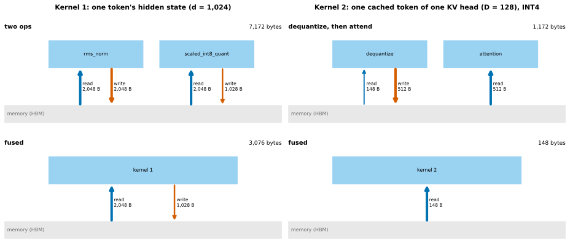
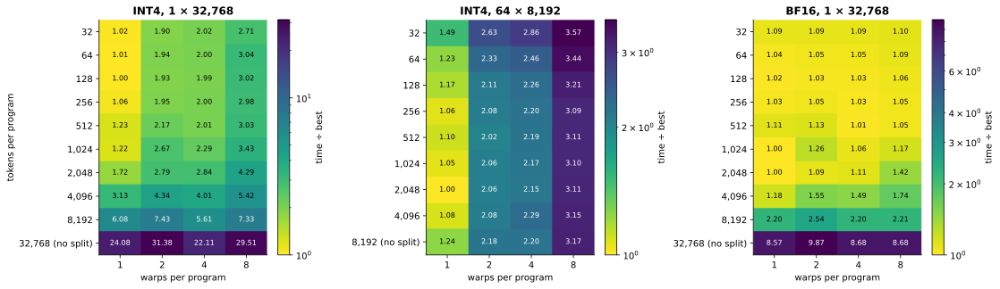
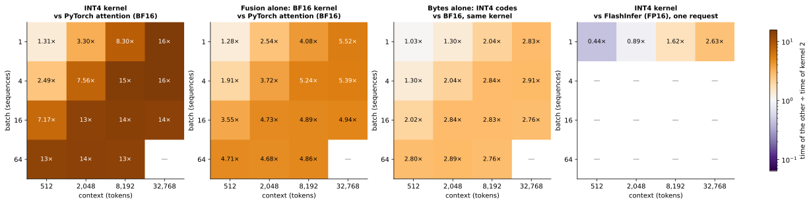
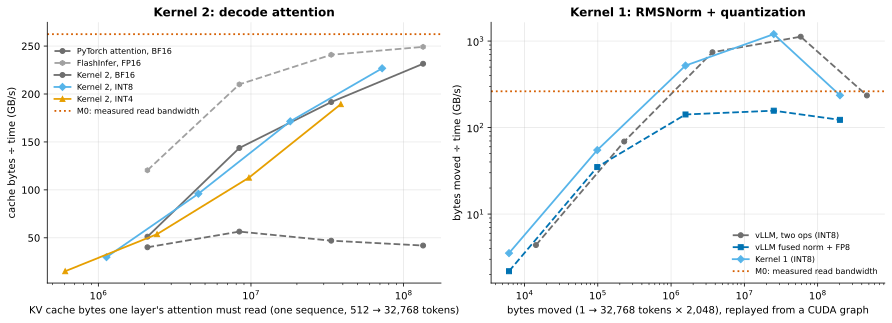
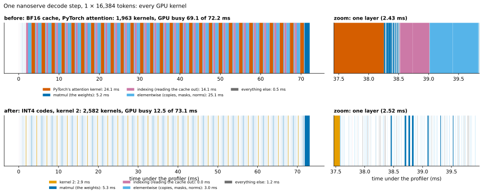
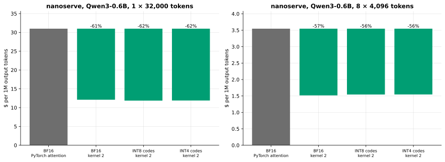

# Custom kernels (M7)

Two Triton kernels, each chosen from a profile, each with a plain-PyTorch reference and tests, each explained
in bytes. This page is the engineering record: what justified them, how they work, how they were tuned and
measured, where they lose, and what it would take to put them into vLLM. The teaching version is
[learning/M7-triton-kernels.md](learning/M7-triton-kernels.md).

| | Kernel 1 | Kernel 2 |
|---|---|---|
| Code | [`kernels/norm_quant.py`](../src/fastserve/kernels/norm_quant.py) | [`kernels/kv_attention.py`](../src/fastserve/kernels/kv_attention.py) |
| Computes | RMSNorm + per-token INT8 quantization | decode attention over 4/8-bit KV codes |
| Fuses | three passes over a hidden state into one read | dequantization into attention |
| Lever | less waste between bytes and math | move fewer bytes |
| Reference | `kernels/reference.py::rms_norm_int8` | `kernels/reference.py::decode_attention` |
| In nanoserve | [`integration/norm_quant.py`](../src/fastserve/integration/norm_quant.py) | [`integration/kv_cache.py`](../src/fastserve/integration/kv_cache.py) |
| Competes with | vLLM's `rms_norm` + `scaled_int8_quant` | PyTorch's fused attention, FlashInfer |

All numbers are from an NVIDIA L4. Reproduce with `make bench-kernels`.

## 1. The profile that chose them

### nanoserve's decode step

<!-- BEGIN GENERATED: m7_profile -->
| Batch × context | Step (ms) | Attention (ms) | Share of step | Kernels launched | KV cache read (GB) | GB/s through attention | Share of M0's bandwidth |
|---|---|---|---|---|---|---|---|
| 1 × 512 | 44.9 | 6.8 | 15% | 1,963 | 0.06 | 9 | 3% |
| 1 × 4,096 | 57.9 | 12.8 | 22% | 1,963 | 0.47 | 37 | 14% |
| 1 × 16,384 | 75.1 | 50.4 | 67% | 1,963 | 1.88 | 37 | 14% |
| 1 × 32,000 | 139.7 | 99.5 | 71% | 1,963 | 3.67 | 37 | 14% |
| 8 × 4,096 | 128.0 | 85.2 | 67% | 1,963 | 3.76 | 44 | 17% |
<!-- END GENERATED: m7_profile -->

At long context attention is most of the step, and it gets through the KV cache at a small fraction of the
memory bandwidth. Section 4's timeline shows why: nanoserve copies the cache out with an indexing kernel,
copies it again to give every query head its own K and V, and only then runs PyTorch's attention kernel.

### vLLM's norm and INT8-quantization ops, in a CUDA graph

<!-- BEGIN GENERATED: m7_ops_profile -->
| Tokens × width | `rms_norm` (µs) | `scaled_int8_quant` (µs) | Both, in a CUDA graph (µs) | Both, from Python (µs) | vLLM's fused norm + FP8 (µs) | Both: GB/s moved |
|---|---|---|---|---|---|---|
| 1 × 1,024 | 1.7 | 1.6 | 3.2 | 55.3 | 2.6 | 2 |
| 16 × 1,024 | 1.7 | 1.6 | 3.2 | 56.8 | 2.6 | 36 |
| 256 × 1,024 | 2.1 | 2.0 | 4.1 | 56.8 | 10.1 | 448 |
| 4,096 × 1,024 | 15.8 | 20.9 | 31.3 | 59.9 | 136.3 | 939 |
| 32,768 × 1,024 | 571.7 | 401.9 | 987.7 | 940.5 | 1,242.6 | 238 |
| 1 × 2,048 | 1.8 | 1.6 | 3.3 | 58.4 | 2.9 | 4 |
| 16 × 2,048 | 1.8 | 1.7 | 3.3 | 58.4 | 2.9 | 69 |
| 256 × 2,048 | 2.7 | 2.5 | 5.0 | 58.4 | 11.1 | 739 |
| 4,096 × 2,048 | 22.1 | 21.8 | 45.6 | 64.0 | 158.8 | 1,288 |
| 32,768 × 2,048 | 1,139.0 | 853.6 | 1,997.1 | 1,994.2 | 1,637.6 | 235 |
<!-- END GENERATED: m7_ops_profile -->

vLLM 0.30's fusion pass (`vllm/compilation/passes/fusion/rms_quant_fusion.py`) rewrites RMSNorm followed by
a quantization op into one fused op. Its tables (`QUANT_OPS`, `FUSED_OPS`) hold FP8 entries only, so for a
W8A8-INT8 checkpoint the two ops always run separately. At decode sizes each costs one fixed launch; at
prefill sizes both run near the memory bandwidth, so the only thing left to save is a round trip.

### What that means for M4's INT8 gap

<!-- BEGIN GENERATED: m7_m4_gap -->
| Model | TPOT from bytes (ms) | Measured TPOT (ms) | Unexplained (ms) | Quantization launches per step | Their cost (ms) | Share of the gap | Fusable with a norm: share of TPOT |
|---|---|---|---|---|---|---|---|
| Qwen3-0.6B | 4.13 | 4.50 | 0.37 | 112 × 1.59 µs | 0.18 | 47% | 2.0% |
| Qwen3-1.7B | 9.35 | 9.97 | 0.62 | 112 × 1.64 µs | 0.18 | 29% | 0.9% |
<!-- END GENERATED: m7_m4_gap -->

M4 attributed W8A8-INT8's unexplained batch-1 slowdown to the separate quantization op. The measured cost
of those launches covers a minority of it. The rest is not explained here (the INT8 matmul kernel is the
next suspect). Half of the launches follow an RMSNorm and could be fused with it, which bounds what
kernel 1 could give vLLM's decode step: the last column.

## 2. Kernel 1: RMSNorm + INT8 quantization

    y = x / sqrt(mean(x²) + eps) · weight      scale = max|y| / 127      codes = round(y / scale)

One program per token. The program loads the token's whole hidden vector once (`BLOCK` = the next power of
two ≥ d, masked), and the three passes the math needs (sum of squares, maximum, rounding) run on that copy
in registers. One read of 2d bytes, one write of d + 4.

<!-- BEGIN GENERATED: caption-m7_traffic -->
*Fusing moves 2.3× fewer bytes per token in kernel 1 (7,172 → 3,076) and 7.9× fewer per cached token in kernel 2 (1,172 → 148); a BF16 cache costs 512 bytes for the same token.*
<!-- END GENERATED: caption-m7_traffic -->

### Replayed from a CUDA graph (how vLLM runs decode)

<!-- BEGIN GENERATED: m7_norm_quant -->
| Tokens × width | PyTorch (µs) | vLLM, two ops (µs) | vLLM fused FP8 (µs) | **Kernel 1 (µs)** | vs two ops | vs fused FP8 | Kernel 1: GB/s moved |
|---|---|---|---|---|---|---|---|
| 1 × 1,024 | 22.7 | 3.1 | 2.6 | 1.6 | 1.97× | 1.61× | 2 |
| 16 × 1,024 | 27.0 | 3.2 | 2.6 | 1.6 | 2.00× | 1.62× | 31 |
| 256 × 1,024 | 36.3 | 4.1 | 10.0 | 2.3 | 1.82× | 4.45× | 350 |
| 4,096 × 1,024 | 468.0 | 29.0 | 136.4 | 13.2 | 2.19× | 10.33× | 954 |
| 32,768 × 1,024 | 13,179.8 | 990.2 | 1,254.3 | 405.4 | 2.44× | 3.09× | 249 |
| 1 × 2,048 | 23.9 | 3.3 | 2.8 | 1.7 | 1.88× | 1.62× | 4 |
| 16 × 2,048 | 30.4 | 3.3 | 2.8 | 1.8 | 1.86× | 1.57× | 55 |
| 256 × 2,048 | 52.2 | 4.9 | 11.1 | 3.0 | 1.64× | 3.68× | 521 |
| 4,096 × 2,048 | 1,941.6 | 52.3 | 160.7 | 20.9 | 2.50× | 7.68× | 1,203 |
| 32,768 × 2,048 | 26,370.2 | 2,000.1 | 1,641.1 | 853.8 | 2.34× | 1.92× | 236 |
<!-- END GENERATED: m7_norm_quant -->

- **A few tokens (decode):** one launch instead of two, each a fixed cost. The speedup is the launch count.
- **Thousands of tokens, data in L2:** the kernel keeps pace with vLLM's hand-written ops at cache speed,
  and moves 2.3× fewer bytes. I predicted it might not keep up; it did.
- **32,768 tokens, data in memory:** both sides are memory-bound, and the speedup is the ratio of bytes
  moved. The kernel moves its bytes at close to the bandwidth M0 measured.
- **vLLM's own fused op (FP8 output, the same bytes)** is slower than its two separate INT8 ops for
  thousands of tokens. Fused is not automatically fast.

### Launched from Python

<!-- BEGIN GENERATED: m7_norm_quant_eager -->
| Tokens × width | PyTorch (µs) | vLLM, two ops (µs) | vLLM fused FP8 (µs) | **Kernel 1 (µs)** | vs two ops | vs fused FP8 | Kernel 1: GB/s moved |
|---|---|---|---|---|---|---|---|
| 1 × 1,024 | 346.6 | 57.3 | 54.3 | 61.4 | 0.93× | 0.88× | 0 |
| 16 × 1,024 | 332.8 | 59.4 | 51.2 | 60.4 | 0.98× | 0.85× | 1 |
| 256 × 1,024 | 334.3 | 57.3 | 51.2 | 63.5 | 0.90× | 0.81× | 12 |
| 4,096 × 1,024 | 430.6 | 60.4 | 166.9 | 60.4 | 1.00× | 2.76× | 209 |
| 32,768 × 1,024 | 13,187.1 | 990.2 | 1,323.5 | 422.9 | 2.34× | 3.13× | 238 |
| 1 × 2,048 | 338.4 | 58.4 | 52.8 | 61.4 | 0.95× | 0.86× | 0 |
| 16 × 2,048 | 329.8 | 57.4 | 50.2 | 59.4 | 0.97× | 0.84× | 2 |
| 256 × 2,048 | 334.3 | 58.4 | 51.2 | 60.4 | 0.97× | 0.85× | 26 |
| 4,096 × 2,048 | 1,953.3 | 69.1 | 299.0 | 60.9 | 1.13× | 4.91× | 413 |
| 32,768 × 2,048 | 26,405.4 | 1,995.8 | 1,605.6 | 850.9 | 2.35× | 1.89× | 237 |
<!-- END GENERATED: m7_norm_quant_eager -->

Below a few thousand tokens the kernel gains nothing: Triton's launcher prepares its arguments in Python
on every call, and that costs about as much as vLLM's two native calls. Kernel 1 only pays where the engine
replays a CUDA graph, or where the data is large.

### Is it the same computation?

<!-- BEGIN GENERATED: m7_norm_exact -->
| Tokens × width | Codes equal to the reference | Largest difference (codes) | Codes equal to vLLM's two ops | Largest difference (codes) |
|---|---|---|---|---|
| 1 × 1,024 | 100.000% | 0 | 97.75% | 1 |
| 16 × 1,024 | 100.000% | 0 | 96.55% | 1 |
| 256 × 1,024 | 99.998% | 1 | 96.68% | 1 |
| 4,096 × 1,024 | 99.999% | 1 | 96.64% | 1 |
| 32,768 × 1,024 | 99.999% | 1 | 96.63% | 1 |
| 1 × 2,048 | 100.000% | 0 | 97.27% | 1 |
| 16 × 2,048 | 100.000% | 0 | 96.73% | 1 |
| 256 × 2,048 | 99.997% | 1 | 96.99% | 1 |
| 4,096 × 2,048 | 99.997% | 1 | 96.90% | 1 |
| 32,768 × 2,048 | 99.997% | 1 | 96.89% | 1 |
<!-- END GENERATED: m7_norm_exact -->

Against the reference the codes are identical up to exact ties. Against vLLM's two ops a few percent
differ, never by more than one code: vLLM's `rms_norm` writes its result in BF16 before the quantizer reads
it, and that rounding moves a value by up to a quarter of a code. The fused kernel never rounds to BF16, so
of the two it is the more exact.

### Tuning

<!-- BEGIN GENERATED: m7_norm_warps -->
| Tokens × width | 1 warps (µs) | 2 warps (µs) | 4 warps (µs) | 8 warps (µs) | 16 warps (µs) |
|---|---|---|---|---|---|
| 256 × 1,024 | 61.4 | 60.4 | 60.4 | 59.4 ← | 61.4 |
| 256 × 2,048 | 60.4 | 60.4 | 58.4 ← | 60.4 | 60.4 |
| 32,768 × 1,024 | 421.9 | 405.5 | 402.4 | 401.4 ← | 453.6 |
| 32,768 × 2,048 | 853.0 | 818.7 | 814.1 | 808.4 ← | 820.7 |
<!-- END GENERATED: m7_norm_warps -->

Warps per program are kernel 1's only knob, and the landscape is flat: the kernel is launch-bound at small
sizes and memory-bound at large ones, and neither cares how many threads share a row. (Timed from Python,
which is why the small size shows only launch overhead.)

## 3. Kernel 2: decode attention over a quantized KV cache

### The storage it reads

`kernels/reference.py::QuantKV`, KIVI's layout (quality measured in M5, by simulation):

| | grid | shape | bytes per token and KV head (D = 128, INT4) |
|---|---|---|---|
| key codes | one per channel, shared by a group of 32 tokens | `[B, Hkv, T, D/2]` uint8 | 64 |
| key scale, zero | float16 | `[B, Hkv, T/32, D]` | 16 |
| value codes | one per token | `[B, Hkv, T, D/2]` uint8 | 64 |
| value scale, zero | float16 | `[B, Hkv, T]` | 4 |

4-bit codes are packed two per byte, channel d with channel d + D/2, so one loaded byte splits into two
half-vectors with a mask and a shift.

### What one program computes, and where the data lives

A program is one (sequence, KV head, split). It:

1. loads the two query heads that share this KV head, scaled by 1/√D, into registers: `[2, D]`;
2. walks its split's tokens in blocks of one key group (32 tokens). For each block it
   - loads that group's key scale and zero (`[D]` each) and folds them into the queries: a scaled query and
     one bias per query head. No key is dequantized;
   - loads the block's key codes (`[32, D/2]` bytes), splits the nibbles, and takes dot products with the
     scaled queries: scores `[2, 32]`;
   - updates the running maximum and rescales what it has accumulated (online softmax);
   - loads the block's value codes and the tokens' value scale and zero, folds the scale into the attention
     weights, and accumulates the weighted codes: `[2, D]`;
3. writes its partial output `[2, D]` and the log of its summed weights `[2]`.

Everything except the codes and grids stays in registers. Nothing the size of the cache is written. The
partials are merged by `reference.merge_partials` (a softmax over the splits' log-sums: exact).

Handling both query heads in the program that owns their KV head means each cached byte is read once. A
program per *query* head would read every byte twice.

### Tuning: tokens per program × warps

<!-- BEGIN GENERATED: m7_tune -->
| Batch × context | Format | Best tokens per program | Warps | Programs | Time (µs) | No splitting ÷ best | One key group per program ÷ best | Worst ÷ best |
|---|---|---|---|---|---|---|---|---|
| 1 × 2,048 | INT4 | 64 | 1 | 256 | 40 | 7.5× | 1.0× | 10.5× |
| 1 × 2,048 | BF16 | 64 | 1 | 256 | 57 | 5.7× | 1.1× | 6.5× |
| 1 × 32,768 | INT4 | 128 | 1 | 2,048 | 205 | 22.1× | 1.0× | 31.4× |
| 1 × 32,768 | BF16 | 1,024 | 1 | 256 | 570 | 8.6× | 1.1× | 9.9× |
| 16 × 2,048 | INT4 | 64 | 1 | 4,096 | 201 | 1.8× | 1.0× | 4.4× |
| 16 × 2,048 | BF16 | 1,024 | 1 | 256 | 570 | 1.0× | 1.1× | 1.4× |
| 64 × 8,192 | INT4 | 2,048 | 1 | 2,048 | 3,244 | 1.2× | 1.5× | 3.6× |
| 64 × 8,192 | BF16 | 1,024 | 1 | 4,096 | 8,807 | 1.1× | 1.3× | 1.5× |
<!-- END GENERATED: m7_tune -->

<!-- BEGIN GENERATED: caption-m7_tuning -->
*For INT4 at 1 × 32,768 the best cell is 128 tokens per program with 1 warp (2,048 programs): not splitting is 22× slower, and the wrong warp count at that split (8) 3.0×.*
<!-- END GENERATED: caption-m7_tuning -->

- **Splitting is not optional.** One sequence without it is 8 programs on 58 SMs.
- **One warp per program.** With more, a program's sums cross warps through shared memory. The INT4 path,
  which does the most arithmetic per byte, pays most for that. BF16 barely cares.
- **Small programs.** I predicted 512–2,048 tokens per program would be best; the best was far smaller,
  and anything from 64 to about 1,000 is within a few percent. Each program waits on one block's load at a
  time, so more programs means more memory requests in flight.
- The defaults (`default_split`: 128 tokens per program, more once that would exceed about 16,000
  programs; 1 warp) were set from the first sweep and are within a few percent of the best at every shape.

### One layer's decode attention

<!-- BEGIN GENERATED: m7_attention -->
| Batch × context | PyTorch attention, BF16 (µs) | FlashInfer, FP16 (µs) | Dequantize then attend, INT4 (µs) | **Kernel 2, BF16** (µs) | **Kernel 2, INT8** (µs) | **Kernel 2, INT4** (µs) | INT4 kernel vs PyTorch | INT4 kernel vs FlashInfer |
|---|---|---|---|---|---|---|---|---|
| 1 × 512 | 52 | 17 | 148 | 41 | 38 | 40 | 1.31× | 0.44× |
| 1 × 2,048 | 148 | 40 | 318 | 58 | 47 | 45 | 3.30× | 0.89× |
| 1 × 8,192 | 714 | 139 | 3,402 | 175 | 105 | 86 | 8.30× | 1.62× |
| 1 × 32,768 | 3,199 | 539 | 15,751 | 580 | 319 | 205 | 15.62× | 2.63× |
| 4 × 512 | 110 | — | 338 | 57 | 45 | 44 | 2.49× | — |
| 4 × 2,048 | 658 | — | 3,178 | 177 | 108 | 87 | 7.56× | — |
| 4 × 8,192 | 3,038 | — | 15,056 | 580 | 317 | 204 | 14.91× | — |
| 4 × 32,768 | 12,354 | — | 63,440 | 2,291 | 1,232 | 788 | 15.67× | — |
| 16 × 512 | 632 | — | 3,207 | 178 | 109 | 88 | 7.17× | — |
| 16 × 2,048 | 2,756 | — | 15,078 | 582 | 321 | 205 | 13.46× | — |
| 16 × 8,192 | 11,244 | — | 60,772 | 2,298 | 1,232 | 813 | 13.83× | — |
| 16 × 32,768 | 44,427 | — | — | 9,000 | 4,689 | 3,259 | 13.63× | — |
| 64 × 512 | 2,766 | — | 14,988 | 588 | 321 | 210 | 13.18× | — |
| 64 × 2,048 | 10,811 | — | 60,972 | 2,308 | 1,232 | 800 | 13.52× | — |
| 64 × 8,192 | 44,236 | — | — | 9,099 | 4,711 | 3,296 | 13.42× | — |
<!-- END GENERATED: m7_attention -->

<!-- BEGIN GENERATED: caption-m7_speedup -->
*Kernel 2 on INT4 codes is 1.3–16× the speed of nanoserve's PyTorch attention (0 of 15 shapes slower), and 0.44–2.63× FlashInfer's on a full-precision cache: fewer bytes win at long context, launch overhead decides the short ones.*
<!-- END GENERATED: caption-m7_speedup -->

Reading the four panels:

- **Against nanoserve's PyTorch path** the kernel wins everywhere, mostly because that path copies K and V
  for every query head before attending (panel 2: the same BF16 bytes, several times faster).
- **Bytes alone** (panel 3) are worth less than the 3.46× the sizes promise even at long context, and
  nothing at short context.
- **Against FlashInfer**, vLLM's attention library on a full-precision cache (panel 4): on the *same* bytes
  FlashInfer is slightly faster than kernel 2 (it is a hand-tuned CUDA kernel). INT4 codes overtake it
  at a few thousand tokens. At 512 tokens kernel 2 loses clearly: its fixed cost (a launch, then the
  merge's few small kernels) is larger than FlashInfer's whole call.

The reference path, dequantize then attend, is slower than a BF16 cache at every size: storing fewer bytes
is not moving fewer bytes.

### On the roofline

<!-- BEGIN GENERATED: m7_roofline -->
| Batch × context | INT4 cache (MB) | PyTorch attention, BF16: GB/s | FlashInfer, FP16: GB/s | Kernel 2, BF16: GB/s | Kernel 2, INT8: GB/s | Kernel 2, INT4: GB/s |
|---|---|---|---|---|---|---|
| 1 × 512 | 0.6 | 40 (15%) | 120 (46%) | 51 (20%) | 30 (11%) | 15 (6%) |
| 1 × 2,048 | 2.4 | 56 (22%) | 210 (80%) | 144 (55%) | 96 (37%) | 54 (21%) |
| 1 × 8,192 | 9.7 | 47 (18%) | 241 (92%) | 192 (73%) | 171 (65%) | 113 (43%) |
| 1 × 32,768 | 38.8 | 42 (16%) | 249 (95%) | 232 (88%) | 227 (86%) | 189 (72%) |
| 4 × 512 | 2.4 | 77 (29%) | — | 146 (56%) | 100 (38%) | 55 (21%) |
| 4 × 2,048 | 9.7 | 51 (19%) | — | 189 (72%) | 167 (64%) | 111 (42%) |
| 4 × 8,192 | 38.8 | 44 (17%) | — | 232 (88%) | 228 (87%) | 190 (73%) |
| 4 × 32,768 | 155.2 | 43 (17%) | — | 234 (89%) | 235 (89%) | 197 (75%) |
| 16 × 512 | 9.7 | 53 (20%) | — | 188 (72%) | 167 (63%) | 110 (42%) |
| 16 × 2,048 | 38.8 | 49 (19%) | — | 231 (88%) | 226 (86%) | 189 (72%) |
| 16 × 8,192 | 155.2 | 48 (18%) | — | 234 (89%) | 235 (89%) | 191 (73%) |
| 16 × 32,768 | 620.8 | 48 (18%) | — | 239 (91%) | 247 (94%) | 190 (73%) |
| 64 × 512 | 38.8 | 49 (18%) | — | 228 (87%) | 226 (86%) | 185 (70%) |
| 64 × 2,048 | 155.2 | 50 (19%) | — | 233 (89%) | 235 (90%) | 194 (74%) |
| 64 × 8,192 | 620.8 | 49 (18%) | — | 236 (90%) | 246 (94%) | 188 (72%) |
<!-- END GENERATED: m7_roofline -->

<!-- BEGIN GENERATED: caption-m7_roofline -->
*At 1 × 32,768 tokens kernel 2 reads the BF16 cache at 88% of the measured bandwidth and the INT4 cache at 72%, where PyTorch's path manages 16%; kernel 1 moves its bytes at 90% once they no longer fit in the cache (above the line, the data is in L2).*
<!-- END GENERATED: caption-m7_roofline -->

### Why INT4 stops near 70% of the bandwidth

<!-- BEGIN GENERATED: m7_timing_views -->
| Batch × context | INT4 cache (MiB) | PyTorch attention, BF16: cold · eager · graph (µs) | FlashInfer, FP16: cold · eager · graph (µs) | Kernel 2, BF16: cold · eager · graph (µs) | Kernel 2, INT4: cold · eager · graph (µs) |
|---|---|---|---|---|---|
| 1 × 512 | 0.6 | 52 · 145 · 39 | 17 · 51 · 11 | 41 · 213 · 27 | 40 · 219 · 27 |
| 1 × 2,048 | 2.3 | 148 · 162 · 129 | 40 · 50 · 13 | 58 · 212 · 30 | 45 · 207 · 29 |
| 1 × 8,192 | 9.2 | 714 · 739 · 777 | 139 · 53 · 23 | 175 · 205 · 65 | 86 · 202 · 65 |
| 1 × 32,768 | 37.0 | 3,199 · 3,337 · 3,399 | 539 · 541 · 538 | 580 · 594 · 590 | 205 · 223 · 201 |
<!-- END GENERATED: m7_timing_views -->

Each contender was timed three ways: cold (L2 evicted before every run), eager (from Python, no eviction),
and replayed from a CUDA graph (no Python, cache warm).

- **BF16 and INT8 are memory-bound.** Their bytes move at close to the measured bandwidth once the cache
  is large (the roofline table), and for the BF16 cache at 32,768 tokens (too big for L2) cold and graph agree.
- **INT4 is instruction-bound.** At 1 × 32,768 its whole cache fits in L2, yet a warm replay is no faster
  than a cold run: memory was not the limit. At 1 × 8,192, warm, the BF16 and INT4 kernels take the same
  time: with memory out of the way the time follows the number of *tokens*, not bytes. Per token INT4 does
  the same multiply-adds as BF16 plus unpacking and integer-to-float conversion, on a quarter of the bytes.
- **The fixed cost** is visible at 512 tokens: tens of microseconds replayed from a graph, and several
  times that from Python, where the launcher and the merge's small PyTorch ops are paid in interpreter time. FlashInfer's
  whole call costs less than half as much either way.

What would move INT4 toward the ceiling: the two inner products on tensor cores (`tl.dot` on half-precision
operands, which needs care with the precision of the scaled queries), and a merge fused into one small
kernel. Neither was attempted.

### A measurement artifact found on the way

<!-- BEGIN GENERATED: m7_flush -->
| Batch × context | PyTorch attention, BF16: read · write flush (µs) | FlashInfer, FP16: read · write flush (µs) | Kernel 2, BF16: read · write flush (µs) | Kernel 2, INT4: read · write flush (µs) |
|---|---|---|---|---|
| 1 × 512 | 52 · 79 (+27) | 17 · 29 (+11) | 41 · 46 (+5) | 40 · 43 (+3) |
| 1 × 2,048 | 148 · 219 (+71) | 40 · 58 (+18) | 58 · 77 (+18) | 45 · 52 (+7) |
| 1 × 8,192 | 714 · 881 (+167) | 139 · 194 (+54) | 175 · 234 (+59) | 86 · 102 (+16) |
| 1 × 32,768 | 3,199 · 3,503 (+303) | 539 · 691 (+152) | 580 · 739 (+160) | 205 · 265 (+60) |
<!-- END GENERATED: m7_flush -->

The project's "cold" timings evict L2 by overwriting a scratch buffer before each run. That leaves the cache
full of modified lines, and the timed call then also pays for writing them back as it evicts them: the
same kind of extra on every contender (the differences in brackets), growing with the cache it has to
displace. It showed up
as cold timings slower than a graph replay of data far too large for L2. Evicting by *reading* the buffer
removes it. The check that the read flush is the right one: section 5's projection reproduces vLLM's measured step
with read-flush timings and overshoots it with write-flush ones (its first two rows). Kernel 2's numbers use the
read flush; M0–M6's cold timings (M0's cold matmul, M1's decode points) used the write flush and carry this
bias.

### Numerical agreement

<!-- BEGIN GENERATED: m7_attention_error -->
| Batch × context | Kernel vs reference, BF16 | INT8 | INT4 | vs unquantized attention: FlashInfer | INT8 codes | INT4 codes |
|---|---|---|---|---|---|---|
| 1 × 512 | 4.5e-07 | 1.1e-06 | 8.5e-07 | 2.9e-04 | 7.4e-03 | 1.4e-01 |
| 1 × 2,048 | 4.6e-07 | 8.2e-07 | 1.1e-06 | 2.9e-04 | 7.9e-03 | 1.3e-01 |
| 1 × 8,192 | 1.1e-06 | 1.4e-06 | 1.1e-06 | 3.6e-04 | 8.0e-03 | 1.4e-01 |
| 1 × 32,768 | 3.3e-06 | 1.8e-06 | 2.4e-06 | 3.7e-04 | 7.5e-03 | 1.3e-01 |
| 4 × 512 | 6.1e-07 | 7.9e-07 | 8.1e-07 | — | 7.7e-03 | 1.4e-01 |
| 4 × 2,048 | 7.2e-07 | 9.8e-07 | 8.5e-07 | — | 7.8e-03 | 1.3e-01 |
| 4 × 8,192 | 1.7e-06 | 1.8e-06 | 1.8e-06 | — | 7.8e-03 | 1.3e-01 |
| 4 × 32,768 | 3.4e-06 | 3.7e-06 | 3.5e-06 | — | 8.0e-03 | 1.4e-01 |
| 16 × 512 | 5.7e-07 | 9.7e-07 | 1.4e-06 | — | 7.9e-03 | 1.3e-01 |
| 16 × 2,048 | 1.3e-06 | 1.3e-06 | 1.7e-06 | — | 7.9e-03 | 1.4e-01 |
| 16 × 8,192 | 2.1e-06 | 2.2e-06 | 2.0e-06 | — | 7.8e-03 | 1.4e-01 |
| 64 × 512 | 7.2e-07 | 7.7e-07 | 7.7e-07 | — | 7.9e-03 | 1.3e-01 |
| 64 × 2,048 | 1.1e-06 | 1.5e-06 | 1.2e-06 | — | 7.9e-03 | 1.4e-01 |
<!-- END GENERATED: m7_attention_error -->

The first three columns are the kernel against the reference *on the same codes*: float32 sums in a
different order. The last three compare with attention over the unquantized tensors, on random data with
one outlier key channel: they show the size of quantization error on that data, not model quality (that is
section 4).

## 4. Inside nanoserve

`QuantizedKVCache` stores real codes. Tokens wait in a full-precision tail until their key group of 32 is
complete, then become codes. A decode step runs kernel 2 over the codes, plain attention over the tail, and
merges the two with the split-KV merge. Prefill uses the unfused reference path.

<!-- BEGIN GENERATED: m7_nanoserve -->
| Batch × context | KV cache and reader | Step (ms) | vs before M7 | KV cache (MiB) | $ per 1M tokens | KL of the next token vs BF16 | Same top token |
|---|---|---|---|---|---|---|---|
| 1 × 512 | BF16 + PyTorch attention (before M7) | 31.2 | 1.00× | 56 | 6.93 | — | — |
| 1 × 512 | BF16 + kernel 2 | 43.7 | 0.71× | 56 | 9.71 | 0.0002 | 100% |
| 1 × 512 | INT8 codes + kernel 2 | 44.5 | 0.70× | 30 | 9.88 | 0.0006 | 100% |
| 1 × 512 | INT4 codes + kernel 2 | 42.7 | 0.73× | 16 | 9.49 | 0.0257 | 100% |
| 1 × 512 | INT4 codes, dequantize then attend | 58.1 | 0.54× | 16 | 12.91 | 0.0259 | 100% |
| 1 × 4,096 | BF16 + PyTorch attention (before M7) | 30.1 | 1.00× | 448 | 6.68 | — | — |
| 1 × 4,096 | BF16 + kernel 2 | 43.3 | 0.69× | 448 | 9.63 | 0.0004 | 100% |
| 1 × 4,096 | INT8 codes + kernel 2 | 43.5 | 0.69× | 242 | 9.68 | 0.0006 | 100% |
| 1 × 4,096 | INT4 codes + kernel 2 | 44.1 | 0.68× | 130 | 9.81 | 0.0155 | 100% |
| 1 × 4,096 | INT4 codes, dequantize then attend | 58.6 | 0.51× | 130 | 13.03 | 0.0153 | 100% |
| 1 × 16,384 | BF16 + PyTorch attention (before M7) | 74.5 | 1.00× | 1,792 | 16.56 | — | — |
| 1 × 16,384 | BF16 + kernel 2 | 54.6 | 1.37× | 1,792 | 12.13 | 0.0003 | 100% |
| 1 × 16,384 | INT8 codes + kernel 2 | 55.1 | 1.35× | 966 | 12.25 | 0.0004 | 100% |
| 1 × 16,384 | INT4 codes + kernel 2 | 53.5 | 1.39× | 518 | 11.88 | 0.0135 | 100% |
| 1 × 16,384 | INT4 codes, dequantize then attend | 219.2 | 0.34× | 518 | 48.71 | 0.0133 | 100% |
| 1 × 32,000 | BF16 + PyTorch attention (before M7) | 139.4 | 1.00× | 3,500 | 30.99 | — | — |
| 1 × 32,000 | BF16 + kernel 2 | 54.4 | 2.56× | 3,500 | 12.10 | 0.0004 | 100% |
| 1 × 32,000 | INT8 codes + kernel 2 | 53.4 | 2.61× | 1,887 | 11.87 | 0.0005 | 100% |
| 1 × 32,000 | INT4 codes + kernel 2 | 53.5 | 2.60× | 1,012 | 11.90 | 0.0152 | 100% |
| 1 × 32,000 | INT4 codes, dequantize then attend | 441.3 | 0.32× | 1,012 | 98.07 | 0.0163 | 100% |
| 8 × 4,096 | BF16 + PyTorch attention (before M7) | 127.7 | 1.00× | 3,584 | 3.55 | — | — |
| 8 × 4,096 | BF16 + kernel 2 | 54.6 | 2.34× | 3,584 | 1.52 | 0.0004 | 100% |
| 8 × 4,096 | INT8 codes + kernel 2 | 55.6 | 2.30× | 1,932 | 1.54 | 0.0006 | 100% |
| 8 × 4,096 | INT4 codes + kernel 2 | 55.6 | 2.29× | 1,036 | 1.55 | 0.0261 | 88% |
| 8 × 4,096 | INT4 codes, dequantize then attend | 440.8 | 0.29× | 1,036 | 12.24 | 0.0252 | 88% |
<!-- END GENERATED: m7_nanoserve -->

<!-- BEGIN GENERATED: caption-m7_timeline -->
*One decode step at 1 × 16,384 tokens: the GPU works 69 of 72 ms before and 12 of 73 ms after; what is left is 2,582 small kernels with gaps between them (Python between launches), which no attention kernel can shorten.*
<!-- END GENERATED: caption-m7_timeline -->

- **The whole speedup comes from fusion.** The BF16 cache read by kernel 2 is as fast as INT4 codes: once
  attention is a single short kernel, the step is bound by Python between launches, and fewer bytes no
  longer buy time. INT4's gain in nanoserve is the cache's size.
- **At short context the kernel-backed cache is slower.** Attention was a small part of the step, and the
  cache's bookkeeping (appending to the tail, attending over it, merging) adds launches.
- **Reading the codes the unfused way is the slowest configuration**, slower than BF16.
- The before trace also shows what nanoserve's baseline wastes: an indexing kernel that copies the cache
  out, and elementwise copies, each as large as the attention kernel itself.

<!-- BEGIN GENERATED: caption-m7_waterfall -->
*Waterfall v4, nanoserve at 1 × 32,000 tokens: reading the same BF16 cache with kernel 2 changes cost by -61%, and INT4 codes by -62% (KL 0.011 from the BF16 cache): once attention is fused the step is bound by Python's launches, so INT4 buys a 3.5× smaller cache, not time. These bars are nanoserve's, not vLLM's.*
<!-- END GENERATED: caption-m7_waterfall -->

### Quality through the real codes

<!-- BEGIN GENERATED: m7_quality -->
| KV cache and reader | KL vs BF16 cache (nats) | Same top token | Perplexity | BF16 perplexity | M5's simulated KL | Needle recall | M5's simulated recall |
|---|---|---|---|---|---|---|---|
| BF16 + kernel 2 | 0.0011 | 98.3% | 29.29 | 29.28 | — | — | — |
| INT8 codes + kernel 2 | 0.0012 | 98.2% | 29.30 | 29.28 | 0.0014 | — | 100% |
| INT4 codes + kernel 2 | 0.011 | 94.4% | 29.55 | 29.28 | 0.032 | 100% | 100% |
<!-- END GENERATED: m7_quality -->

Every position is decoded as its own step, so every attention goes through the kernel, and keys become
codes in groups of 32 as the text grows.

- **The yardstick has a floor.** Reading the *same* BF16 cache through kernel 2 already differs from
  PyTorch's attention: the kernel accumulates in float32, PyTorch in BF16 (M6 found the same sensitivity).
  INT8 codes sit at that floor.
- **INT4** stays close and keeps every needle. Its KL is below M5's simulated number, but the two are not
  the same experiment: M5 quantized whole 2,048-token windows at once, here windows are 512 tokens and the
  newest tokens are still in full precision.

### Kernel 1 in the model

<!-- BEGIN GENERATED: m7_norm_in_model -->
| Pre-norms emit INT8 through | Decode step (ms) | Largest logit difference | Same top token |
|---|---|---|---|
| Reference (norm, then quantize, in PyTorch) | 49.5 | — | — |
| Kernel 1 | 40.5 | 0.914 | 100% |
<!-- END GENERATED: m7_norm_in_model -->

Both pre-norms of every layer emit INT8-quantized activations, through the reference or through kernel 1.
The step is shorter because the reference path is a dozen small PyTorch kernels per norm. The logit
difference is of the size BF16 models show between any two computation orders (M1's comparison of two
attention implementations found the same), and the top token never changed.

## 5. What this would mean in vLLM

Neither kernel is integrated into vLLM. What the measurements imply, and what integration would take:

### A projection, checked where it can be

<!-- BEGIN GENERATED: m7_projection -->
*Short-context step: 5.8 ms; 28 layers.*

| Attention kernel and cache | One layer (µs) | Projected vLLM step (ms) | Measured in vLLM (ms) | Projection error |
|---|---|---|---|---|
| FlashInfer, full-precision cache | 539 | 20.9 | 20.6 | 1.4% |
| FlashInfer, timed with the write flush | 691 | 25.1 | 20.6 | 22.0% |
| Kernel 2, BF16 cache | 580 | 22.0 | — | — |
| Kernel 2, INT8 codes | 319 | 14.7 | — | — |
| Kernel 2, INT4 codes | 205 | 11.5 | — | — |
| vLLM's FP8 cache (measured only) | — | — | 13.8 | — |
<!-- END GENERATED: m7_projection -->

The first row is a check of the method: vLLM's short-context step plus one layer of FlashInfer's measured
time per model layer reproduces the 32k-token step M5 measured in vLLM. The second row repeats it with the
write-flush timing, which does not. The kernel 2 rows apply the same sum to its
layer times. They are projections: an INT4 KV cache in vLLM would also need the write path, paging and
batching described below, and none of that is measured.

### nanoserve next to vLLM

<!-- BEGIN GENERATED: m7_production -->
| Engine | KV cache and attention | Decode step (ms) | KV cache read (GiB) |
|---|---|---|---|
| nanoserve | BF16 + PyTorch attention (before M7) | 139.4 | 3.42 |
| nanoserve | BF16 + kernel 2 | 54.4 | 3.42 |
| nanoserve | INT8 codes + kernel 2 | 53.4 | 1.84 |
| nanoserve | INT4 codes + kernel 2 | 53.5 | 0.99 |
| nanoserve | INT4 codes, dequantize then attend | 441.3 | 0.99 |
| vLLM 0.30 | BF16 KV, FlashAttention | 20.3 | 3.50 |
| vLLM 0.30 | BF16 KV, FlashInfer | 20.6 | 3.50 |
| vLLM 0.30 | FP8 KV | 13.8 | 1.75 |
<!-- END GENERATED: m7_production -->

nanoserve's step is still several times vLLM's: it launches thousands of small kernels from Python. The
kernels do not change that; CUDA graphs would.

### The integration path

**Kernel 1.**
- Register it as a custom op and add INT8 entries to `QUANT_OPS` and `FUSED_OPS` in
  `rms_quant_fusion.py`, so `RMSNormQuantFusionPass` rewrites `rms_norm` → INT8 quantization the way it
  already does for FP8.
- vLLM's second norm in each layer is `fused_add_rms_norm` (the residual add is fused in). Kernel 1 has no
  residual input yet; vLLM's fused FP8 op takes one.
- Triton kernels already run inside vLLM's CUDA graphs (its optional Triton AWQ dequantize), so the
  launcher's Python cost would not apply.
- Expected gain: the last column of the M4 table in section 1. Small.

**Kernel 2.**
- A new attention backend next to FlashAttention and FlashInfer, plus a cache write that quantizes.
- vLLM's cache is paged. The kernel reads one contiguous run of tokens per sequence, so it needs a block
  table lookup per block of tokens. Its per-sequence `lengths` already handle mixed lengths.
- Per-channel key grids need a whole group of 32 tokens before anything can be quantized, so the newest
  tokens must be kept in full precision somewhere (nanoserve's tail). In a paged cache that is one more
  small buffer per sequence.
- Prefill needs its own path (this is a decode kernel).

### Limits of what was built

- `QuantizedKVCache` is contiguous, append-only, and requires all rows to advance together. No rollback, so
  no speculative decoding on top of it.
- Values use one grid per token (KIVI's default). M5's 2-bit variant with four value groups per token is not
  supported.
- Kernel 2 was tuned and measured on one GPU model and one head shape (Qwen3: 16 query heads, 8 KV heads,
  head dimension 128). The tests cover other shapes for correctness, not speed.
- FlashInfer was compared through its single-request call only; its batched, paged path was not.

## 6. Tests

- `tests/kernels/test_reference.py` (CPU): the references against independent code: nanoserve's own
  RMSNorm and INT8 quantizer, M5's simulated KV storage, nanoserve's plain attention; nibble packing;
  split-and-merge equals attention, including empty splits and sequences with no tokens; allocated bytes
  equal M5's sizing formula.
- `tests/kernels/test_kernels_gpu.py` (L4): both kernels against the references over widths and lengths
  that are not powers of two, a single token, a single key group, empty rows, one and two query heads per
  KV head, three float dtypes, non-contiguous inputs, every split size, and 32,768 tokens; then inside a
  small model.
- `tests/integration/test_quant_kv_cache.py` (CPU): with 16 "bits" (nothing rounded) the cache must equal a
  plain forward pass at every prefill length, which isolates its bookkeeping; with 4 and 8 bits it must
  match M5's simulation after a whole-group prefill.

## 7. Predictions

<!-- BEGIN GENERATED: m7_prediction_score -->
**21 of 29 predictions in range.**
<!-- END GENERATED: m7_prediction_score -->

<!-- BEGIN GENERATED: m7_predictions -->
*Predictions written in commit `eb13c86`, before the first measurement.*

| Quantity | Predicted | Measured | Verdict |
|---|---|---|---|
| Kernel 1 vs vLLM's two ops, 1 token × 2,048, in a CUDA graph (x faster) | 1.4 – 2.1 | 1.88 | within range |
| Kernel 1 vs vLLM's two ops, 4,096 tokens × 2,048 (data resident in L2), in a CUDA graph (x faster) | 1.2 – 2.3 | 2.5 | above range |
| Kernel 1 vs vLLM's two ops, 32,768 tokens × 2,048, in a CUDA graph (x faster) | 1.9 – 2.4 | 2.34 | within range |
| Kernel 1's bytes moved ÷ time at 32,768 × 2,048, as a share of M0's read bandwidth | 0.75 – 1 | 0.899 | within range |
| Kernel 1 vs vLLM's fused RMSNorm + FP8 op, 32,768 tokens × 2,048, in a CUDA graph (x faster) | 1.5 – 2 | 1.92 | within range |
| Kernel 1 vs vLLM's two ops, 1 token × 2,048, launched from Python (x faster) | 0.7 – 1.8 | 0.95 | within range |
| Kernel 1's codes identical to the reference's (share, worst shape) | 0.999 – 1 | 1 | within range |
| Kernel 1's codes identical to vLLM's norm-then-quantize (share, worst shape) | 0.9 – 0.995 | 0.966 | within range |
| Kernel 2 vs nanoserve's PyTorch attention, same BF16 cache, 1 × 32,768 tokens (x faster) | 2.7 – 6 | 5.52 | within range |
| Kernel 2 on INT4 codes vs on BF16, 1 × 32,768 (x faster; bytes say 3.46) | 1.5 – 3.4 | 2.83 | within range |
| Kernel 2 on INT8 codes vs on BF16, 1 × 32,768 (x faster; bytes say 1.86) | 1.2 – 1.9 | 1.82 | within range |
| Kernel 2 on BF16 vs FlashInfer on FP16, 1 × 32,768 (x faster) | 0.5 – 1.1 | 0.929 | within range |
| Kernel 2 on INT4 vs FlashInfer on FP16, 1 × 32,768 (x faster) | 1.1 – 3.5 | 2.63 | within range |
| Kernel 2 vs dequantize-then-attend on the same INT4 codes, 1 × 32,768 (x faster) | 30 – 200 | 76.9 | within range |
| Kernel 2 on BF16: cache bytes ÷ time, as a share of M0's read bandwidth, 1 × 32,768 | 0.4 – 0.85 | 0.882 | above range |
| Kernel 2 on INT4: cache bytes ÷ time, as a share of M0's read bandwidth, 1 × 32,768 | 0.3 – 0.7 | 0.722 | above range |
| Kernel 2 on INT4 vs nanoserve's PyTorch attention, 1 × 512 tokens (x faster) | 0.5 – 1.3 | 1.31 | above range |
| Kernel 2 vs the reference on the same INT4 codes, worst relative error over shapes | 0 – 0.001 | 3.53e-06 | within range |
| Best tokens per program, INT4, 1 × 32,768 | 512 – 2,048 | 128 | below range |
| No splitting (8 programs) ÷ the best split, INT4, 1 × 32,768 (x slower) | 4 – 20 | 22.1 | above range |
| nanoserve decode step, INT4 codes + kernel 2 vs BF16 + PyTorch attention, 1 × 512 (x faster) | 0.75 – 1 | 0.73 | below range |
| nanoserve decode step, INT4 codes + kernel 2 vs BF16 + PyTorch attention, 1 × 32,000 (x faster) | 1.8 – 2.6 | 2.6 | above range |
| nanoserve decode step, INT4 codes + kernel 2 vs BF16 + PyTorch attention, 8 × 4,096 (x faster) | 1.7 – 2.8 | 2.29 | within range |
| nanoserve decode step, INT4 codes read the unfused way vs BF16 + PyTorch attention, 1 × 32,000 (x faster) | 0.08 – 0.5 | 0.316 | within range |
| KV bytes per token as allocated, INT4 cache ÷ BF16 cache | 0.28 – 0.3 | 0.289 | within range |
| KL vs the BF16 cache, BF16 cache read by kernel 2, token-by-token decode (nats) | 0 – 0.002 | 0.00113 | within range |
| KL vs the BF16 cache, INT8 codes read by kernel 2 (nats; M5's simulation: 0.0014) | 0.0003 – 0.003 | 0.00121 | within range |
| KL vs the BF16 cache, INT4 codes read by kernel 2 (nats; M5's simulation: 0.032) | 0.008 – 0.04 | 0.0115 | within range |
| Needle recall, INT4 codes read by kernel 2 (M5's simulation: 100%) | 0.95 – 1 | 1 | within range |
<!-- END GENERATED: m7_predictions -->
