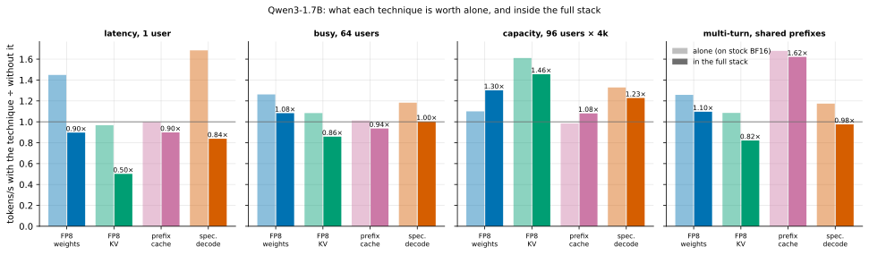
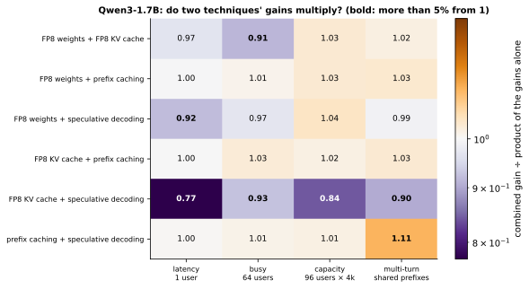
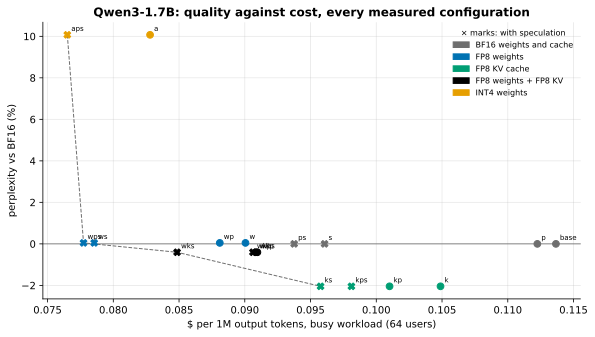

# Results analysis: the full stack (M8)

M4–M7 each measured one technique alone. M8 turns them on together, one at a time and in every combination,
on the same workloads and the same GPU, and asks what each one is worth and whether the gains multiply.

Every number and table below is generated from `results/raw/m8_ablation.jsonl` by `scripts/render_docs.py`.
The predictions it is compared with were committed before the measurements.

<!-- BEGIN GENERATED: m8_findings -->
- **The best measured stack, Qwen3-1.7B on one L4, against stock BF16 vLLM:** latency `wps` 2.25×, busy `wps` 1.46×, capacity `wkps` 2.28×, multi-turn `wps` 2.76×, long `wkps` 1.22×. With INT4 weights allowed (lower quality, M4): latency `aps` 3.08×, busy `aps` 1.49×, multi-turn `aps` 3.13×.
- **The full stack (`wkps`: FP8 weights, FP8 KV, prefix caching, speculation) is the best stack on 2 of 5 workloads on Qwen3-1.7B and 0 of 5 on Qwen3-0.6B.** At one user it gives 1.13× where `wps` gives 2.25×; on Qwen3-0.6B it is slower than stock (0.48×).
- **Why: one pair collides.** With an FP8 KV cache and speculation together, vLLM 0.30 gives up its full CUDA graph on this GPU, and a step then waits for the host instead of the GPU: 25.8 ms per step against 4.6 with the graph, for the same GPU work (Qwen3-0.6B, FP8 weights, piecewise graphs forced on a control server).
- **Everything else nearly multiplies:** 17 of 24 pair × workload interactions are within 5% of 1. FP8 KV × speculation is 0.77 at one user.
- **Quality of the lossy part of the stack** (FP8 weights + FP8 KV, Qwen3-1.7B, in vLLM): perplexity ×0.996, needle recall 100%, GSM8K -1.3, MMLU -0.4 and HumanEval -6.1 points. Prefix caching does not change outputs; speculation is lossless in distribution (M6).
- **The serving model, frozen before any M8 server ran:** median error 6.4% over 125 predictions (66% within 15%), 3.5% on servers without speculation. Its large misses are the colliding servers: it had no term for the host. With that one constant fitted on M8, the same points come to 5.1% (71% within 15%).
<!-- END GENERATED: m8_findings -->

**How to read the claims.** "×" is output tokens per second over stock BF16 vLLM 0.30 on the same L4, same
workload. It is a better *configuration* of vLLM, not a faster engine than vLLM. The models are Qwen3-1.7B and
Qwen3-0.6B on a 24 GB L4 (ADR 001), not the 8B model on an H100 the project was first planned for. Section 6
shows that one of the main results here depends on the GPU generation.

## 1. What was run

**Techniques**, one letter each. A server's label is the letters that are on.

| Letter | Technique | Lever |
|---|---|---|
| `w` | FP8 weights (W8A8, dynamic per-token activations) | move fewer bytes |
| `a` | INT4 weights (AWQ), the alternative to `w` | move fewer bytes |
| `k` | FP8 KV cache | move fewer bytes |
| `p` | prefix caching | more tokens per byte moved |
| `s` | speculative decoding: an EAGLE-3 head drafting 3 tokens | more tokens per byte moved |
| `f`, `g` | controls only: FlashInfer on a BF16 cache; piecewise CUDA graphs only | — |

**Servers** ([config](../benchmarks/configs/m8_ablation.yaml)): on Qwen3-1.7B all 16 combinations of w, k, p,
s, which contain the ladder, leave-one-out and every pair at once; the INT4 branch; the base and the full
stack twice. On Qwen3-0.6B the ladder and leave-one-out. 30 planned servers, then 10 control servers added
during the investigation in section 6. One L4 container each.

**Workloads**, the same on every server:

| Workload | Users | Prompts | What limits it on the stock server |
|---|---|---|---|
| Latency | 1 | real: chat, code, math, summarization | reading the weights once per token |
| Busy | 64 | the same four tasks | the math of a full batch |
| Capacity | 96 | 4,096 random tokens each | the KV cache's size: not all 96 fit |
| Multi-turn | 8 | conversations on 4 shared system prompts | prefill of prompts that were seen before |
| Long | 1 | 32,768 random tokens | reading the KV cache (ladder servers only) |

## 2. The headline: the best stack is not the full stack

<!-- BEGIN GENERATED: caption-m8_waterfall -->
*The best measured stack serves Qwen3-1.7B at 1.2–2.8× lower cost per token than stock BF16 vLLM on the same L4 (most on multi-turn, least on long); on 8 of 10 model–workload pairs it is not the full stack, because the last technique added made serving dearer (hatched steps).*
<!-- END GENERATED: caption-m8_waterfall -->

Each colored bar is one technique added to the stack below it. A hatched bar is a step that made serving
*dearer*. The black bar is the full stack; the light blue bar is the best stack that was measured, named.
The outlined bar on the long workload is a projection (section 10), not a measurement.

**Qwen3-1.7B**

<!-- BEGIN GENERATED: m8_best_large -->
| Workload | Stock BF16 (tokens/s) | Full stack `wkps` | Best measured stack | Its speedup | Its perplexity vs BF16 | Best with INT4 weights, if faster | Its speedup |
|---|---|---|---|---|---|---|---|
| Latency (1 user, real prompts) | 67 | 1.13× | `wps` | 2.25× | +0.0% | `aps` | 3.08× |
| Busy (64 users, real prompts) | 1,955 | 1.25× | `wps` | 1.46× | +0.0% | `aps` | 1.49× |
| Capacity (96 users, 4k-token prompts) | 256 | 2.28× | `wkps` | 2.28× | -0.4% | — | — |
| Multi-turn (8 users, shared prefixes) | 199 | 2.27× | `wps` | 2.76× | +0.0% | `aps` | 3.13× |
| Long (1 user, 32k tokens) | 10 | 1.22× | `wkps` | 1.22× | -0.4% | — | — |
<!-- END GENERATED: m8_best_large -->

**Qwen3-0.6B**

<!-- BEGIN GENERATED: m8_best_small -->
| Workload | Stock BF16 (tokens/s) | Full stack `wkps` | Best measured stack | Its speedup | Its perplexity vs BF16 | Best with INT4 weights, if faster | Its speedup |
|---|---|---|---|---|---|---|---|
| Latency (1 user, real prompts) | 168 | 0.48× | `wps` | 1.96× | +1.6% | — | — |
| Busy (64 users, real prompts) | 3,495 | 0.81× | `wps` | 1.30× | +1.6% | — | — |
| Capacity (96 users, 4k-token prompts) | 322 | 1.71× | `wk` | 1.90× | +3.7% | — | — |
| Multi-turn (8 users, shared prefixes) | 369 | 0.89× | `wkp` | 1.98× | +3.7% | — | — |
| Long (1 user, 32k tokens) | 14 | 0.96× | `wk` | 1.11× | +3.7% | — | — |
<!-- END GENERATED: m8_best_small -->

"Its perplexity vs BF16" is the cost in quality of the lossy letters of that stack (section 7). The INT4
column is separate because INT4 weights cost visibly more quality than FP8 (M4).

The pattern: **where the KV cache is the bottleneck, the full stack wins. Everywhere else the best stack
leaves the FP8 KV cache out.** Section 6 explains why, and it is not about FP8.

## 3. The ladder, bar by bar

Each step is explained by which of the three levers it pulls, and by what the step was waiting for before.

### Latency: one user

<!-- BEGIN GENERATED: m8_steps_m8_latency_large -->
| Step | Server | Tokens/s | vs base | vs previous step | TPOT p50 (ms) | TTFT p50 (ms) | $ per 1M tokens | Tokens per joule | KV cache (tokens) |
|---|---|---|---|---|---|---|---|---|---|
| stock BF16 | `base` | 67 | 1.00× | — | 14.7 | 35 | 3.30 | 0.9 | 152,800 |
| + FP8 weights | `w` | 97 | 1.45× | 1.45× | 10.0 | 39 | 2.28 | 1.4 | 159,664 |
| (control: + FlashInfer, BF16 cache) | `wf` | 91 | 1.36× | — | 10.6 | 51 | 2.43 | 1.3 | 156,368 |
| + FP8 KV cache | `wk` | 91 | 1.35× | 0.94× | 10.7 | 43 | 2.44 | 1.3 | 312,752 |
| + prefix caching | `wkp` | 91 | 1.35× | 0.99× | 10.7 | 49 | 2.45 | 1.3 | 322,816 |
| + speculative decoding | `wkps` | 76 | 1.13× | 0.84× | 12.5 | 61 | 2.93 | 1.3 | 305,008 |
| (branch: INT4 weights instead of FP8) | `akps` | 107 | 1.59× | — | 9.3 | 45 | 2.07 | 1.8 | 317,504 |
<!-- END GENERATED: m8_steps_m8_latency_large -->

- **FP8 weights: move fewer bytes.** One sequence does almost no math, so a step is one read of the weights
  (M1). Half the bytes should give close to twice the speed; the fixed costs of a step and FP8's activation
  quantization take the rest (M4).
- **FP8 KV: nothing to move.** A few hundred cached tokens are a rounding error next to the weights. The step
  gets slightly *slower*, and the control row shows why: the loss comes with FlashInfer, the attention
  kernel that an FP8 cache needs on this GPU, not with the FP8 bytes.
- **Prefix caching: nothing to share.** Different prompts; the hashing costs nothing measurable.
- **Speculation: more tokens per byte, and here it backfires.** Alone it is the largest single gain on this
  workload (section 4). On top of an FP8 cache it makes the server slower than before. This is the collision
  of section 6.
- **INT4 instead of FP8** reads half the bytes again and is faster for one user, as M4 predicted. It suffers
  the same collision.

### Busy: 64 users

<!-- BEGIN GENERATED: m8_steps_spec_mixed_large -->
| Step | Server | Tokens/s | vs base | vs previous step | TPOT p50 (ms) | TTFT p50 (ms) | $ per 1M tokens | Tokens per joule | KV cache (tokens) |
|---|---|---|---|---|---|---|---|---|---|
| stock BF16 | `base` | 1,955 | 1.00× | — | 27.7 | 128 | 0.11 | 28.0 | 152,800 |
| + FP8 weights | `w` | 2,468 | 1.26× | 1.26× | 22.6 | 148 | 0.09 | 35.6 | 159,664 |
| (control: + FlashInfer, BF16 cache) | `wf` | 2,058 | 1.05× | — | 26.5 | 229 | 0.11 | 29.9 | 156,368 |
| + FP8 KV cache | `wk` | 2,443 | 1.25× | 0.99× | 22.6 | 194 | 0.09 | 35.5 | 312,752 |
| + prefix caching | `wkp` | 2,447 | 1.25× | 1.00× | 22.4 | 228 | 0.09 | 36.1 | 322,816 |
| + speculative decoding | `wkps` | 2,452 | 1.25× | 1.00× | 20.8 | 176 | 0.09 | 36.5 | 305,008 |
| (branch: INT4 weights instead of FP8) | `akps` | 2,625 | 1.34× | — | 20.0 | 152 | 0.08 | 38.2 | 317,504 |
<!-- END GENERATED: m8_steps_spec_mixed_large -->

- **FP8 weights** now help through both terms: fewer bytes read, and faster math for 64 tokens per step.
- **FP8 KV: fewer KV bytes, paid for with the kernel.** Short contexts mean the cache read is a small part of
  the step. The FlashInfer control is *slower* than FlashAttention here, and the FP8 bytes only win that
  back (section 6.5).
- **Speculation adds nothing on top.** A busy server has little idle compute to draft with (M6), and what it
  has is lost to the collision.
- The best stack here is FP8 weights, prefix caching and speculation, without FP8 KV (section 2).

### Capacity: 96 users with 4k-token prompts

<!-- BEGIN GENERATED: m8_steps_capacity_large -->
| Step | Server | Tokens/s | vs base | vs previous step | TPOT p50 (ms) | TTFT p50 (ms) | $ per 1M tokens | Tokens per joule | KV cache (tokens) |
|---|---|---|---|---|---|---|---|---|---|
| stock BF16 | `base` | 256 | 1.00× | — | 133.1 | 66,086 | 0.87 | 3.6 | 152,800 |
| + FP8 weights | `w` | 282 | 1.10× | 1.10× | 127.6 | 46,154 | 0.79 | 3.9 | 159,664 |
| (control: + FlashInfer, BF16 cache) | `wf` | 321 | 1.25× | — | 109.9 | 39,233 | 0.69 | 4.5 | 156,368 |
| + FP8 KV cache | `wk` | 467 | 1.82× | 1.66× | 150.6 | 10,522 | 0.48 | 6.5 | 312,752 |
| + prefix caching | `wkp` | 475 | 1.85× | 1.02× | 152.3 | 9,333 | 0.47 | 6.6 | 322,816 |
| + speculative decoding | `wkps` | 584 | 2.28× | 1.23× | 59.9 | 23,646 | 0.38 | 8.2 | 305,008 |
| (branch: INT4 weights instead of FP8) | `akps` | 512 | 2.00× | — | 62.4 | 26,245 | 0.43 | 7.1 | 317,504 |
<!-- END GENERATED: m8_steps_capacity_large -->

- **FP8 weights** barely matter: the step is KV reads, and the queue is long.
- **FP8 KV is the step that counts, through capacity.** The last column is the lever: the same memory holds
  twice the tokens, so about twice the sequences run at once and each step serves them all. This is "more
  tokens per byte moved" bought by "move fewer bytes". The control row separates the kernel's share of the
  gain from the bytes'.
- **TPOT gets worse while throughput gets better**: more sequences share each step, so each user waits
  longer between tokens and far less before the first one (TTFT).
- **Speculation helps here even with the collision**: at this load a pass keeps the GPU busy for far longer
  than the host needs, so nothing waits for the host.
- This is the workload where the full stack is the best stack.

### Multi-turn: 8 users on shared prefixes

<!-- BEGIN GENERATED: m8_steps_multi_turn_large -->
| Step | Server | Tokens/s | vs base | vs previous step | TPOT p50 (ms) | TTFT p50 (ms) | $ per 1M tokens | Tokens per joule | KV cache (tokens) |
|---|---|---|---|---|---|---|---|---|---|
| stock BF16 | `base` | 199 | 1.00× | — | 33.0 | 477 | 1.12 | 2.8 | 152,800 |
| + FP8 weights | `w` | 250 | 1.26× | 1.26× | 25.9 | 370 | 0.89 | 3.5 | 159,664 |
| (control: + FlashInfer, BF16 cache) | `wf` | 247 | 1.24× | — | 26.6 | 378 | 0.90 | 3.4 | 156,368 |
| + FP8 KV cache | `wk` | 276 | 1.39× | 1.10× | 23.2 | 385 | 0.81 | 3.8 | 312,752 |
| + prefix caching | `wkp` | 463 | 2.33× | 1.68× | 14.7 | 154 | 0.48 | 6.5 | 322,816 |
| + speculative decoding | `wkps` | 452 | 2.27× | 0.98× | 14.1 | 103 | 0.49 | 6.7 | 305,008 |
| (branch: INT4 weights instead of FP8) | `akps` | 569 | 2.86× | — | 11.1 | 89 | 0.39 | 8.1 | 317,504 |
<!-- END GENERATED: m8_steps_multi_turn_large -->

- **Prefix caching is the step that counts: more tokens per byte moved.** The prompt's shared part is already
  in the cache, so its prefill is skipped: TTFT drops, and the GPU time that prefills took goes to decoding.
- **Speculation on top loses slightly** for the same reason as on latency: with 8 users a pass is short
  enough for the host to be the slower one. Without FP8 KV, speculation adds to prefix caching instead
  (section 5): the best stack is `wps`.

### Long: one user, 32k tokens

<!-- BEGIN GENERATED: m8_steps_long_32k_large -->
| Step | Server | Tokens/s | vs base | vs previous step | TPOT p50 (ms) | TTFT p50 (ms) | $ per 1M tokens | Tokens per joule | KV cache (tokens) |
|---|---|---|---|---|---|---|---|---|---|
| stock BF16 | `base` | 10 | 1.00× | — | 29.1 | 4,551 | 22.16 | 0.1 | 152,800 |
| + FP8 weights | `w` | 11 | 1.12× | 1.12× | 25.1 | 4,111 | 19.76 | 0.2 | 159,664 |
| (control: + FlashInfer, BF16 cache) | `wf` | 12 | 1.15× | — | 25.5 | 3,939 | 19.23 | 0.2 | 156,368 |
| + FP8 KV cache | `wk` | 12 | 1.20× | 1.07× | 18.5 | 4,147 | 18.42 | 0.2 | 312,752 |
| + prefix caching | `wkp` | 12 | 1.21× | 1.01× | 18.5 | 4,097 | 18.28 | 0.2 | 322,816 |
| + speculative decoding | `wkps` | 12 | 1.22× | 1.01× | 8.7 | 4,425 | 18.16 | 0.2 | 305,008 |
| (branch: INT4 weights instead of FP8) | `akps` | 12 | 1.22× | — | 7.2 | 4,783 | 18.18 | 0.2 | 317,504 |
<!-- END GENERATED: m8_steps_long_32k_large -->

- A request here is mostly prefill (seconds, TTFT column) followed by a short answer, so tokens per second
  move little whatever happens to the decode step.
- **FP8 KV shortens the step** (TPOT column): at 32k tokens the cache read is most of it.
- **Speculation halves the time between tokens** and changes throughput by a percent, because the prefill
  dominates the request.

## 4. What each technique is worth: alone, and inside the stack

A technique has two honest numbers: what it adds to the stock server, and what the full stack loses when it
is taken out.

<!-- BEGIN GENERATED: m8_leave_one_out -->
| Workload | FP8 weights: alone · in the full stack | FP8 KV cache: alone · in the full stack | prefix caching: alone · in the full stack | speculative decoding: alone · in the full stack |
|---|---|---|---|---|
| Latency (1 user, real prompts) | 1.45× · 0.90× | 0.97× · 0.50× | 1.00× · 0.90× | 1.68× · 0.84× |
| Busy (64 users, real prompts) | 1.26× · 1.08× | 1.08× · 0.86× | 1.01× · 0.94× | 1.18× · 1.00× |
| Capacity (96 users, 4k-token prompts) | 1.10× · 1.30× | 1.61× · 1.46× | 0.98× · 1.08× | 1.33× · 1.23× |
| Multi-turn (8 users, shared prefixes) | 1.26× · 1.10× | 1.09× · 0.82× | 1.68× · 1.62× | 1.17× · 0.98× |
| Long (1 user, 32k tokens) | 1.12× · — | — · — | — · — | — · 1.01× |
<!-- END GENERATED: m8_leave_one_out -->

<!-- BEGIN GENERATED: caption-m8_leave_one_out -->
*In 7 of 16 cases the full stack is faster *without* a technique. The largest: removing FP8 KV cache on latency makes the stack 1.99× faster, although alone it gives 0.97×.*
<!-- END GENERATED: caption-m8_leave_one_out -->

A value below 1 in the second position means the full stack is *faster without* that technique. Every such
case involves FP8 KV and speculation being on together: removing either one ends the collision, which is
worth more than the technique itself. On capacity, where nothing waits for the host, every technique still
pays inside the stack.

## 5. Do the gains multiply?

For two techniques A and B: `interaction = S(A + B) ÷ (S(A) × S(B))`. 1 means the gains multiply; below 1 the
two compete for the same slack; above 1 each makes the other more useful.

<!-- BEGIN GENERATED: m8_interactions -->
| Pair | Server | Latency (1 user, real prompts) | Busy (64 users, real prompts) | Capacity (96 users, 4k-token prompts) | Multi-turn (8 users, shared prefixes) |
|---|---|---|---|---|---|
| FP8 weights + FP8 KV cache | `wk` | 0.97 | 0.91 | 1.03 | 1.02 |
| FP8 weights + prefix caching | `wp` | 1.00 | 1.01 | 1.03 | 1.03 |
| FP8 weights + speculative decoding | `ws` | 0.92 | 0.97 | 1.04 | 0.99 |
| FP8 KV cache + prefix caching | `kp` | 1.00 | 1.03 | 1.02 | 1.03 |
| FP8 KV cache + speculative decoding | `ks` | 0.77 | 0.93 | 0.84 | 0.90 |
| prefix caching + speculative decoding | `ps` | 1.00 | 1.01 | 1.01 | 1.11 |
<!-- END GENERATED: m8_interactions -->

<!-- BEGIN GENERATED: caption-m8_interactions -->
*17 of 24 pairs multiply to within 5%. The pair that competes most is FP8 KV cache with speculative decoding on latency (0.77); the pair that helps each other most is prefix caching with speculative decoding on multi-turn (1.11). Two runs of the stock server differ by up to 1%.*
<!-- END GENERATED: caption-m8_interactions -->

- **Most pairs multiply.** They shorten different parts of a request: weights, cache, prefill.
- **FP8 weights × speculation competes mildly at one user**, as predicted: the step gets shorter, the
  drafter's fixed cost does not (M6).
- **Prefix caching × speculation helps each other on multi-turn**, as predicted: one removes prefill, which
  leaves a request that is all decode, and decode is where speculation works.
- **FP8 KV × speculation is the outlier**, and far outside what two runs of the same server differ by:

<!-- BEGIN GENERATED: m8_repeats -->
| Server | Workload | Second run vs first, tokens/s |
|---|---|---|
| `base` | Latency (1 user, real prompts) | -0.1% |
| `base` | Busy (64 users, real prompts) | -0.9% |
| `base` | Capacity (96 users, 4k-token prompts) | -1.1% |
| `base` | Multi-turn (8 users, shared prefixes) | -0.3% |
| `wkps` | Latency (1 user, real prompts) | 7.8% |
| `wkps` | Busy (64 users, real prompts) | 7.0% |
| `wkps` | Capacity (96 users, 4k-token prompts) | -3.9% |
| `wkps` | Multi-turn (8 users, shared prefixes) | -8.9% |
<!-- END GENERATED: m8_repeats -->

The stock server repeats closely. The full stack does not: its second run differs several times more, in
both directions. That is itself a symptom. A server that waits for its host inherits the host's
variability, and the containers do not all get the same CPU.

## 6. The pair that collides

The short version: with an FP8 KV cache *and* speculation, vLLM 0.30 on this GPU cannot replay a decode pass
as one CUDA graph. It falls back to piecewise graphs, where Python runs between every layer. The GPU then
finishes its part of a pass and waits for the host. Neither FP8 nor speculation is at fault.

It took four rounds of control servers to get there, and the first explanation was wrong. The rounds are kept
as they happened: each prediction was committed before its servers ran.

### 6.1 The symptom

<!-- BEGIN GENERATED: m8_collision -->
| Server | What it is | Attention backend | Decode pass in a CUDA graph | Tokens/s, 1 user | Tokens per pass | ms per pass | GPU power (W) | Tokens/s, 64 users |
|---|---|---|---|---|---|---|---|---|
| `base` | stock | FLASH_ATTN | full | 67 | 1.00 | 14.7 | 72 | 1,955 |
| `g` | stock, piecewise graphs only (control) | FLASH_ATTN | piecewise | 67 | 1.00 | 14.8 | 72 | 1,916 |
| `k` | FP8 KV | FLASHINFER | full | 65 | 1.00 | 15.2 | 72 | 2,119 |
| `s` | speculation | FLASH_ATTN | full | 113 | 2.12 | 18.0 | 72 | 2,313 |
| `sg` | speculation, piecewise graphs only (control) | FLASH_ATTN | piecewise | 112 | 2.11 | 17.9 | 71 | 2,342 |
| `fs` | speculation on FlashInfer, BF16 cache (control) | FLASHINFER | piecewise | 83 | 2.11 | 24.6 | 69 | 2,202 |
| `ks` | speculation + FP8 KV | FLASHINFER | piecewise | 85 | 2.14 | 25.3 | 70 | 2,321 |
<!-- END GENERATED: m8_collision -->

`ks` keeps as many tokens per pass as `s`: the drafter is not worse. A pass simply takes longer, and the GPU
draws less power while it does.

### 6.2 What vLLM says at startup

On every server with both letters:

<!-- BEGIN GENERATED: m8_fallback_message -->
> CUDAGraphMode.FULL_AND_PIECEWISE is not supported with spec-decode for attention backend FlashInferBackend (support: AttentionCGSupport.UNIFORM_SINGLE_TOKEN_DECODE); setting cudagraph_mode=PIECEWISE
<!-- END GENERATED: m8_fallback_message -->

The reasons are in vLLM's source (`vllm/v1/attention/backends/flashinfer.py`, 0.30.0):

- `--kv-cache-dtype fp8` selects the FlashInfer attention backend on an L4. FlashAttention's FP8 path needs
  Hopper (M5).
- FlashInfer can treat a speculative pass (4 tokens per sequence) as a decode only when its TRTLLM kernels
  exist (`supports_spec_as_decode`). Those need Hopper or newer. Without them such a pass is planned as a
  *prefill*, and a prefill cannot be captured in a full CUDA graph.
- vLLM then captures piecewise graphs only: one graph per stretch of layers between attention calls.
  Attention, the cache update and every graph launch are called from Python, for every layer.

### 6.3 Round 1: is it the FP8 bytes, or the graph mode?

Three controls: `fs` gives speculation FlashInfer *without* FP8 bytes; `g` and `sg` force piecewise graphs on
FlashAttention.

<!-- BEGIN GENERATED: m8_controls_1 -->
*Predictions written in commit `9c99a84`, before the first measurement.*

| Quantity | Predicted | Measured | Verdict |
|---|---|---|---|
| FlashInfer + speculation on a BF16 cache ÷ FP8 KV + speculation, latency (fs ÷ ks): 1.0 means the FP8 bytes are not the cause | 0.9 – 1.1 | 0.979 | within range |
| FlashInfer + speculation ÷ speculation alone, latency (fs ÷ s) | 0.7 – 0.85 | 0.731 | within range |
| Speculation with piecewise graphs only, on FlashAttention ÷ speculation alone, latency (sg ÷ s): near 0.75 means the graph mode is the whole cause | 0.84 – 0.96 | 0.986 | above range |
| Piecewise graphs only ÷ base, latency (g ÷ base) | 0.82 – 0.95 | 0.993 | above range |
| Piecewise graphs only ÷ base, busy (g ÷ base): longer steps hide the same host time | 0.92 – 1 | 0.98 | within range |
| FlashInfer + speculation ÷ speculation alone, busy (fs ÷ s) | 0.8 – 0.95 | 0.952 | above range |
| INT4 weights + prefix caching + speculation on latency (aps ÷ base): the INT4 branch without the collision | 2.6 – 3.3 | 3.08 | within range |
| INT4 weights + prefix caching + speculation on multi-turn (aps ÷ base) | 2.5 – 3.2 | 3.13 | within range |
<!-- END GENERATED: m8_controls_1 -->
<!-- BEGIN GENERATED: m8_controls_1_score -->
**5 of 8 predictions in range.**
<!-- END GENERATED: m8_controls_1_score -->

- `fs` equals `ks`: **the FP8 bytes are innocent.** Right.
- `g` equals `base` and `sg` equals `s`: forcing piecewise graphs on FlashAttention cost nothing. I had
  predicted a loss, and concluded from its absence that the graph mode was innocent too and that the cost
  must be inside FlashInfer. **That conclusion was wrong**, and round 3 shows why.

### 6.4 Round 2 and a direct measurement: is it FlashInfer?

`f` and `fg` run FlashInfer without speculation, with and without the full graph:

<!-- BEGIN GENERATED: m8_controls_2 -->
*Predictions written in commit `6264035`, before the first measurement.*

| Quantity | Predicted | Measured | Verdict |
|---|---|---|---|
| FlashInfer with piecewise graphs only ÷ FlashInfer, latency (fg ÷ f): 0.70 would mean being outside the full graph is the whole 7 ms | 0.82 – 0.97 | 0.959 | within range |
| FlashInfer on a BF16 cache ÷ base, latency (f ÷ base) | 0.94 – 1 | 0.968 | within range |
| FlashInfer on a BF16 cache ÷ base, busy (f ÷ base): with FP8 weights it was 0.83 | 0.78 – 0.92 | 0.988 | above range |
| FlashInfer with piecewise graphs only ÷ FlashInfer, busy (fg ÷ f): 1.0 if busy steps already run outside the full graph | 0.93 – 1 | 0.991 | within range |
<!-- END GENERATED: m8_controls_2 -->
<!-- BEGIN GENERATED: m8_controls_2_score -->
**3 of 4 predictions in range.**
<!-- END GENERATED: m8_controls_2_score -->

Then FlashInfer's own calls, made with the arguments vLLM passes and timed alone
(`src/fastserve/experiments/m8.py`): "host" is until the call returns, "total" until the GPU has finished.

<!-- BEGIN GENERATED: m8_plan_cost -->
| Call | When vLLM makes it | 1 sequence: host · total (ms) | 8 sequences: host · total (ms) | 64 sequences: host · total (ms) |
|---|---|---|---|---|
| graph decode plan | per pass, inside a full CUDA graph | 0.099 · 0.114 | 0.101 · 0.116 | 0.109 · 0.125 |
| eager decode plan | per pass, one token per sequence, no full graph | 0.096 · 0.112 | 0.141 · 0.159 | 0.381 · 0.403 |
| prefill plan | per pass with several tokens per sequence (a speculative pass) | 0.139 · 0.157 | 0.212 · 0.231 | 0.685 · 0.707 |
| decode run | per layer, one token per sequence | 0.036 · 0.047 | 0.031 · 0.053 | 0.038 · 0.649 |
| prefill run | per layer, four tokens per sequence | 0.037 · 0.048 | 0.032 · 0.053 | 0.041 · 0.663 |
<!-- END GENERATED: m8_plan_cost -->

<!-- BEGIN GENERATED: m8_controls_plan -->
*Predictions written in commit `8ec9224`, before the first measurement.*

| Quantity | Predicted | Measured | Verdict |
|---|---|---|---|
| Prefill plan(), host ms per call | 0.5 – 5 | 0.139 | below range |
| Prefill run() with 4 query tokens, host ms per call | 0.3 – 0.9 | 0.0372 | below range |
| Host ms of one speculative pass's FlashInfer calls: 28 x prefill run + 4 x prefill plan (the servers' floor is about 24) | 12 – 26 | 1.6 | below range |
| fast_decode_plan (what a full CUDA graph needs), host ms per call | 0.02 – 0.2 | 0.0986 | within range |
| Decode run() with 1 query token, host ms per call | 0.03 – 0.2 | 0.0359 | within range |
<!-- END GENERATED: m8_controls_plan -->
<!-- BEGIN GENERATED: m8_controls_plan_score -->
**2 of 5 predictions in range.**
<!-- END GENERATED: m8_controls_plan_score -->

I had predicted that these calls would add up to most of a pass. They add up to a small fraction of it.
**FlashInfer's calls are cheap. The time is in vLLM's Python around them.**

### 6.5 Round 3: the profiler, and the control that could see the host

vLLM's own PyTorch profiler, on 24 engine steps of a one-user request:

<!-- BEGIN GENERATED: m8_profiles_large -->
| Server | CUDA graphs | Wall time per step, profiled (ms) | GPU kernel time per step (ms) | GPU busy | Graph launches per step | Kernel launches per step, outside graphs |
|---|---|---|---|---|---|---|
| `s` | full | 18.6 | 18.0 | 97% | 3 | 10 |
| `sg` | piecewise | 36.6 | 18.0 | 49% | 31 | 104 |
| `fs` | piecewise | 41.3 | 17.9 | 43% | 31 | 104 |
<!-- END GENERATED: m8_profiles_large -->

The three servers do **the same GPU work per step**. On a full graph the GPU is busy almost all the time. On
piecewise graphs it idles for much of it (the GPU busy column), with FlashAttention as much as with
FlashInfer. (The profiler
slows Python, so the wall times are inflated; the GPU time and the launch counts are not.) A step goes from
a few launches to many times more (the last two columns), each one issued from Python.

So why did `sg` cost nothing in round 1? Because on Qwen3-1.7B with BF16 weights the GPU itself needs
longer per pass than the host does (the grey bars in 6.7). A host that needs less is hidden behind the GPU. **The control could not see what it was built to
see.** Qwen3-0.6B with FP8 weights needs only a few milliseconds per pass, so there the host is exposed:

<!-- BEGIN GENERATED: m8_controls_3 -->
*Predictions written in commit `cb5eb27`, before the first measurement.*

| Quantity | Predicted | Measured | Verdict |
|---|---|---|---|
| Qwen3-0.6B, speculation with piecewise graphs only, on FlashAttention ÷ with full graphs (wsg ÷ wps): 1.0 means the graph mode is innocent; 0.22 is what FlashInfer gives (wks) | 0.25 – 0.45 | 0.216 | below range |
| Qwen3-0.6B, piecewise graphs only ÷ full graphs, no speculation (wg ÷ w) | 0.28 – 0.5 | 0.178 | below range |
| Qwen3-0.6B wsg: milliseconds per speculative pass (FlashInfer's wks: 25.5; full graphs: 5.7) | 13 – 23 | 27 | above range |
<!-- END GENERATED: m8_controls_3 -->
<!-- BEGIN GENERATED: m8_controls_3_score -->
**0 of 3 predictions in range.**
<!-- END GENERATED: m8_controls_3_score -->

All three predictions missed, in the same direction: the loss is even larger than I expected. Piecewise
graphs alone, on FlashAttention, without speculation, are enough.

<!-- BEGIN GENERATED: m8_profiles_small -->
| Server | CUDA graphs | Wall time per step, profiled (ms) | GPU kernel time per step (ms) | GPU busy | Graph launches per step | Kernel launches per step, outside graphs |
|---|---|---|---|---|---|---|
| `w` | full | 6.6 | 4.3 | 65% | 1 | 10 |
| `g` | piecewise | 28.4 | 5.5 | 19% | 29 | 66 |
| `wg` | piecewise | 39.8 | 4.2 | 11% | 29 | 66 |
<!-- END GENERATED: m8_profiles_small -->

### 6.6 Round 4: what sets the host's time

The host needed more time on the small model with FP8 weights than the large model's GPU-bound controls
allowed for. Same layer count, so the same host work was expected. The last round swaps the weights:

<!-- BEGIN GENERATED: m8_controls_4 -->
*Predictions written in commit `2069f67`, before the first measurement.*

| Quantity | Predicted | Measured | Verdict |
|---|---|---|---|
| Qwen3-0.6B, BF16 weights, piecewise graphs only: ms per step (full graph: 5.9; if FP8 is what lengthens the chain, well below wg's 25.8) | 6 – 15 | 12.1 | within range |
| Qwen3-1.7B, FP8 weights, piecewise graphs only: ms per step (full graph: 10.3; if FP8 lengthens the chain, near 25) | 22 – 28 | 25.3 | within range |
<!-- END GENERATED: m8_controls_4 -->
<!-- BEGIN GENERATED: m8_controls_4_score -->
**2 of 2 predictions in range.**
<!-- END GENERATED: m8_controls_4_score -->

**The weights' format sets it, not the model.** On piecewise graphs the host needs roughly twice as long per
step with FP8 weights as with BF16 weights, on either model.

### 6.7 Every server on piecewise graphs

<!-- BEGIN GENERATED: caption-m8_host_chain -->
*12 of 15 servers on piecewise graphs are slower than their full-graph twin, by up to 5.6× (`wg` on Qwen3-0.6B: 26 ms per step against 5). The 3 that are not are the ones whose GPU already needs 15 ms or more per step: the host's time hides behind the GPU's.*
<!-- END GENERATED: caption-m8_host_chain -->

<!-- BEGIN GENERATED: m8_host_chain -->
| Model | Server | Weights | Attention | Speculation | ms per step, piecewise graphs | ms per step, full graph (closest server) | GPU power (W) | GPU power, full graph (W) |
|---|---|---|---|---|---|---|---|---|
| Qwen3-0.6B | `wkps` | FP8 | FlashInfer | yes | 25.0 | 6.0 (`wps`) | 46 | 69 |
| Qwen3-0.6B | `kps` | BF16 | FlashInfer | yes | 19.4 | — | 53 | — |
| Qwen3-0.6B | `wks` | FP8 | FlashInfer | yes | 25.5 | 6.0 (`wps`) | 47 | 69 |
| Qwen3-0.6B | `wsg` | FP8 | FlashAttention | yes | 28.3 | 6.0 (`wps`) | 43 | 69 |
| Qwen3-0.6B | `wg` | FP8 | FlashAttention | no | 25.8 | 4.6 (`w`) | 38 | 70 |
| Qwen3-0.6B | `g` | BF16 | FlashAttention | no | 12.1 | 5.9 (`base`) | 61 | 71 |
| Qwen3-1.7B | `wks` | FP8 | FlashInfer | yes | 24.8 | 13.9 (`ws`) | 65 | 71 |
| Qwen3-1.7B | `ks` | BF16 | FlashInfer | yes | 25.2 | 18.7 (`s`) | 70 | 72 |
| Qwen3-1.7B | `wkps` | FP8 | FlashInfer | yes | 27.6 | 13.9 (`wps`) | 58 | 71 |
| Qwen3-1.7B | `kps` | BF16 | FlashInfer | yes | 25.0 | 18.6 (`ps`) | 71 | 71 |
| Qwen3-1.7B | `akps` | INT4 | FlashInfer | yes | 19.7 | 10.1 (`aps`) | 60 | 71 |
| Qwen3-1.7B | `sg` | BF16 | FlashAttention | yes | 18.8 | 18.7 (`s`) | 71 | 72 |
| Qwen3-1.7B | `fs` | BF16 | FlashInfer | yes | 25.3 | 18.7 (`s`) | 69 | 72 |
| Qwen3-1.7B | `g` | BF16 | FlashAttention | no | 15.0 | 14.9 (`base`) | 72 | 72 |
| Qwen3-1.7B | `fg` | BF16 | FlashInfer | no | 16.0 | 15.4 (`f`) | 72 | 72 |
| Qwen3-1.7B | `wg` | FP8 | FlashAttention | no | 25.3 | 10.3 (`w`) | 50 | 72 |
<!-- END GENERATED: m8_host_chain -->

Read each row as `step time ≈ max(what the GPU needs, what the host needs)`:

- where the GPU needs more than the host (BF16 weights on Qwen3-1.7B without speculation), the piecewise
  server is as fast as its twin, and its GPU stays at its power limit;
- where the host needs more, the step time stops following the model and its GPU's power drops.

The median step time of the deployable servers that lost their graph is
<!-- BEGIN GENERATED: m8_host_step_ms -->
25
<!-- END GENERATED: m8_host_step_ms -->
ms. That is the constant the performance model was missing (docs/07-performance-model.md).

**The same mechanism at 64 users.** FlashInfer keeps its full graph only for passes where every sequence
decodes exactly one token. A busy server's passes usually also carry a new request's prompt. With FP8
weights, FlashInfer servers land between the full-graph server and the forced-piecewise control, and draw
less power:

<!-- BEGIN GENERATED: m8_busy_steps -->
| Model | Server | Attention | TPOT, 1 user (ms) | TPOT, 64 users (ms) | Tokens/s, 64 users | GPU power, 64 users (W) |
|---|---|---|---|---|---|---|
| Qwen3-0.6B | `w` | FlashAttention, BF16 cache | 4.3 | 16.4 | 3,442 | 68 |
| Qwen3-0.6B | `wg` | FlashAttention, BF16 cache, piecewise graphs only (control) | 25.2 | 28.9 | 1,632 | 54 |
| Qwen3-0.6B | `wf` | FlashInfer, BF16 cache (control) | 4.9 | 23.8 | 2,446 | 62 |
| Qwen3-0.6B | `wk` | FlashInfer, FP8 cache | 5.0 | 20.3 | 2,808 | 60 |
| Qwen3-1.7B | `w` | FlashAttention, BF16 cache | 10.0 | 22.6 | 2,468 | 69 |
| Qwen3-1.7B | `wg` | FlashAttention, BF16 cache, piecewise graphs only (control) | 25.5 | 27.9 | 1,922 | 70 |
| Qwen3-1.7B | `wf` | FlashInfer, BF16 cache (control) | 10.6 | 26.5 | 2,058 | 69 |
| Qwen3-1.7B | `wk` | FlashInfer, FP8 cache | 10.7 | 22.6 | 2,443 | 69 |
<!-- END GENERATED: m8_busy_steps -->

This part is consistent with the mechanism and not shown directly: vLLM does not log which graph each pass
used.

### 6.8 What is established, what is not, and where it applies

**Established** (each by a control built to falsify it):

- The FP8 bytes do not cause the loss (`fs` = `ks`).
- FlashInfer's own calls do not (timed alone).
- Losing the full CUDA graph does, by itself, on either attention backend (`wg`, `wsg`, `g` on the small
  model), and the GPU does the same work either way (profiles).
- With FP8 weights the host needs about twice as long as with BF16 weights (round 4).

**Not established:**

- *Why* FP8 weights double the host's time. The profiles show the same number of launches with either
  format, and slower Python per call with FP8 weights. I did not find the reason.
- That FlashInfer's loss at 64 users is this mechanism (above).

**Where it applies.** vLLM 0.30.0, FlashInfer 0.6, on a GPU older than Hopper. On an H100 the TRTLLM kernels
exist, vLLM keeps a speculative pass in a full graph with FlashInfer, and FlashAttention has its own FP8
path. This collision should not occur there. That is read from the source, not measured: this project has no
H100 time.

**What to do about it on this GPU.** Pick per workload (section 2): leave FP8 KV out unless the cache is the
bottleneck. Section 4 of docs/07-performance-model.md turns that into a map.

## 7. Quality

Speed is never reported without it. Prefix caching does not change outputs, and speculation is lossless in
distribution (M6, tested), so the stack's quality is that of its lossy letters: `w` and `k`.

<!-- BEGIN GENERATED: m8_quality -->
| Model | Stack | Perplexity | Needle recall | GSM8K (%) | MMLU (%) | HumanEval pass@1 (%) |
|---|---|---|---|---|---|---|
| Qwen3-0.6B | BF16 | 19.54 | 100% | 41.7 | 49.6 | 18.9 |
| Qwen3-0.6B | FP8 weights (`w`) | 19.85 | — | 40.4 | 46.5 | 20.1 |
| Qwen3-0.6B | FP8 KV cache (`k`) | 19.78 | 100% | — | — | — |
| Qwen3-0.6B | FP8 weights + FP8 KV (`wk`) | 20.26 | 100% | 38.4 | 46.0 | 19.5 |
| Qwen3-1.7B | BF16 | 15.55 | 100% | 69.0 | 62.8 | 40.2 |
| Qwen3-1.7B | FP8 weights (`w`) | 15.56 | — | 67.4 | 62.0 | 36.6 |
| Qwen3-1.7B | FP8 KV cache (`k`) | 15.23 | 100% | — | — | — |
| Qwen3-1.7B | FP8 weights + FP8 KV (`wk`) | 15.49 | 100% | 67.7 | 62.4 | 34.1 |
<!-- END GENERATED: m8_quality -->

- Perplexity and needle recall of the two together are where each alone was.
- GSM8K and MMLU move little, as M4 found for FP8 weights alone.
- **HumanEval drops by several points on Qwen3-1.7B.** It has 164 problems, so one problem is 0.6 points and
  the measurement is coarse, but FP8 weights alone already lost part of it (M4), and the direction is the
  same. Anyone deploying this stack for code should measure code.

<!-- BEGIN GENERATED: caption-m8_quality_cost -->
*The cheapest measured configuration on the busy workload, `aps`, costs 1.49× less than stock BF16 for a perplexity change of +10.1%; without INT4 weights the cheapest is `wps` at 1.46× and +0.0%. 4 of 18 configurations are on the frontier.*
<!-- END GENERATED: caption-m8_quality_cost -->

## 8. Energy

GPU power was sampled through NVML during every load.

<!-- BEGIN GENERATED: m8_energy -->
| Workload | Power, base (W) | Power, full stack (W) | Tokens per joule, base | Full stack | Change |
|---|---|---|---|---|---|
| Latency (1 user, real prompts) | 72 | 58 | 0.94 | 1.30 | 1.38× |
| Busy (64 users, real prompts) | 70 | 67 | 28.04 | 36.54 | 1.30× |
| Capacity (96 users, 4k-token prompts) | 72 | 72 | 3.56 | 8.16 | 2.29× |
| Multi-turn (8 users, shared prefixes) | 72 | 67 | 2.76 | 6.71 | 2.43× |
| Long (1 user, 32k tokens) | 72 | 71 | 0.14 | 0.17 | 1.23× |
<!-- END GENERATED: m8_energy -->

- **The stock server sits at the L4's power limit on every workload, one user included.** A decode step
  keeps the GPU drawing full power even when it is far from its FLOP limit. So energy per token follows time
  per token, and tokens per joule improve by the speedup.
- **The exception is the collision**: the full stack at one user draws less power, because its GPU idles
  while the host works. It is the only way this project found to make an L4 draw less than its limit, and it
  is not a saving: the tokens take longer.

## 9. Cost

`$ per 1M output tokens = $ per GPU-hour ÷ (tokens/s × 3,600) × 10⁶`, at the L4's price in the config.

<!-- BEGIN GENERATED: m8_cost -->
| Model | Workload | Stock BF16 ($ per 1M) | Full stack `wkps` ($ per 1M) | Cheaper by | Best measured stack | Its $ per 1M | Cheaper by |
|---|---|---|---|---|---|---|---|
| Qwen3-0.6B | Latency (1 user, real prompts) | 1.32 | 2.76 | 0.48× | `wps` | 0.67 | 1.96× |
| Qwen3-0.6B | Busy (64 users, real prompts) | 0.06 | 0.08 | 0.81× | `wps` | 0.05 | 1.30× |
| Qwen3-0.6B | Capacity (96 users, 4k-token prompts) | 0.69 | 0.40 | 1.71× | `wk` | 0.36 | 1.90× |
| Qwen3-0.6B | Multi-turn (8 users, shared prefixes) | 0.60 | 0.68 | 0.89× | `wkp` | 0.30 | 1.98× |
| Qwen3-0.6B | Long (1 user, 32k tokens) | 15.70 | 16.29 | 0.96× | `wk` | 14.19 | 1.11× |
| Qwen3-1.7B | Latency (1 user, real prompts) | 3.30 | 2.93 | 1.13× | `wps` | 1.47 | 2.25× |
| Qwen3-1.7B | Busy (64 users, real prompts) | 0.11 | 0.09 | 1.25× | `wps` | 0.08 | 1.46× |
| Qwen3-1.7B | Capacity (96 users, 4k-token prompts) | 0.87 | 0.38 | 2.28× | `wkps` | 0.38 | 2.28× |
| Qwen3-1.7B | Multi-turn (8 users, shared prefixes) | 1.12 | 0.49 | 2.27× | `wps` | 0.40 | 2.76× |
| Qwen3-1.7B | Long (1 user, 32k tokens) | 22.16 | 18.16 | 1.22× | `wkps` | 18.16 | 1.22× |
<!-- END GENERATED: m8_cost -->

Cost per token differs by two orders of magnitude between workloads on the same server: one user leaves most
of the GPU unused. The speedups are what a configuration changes; the workload sets the scale.

## 10. The custom kernels: a projection, labeled as one

M7's decode-attention kernel reads INT4 KV codes and was measured in nanoserve, not in vLLM. Neither the
kernel nor an INT4 cache exists in vLLM. What follows replaces one measured piece with another:

    projected step = the `wk` server's step at short context + layers × kernel 2's measured layer time at 32k

<!-- BEGIN GENERATED: m8_kernel_projection -->
| Model | Measured step, FP8 KV (ms) | of which the KV read (ms) | Kernel 2 on INT4 codes, all layers (ms) | Projected step (ms) | Projected gain |
|---|---|---|---|---|---|
| Qwen3-0.6B | 13.0 | 8.1 | 5.7 | 10.7 | 1.22× |
| Qwen3-1.7B | 18.5 | 7.7 | 5.7 | 16.5 | 1.12× |
<!-- END GENERATED: m8_kernel_projection -->

"Of which the KV read" is the `wk` server's step at 32k tokens minus its step at short context. The projected
gain is for the step. A request on the long workload is mostly prefill, so the waterfall's outlined bar moves
little. The kernel verifies one token per sequence, so this is for the stack without speculation.

## 11. Qwen3-0.6B

<!-- BEGIN GENERATED: m8_ladder_small -->
| Workload | Base (tokens/s) | Base ($ per 1M) | `w` | `wk` | `wkp` | `wkps` | `wkps` ($ per 1M) |
|---|---|---|---|---|---|---|---|
| Latency (1 user, real prompts) | 168 | 1.32 | 1.29× | 1.12× | 1.13× | 0.48× | 2.76 |
| Busy (64 users, real prompts) | 3,495 | 0.06 | 0.98× | 0.80× | 0.85× | 0.81× | 0.08 |
| Capacity (96 users, 4k-token prompts) | 322 | 0.69 | 1.02× | 1.90× | 1.89× | 1.71× | 0.40 |
| Multi-turn (8 users, shared prefixes) | 369 | 0.60 | 1.11× | 1.11× | 1.98× | 0.89× | 0.68 |
| Long (1 user, 32k tokens) | 14 | 15.70 | 1.02× | 1.11× | 1.10× | 0.96× | 16.29 |
<!-- END GENERATED: m8_ladder_small -->

<!-- BEGIN GENERATED: m8_leave_one_out_small -->
| Workload | FP8 weights: alone · in the full stack | FP8 KV cache: alone · in the full stack | prefix caching: alone · in the full stack | speculative decoding: alone · in the full stack |
|---|---|---|---|---|
| Latency (1 user, real prompts) | 1.29× · 0.78× | — · 0.24× | — · 1.02× | — · 0.42× |
| Busy (64 users, real prompts) | 0.98× · 0.80× | — · 0.62× | — · 1.07× | — · 0.95× |
| Capacity (96 users, 4k-token prompts) | 1.02× · 1.04× | — · 1.88× | — · 1.04× | — · 0.91× |
| Multi-turn (8 users, shared prefixes) | 1.11× · 0.81× | — · 0.60× | — · 1.21× | — · 0.45× |
| Long (1 user, 32k tokens) | 1.02× · — | — · — | — · — | — · 0.88× |
<!-- END GENERATED: m8_leave_one_out_small -->

The small model shows the same structure with every effect of the collision larger, because its GPU needs so
little time per pass that the host is exposed almost everywhere:

- **The full stack is slower than stock at one user.** `wps` is the best stack there.
- **FP8 weights alone do not help at 64 users**, as in M4: the small model's step at that batch is math and
  overhead, not bytes.
- **Speculation costs at capacity and on multi-turn even without the collision.** The reason is the head, not
  the mechanism (next section).

## 12. Tokens kept per pass

What speculation had to work with: tokens produced per pass of the target model (1 = nothing accepted).

**Qwen3-1.7B**

<!-- BEGIN GENERATED: m8_kept -->
| Workload | `s` | `ws` | `ks` | `ps` | `wkps` | `akps` |
|---|---|---|---|---|---|---|
| Latency (1 user, real prompts) | 2.12 | 2.10 | 2.14 | 2.12 | 2.11 | 2.12 |
| Busy (64 users, real prompts) | 2.10 | 2.12 | 2.10 | 2.11 | 2.10 | 2.10 |
| Capacity (96 users, 4k-token prompts) | 2.42 | 2.65 | 2.62 | 2.42 | 2.85 | 2.74 |
| Multi-turn (8 users, shared prefixes) | 1.95 | 2.01 | 1.93 | 1.94 | 2.06 | 2.22 |
| Long (1 user, 32k tokens) | — | — | — | — | 2.31 | 3.49 |
<!-- END GENERATED: m8_kept -->

**Qwen3-0.6B** (a community EAGLE-3 head)

<!-- BEGIN GENERATED: m8_kept_small -->
| Workload | `wps` | `wks` | `kps` | `wkps` |
|---|---|---|---|---|
| Latency (1 user, real prompts) | 2.02 | 2.04 | 2.04 | 2.04 |
| Busy (64 users, real prompts) | 2.04 | 2.03 | 2.05 | 2.02 |
| Capacity (96 users, 4k-token prompts) | 1.30 | 1.24 | 1.25 | 1.23 |
| Multi-turn (8 users, shared prefixes) | 1.19 | 1.12 | 1.20 | 1.15 |
| Long (1 user, 32k tokens) | — | — | — | 1.30 |
<!-- END GENERATED: m8_kept_small -->

- On real prompts both heads keep about two tokens per pass.
- On random-token prompts (capacity, long) the large model's head keeps *more*: text continued from noise is
  repetitive and easy to draft.
- The small model's head keeps little on the random-token and multi-turn workloads. There a pass costs more
  than a step and yields barely more than one token: speculation is a net loss, whatever the graph mode.

## 13. Repeatability and failures

<!-- BEGIN GENERATED: m8_failures -->
*Every server of the plan ran.*
<!-- END GENERATED: m8_failures -->

Two runs of the same servers are in section 5. Things that went wrong and were fixed before or during the
campaign are in `JOURNAL.md`: a checkpoint that served without its chat template (caught by a startup check,
nothing had been timed), and one control run that was stopped and relaunched because test files were
uncommitted when it started.

## 14. Limits

- Two small models on one L4. The collision in section 6 is specific to vLLM 0.30 on a pre-Hopper GPU.
- Closed-loop load only, at one concurrency per workload. No open-loop arrivals, no SLO sweep (M2 has those
  for the stock server).
- One run per server, except the two that ran twice. Differences of a few percent between servers that wait
  for the host are within their run-to-run spread.
- Three of the five workloads use random-token prompts. Speculation's acceptance on them is not what real
  text would give (section 12).
- Quality was measured for `w`, `k` and `wk`. The INT4 branch with an FP8 cache (`ak`) was not.
- The custom kernels are not in vLLM (section 10).
- Why FP8 weights lengthen the host's work on piecewise graphs is open (section 6.8).
