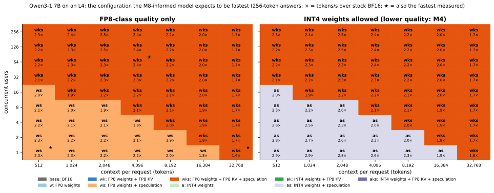

# The performance model

A model of a serving step built from bytes and FLOPs, calibrated on M2–M6, **frozen, and then tested on the
30 servers of M8's plan**. It predicted most of them well and one group of them badly. Both halves are here.

Code: [`src/fastserve/perfmodel/serving.py`](../src/fastserve/perfmodel/serving.py) (the model, stdlib only),
[`fit.py`](../src/fastserve/perfmodel/fit.py) (calibration), `src/fastserve/report/m8.py` (inputs and checks).
Every number below is generated from `results/raw/`.

## 1. What it is for

- **Explaining**: every bar in M8's waterfall should follow from which term of a step a technique changes.
- **Being wrong on the record**: its predictions for every M8 server were committed before any ran
  (`benchmarks/predictions/m8_model.json`).
- **Answering "what should I deploy?"** for a concurrency and context length nobody measured (section 5).

## 2. The model

Three kinds of inputs:

- the model's sizes, from `config.json` (parameters, layers, heads);
- the GPU's measured ceilings, from M0: memory bandwidth B and peak FLOP/s F per matmul format;
- a few calibrated constants for what bytes and FLOPs cannot give (section 3).

**One decode step** of `b` sequences at mean context `c`:

    t_step = t_fixed + b · t_seq                         overheads
           + W / B  +  2 · P · b / F                     weights: bytes ÷ bandwidth + FLOPs ÷ peak
           + b · c · K / (B · η)                         KV cache: bytes ÷ (bandwidth × kernel efficiency)

W is the bytes of weights in the serving format, P the parameters, K the KV bytes per cached token, η how
close the attention kernel gets to the bandwidth. The weights term *adds* memory time and compute time
instead of taking the larger of the two: near the ridge point a kernel reaches neither ceiling, and the sum
fits the data better than the max.

**Prefill** of q new tokens after c₀ cached ones is compute-bound:

    t_prefill = 2 · P · q / (F · η_lin)  +  4 · q · (c₀ + q/2) · D · H · L / (F_bf16 · η_attn)

**A closed loop of N users** spends GPU time on prefills and on steps that the whole batch shares:

    time per request = t_prefill + O · t_token / b          O output tokens, b sequences in flight
    throughput       = O / time per request
    TPOT             = t_token + the other users' prefills that cut in line

**Each technique changes one term:**

| Technique | What changes |
|---|---|
| FP8 / INT4 weights | W shrinks. F changes: FP8 math is faster; INT4 is dequantized to BF16 first |
| FP8 KV cache | K halves; the attention kernel changes (η); if the cache limited the batch, b grows |
| Prefix caching | q shrinks to the uncached part of the prompt; shared cache blocks are read once per group |
| Speculative decoding | t_token = (a step with k + 1 tokens per sequence + k drafted tokens) ÷ tokens kept per pass |

**And one term that is not bytes or FLOPs**, added after M8 (section 4): where vLLM cannot replay a pass as
one CUDA graph, the host works beside the GPU and a pass takes `max(GPU time, host time)`.

Three things the model has to get right that are easy to get wrong, each found by fitting it:

- **Tokens per pass must count every pass**, including those that accept nothing: generated ÷ (generated −
  accepted), from the server's counters.
- **A prefill that rides along in a decode step does not pay for its own read of the weights.** vLLM puts a
  new prompt's tokens in the same pass as the running sequences' next token.
- **"64 users" are not 64 running sequences.** A closed-loop client spends part of each request outside the
  GPU. The load's concurrency is measured as requests in flight.

## 3. Calibration and its check on old data

<!-- BEGIN GENERATED: m8_calibration -->
| Constant | Value | Fitted on (points) |
|---|---|---|
| Fixed cost of a decode step | 1.21 ms | 10 (BF16, ≤ 16 users) |
| Added per sequence in the batch | 0 µs | 10 (BF16, ≥ 64 users: decode, capacity, saturation) |
| FlashAttention: efficiency lost per doubling of the batch | 0.049 | 10 (BF16, ≥ 64 users: decode, capacity, saturation) |
| W8A8's extra per step | 0.49 ms | 16 (FP8/INT8, ≤ 16 users) |
| FlashInfer's share of the bandwidth, BF16 cache | 95% | 6 (M5's FlashInfer control) |
| FlashInfer's share of the bandwidth, FP8 cache | 83% | 6 (M5's FP8 KV servers) |
| Prefill: share of BF16's peak FLOP/s, linear layers | 81% | 12 (one user, 8k–32k prompts: TTFT) |
| Prefill: share of BF16's peak FLOP/s, attention | 80% | the same |
| Prefill: share of its own peak FLOP/s, FP8 layers | 50% | 4 (one user, long prompts: TTFT) |
| Prefill: share of its own peak FLOP/s, INT4 layers | 86% | 8 (one user, long prompts: TTFT) |
| Prefill: share of its own peak FLOP/s, INT8 layers | 48% | 4 (one user, long prompts: TTFT) |
| Per request, before its prefill | 4.1 ms | 6 (one user: TTFT) |
| Fixed cost per drafted token | 0.26 ms | 4 (EAGLE-3, one user) |
| Per drafted token and sequence | 10 µs | 1 (EAGLE-3, 64 users) |
| Cache tokens a running sequence holds ÷ its length | 1.066 | the capacity runs' counters |
<!-- END GENERATED: m8_calibration -->

Each constant is fitted on a named group of earlier measurements. Every other point is held out:

<!-- BEGIN GENERATED: m8_validation -->
| Measured in | Points | Count | Median error, tokens/s | Worst | Within 15% | Median error, TTFT (prompts ≥ 2,000 tokens) | Median error, TTFT (shorter prompts) |
|---|---|---|---|---|---|---|---|
| M2 baselines | used in a fit | 8 | 1.1% | 4% | 100% | 3.3% | 7 ms |
| M2 baselines | held out | 10 | 4.7% | 7% | 100% | — | 13 ms |
| M4 weight formats | used in a fit | 50 | 2.3% | 17% | 94% | 3.6% | 9 ms |
| M4 weight formats | held out | 40 | 5.0% | 20% | 90% | — | 6 ms |
| M5 KV cache and prefix caching | used in a fit | 18 | 2.7% | 14% | 100% | 3.2% | — |
| M5 KV cache and prefix caching | held out | 14 | 2.8% | 27% | 79% | 2.5% | — |
| M6 speculative decoding | used in a fit | 5 | 0.2% | 1% | 100% | — | 7 ms |
| M6 speculative decoding | held out | 37 | 5.7% | 26% | 97% | — | 9 ms |
| **All of the above** |  | 182 | 3.4% | 27% | 94% | 3.6% | 8 ms |
| **All held out** |  | 101 | 4.5% | 27% | 92% | 2.5% | 8 ms |
| M6: a separate draft model (not modeled) | held out | 42 | 55.1% | 102% | 12% | — | 62 ms |
<!-- END GENERATED: m8_validation -->

The last row is outside the model on purpose: a separate draft model inside vLLM costs far more per drafted
token than the bytes it reads (M6's open question), and the model says so by being wrong there. Its largest
misses on the points it does claim:

<!-- BEGIN GENERATED: m8_worst -->
| Measured in | Model | Server | Workload | Users | Measured tok/s | Predicted | Error |
|---|---|---|---|---|---|---|---|
| M5 KV cache and prefix caching | Qwen3-0.6B | prefix-on | shared_prefix | 8 | 810 | 1,026 | 27% |
| M5 KV cache and prefix caching | Qwen3-0.6B | fp8w-fp8kv | saturation | 512 | 3,492 | 4,421 | 27% |
| M6 speculative decoding | Qwen3-1.7B | bf16-ngram-k6 | spec_mixed | 64 | 1,840 | 1,364 | -26% |
| M4 weight formats | Qwen3-0.6B | int8 | saturation | 512 | 1,852 | 2,231 | 20% |
| M4 weight formats | Qwen3-0.6B | fp8 | saturation | 512 | 1,863 | 2,224 | 19% |
| M4 weight formats | Qwen3-0.6B | gptq | saturation | 512 | 1,836 | 2,189 | 19% |
| M4 weight formats | Qwen3-0.6B | awq | saturation | 512 | 1,842 | 2,189 | 19% |
| M4 weight formats | Qwen3-1.7B | bf16 | decode | 256 | 3,962 | 3,300 | -17% |
<!-- END GENERATED: m8_worst -->

## 4. Frozen predictions against M8

What the model said before the runs, as speedups over the stock server (Qwen3-1.7B):

<!-- BEGIN GENERATED: m8_predicted_large -->
| Workload | Base (tokens/s) | `w` | `k` | `p` | `s` | `wk` | `wkp` | `wkps` | `akps` |
|---|---|---|---|---|---|---|---|---|---|
| Latency (1 user, real prompts) | 68 | 1.51× | 1.00× | 1.00× | 1.68× | 1.52× | 1.52× | 2.33× | 3.00× |
| Busy (64 users, real prompts) | 1,899 | 1.33× | 1.15× | 1.00× | 1.26× | 1.61× | 1.61× | 1.89× | 1.68× |
| Capacity (96 users, 4k-token prompts) | 254 | 1.11× | 1.54× | 1.00× | 1.49× | 1.77× | 1.77× | 2.40× | 2.17× |
| Multi-turn (8 users, shared prefixes) | 195 | 1.26× | 1.11× | 1.77× | 1.32× | 1.45× | 2.75× | 3.94× | 4.23× |
| Long (1 user, 32k tokens) | 10 | 1.13× | — | — | — | 1.20× | 1.20× | 1.33× | 1.27× |
<!-- END GENERATED: m8_predicted_large -->

And what happened:

<!-- BEGIN GENERATED: caption-m8_predicted -->
*Frozen before any M8 server ran, the model's 125 predictions have a median error of 6% (66% within 15%): 3% without speculation, 11% with it, and 45% where FP8 KV meets speculation, which the model had no term for.*
<!-- END GENERATED: caption-m8_predicted -->

<!-- BEGIN GENERATED: m8_model_errors -->
| Points | Count | Median error | Median signed error | Worst | Within 15% |
|---|---|---|---|---|---|
| Latency (1 user, real prompts) | 28 | 8.2% | 10.2% | 300% | 71% |
| Busy (64 users, real prompts) | 28 | 16.0% | 17.5% | 164% | 50% |
| Capacity (96 users, 4k-token prompts) | 28 | 5.4% | 4.7% | 110% | 86% |
| Multi-turn (8 users, shared prefixes) | 28 | 17.8% | 19.7% | 324% | 46% |
| Long (1 user, 32k tokens) | 13 | 2.4% | -2.1% | 28% | 92% |
| Servers without speculation | 70 | 3.5% | 2.1% | 102% | 84% |
| Servers with speculation | 55 | 24.8% | 24.8% | 324% | 44% |
| Qwen3-1.7B | 83 | 5.3% | 5.0% | 109% | 77% |
| Qwen3-0.6B | 42 | 26.2% | 27.5% | 324% | 45% |
| **All** | 125 | 6.4% | 6.4% | 324% | 66% |
<!-- END GENERATED: m8_model_errors -->

<!-- BEGIN GENERATED: m8_model_worst -->
| Model | Server | Workload | Measured tok/s | Predicted | Error |
|---|---|---|---|---|---|
| Qwen3-0.6B | `wkps` | Multi-turn (8 users, shared prefixes) | 328 | 1,394 | 324% |
| Qwen3-0.6B | `wks` | Latency (1 user, real prompts) | 79 | 315 | 300% |
| Qwen3-0.6B | `wkps` | Latency (1 user, real prompts) | 80 | 315 | 292% |
| Qwen3-0.6B | `kps` | Multi-turn (8 users, shared prefixes) | 407 | 1,214 | 198% |
| Qwen3-0.6B | `wks` | Multi-turn (8 users, shared prefixes) | 271 | 733 | 170% |
| Qwen3-0.6B | `wks` | Busy (64 users, real prompts) | 2,648 | 7,001 | 164% |
| Qwen3-0.6B | `kps` | Latency (1 user, real prompts) | 103 | 266 | 158% |
| Qwen3-0.6B | `wkps` | Busy (64 users, real prompts) | 2,826 | 7,001 | 148% |
| Qwen3-0.6B | `wps` | Multi-turn (8 users, shared prefixes) | 545 | 1,145 | 110% |
| Qwen3-0.6B | `wps` | Capacity (96 users, 4k-token prompts) | 292 | 614 | 110% |
<!-- END GENERATED: m8_model_worst -->

Three kinds of miss, in order of size:

1. **FP8 KV with speculation** (the hollow markers). The model predicted the product of two gains. The
   servers lost their full CUDA graph and waited for the host
   ([06-results-analysis.md, section 6](06-results-analysis.md#6-the-pair-that-collides)). The model had no
   term for the host at all. This is the "wrong physics" kind of miss.
2. **The small model's drafter on prompts it was not measured on.** The model assumed the tokens per pass
   measured on real prompts. On random-token and multi-turn prompts the small model's head keeps far fewer
   ([06, section 12](06-results-analysis.md#12-tokens-kept-per-pass)). This is a "wrong input" miss: with
   the measured value the model is close.
3. **FlashInfer at 64 users.** The model gives FlashInfer a constant efficiency fitted on long contexts. On
   a busy server with short contexts it is slower than FlashAttention, most visibly with FP8 weights.

**Separating wrong physics from wrong inputs.** Feed the model what M8 measured (lengths, requests in
flight, tokens per pass, cache sizes) and keep the frozen constants: what is left is physics. Then add the
host term, with its one constant taken from M8 itself:

<!-- BEGIN GENERATED: m8_model_informed -->
| Points | Count | Median error, frozen constants | Within 15% | Median error, with the host term | Within 15% |
|---|---|---|---|---|---|
| Latency (1 user, real prompts) | 31 | 9.1% | 71% | 4.0% | 94% |
| Busy (64 users, real prompts) | 31 | 16.4% | 45% | 15.4% | 48% |
| Capacity (96 users, 4k-token prompts) | 31 | 5.8% | 55% | 5.8% | 55% |
| Multi-turn (8 users, shared prefixes) | 31 | 13.9% | 55% | 5.8% | 74% |
| Long (1 user, 32k tokens) | 13 | 2.7% | 92% | 2.7% | 100% |
| Servers with FP8 KV and speculation | 39 | 31.4% | 15% | 13.9% | 54% |
| All other servers | 98 | 4.2% | 78% | 4.2% | 78% |
| **All** | 137 | 6.9% | 60% | 5.1% | 71% |
<!-- END GENERATED: m8_model_informed -->

The host constant is the median step time of the servers that lost their graph, about
<!-- BEGIN GENERATED: m8_host_step_ms -->
25
<!-- END GENERATED: m8_host_step_ms -->
ms. It was fitted on these same points, so the right-hand columns describe; they do not predict. What they
show is that one constant accounts for most of the largest group of misses. What they do not fix is the
busy workload, where the remaining error is FlashInfer's (kind 3 above).

## 5. Using it: which stack for which traffic?

<!-- BEGIN GENERATED: caption-m8_recommendation -->
*The M8-informed model's recommendation for Qwen3-1.7B, FP8-class quality only: `wks` in 70% of the cells, `ws` in 30% of the cells. It names the fastest measured stack on 3 of the 4 measured workloads (★); everywhere else the map is a prediction.*
<!-- END GENERATED: caption-m8_recommendation -->

The map uses the M8-informed constants. Read it with its errors in mind:

- **Bottom left (few users, short context): speculation without FP8 KV.** A pass is short, so a stack that
  loses its CUDA graph waits for the host. Measured, and the model now agrees.
- **Right and top (long context or many sequences): add FP8 KV.** The cache read or the cache's capacity
  dominates, and a pass is long enough that the host is not what it waits for. Measured at two corners.
- **Top left (many users, short context): the map says `wks`; the measurement says `ws`.** This is the
  FlashInfer miss above, and the one measured workload where the map's pick is not the fastest stack. Trust
  the measurement.

**A worked question: 500 concurrent users with 16k-token contexts.** On one L4 with Qwen3-1.7B:

<!-- BEGIN GENERATED: m8_example -->
| Stack | Sequences running at once | Tokens/s | vs stock | TPOT (ms) | $ per 1M tokens |
|---|---|---|---|---|---|
| `base` | 9 | 60 | 1.00× | 136 | 3.69 |
| `w` | 9 | 66 | 1.10× | 135 | 3.36 |
| `wk` | 17 | 94 | 1.56× | 177 | 2.37 |
| `ws` | 9 | 96 | 1.59× | 85 | 2.32 |
| **`wks`** | 16 | 121 | 2.01× | 125 | 1.83 |
| `a` | 10 | 65 | 1.08× | 142 | 3.42 |
| `ak` | 18 | 90 | 1.50× | 191 | 2.46 |
| `as` | 9 | 92 | 1.52× | 92 | 2.43 |
| `aks` | 17 | 114 | 1.89× | 139 | 1.95 |
<!-- END GENERATED: m8_example -->

The first thing the model says is not about speed: one GPU holds only a small fraction of those 500 requests
at once, and the rest queue. The stack in bold serves the most tokens per GPU among the FP8-class stacks,
mainly because an FP8 cache holds twice the sequences. The honest answer to the customer is a number of
GPUs, and the model gives the per-GPU rate to size it with. These are predictions for a load nobody ran.

## 6. Limits

- **Calibrated on one GPU and two models of the same family.** The constants are not portable; the structure
  should be.
- **The host term is one constant per pass.** The measurements show it depends on the weights' format
  (about twice as long with FP8 weights) and probably on the CPU. The model uses one median.
- **FlashInfer has one efficiency per cache format**, fitted at long context. It is wrong for busy,
  short-context servers.
- **Mixed-length batches at saturation are over-predicted, uniform batches of 256 under-predicted**
  (section 3): one constant for FlashAttention's batch behaviour cannot serve both.
- **Acceptance is an input, not an output.** The model cannot say how many tokens a drafter will keep on a
  new kind of prompt, and that was its second-largest source of error.
- **A separate draft model is not modeled** (section 3).
- **TTFT under load** is not predicted: it is queueing, and the model has no queue.
