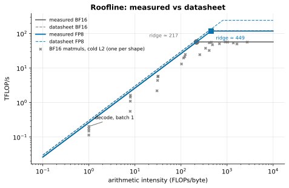
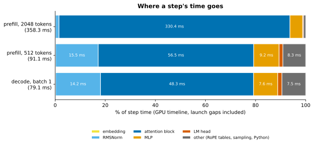
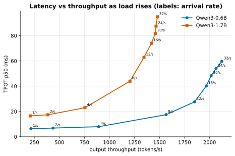
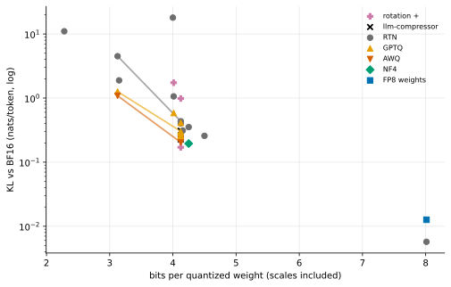
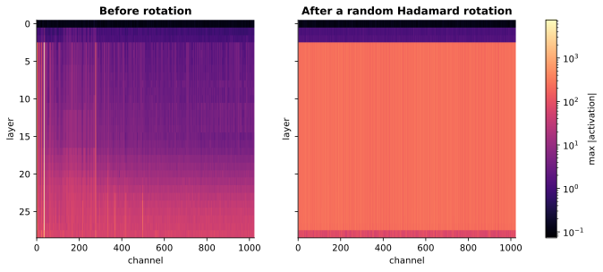
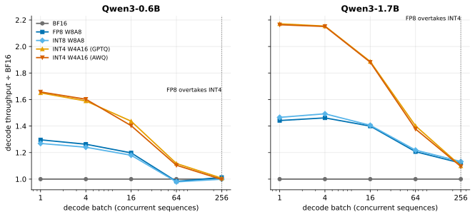
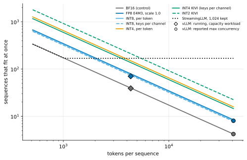
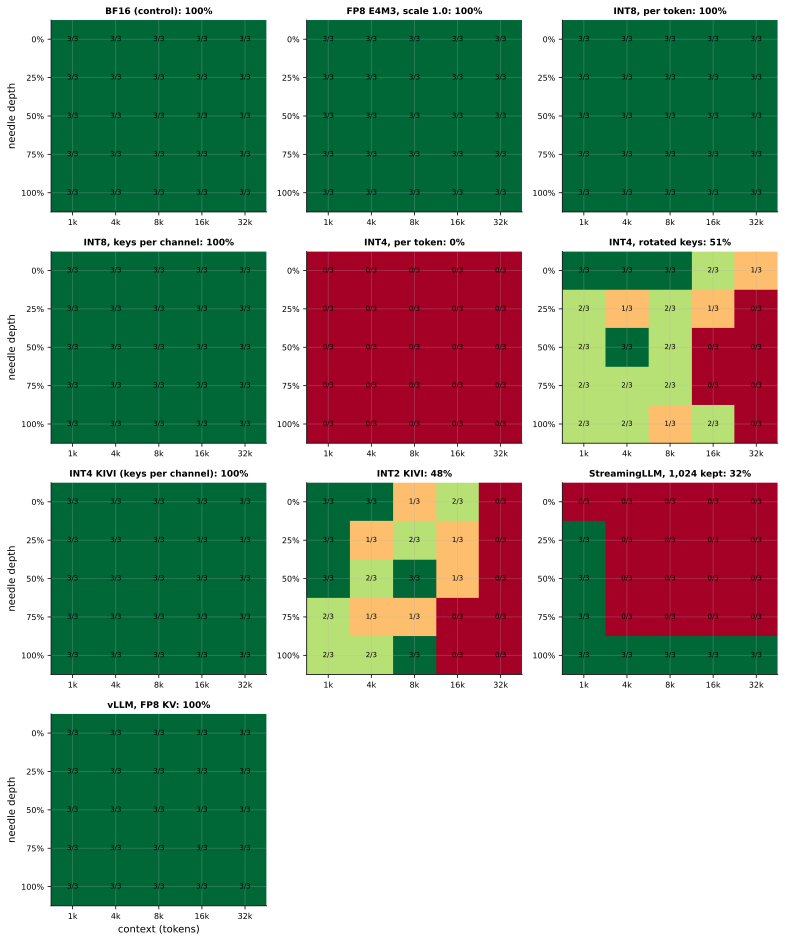
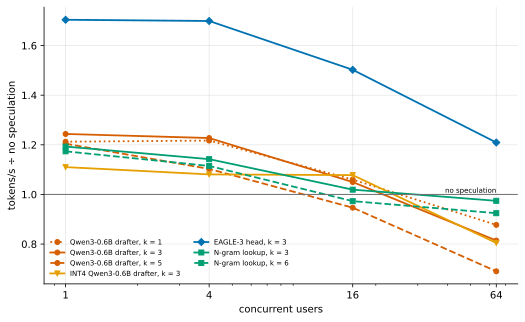

# Where the milliseconds go: serving a small LLM on a cheap GPU, one lever at a time

*A draft for a technical but general audience. Every number, table and caption below is generated from the
raw benchmark records in this repository; none is typed by hand.*

I took two small open-weight models (Qwen3-0.6B and Qwen3-1.7B), one low-cost cloud GPU (an NVIDIA L4), and a
stock deployment of vLLM, and asked how much cheaper a token can get, and *why*. I built each technique from
scratch first, then measured the production version, and wrote down a prediction before every experiment.

The short version:

<!-- BEGIN GENERATED: m8_findings -->
- **The best measured stack, Qwen3-1.7B on one L4, against stock BF16 vLLM:** latency `wps` 2.25×, busy `wps` 1.46×, capacity `wkps` 2.28×, multi-turn `wps` 2.76×, long `wkps` 1.22×. With INT4 weights allowed (lower quality, M4): latency `aps` 3.08×, busy `aps` 1.49×, multi-turn `aps` 3.13×.
- **The full stack (`wkps`: FP8 weights, FP8 KV, prefix caching, speculation) is the best stack on 2 of 5 workloads on Qwen3-1.7B and 0 of 5 on Qwen3-0.6B.** At one user it gives 1.13× where `wps` gives 2.25×; on Qwen3-0.6B it is slower than stock (0.48×).
- **Why: one pair collides.** With an FP8 KV cache and speculation together, vLLM 0.30 gives up its full CUDA graph on this GPU, and a step then waits for the host instead of the GPU: 25.8 ms per step against 4.6 with the graph, for the same GPU work (Qwen3-0.6B, FP8 weights, piecewise graphs forced on a control server).
- **Everything else nearly multiplies:** 17 of 24 pair × workload interactions are within 5% of 1. FP8 KV × speculation is 0.77 at one user.
- **Quality of the lossy part of the stack** (FP8 weights + FP8 KV, Qwen3-1.7B, in vLLM): perplexity ×0.996, needle recall 100%, GSM8K -1.3, MMLU -0.4 and HumanEval -6.1 points. Prefix caching does not change outputs; speculation is lossless in distribution (M6).
- **The serving model, frozen before any M8 server ran:** median error 6.4% over 125 predictions (66% within 15%), 3.5% on servers without speculation. Its large misses are the colliding servers: it had no term for the host. With that one constant fitted on M8, the same points come to 5.1% (71% within 15%).
<!-- END GENERATED: m8_findings -->

The long version is a story about bytes.

## 1. Generating a token is a memory problem

To produce one token, a language model reads all of its weights once. For one user, that read is almost the
whole job: there is very little arithmetic to do per byte read. A GPU can multiply much faster than it can
fetch, so it spends the step waiting for memory.

The first thing I did was measure the GPU instead of trusting its datasheet:

<!-- BEGIN GENERATED: hw_summary -->
*NVIDIA L4 · driver 580.95.05 · CUDA 13.0 · PyTorch 2.14.0+cu130 · Triton 3.8.0 · host CPU unknown · run `aed53c62b464` · commit `d5e40f5` · 2026-09-29T21:20:30+00:00*

| Quantity | Measured | Datasheet | Measured / datasheet |
|---|---|---|---|
| Memory bandwidth, read (GB/s) | 262 | 300 | 87% |
| Memory bandwidth, copy (GB/s) | 231 | 300 | 77% |
| BF16 matmul peak (TFLOP/s) | 57.0 | 121 | 47% |
| FP16 matmul peak (TFLOP/s) | 56.6 | 121 | 47% |
| FP8 matmul peak (TFLOP/s) | 117.8 | 242 | 49% |
| INT8 matmul peak (TOPS) | 128.1 | 242 | 53% |
| BF16 ridge point (FLOPs/byte) | 217 | 403 | — |
| FP8 ridge point (FLOPs/byte) | 449 | 807 | — |
| Kernel launch, eager (µs per kernel) | 8.72 | — | — |
| Kernel launch, CUDA graph (µs per kernel) | 0.95 | — | — |
| Power, idle (W) | 30 | — | — |
| Power, streaming memory (W) | 63 | — | — |
| Power, BF16 matmul (W) | 71 | 72 | 99% |
| SM clock, sustained BF16 matmul (MHz) | 1,009 | 2,040 | 49% |
| BF16 datasheet peak at that clock (TFLOP/s) | 59.8 | 121 | 49% |
| Temperature start → end (°C) | 61 → 68 | — | — |
<!-- END GENERATED: hw_summary -->

Two numbers matter. **Bandwidth** is how many bytes per second the GPU can read from its memory. **Peak
FLOP/s** is how much arithmetic it can do. Their ratio, the *ridge point*, says how many operations per byte a
workload must do before arithmetic, not memory, becomes the limit. Decoding for one user is far below it:

<!-- BEGIN GENERATED: caption-hw_roofline -->
*Measured BF16 ridge point: 217 FLOPs/byte (FP8: 449); an M=1 matmul (decode at batch 1) sits at 1.0 FLOPs/byte and reaches 0.2% of the measured peak.*
<!-- END GENERATED: caption-hw_roofline -->

So the ceiling for one user is simple: bandwidth divided by the bytes read per token.

<!-- BEGIN GENERATED: m1_model_facts -->
*Qwen3-0.6B, from config.json; bandwidth from the M0 probe.*

| Quantity | Value |
|---|---|
| Parameters | 596 M |
| Weights in BF16 | 1.192 GB |
| Embedding / LM head share of weights | 26% |
| Bytes read per decode step (batch 1, weights only) | 1.192 GB |
| KV cache per token (BF16) | 112 KiB |
| Batch-1 ceiling = measured read bandwidth ÷ bytes per step | 220 tokens/s |
<!-- END GENERATED: m1_model_facts -->

That one division organizes everything else. Every speedup in this project is one of three things:

| Lever | Meaning | Techniques |
|---|---|---|
| **Move fewer bytes** | shrink what is read per token | quantized weights, a quantized KV cache |
| **More tokens per byte moved** | get more useful work out of each read | batching, prefix caching, speculative decoding |
| **Less waste between bytes and math** | remove overhead around the kernels | fused kernels, CUDA graphs |

## 2. An engine from scratch, to see it

Before touching a production server I wrote a minimal inference engine in plain PyTorch ("nanoserve") and
checked its logits against Hugging Face's. Its purpose is to make the physics visible:

<!-- BEGIN GENERATED: caption-m1_anatomy -->
*In a decode, batch 1 step, the attention block takes 61% of the time; tiny ops like RMSNorm cost far more than their arithmetic, because every launch has a fixed cost.*
<!-- END GENERATED: caption-m1_anatomy -->

A plain-PyTorch engine is nowhere near the ceiling, and the reason is the third lever: each tiny operation
is a separate launch from Python, and a launch has a fixed cost. Batching shows the second lever at work.
The weights are read once per step however many sequences share it:

<!-- BEGIN GENERATED: m1_speed -->
| Workload | Time per step (ms) | Tokens/s | vs batch 1 |
|---|---|---|---|
| decode, batch 1 | 50.1 | 20 | 1.0× |
| decode, batch 4 | 50.2 | 80 | 4.0× |
| decode, batch 16 | 53.4 | 299 | 15.0× |
| decode, batch 64 | 53.8 | 1,189 | 59.5× |
| decode, batch 256 | 161.1 | 1,589 | 79.6× |
| prefill, 128 tokens | 52.2 | 2,451 | — |
| prefill, 512 tokens | 54.4 | 9,405 | — |
| prefill, 2048 tokens | 358.7 | 5,710 | — |
<!-- END GENERATED: m1_speed -->

## 3. The baseline, measured properly

Everything is compared with stock vLLM in BF16 on the same GPU. A serving benchmark is easy to get wrong, so
the harness records every request, drives load both open-loop and closed-loop, and reports percentiles and
*goodput* (requests that met a latency target), not just averages.

<!-- BEGIN GENERATED: m2_summary -->
| Model | Chat TTFT p50 (ms) | Chat TPOT p50 (ms) | Single-stream tokens/s | Sweep peak tokens/s (run average) | Knee (req/s) | $ / 1M tokens at that peak | KV cache (tokens) |
|---|---|---|---|---|---|---|---|
| Qwen3-0.6B | 20.1 | 5.83 | 171 | 2,122 | 12 | 0.105 | 172,640 |
| Qwen3-1.7B | 27.8 | 14.74 | 68 | 1,486 | 4 | 0.150 | 142,928 |
<!-- END GENERATED: m2_summary -->

<!-- BEGIN GENERATED: caption-m2_pareto -->
*Qwen3-0.6B reaches 2,122 output tokens/s; as load rises its TPOT p50 grows from 6.4 to 59.7 ms, the price of bigger batches.*
<!-- END GENERATED: caption-m2_pareto -->

Throughput rises while each user's tokens arrive more slowly. That is batching: more tokens per byte moved,
paid for in latency.

## 4. Move fewer bytes: quantizing the weights

If a step is a read of the weights, store them in fewer bytes. I implemented the standard methods myself
(round-to-nearest, GPTQ, AWQ, Hadamard rotation, FP8) and validated them against a library's checkpoints.

How you quantize matters more than how many bits you use:

<!-- BEGIN GENERATED: caption-m3_error_vs_bits -->
*Going from 4 to 3 bits multiplies round-to-nearest's KL by 10×; at 4 bits GPTQ keeps 75% of it on the same grid.*
<!-- END GENERATED: caption-m3_error_vs_bits -->

The reason is outliers. A few channels of the model's internal activations are enormous compared with the
rest, and a uniform grid spends its levels on them:

<!-- BEGIN GENERATED: caption-m3_rotation -->
*Rotating the residual stream spreads its outlier channels over all channels: the largest channel maximum drops from 1,295× to 1.3× the median.*
<!-- END GENERATED: caption-m3_rotation -->

In production the question is which format, and the answer depends on load. INT4 reads the fewest bytes but
must be expanded before multiplying; FP8 reads more bytes and multiplies natively:

<!-- BEGIN GENERATED: caption-m4_speedup_vs_batch -->
*On Qwen3-1.7B, INT4 decodes 2.2× faster than BF16 at batch 1 but 1.1× at batch 256; FP8 overtakes it from batch 256.*
<!-- END GENERATED: caption-m4_speedup_vs_batch -->

<!-- BEGIN GENERATED: m4_crossover -->
| Batch | Qwen3-0.6B: INT4 ÷ FP8 | Qwen3-1.7B: INT4 ÷ FP8 |
|---|---|---|
| 1 | 1.27× | 1.51× |
| 4 | 1.26× | 1.47× |
| 16 | 1.20× | 1.35× |
| 64 | 1.14× | 1.16× |
| 256 | 0.99× | 0.98× |
<!-- END GENERATED: m4_crossover -->

One user is memory-bound, so fewer bytes win. A full batch is compute-bound, so faster math wins. A
prediction of where they cross was written down before the measurement, and it was too early: INT4 stays
ahead for longer than the simple estimate says ([M4 gate report](gates/M4-report.md)).

## 5. The other thing a step reads: the KV cache

A model keeps keys and values for every token it has seen, so that it does not recompute them. With long
prompts or many users, this cache is what a step reads and what fills the GPU's memory.

<!-- BEGIN GENERATED: caption-m5_concurrency -->
*In the L4's 18.4 GiB KV budget, FP8 fits twice the sequences of BF16 and INT4 KIVI 3.5×; only eviction keeps the count flat as contexts grow. With 4k-token prompts vLLM ran 39 (BF16) vs 70 (FP8).*
<!-- END GENERATED: caption-m5_concurrency -->

A smaller cache holds more sequences, and more sequences per step is the second lever again. But the cache is
where long-context correctness lives, so every lossy scheme has to pass a recall test: a secret hidden
somewhere in a long prompt.

<!-- BEGIN GENERATED: caption-m5_needle -->
*Every policy keeps the needle except INT4, per token (0%), INT4, rotated keys (51%), INT2 KIVI (48%), StreamingLLM, 1,024 kept (32%).*
<!-- END GENERATED: caption-m5_needle -->

Keys are harder to quantize than values, for the same outlier reason as before:

<!-- BEGIN GENERATED: caption-m5_key_value_channels -->
*Keys have outlier channels, values don't: in the median layer the largest key channel is 8.3× the median one, against 2.1× for values, so one scale per token wastes the grid on keys; layer 0's largest key reaches |506| (FP8 E4M3 tops out at 448).*
<!-- END GENERATED: caption-m5_key_value_channels -->

And when many requests share a prefix (a system prompt, a conversation so far), the cheapest read is the one
that already happened:

<!-- BEGIN GENERATED: caption-m5_prefix_ttft -->
*Prefix caching on the multi-turn workload: Qwen3-0.6B: TTFT p50 222 → 60 ms, prefill 85% smaller; Qwen3-1.7B: TTFT p50 479 → 135 ms, prefill 85% smaller.*
<!-- END GENERATED: caption-m5_prefix_ttft -->

## 6. More tokens per byte: speculative decoding

If a step for one user is a read of the weights with idle arithmetic, use the idle arithmetic. A cheap
drafter guesses several tokens; the big model checks them all in one pass, which costs about the same read
as generating one. A rejection rule keeps the output distribution exactly the big model's. I implemented it
and tested that claim statistically:

<!-- BEGIN GENERATED: m6_lossless -->
| Arithmetic | Prompt | Samples × tokens | TV between the two samplers' passes | χ², speculative vs its own pass | χ², plain vs its own pass | χ², speculative vs the reference pass | 5σ limit | TV, speculative vs plain samples | TV, plain vs plain samples |
|---|---|---|---|---|---|---|---|---|---|
| BF16 | Chat | 600 × 3 | 0.179 | 0 | 1 | 7 | 12 | 0.168 | 0.020 |
| BF16 | Code | 600 × 3 | 0.000 | 0 | 0 | 0 | 8 | 0.003 | 0.003 |
| BF16 | Math | 600 × 3 | 0.034 | 2 | 2 | 6 | 12 | 0.068 | 0.052 |
| BF16 | Summarization | 600 × 3 | 0.000 | 0 | 0 | 0 | 8 | 0.000 | 0.000 |
| float32 (control) | Chat | 3,000 × 1 | 0.000 | 3 | 2 | 3 | 12 | 0.022 | 0.004 |
| float32 (control) | Code | 600 × 3 | 0.000 | 3 | 1 | 3 | 8 | 0.010 | 0.003 |
| float32 (control) | Math | 600 × 3 | 0.000 | 2 | 0 | 2 | 12 | 0.037 | 0.035 |
| float32 (control) | Summarization | 600 × 3 | 0.000 | 0 | 0 | 0 | 8 | 0.000 | 0.000 |
<!-- END GENERATED: m6_lossless -->

<!-- BEGIN GENERATED: caption-m6_speedup_vs_users -->
*The best method for one user (EAGLE-3 head, k = 3, 1.70×) gives 1.21× at 64 users, and 6 of the 7 setups fall below no speculation there: speculation spends spare compute, and a busy server has little.*
<!-- END GENERATED: caption-m6_speedup_vs_users -->

Speculation spends spare compute. A busy server has none. Where drafting works is visible token by token:

<!-- BEGIN GENERATED: caption-m6_highlight -->
*Blue tokens were drafted and accepted; bold orange ones the target wrote itself. Qwen3-0.6B drafted 75% of the code answer; N-gram lookup drafted 14% of the chat answer.*
<!-- END GENERATED: caption-m6_highlight -->

## 7. Less waste: two kernels

Profiling pointed at two places. I wrote a Triton kernel that fuses a normalization with the quantization
that follows it, and one that runs decode attention directly on a 4-bit KV cache without ever expanding it.

<!-- BEGIN GENERATED: caption-m7_speedup -->
*Kernel 2 on INT4 codes is 1.3–16× the speed of nanoserve's PyTorch attention (0 of 15 shapes slower), and 0.44–2.63× FlashInfer's on a full-precision cache: fewer bytes win at long context, launch overhead decides the short ones.*
<!-- END GENERATED: caption-m7_speedup -->

It is honest about where it loses: on the same full-precision bytes a hand-tuned library is slightly faster,
and at short context a launch from Python costs more than the kernel saves. And once the GPU's part of a
step got small, something else was in the way:

<!-- BEGIN GENERATED: caption-m7_timeline -->
*One decode step at 1 × 16,384 tokens: the GPU works 69 of 72 ms before and 12 of 73 ms after; what is left is 2,582 small kernels with gaps between them (Python between launches), which no attention kernel can shorten.*
<!-- END GENERATED: caption-m7_timeline -->

That sentence turned out to be the plot of the next chapter.

## 8. All of it at once

Then I switched everything on, one technique at a time and in every combination, with a performance model's
predictions frozen beforehand.

<!-- BEGIN GENERATED: caption-m8_waterfall -->
*The best measured stack serves Qwen3-1.7B at 1.2–2.8× lower cost per token than stock BF16 vLLM on the same L4 (most on multi-turn, least on long); on 8 of 10 model–workload pairs it is not the full stack, because the last technique added made serving dearer (hatched steps).*
<!-- END GENERATED: caption-m8_waterfall -->

<!-- BEGIN GENERATED: m8_best_large -->
| Workload | Stock BF16 (tokens/s) | Full stack `wkps` | Best measured stack | Its speedup | Its perplexity vs BF16 | Best with INT4 weights, if faster | Its speedup |
|---|---|---|---|---|---|---|---|
| Latency (1 user, real prompts) | 67 | 1.13× | `wps` | 2.25× | +0.0% | `aps` | 3.08× |
| Busy (64 users, real prompts) | 1,955 | 1.25× | `wps` | 1.46× | +0.0% | `aps` | 1.49× |
| Capacity (96 users, 4k-token prompts) | 256 | 2.28× | `wkps` | 2.28× | -0.4% | — | — |
| Multi-turn (8 users, shared prefixes) | 199 | 2.27× | `wps` | 2.76× | +0.0% | `aps` | 3.13× |
| Long (1 user, 32k tokens) | 10 | 1.22× | `wkps` | 1.22× | -0.4% | — | — |
<!-- END GENERATED: m8_best_large -->

The full stack was not the best stack. Two techniques that each help, an FP8 KV cache and speculative
decoding, were a loss together at low load. Nothing about either had suggested it.

It took four rounds of control servers to find out why, and my first explanation was wrong. The cause is the
third lever running backwards. A serving engine removes the waste between kernels by recording a whole
forward pass as one *CUDA graph* and replaying it. With that particular pair, on this generation of GPU, vLLM
cannot record the pass as one graph. It falls back to recording the stretches between attention calls, and
Python runs between every layer. The GPU finishes its part and waits:

<!-- BEGIN GENERATED: caption-m8_host_chain -->
*12 of 15 servers on piecewise graphs are slower than their full-graph twin, by up to 5.6× (`wg` on Qwen3-0.6B: 26 ms per step against 5). The 3 that are not are the ones whose GPU already needs 15 ms or more per step: the host's time hides behind the GPU's.*
<!-- END GENERATED: caption-m8_host_chain -->

The detail I am least proud of and most glad to have written down: my first control server forced that graph
mode on its own and showed no loss, so I cleared it and spent two rounds blaming the wrong component. The
control ran on the larger model, whose GPU work per pass is long enough to hide a slow host. The same control
on the smaller model showed the loss at once. A null result is only as good as what the measurement could
have seen.

Everything else behaved:

<!-- BEGIN GENERATED: caption-m8_interactions -->
*17 of 24 pairs multiply to within 5%. The pair that competes most is FP8 KV cache with speculative decoding on latency (0.77); the pair that helps each other most is prefix caching with speculative decoding on multi-turn (1.11). Two runs of the stock server differ by up to 1%.*
<!-- END GENERATED: caption-m8_interactions -->

## 9. Could it have been predicted?

The performance model is the idea from section 1, taken seriously: a step is bytes over bandwidth plus
operations over peak, plus a few fitted constants for overheads. Calibrated on the earlier experiments and
frozen, it then had to predict the full-stack servers:

<!-- BEGIN GENERATED: caption-m8_predicted -->
*Frozen before any M8 server ran, the model's 125 predictions have a median error of 6% (66% within 15%): 3% without speculation, 11% with it, and 45% where FP8 KV meets speculation, which the model had no term for.*
<!-- END GENERATED: caption-m8_predicted -->

It is good exactly where a step waits for the GPU, and useless where a step waits for the host. That is the
honest boundary of this kind of reasoning: bytes and FLOPs bound what the GPU can do. A server can fall far
short of that bound for reasons that are not on the GPU.

## 10. What I would tell someone deploying this

- **Measure your own GPU.** The datasheet is a ceiling nobody reaches.
- **Pick the weight format by load.** Few users: the fewest bytes. Many users: the fastest math.
- **Quantize the KV cache when the cache is your bottleneck**, and test recall on long prompts when you do.
- **Use speculation when the server has spare compute**, and check which code path your engine takes with it.
- **Turn on prefix caching wherever prompts repeat.** It costs nothing where they do not.
- **Never stack optimizations on faith.** Measure the combination. One of ours changed sign.
- **Report quality next to speed.** The lossy parts of the stack here cost measurable accuracy on code
  while leaving perplexity and long-context recall untouched.

## 11. What did not work, and what this is not

- The full stack as designed: on most workloads a subset of it was faster.
- My first two explanations of why.
- Rotating the model's activations to remove outliers made simple rounding *worse* at first: folding the
  norms into the weights moved the unevenness into the weights. Only with GPTQ did rotation give the best
  4-bit result ([M3 gate report](gates/M3-report.md)).
- A separate small model as a drafter inside the serving engine cost more than the bytes it reads
  ([M6](learning/M6-speculative-decoding.md)); a lightweight head on the target's own features did not.
- The custom kernels are not inside vLLM. Their effect there is a labeled projection.
- This is two small models on one modest GPU. The method carries over. The numbers do not, and one finding
  (the collision) is specific to GPUs older than Hopper.
- These are better configurations of vLLM for a workload. Nothing here is "faster than vLLM".

## 12. Try it

The [dashboard](../site/index.html) has interactive versions of the figures and runs the performance model
in the browser. `make reproduce-quick` redraws every figure from the committed raw results in about a
minute, without a GPU. The full story, milestone by milestone, is in the
[learning docs](learning/), the [results analysis](06-results-analysis.md) and the
[model's write-up](07-performance-model.md).
