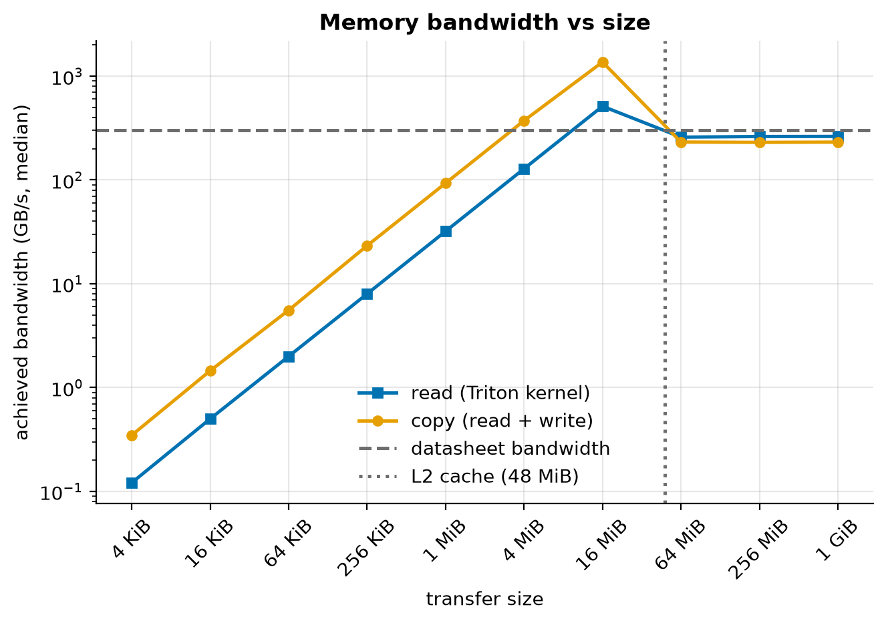
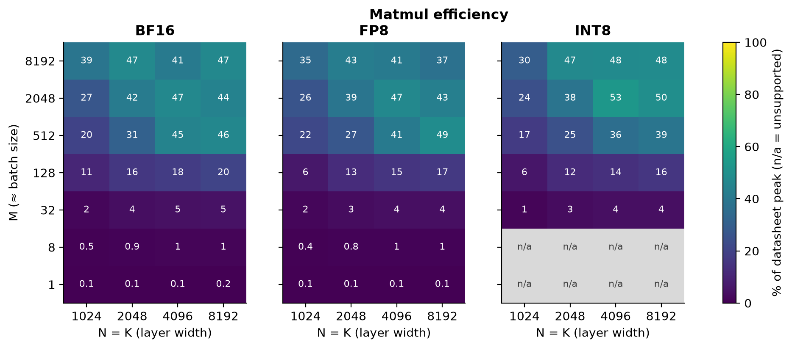

# Gate Report: M0, Foundations

> **Gate decision (2026-09-30):** approved by the owner. The explain-it-back questions are deferred for later study.
> Tagged `v0.0-foundations`.

## What was built

- **Cloud-only environment:** [`pyproject.toml`](../../pyproject.toml) + [`uv.lock`](../../uv.lock). The laptop
  installs only `modal` and `ruff` (~50 MB). PyTorch, Triton and friends live in the cloud image.
- **One door to all compute:** [`infra/modal_app.py`](../../infra/modal_app.py), which has CPU tests, GPU tests on
  an NVIDIA L4, the hardware probe and figure rendering. Every function has a timeout.
- **Hardware probe:** [`src/fastserve/hw/`](../../src/fastserve/hw/):
  - memory bandwidth (device copy + a Triton read kernel, 4 KiB–1 GiB)
  - BF16/FP16/FP8/INT8 matmul throughput (cold L2)
  - kernel launch overhead (eager vs CUDA graph)
  - power and SM clock under load
- **Measurement plumbing:**
  - [`timing.py`](../../src/fastserve/timing.py): CUDA events, optional L2 flush
  - [`results.py`](../../src/fastserve/results.py): JSONL records with git commit, GPU, driver, versions, config
  - [`perfmodel/roofline.py`](../../src/fastserve/perfmodel/roofline.py): roofline arithmetic
- **Generated docs:** [`report/`](../../src/fastserve/report/) + [`scripts/render_docs.py`](../../scripts/render_docs.py).
  Every number in the docs comes from `results/raw/`, and predictions live in
  [`benchmarks/predictions/m0.json`](../../benchmarks/predictions/m0.json) and are checked automatically.
- **Figures:** [`viz/`](../../src/fastserve/viz/), with one shared colorblind-safe style, PNG + SVG, and captions
  computed from data.
- **Tests:** 43 CPU tests (GitHub Actions + Modal) and 4 GPU tests on the L4, including "too good to be true"
  guards.
- **Docs:** [learning doc](../learning/M0-foundations.md), [ADR 001](../decisions/001-cloud-only-small-models.md),
  [JOURNAL](../../JOURNAL.md).

## Key results

<!-- BEGIN GENERATED: hw_summary -->
*NVIDIA L4 · driver 580.95.05 · CUDA 13.0 · PyTorch 2.14.0+cu130 · Triton 3.8.0 · host CPU unknown · run `aed53c62b464` · commit `d5e40f5` · 2026-09-29T21:20:30+00:00*

| Quantity | Measured | Datasheet | Measured / datasheet |
|---|---|---|---|
| Memory bandwidth, read (GB/s) | 262 | 300 | 87% |
| Memory bandwidth, copy (GB/s) | 231 | 300 | 77% |
| BF16 matmul peak (TFLOP/s) | 57.0 | 121 | 47% |
| FP16 matmul peak (TFLOP/s) | 56.6 | 121 | 47% |
| FP8 matmul peak (TFLOP/s) | 117.8 | 242 | 49% |
| INT8 matmul peak (TOPS) | 128.1 | 242 | 53% |
| BF16 ridge point (FLOPs/byte) | 217 | 403 | — |
| FP8 ridge point (FLOPs/byte) | 449 | 807 | — |
| Kernel launch, eager (µs per kernel) | 8.72 | — | — |
| Kernel launch, CUDA graph (µs per kernel) | 0.95 | — | — |
| Power, idle (W) | 30 | — | — |
| Power, streaming memory (W) | 63 | — | — |
| Power, BF16 matmul (W) | 71 | 72 | 99% |
| SM clock, sustained BF16 matmul (MHz) | 1,009 | 2,040 | 49% |
| BF16 datasheet peak at that clock (TFLOP/s) | 59.8 | 121 | 49% |
| Temperature start → end (°C) | 61 → 68 | — | — |
<!-- END GENERATED: hw_summary -->

| | |
|---|---|
|  |  |

## Predicted vs measured

<!-- BEGIN GENERATED: m0_predictions -->
*Predictions written in commit `82f62cc`, before the first measurement.*

| Quantity | Predicted | Measured | Verdict |
|---|---|---|---|
| Read bandwidth, transfers >= 4x L2 (GB/s) | 250 – 275 | 262 | within range |
| Copy bandwidth, transfers >= 4x L2 (GB/s) | 230 – 265 | 231 | within range |
| Best 1-32 MiB transfer vs memory bandwidth (x) | 1.5 – 3 | 5.2 | above range |
| 4 KiB transfer (GB/s) | 0 – 10 | 0.348 | within range |
| BF16 matmul peak (TFLOP/s) | 75 – 100 | 57 | below range |
| FP8 peak / BF16 peak (x) | 1.6 – 1.9 | 2.07 | above range |
| BF16 M=1, N=K=4096 (% of datasheet peak) | ~0.2 | 0.144 | 0.72× the prediction |
| BF16 ridge point (FLOPs/byte) | ~330 | 217 | 0.66× the prediction |
| Kernel launch, eager (us per kernel) | 4 – 10 | 8.72 | within range |
| Kernel launch, CUDA graph (us per kernel) | 1 – 3 | 0.945 | below range |
| Power, idle (W) | 15 – 25 | 30 | above range |
| Power, streaming memory (W) | 40 – 60 | 63.4 | above range |
| Power, BF16 matmul (W) | ~70 | 70.9 | 1× the prediction |
<!-- END GENERATED: m0_predictions -->

Each gap is explained in the [learning doc, §5](../learning/M0-foundations.md#5-result). In short:
- BF16 fell short because **the L4 is power-limited**: it halves its clock under sustained tensor math.
- The L2 cache is far faster than memory.
- Small (decode-shaped) matmuls can't stream weights at full bandwidth.

## Surprises and dead ends

- **Dead end: warm-cache matmul timing.** The first full run (`8088e303e4bc`, kept in the raw file) reported a
  batch-1 matmul streaming its weight faster than memory physically allows. The weight was sitting in L2. Fixed with
  an L2 flush before every timed run, plus a GPU test that fails if it ever happens again.
- **Dead end: "idle" power sampled right after heavy work**, while clocks were still high. Idle is now measured
  first.
- **Surprise: the L4 is power-capped.** Its sustained BF16 clock is about half the maximum, which explains the gap
  to the datasheet almost exactly.
- **Surprise: FP8 gives its full 2× over BF16.**
- **Surprise: Modal requires a payment method for GPU apps** (even with free credit). Containers that crash at
  startup are retried until the local command stops, and killed clients leave their app running for about a minute.
  All three are now in the working rules (JOURNAL).
- **Bug: a PyTorch version object leaked into results** and couldn't be unpickled on the laptop. All cloud
  functions now return plain JSON types.
- **Deviations from AGENTS.md (see ADR 001):**
  - Modal image instead of a Dockerfile, deferred to M9
  - L4 instead of H100
  - Qwen3 small models instead of Llama-3.1-8B

## What you should now understand

- The roofline: attainable FLOP/s = min(peak, bandwidth × arithmetic intensity), and what the ridge point means.
- Why measured bandwidth and FLOPs sit below the datasheet (DRAM overheads; power caps lowering clocks).
- Why the L2 cache can fool a benchmark, and how flushing it fixes that.
- Why decode at batch 1 is memory-bound (arithmetic intensity ≈ 1) and even slower than "weights ÷ bandwidth".
- What kernel launch overhead is and why CUDA graphs remove most of it.

## Explain it back (answer before we continue)

1. Using the measured BF16 ridge point: a Qwen3-0.6B decode step at batch 8 has an arithmetic intensity of about
   what? Which side of the ridge is it on, and which hardware number limits its speed?
2. The datasheet promises 121 TFLOP/s of BF16, and we measured about half. Using the "SM clock" and "BF16 datasheet
   peak at that clock" rows, explain where the other half went.
3. The first probe run reported a batch-1 matmul streaming its weight faster than memory can deliver. What was
   really happening, and what in our code now prevents it?
4. A CUDA graph makes launching each tiny kernel many times cheaper. Why does that matter *more* for Qwen3-0.6B than
   it would for an 8B model on the same GPU?
5. Using the decode-shaped matmul table: why will Qwen3-0.6B's batch-1 decode come out slower than "1.2 GB ÷ read
   bandwidth"?

## Proposed next steps: M1, nanoserve

- **Build:**
  - a Qwen3 forward pass in plain PyTorch: embeddings, RMSNorm, QK-norm, RoPE, GQA attention, SwiGLU, tied LM head
  - a contiguous KV cache, then a paged one
  - greedy + temperature/top-p sampling, and continuous batching
  - per-op CUDA-event timing and a profiler trace
- **Tests:**
  - tiny *random-weight* Qwen3 configs compared against Hugging Face `transformers` on CPU (no downloads)
  - real Qwen3-0.6B logits parity on the L4
  - paged == contiguous
  - continuous batching == independent greedy runs
- **Infrastructure:** add `transformers`, `safetensors` and `huggingface_hub` to the lock. Add a Modal Volume so the
  model weights (~1.2 GB) are downloaded once, in the cloud.
- **Prediction first:** write the batch-1 decode tokens/s prediction from *this* gate's decode-shaped matmul rates
  and launch overhead before measuring.
- **Cost estimate:** a few L4-minutes per run; well inside the free monthly credit.
