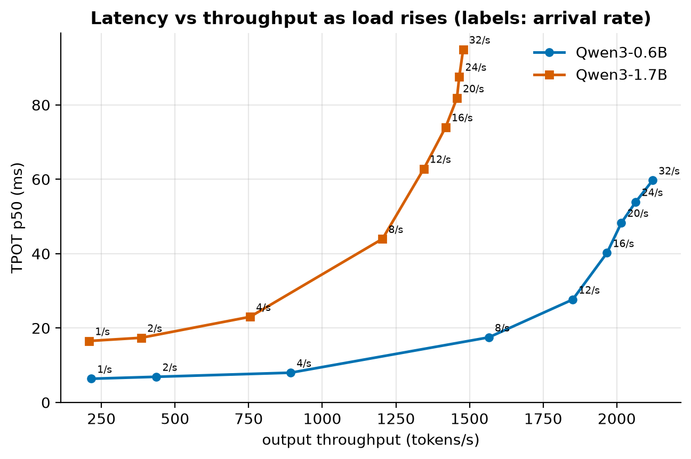
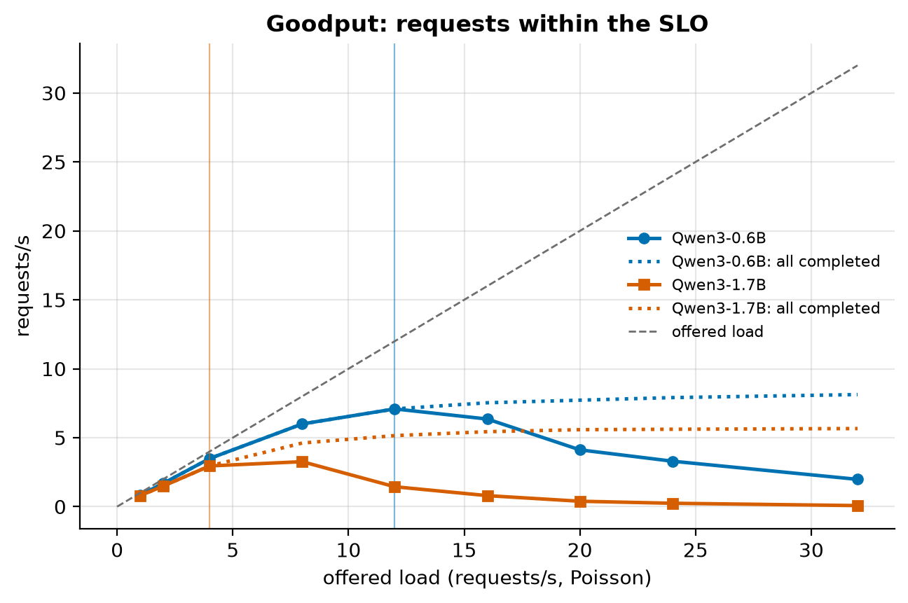
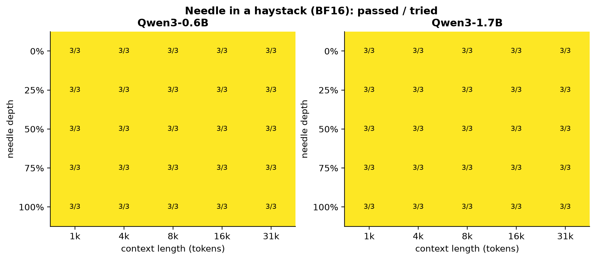

# Gate Report: M2, baselines and the measurement harness

> **Gate decision:** pending. The explain-it-back questions below are for later study; M3 can start on approval.

## What was built

- **A serving harness** ([`src/fastserve/serving/`](../../src/fastserve/serving/)):
  - `VLLMServer`: runs `vllm serve` as a subprocess, waits for `/health`, and keeps the log for diagnosis
  - an async streaming load generator, with open-loop (Poisson) and closed-loop users, timestamping every token
  - serving metrics: TTFT, TPOT, ITL, goodput under an SLO, the knee, and $ per 1M tokens
  - a sampler for vLLM's own Prometheus `/metrics`, which turns the server's counters into a timeline (running
    and waiting requests, KV-cache use, tokens, engine steps)
- **Workloads** ([`benchmarks/workloads/serving.yaml`](../../benchmarks/workloads/serving.yaml)): chat, a
  ShareGPT-like throughput mix, 8k–32k long context, a shared-prefix agent, and a saturation variant.
- **Experiments** ([`src/fastserve/experiments/m2.py`](../../src/fastserve/experiments/m2.py)): the load sweep
  for both models, vLLM's offline engine as a control, and a **saturation run** that holds a queue for minutes.
- **A quality harness** ([`src/fastserve/quality/`](../../src/fastserve/quality/)): teacher-forced perplexity
  and KL on WikiText-2, lm-evaluation-harness (GSM8K, an MMLU slice, HumanEval) through vLLM, and a
  needle-in-a-haystack grid up to 32k tokens.
- **A separate, locked vLLM environment** ([`infra/serving.lock`](../../infra/serving.lock)): vLLM 0.30.0 on a
  CUDA devel base image, so the M0/M1 research environment stays unchanged.
- **Docs:** the [M2 learning doc](../learning/M2-baselines.md), with predictions committed before the runs
  (`19c9be1` for speed, `3909257` for quality), and the
  [benchmark methodology](../05-benchmark-methodology.md).

## Key results

<!-- BEGIN GENERATED: m2_summary -->
| Model | Chat TTFT p50 (ms) | Chat TPOT p50 (ms) | Single-stream tokens/s | Peak tokens/s | Knee (req/s) | $ / 1M tokens at peak | KV cache (tokens) |
|---|---|---|---|---|---|---|---|
| Qwen3-0.6B | 20.1 | 5.83 | 171 | 2,122 | 12 | 0.105 | 172,640 |
| Qwen3-1.7B | 27.8 | 14.74 | 68 | 1,486 | 4 | 0.150 | 142,928 |
<!-- END GENERATED: m2_summary -->

<!-- BEGIN GENERATED: m2_saturation -->
| Model | Saturated for (s) | Running sequences | Context per sequence: predicted / measured | KV cache used | Output tok/s | Memory-bound ceiling (tok/s) | Measured / ceiling |
|---|---|---|---|---|---|---|---|
| Qwen3-0.6B | 252 | 252 | 647 / 628 | 92% | 1,849 | 3,415 | 54% |
| Qwen3-1.7B | 299 | 233 | 647 / 631 | 96% | 1,581 | 3,008 | 53% |
<!-- END GENERATED: m2_saturation -->

<!-- BEGIN GENERATED: m2_quality -->
| Model | WikiText-2 perplexity | GSM8K (%) | MMLU (%) | HumanEval pass@1 (%) | Needle (%) |
|---|---|---|---|---|---|
| Qwen3-0.6B | 19.56 | 41.7 | 49.6 | 18.9 | 100 |
| Qwen3-1.7B | 15.57 | 69.0 | 62.8 | 40.2 | 100 |
<!-- END GENERATED: m2_quality -->

| | |
|---|---|
|  |  |
|  |  |

## Predicted vs measured

<!-- BEGIN GENERATED: m2_predictions -->
*Predictions written in commit `19c9be1`, before the first measurement.*

| Quantity | Predicted | Measured | Verdict |
|---|---|---|---|
| Chat TPOT p50, Qwen3-0.6B (ms) | 5.5 – 8 | 5.83 | within range |
| Chat TTFT p50, Qwen3-0.6B (ms) | 10 – 30 | 20.1 | within range |
| Batch-1 decode speed, vLLM / nanoserve (x) | 6 – 9 | 8.58 | within range |
| Peak output throughput, Qwen3-0.6B (tokens/s) | 3,000 – 6,000 | 2,122 | below range |
| Knee: highest rate with >= 90% of requests in SLO, 0.6B (req/s) | 12 – 25 | 12 | within range |
| Chat TPOT, 1.7B / 0.6B (x) | 2.2 – 2.9 | 2.53 | within range |
| Peak throughput, 1.7B / 0.6B (x) | 0.6 – 0.9 | 0.701 | within range |
| TTFT with a 32k-token prompt, 0.6B (s) | 0.5 – 1.2 | 3.33 | above range |
| TPOT at 32k context / chat TPOT, 0.6B (x) | 2 – 4 | 3.46 | within range |
| Peak request rate, shared-prefix workload, 0.6B (req/s) | 12 – 25 | 6.39 | below range |
<!-- END GENERATED: m2_predictions -->

<!-- BEGIN GENERATED: m2_quality_predictions -->
*Predictions written in commit `3909257`, before the first measurement.*

| Quantity | Predicted | Measured | Verdict |
|---|---|---|---|
| WikiText-2 perplexity, Qwen3-0.6B | 12 – 30 | 19.6 | within range |
| WikiText-2 perplexity, Qwen3-1.7B | 9 – 20 | 15.6 | within range |
| GSM8K 5-shot, Qwen3-0.6B (%) | 25 – 55 | 41.7 | within range |
| GSM8K 5-shot, Qwen3-1.7B (%) | 50 – 75 | 69 | within range |
| MMLU 5-shot slice, Qwen3-0.6B (%) | 35 – 55 | 49.6 | within range |
| MMLU 5-shot slice, Qwen3-1.7B (%) | 50 – 65 | 62.8 | within range |
| HumanEval pass@1, Qwen3-0.6B (%) | 10 – 40 | 18.9 | within range |
| HumanEval pass@1, Qwen3-1.7B (%) | 25 – 55 | 40.2 | within range |
| Needle pass rate up to 32k, Qwen3-0.6B (%) | 70 – 100 | 100 | within range |
| Needle pass rate up to 32k, Qwen3-1.7B (%) | 85 – 100 | 100 | within range |
<!-- END GENERATED: m2_quality_predictions -->

Every gap is explained in the [learning doc](../learning/M2-baselines.md#explaining-every-gap). In short:
- **Peak throughput:** the batch holds mostly long requests, so the KV cache fills and each step reads more
  bytes than predicted. While prompts keep arriving, steps also run at only about half of the memory speed.
- **32k TTFT:** my attention FLOP count left out the ×28 layers. Prefill itself is efficient.
- **Shared prefix:** each step's 2,048-token budget admits about one prompt, and Little's law sets the batch size.
  Prefix caching (M5) removes exactly this.

## Surprises and dead ends

- **I misread the peak twice before measuring it properly.** First I compared a modeled ceiling with the sweep's
  whole-run average. Then I estimated a short burst from client timestamps and took it for capacity. The fix was
  to measure a held queue with the server's own counters.
- **Prefill interference, not bandwidth, halves saturated decode.** Decode-only steps run near the memory speed;
  steps that also carry prompt chunks take about twice as long. Why they cost that much is an open question for
  M8's profiler.
- **The running set skews long** (the inspection paradox). A token-weighted average of request lengths predicted
  the batch's context, and the server's KV usage confirmed it.
- **Dead ends:** a slim base image (FlashInfer compiles a kernel at first use and needs `nvcc`); the
  `"wikitext"` dataset id (now `Salesforce/wikitext`); a quality launcher that lost every result when one task
  failed; `hash()` seeds that changed between processes.
- **Deviations from AGENTS.md:** vLLM only (SGLang was optional under the budget); an L4 instead of an H100
  ([ADR 001](../decisions/001-cloud-only-small-models.md)); an MMLU slice of 20 questions per subject.

## What you should now understand

- Serving metrics (TTFT, TPOT, ITL, goodput, the knee, cost), and why percentiles and CDFs beat averages.
- Open vs closed loop, and why closed loop hides overload.
- What continuous batching, PagedAttention and chunked prefill do inside vLLM, and what chunked prefill costs.
- Why a small model's busy decode step is mostly KV cache, and how full the cache really gets.
- Little's law, in seconds and in engine steps.
- How to measure capacity: a steady state, from the server's own counters.

## Explain it back (for later study)

1. The sweep's "peak" and the saturated plateau are different numbers. What does each one measure, and which
   one would you quote as capacity?
2. The running sequences' average context is well above a typical request's. Why?
3. Why do both models settle at the same batch size on the shared-prefix workload? What would prefix caching
   change in that calculation?
4. Decode-only steps run near the memory speed, but steps that also carry prompt chunks don't. What does chunked
   prefill buy in exchange, and how would you test where the extra time goes?
5. Why is the needle test weak evidence that a KV-cache compression method is safe, and what's stronger?

## Proposed next steps: M3, quantization from scratch

- Reference implementations in nanoserve (`src/fastserve/quant/`): round-to-nearest (RTN) at 8/4/3/2 bits for
  each granularity, the FP8 and NF4 formats, GPTQ, AWQ, Hadamard rotations, and simulated W8A8 FP8. Each gets
  unit tests and a check against a library implementation.
- Quality from the M2 harness: KL and perplexity against the BF16 reference measured here.
- Figures: weight and activation histograms with quantization grids, an outlier atlas, error vs bits, and a
  layer-sensitivity map.
- **Prediction first**, informed by M2: weight quantization should mainly speed up low-load decoding. At
  saturation the KV cache dominates the bytes, so the throughput gains wait for M5.
