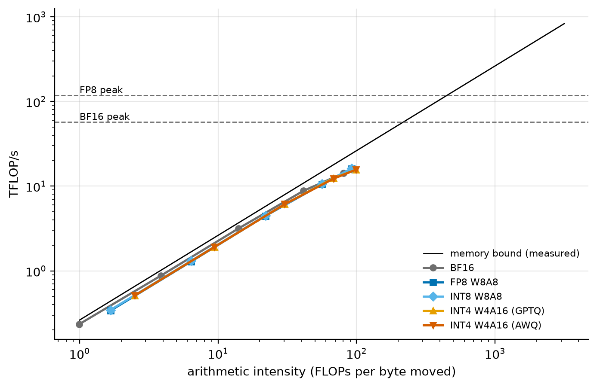
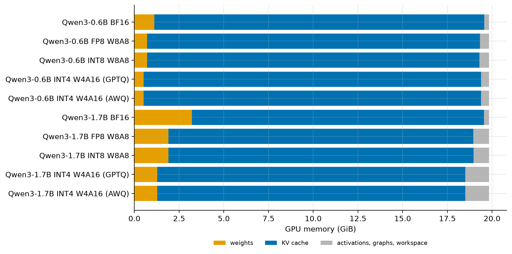

# Gate Report: M4, quantization in production

> **Gate decision (2026-10-01):** approved by the owner (explain-it-back questions deferred for later study).
> Tagged `v0.4-quant-production`. The owner also approved publishing the checkpoints on Hugging Face.

## What was built

- **Production checkpoints** from llm-compressor 0.14.0
  ([`experiments/m4_checkpoints.py`](../../src/fastserve/experiments/m4_checkpoints.py)). Four formats for each
  of Qwen3-0.6B and Qwen3-1.7B, on M3's calibration set, with the LM head kept in BF16:
  - FP8 W8A8: dynamic per-token activations, no calibration
  - INT8 W8A8: SmoothQuant, then GPTQ
  - INT4 W4A16 from GPTQ
  - INT4 W4A16 from AWQ
- **Every checkpoint served by vLLM 0.30.0 on the L4.** Each ran M2's workloads plus a closed-loop decode sweep
  from batch 1 to 256, in [one config](../../benchmarks/configs/m4_production.yaml). The server log records the
  kernel vLLM chose, the weight memory, and the KV-cache size.
- **Quality, three ways:**
  - KL against BF16 in nanoserve, from each checkpoint's own rounded weights
  - M2's lm-eval suite, served with the real kernels
  - a **kernel fidelity check**: vLLM's perplexity against nanoserve's simulated perplexity for the same weights
- **A GSM8K failure breakdown** ([`quality/gsm8k.py`](../../src/fastserve/quality/gsm8k.py)): every answer is
  logged and sorted into correct, right-then-kept-talking, wrong, looping or no final answer.
- **A bytes-only model** of batch-1 TPOT and a crossover table ([`report/m4.py`](../../src/fastserve/report/m4.py)),
  plus four figures ([`viz/m4_figures.py`](../../src/fastserve/viz/m4_figures.py)): the speedup against batch,
  the roofline shift, the memory budget and waterfall v1.
- **Docs:** the [M4 learning doc](../learning/M4-quant-production.md). Its predictions were committed in
  `10349dd`, before any checkpoint was made.

## Key results

<!-- BEGIN GENERATED: m4_speed -->
| Model | Format | Kernel | Weights (GiB) | KV cache (tokens) | Batch-1 TPOT (ms) | Speedup | TTFT 8k (ms) | Saturated tok/s | $ / 1M tokens |
|---|---|---|---|---|---|---|---|---|---|
| Qwen3-0.6B | BF16 | — | 1.12 | 172,640 | 5.78 | 1.00× | 370 | 1,834 | 0.121 |
| Qwen3-0.6B | FP8 W8A8 | CutlassFP8ScaledMM | 0.71 | 174,336 | 4.35 | 1.33× | 344 | 1,848 | 0.120 |
| Qwen3-0.6B | INT8 W8A8 | CutlassInt8ScaledMM | 0.71 | 174,048 | 4.45 | 1.30× | 342 | 1,842 | 0.121 |
| Qwen3-0.6B | INT4 W4A16 (GPTQ) | Marlin | 0.52 | 176,704 | 3.41 | 1.69× | 341 | 1,818 | 0.122 |
| Qwen3-0.6B | INT4 W4A16 (AWQ) | Marlin | 0.52 | 176,704 | 3.44 | 1.68× | 341 | 1,821 | 0.122 |
| Qwen3-1.7B | BF16 | — | 3.22 | 152,800 | 14.72 | 1.00× | 692 | 1,596 | 0.139 |
| Qwen3-1.7B | FP8 W8A8 | CutlassFP8ScaledMM | 1.90 | 159,664 | 10.08 | 1.46× | 566 | 1,678 | 0.132 |
| Qwen3-1.7B | INT8 W8A8 | CutlassInt8ScaledMM | 1.90 | 159,776 | 9.91 | 1.48× | 551 | 1,690 | 0.132 |
| Qwen3-1.7B | INT4 W4A16 (GPTQ) | Marlin | 1.27 | 161,344 | 6.76 | 2.18× | 663 | 1,591 | 0.140 |
| Qwen3-1.7B | INT4 W4A16 (AWQ) | Marlin | 1.27 | 161,344 | 6.75 | 2.18× | 664 | 1,588 | 0.140 |
<!-- END GENERATED: m4_speed -->

| | |
|---|---|
|  |  |
|  |  |

<!-- BEGIN GENERATED: m4_quality -->
| Model | Format | KL vs BF16 | GSM8K (%) | MMLU (%) | HumanEval pass@1 (%) |
|---|---|---|---|---|---|
| Qwen3-0.6B | BF16 | 0.000 | 41.7 | 49.6 | 18.9 |
| Qwen3-0.6B | FP8 W8A8 | 0.021 | 40.4 | 46.5 | 20.1 |
| Qwen3-0.6B | INT8 W8A8 | 0.017 | 40.5 | 47.9 | 18.9 |
| Qwen3-0.6B | INT4 W4A16 (GPTQ) | 0.312 | 12.8 | 43.2 | 12.2 |
| Qwen3-0.6B | INT4 W4A16 (AWQ) | 0.232 | 20.6 | 42.5 | 12.2 |
| Qwen3-1.7B | BF16 | 0.000 | 69.0 | 62.8 | 40.2 |
| Qwen3-1.7B | FP8 W8A8 | 0.020 | 67.4 | 62.0 | 36.6 |
| Qwen3-1.7B | INT8 W8A8 | 0.028 | 67.4 | 61.7 | 38.4 |
| Qwen3-1.7B | INT4 W4A16 (GPTQ) | 0.162 | 47.2 | 57.6 | 12.8 |
| Qwen3-1.7B | INT4 W4A16 (AWQ) | 0.186 | 55.4 | 58.9 | 21.3 |
<!-- END GENERATED: m4_quality -->

## Predicted vs measured

<!-- BEGIN GENERATED: m4_predictions -->
*Predictions written in commit `10349dd`, before the first measurement.*

| Quantity | Predicted | Measured | Verdict |
|---|---|---|---|
| Batch-1 decode speedup, FP8 over BF16, Qwen3-0.6B (x) | 1.1 – 1.5 | 1.33 | within range |
| Batch-1 decode speedup, INT4 GPTQ over BF16, Qwen3-0.6B (x) | 1.2 – 1.8 | 1.69 | within range |
| Batch-1 decode speedup, FP8 over BF16, Qwen3-1.7B (x) | 1.3 – 1.7 | 1.46 | within range |
| Batch-1 decode speedup, INT4 GPTQ over BF16, Qwen3-1.7B (x) | 1.5 – 2.4 | 2.18 | within range |
| Decode throughput, INT4 / FP8 at batch 1, Qwen3-1.7B (x) | 1.1 – 1.6 | 1.51 | within range |
| Decode throughput, INT4 / FP8 at batch 256, Qwen3-1.7B (x) | 0.6 – 1 | 0.981 | within range |
| Batch-1 decode speed, AWQ / GPTQ checkpoint, Qwen3-1.7B (x) | 0.95 – 1.05 | 1 | within range |
| Batch-1 decode speed, INT8 W8A8 / FP8, Qwen3-1.7B (x) | 0.85 – 1.1 | 1.02 | within range |
| Saturated throughput, FP8 / BF16, Qwen3-0.6B (x) | 0.95 – 1.2 | 1.01 | within range |
| Saturated throughput, INT4 GPTQ / BF16, Qwen3-0.6B (x) | 0.8 – 1.05 | 0.991 | within range |
| TTFT at 8k tokens, FP8 / BF16, Qwen3-1.7B (x) | 0.55 – 0.9 | 0.817 | within range |
| TTFT at 8k tokens, INT4 GPTQ / BF16, Qwen3-1.7B (x) | 0.95 – 1.4 | 0.957 | within range |
| KV-cache tokens, FP8 / BF16, Qwen3-0.6B (x) | 1 – 1.05 | 1.01 | within range |
| KV-cache tokens, FP8 / BF16, Qwen3-1.7B (x) | 1.03 – 1.12 | 1.04 | within range |
| GSM8K change, FP8 vs BF16, Qwen3-0.6B (points) | -3 – 3 | -1.29 | within range |
| GSM8K change, INT4 GPTQ vs BF16, Qwen3-0.6B (points) | -15 – -3 | -28.9 | below range |
| GSM8K change, INT4 GPTQ vs BF16, Qwen3-1.7B (points) | -10 – -1 | -21.8 | below range |
| KL ratio, llm-compressor FP8 / our M3 FP8 W8A8, Qwen3-0.6B (x) | 0.8 – 1.25 | 1.02 | within range |
| KL, llm-compressor INT8 W8A8 (SmoothQuant + GPTQ), Qwen3-0.6B | 0.005 – 0.03 | 0.0167 | within range |
<!-- END GENERATED: m4_predictions -->

Batch-1 TPOT from bytes alone, with the fixed overhead fitted on BF16:

<!-- BEGIN GENERATED: m4_bytes_model -->
| Model | Format | GB read per step | Streaming (ms) | Predicted TPOT (ms) | Measured TPOT (ms) | Error |
|---|---|---|---|---|---|---|
| Qwen3-0.6B | BF16 | 1.22 | 4.65 | 5.81 | 5.81 | 0.0% |
| Qwen3-0.6B | FP8 W8A8 | 0.78 | 2.98 | 4.13 | 4.40 | 6.5% |
| Qwen3-0.6B | INT8 W8A8 | 0.78 | 2.98 | 4.13 | 4.50 | 9.1% |
| Qwen3-0.6B | INT4 W4A16 (GPTQ) | 0.57 | 2.16 | 3.32 | 3.42 | 3.2% |
| Qwen3-0.6B | INT4 W4A16 (AWQ) | 0.57 | 2.16 | 3.32 | 3.48 | 4.9% |
| Qwen3-1.7B | BF16 | 3.47 | 13.22 | 14.72 | 14.72 | 0.0% |
| Qwen3-1.7B | FP8 W8A8 | 2.06 | 7.85 | 9.35 | 10.17 | 8.8% |
| Qwen3-1.7B | INT8 W8A8 | 2.06 | 7.85 | 9.35 | 9.97 | 6.7% |
| Qwen3-1.7B | INT4 W4A16 (GPTQ) | 1.38 | 5.25 | 6.74 | 6.76 | 0.2% |
| Qwen3-1.7B | INT4 W4A16 (AWQ) | 1.38 | 5.25 | 6.74 | 6.76 | 0.2% |
<!-- END GENERATED: m4_bytes_model -->

## Surprises and dead ends

- **INT4's GSM8K loss is part reasoning, part stopping.** The GPTQ checkpoints (not AWQ) often write the right
  `#### N` and then keep going. The suite's flexible-extract metric scores the last number they say. On
  strict-match, GPTQ's drop on Qwen3-1.7B is much smaller, and both models' INT4 rankings agree with KL:

<!-- BEGIN GENERATED: m4_gsm8k -->
| Model | Format | Correct | Right, then kept talking | Wrong answer | Looping | No final answer | Talks past #### | Strict-match | Suite score (flexible) |
|---|---|---|---|---|---|---|---|---|---|
| Qwen3-0.6B | BF16 | 40.9% | 0.2% | 54.0% | 2.6% | 2.3% | 1.4% | 41.1% | 41.7% |
| Qwen3-0.6B | FP8 W8A8 | 41.2% | 0.7% | 53.1% | 2.0% | 3.0% | 1.7% | 41.8% | 40.4% |
| Qwen3-0.6B | INT8 W8A8 | 40.9% | 0.8% | 54.9% | 1.7% | 1.7% | 2.7% | 41.5% | 40.5% |
| Qwen3-0.6B | INT4 W4A16 (GPTQ) | 13.0% | 6.4% | 66.0% | 13.6% | 1.0% | 40.1% | 17.7% | 12.8% |
| Qwen3-0.6B | INT4 W4A16 (AWQ) | 20.4% | 0.2% | 69.0% | 9.2% | 1.3% | 2.6% | 20.2% | 20.6% |
| Qwen3-1.7B | BF16 | 69.9% | 0.3% | 24.7% | 1.4% | 3.7% | 1.6% | 69.7% | 69.0% |
| Qwen3-1.7B | FP8 W8A8 | 67.2% | 0.2% | 28.8% | 1.1% | 2.6% | 0.7% | 67.1% | 67.4% |
| Qwen3-1.7B | INT8 W8A8 | 68.0% | 0.3% | 26.4% | 1.2% | 4.1% | 0.3% | 68.2% | 67.4% |
| Qwen3-1.7B | INT4 W4A16 (GPTQ) | 46.5% | 13.6% | 30.1% | 4.0% | 5.8% | 36.5% | 59.4% | 47.2% |
| Qwen3-1.7B | INT4 W4A16 (AWQ) | 56.3% | 1.5% | 32.4% | 5.5% | 4.3% | 9.0% | 56.9% | 55.4% |
<!-- END GENERATED: m4_gsm8k -->

- **W8A8 is slower than its bytes predict, INT4 isn't.** vLLM quantizes each linear layer's input in a separate
  op before the 8-bit matmul (read from the installed source). That's an extra pass per layer, and the target
  of M7's first kernel. *(Added after M7: measured in a CUDA graph, those launches cover under half of the
  gap. See [04-kernels.md](../04-kernels.md), section 1.)*
- **My own crossover math was loose.** Section 2 of the learning doc treated B* ≈ 56 (where INT4's matmuls turn
  compute-bound) as the crossover. For the linear layers alone, INT4 stays ahead until batch ≈ 109, where its
  16-bit math time equals FP8's streaming time. The measured flip is between batch 64 and 256.
- **The kernels are faithful, once we compare against the right copy.** vLLM's perplexity matches nanoserve's
  simulation of the stored weights closely for every format. A first comparison used llm-compressor's dense
  export, which rounds a few INT8 and AWQ weights differently from the codes it stores. Our own checkpoint
  reader ([`quant/compressed.py`](../../src/fastserve/quant/compressed.py)) found it, and the KL was
  re-measured on the stored codes.
- **Freed weight memory only partly reaches the KV cache.** vLLM reserves more non-KV memory for quantized
  formats. Cause not identified yet.
- **Dead end: AWQ out of GPU memory.** llm-compressor's AWQ caches every module's calibration inputs on the GPU.
  Fixed with `offload_device="cpu"` and more container RAM. The calibration is unchanged.
- **Dead end: servers couldn't see new checkpoints.** A warm Modal container reused its old view of the Volume,
  so vLLM rejected a checkpoint path written by another container. Every function that reads checkpoints now
  calls `hf_cache.reload()` first.
- **Deviations from AGENTS.md:**
  - vLLM only, as in M2 (SGLang was optional under the budget).
  - An L4 instead of an H100, and Qwen3 models (ADR 001).
  - **Checkpoints are not on the Hugging Face Hub.** Publishing is outward-facing and needs the owner's
    account; they stay on the Modal Volume until the owner decides.

## What you should now understand

- What a W4A16 kernel does (unpack to 16 bits, multiply in 16 bits) vs a W8A8 kernel (8-bit math on both sides).
- Why weight quantization speeds up one user a lot and a saturated server hardly at all.
- The crossover: where INT4 turns compute-bound (B*), and where FP8 actually overtakes it.
- Why FP8 speeds up prefill and INT4 doesn't.
- How smaller weights turn into KV-cache capacity, and why not all of it arrives.
- Why a task score can mix "reasons worse" with "stops badly", and how to tell them apart.

## Explain it back (for later study)

1. INT4 cuts Qwen3-1.7B's decode time by more than half at batch 1, and gains almost nothing at batch 256. Explain
   both with bytes per step.
2. Derive the batch where the linear layers of INT4 W4A16 and FP8 W8A8 take equal time on the L4. Why is the
   measured crossover later?
3. Why is FP8 slower than the bytes model predicts at batch 1, when INT4 isn't? What would fix it?
4. GPTQ has lower KL than AWQ on Qwen3-1.7B but a lower GSM8K score. How can both be true?
5. Which format would you deploy for a high-traffic chat API on these models, and why?

## Proposed next steps: M5, KV-cache engineering

- **The KV cache is now the bottleneck.** At saturation it dominates every step's bytes, and M4 showed that
  weight quantization can't touch it.
- **Sizing:** a KV calculator from `config.json`, which the performance model will reuse.
- **KV quantization in nanoserve:** INT8 and INT4 with per-channel keys and per-token values (optionally
  rotated keys), scored by KL and needle-in-a-haystack.
- **vLLM's FP8 KV cache:** capacity and throughput at long context and at saturation.
- **Prefix caching:** a reference radix-tree cache, then vLLM's automatic prefix caching on the shared-prefix
  workload.
- **Carried over:** the quantized formats' extra non-KV memory reservation, which matters when KV capacity is
  the goal.
