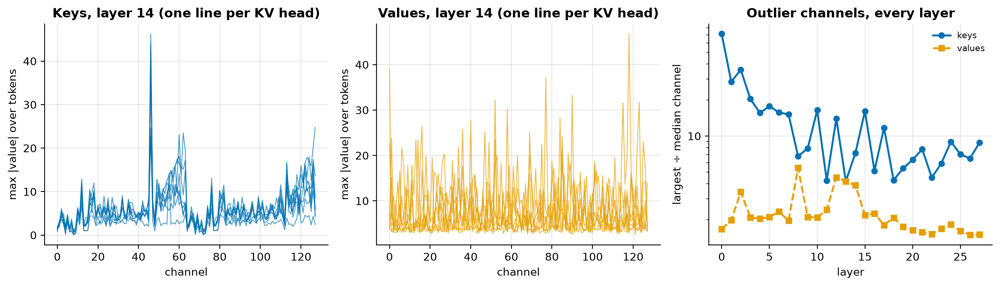
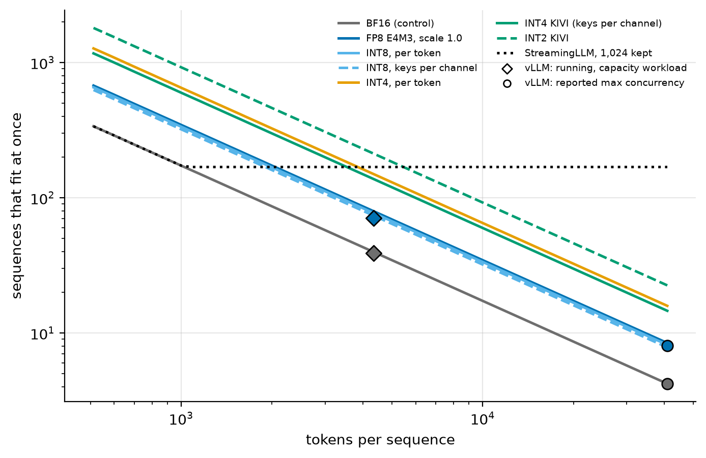
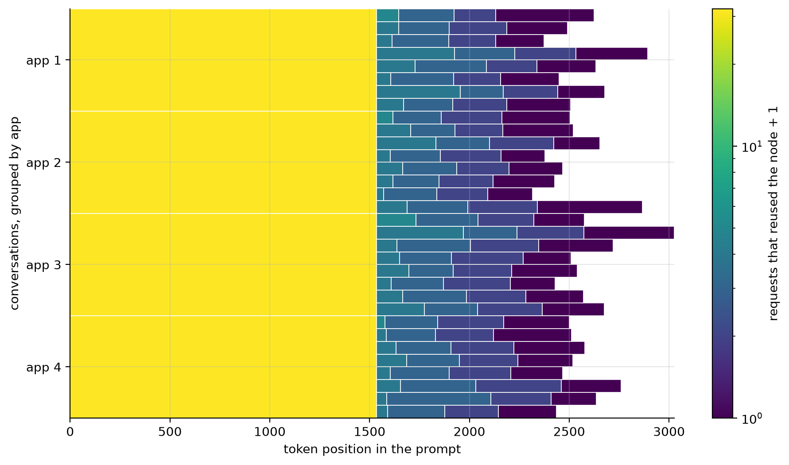
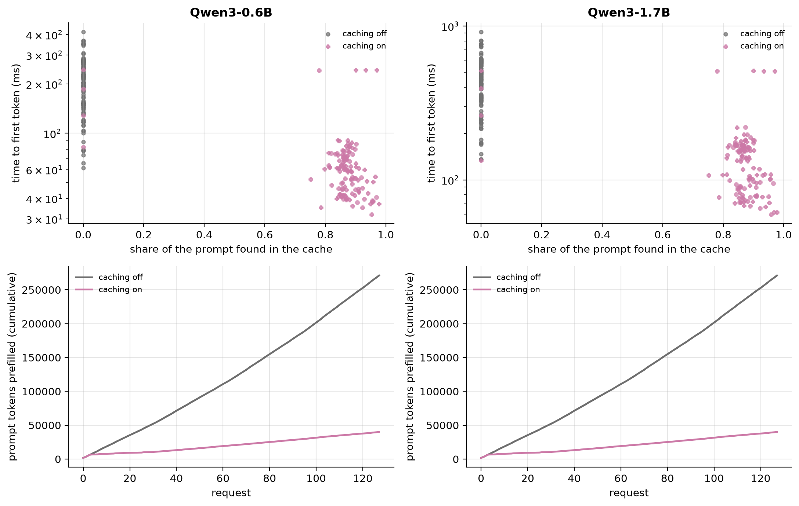

# Gate Report: M5, KV-cache engineering

## What was built

- **A KV sizing model** ([`kv/sizing.py`](../../src/fastserve/kv/sizing.py), stdlib only): bytes per token in
  any storage format (scales and zero-points included), capacity for a memory budget, and eviction. It
  predicts vLLM's measured KV capacity.
- **Reference KV policies in nanoserve** ([`kv/quant.py`](../../src/fastserve/kv/quant.py)): quantized
  storage of K and V after RoPE, and StreamingLLM eviction as an attention mask. Formats: FP8 at vLLM's
  default scale, INT8/INT4/INT2 per token, KIVI's per-channel keys (with a full-precision residual), and
  Hadamard-rotated keys. Tests check that group-aligned chunked prefill through a real cache equals one full
  pass, and that eviction leaves early positions bit-identical.
- **A reference prefix cache** ([`kv/prefix_cache.py`](../../src/fastserve/kv/prefix_cache.py)): a radix tree
  with LRU eviction of leaves. nanoserve generates through it
  ([`kv/prefix_generate.py`](../../src/fastserve/kv/prefix_generate.py)) with tokens identical to plain
  generation.
- **nanoserve upgrades for long contexts:** a fused attention path tested against the reference, and chunked
  long-prompt generation, so the 32k needle grid runs in minutes.
- **New workloads:** `capacity` (96 users × 4k-token prompts) and `multi_turn` (4 apps × 8 conversations × 4
  turns, each turn extending the last).
- **Serving plumbing:** per-request cached-token counts, prefix-cache counters, and startup facts from vLLM's
  log (attention backend, KV dtype, max concurrency). A server can also run a subset of workloads.
- **The campaign** ([config](../../benchmarks/configs/m5_kv.yaml)):
  - KL for nine KV policies on both models
  - the needle grid on 0.6B
  - key/value channel statistics
  - eight vLLM servers for FP8 KV, including a BF16-on-FlashInfer control
  - four servers for prefix caching
  - vLLM's FP8-KV perplexity and needle grid
- **Docs:** the [M5 learning doc](../learning/M5-kv-cache.md). Its predictions were committed in `b93afc6`,
  before any measurement.

## Key results

<!-- BEGIN GENERATED: m5_policies -->
| KV policy | Bits per element | KiB per token | 32k-token sequences that fit | KL, Qwen3-0.6B | KL, Qwen3-1.7B | Top-1 agreement, 0.6B | Needle pass rate, 0.6B |
|---|---|---|---|---|---|---|---|
| BF16 (control) | 16.00 | 112.0 | 5 | 0.0000 | 0.0000 | 100.0% | 100% |
| FP8 E4M3, scale 1.0 | 8.00 | 56.0 | 10 | 0.0149 | 0.0120 | 93.7% | 100% |
| INT8, per token | 8.25 | 57.8 | 10 | 0.0189 | 0.0108 | 93.9% | 100% |
| INT8, keys per channel | 8.62 | 60.4 | 10 | 0.0014 | 0.0013 | 98.0% | 100% |
| INT4, per token | 4.25 | 29.8 | 20 | 6.0242 | 6.2818 | 10.3% | 0% |
| INT4, rotated keys | 4.25 | 29.8 | 20 | 1.0349 | 0.3401 | 58.0% | 51% |
| INT4 KIVI (keys per channel) | 4.62 | 32.4 | 18 | 0.0322 | 0.0277 | 91.1% | 100% |
| INT2 KIVI | 3.00 | 21.0 | 28 | 0.7410 | 0.5789 | 61.4% | 48% |
| StreamingLLM, 1,024 kept | 16.00 | 112.0 | 168 | 0.0377 | 0.0324 | 95.3% | 32% |
<!-- END GENERATED: m5_policies -->

<!-- BEGIN GENERATED: m5_kv_serving -->
| Model | Server | Attention | KV cache (tokens) | Running, capacity workload | Tokens/s, capacity | Tokens/s, saturated | TPOT at 32k (ms) | TTFT at 32k (ms) | $ / 1M tokens, saturated |
|---|---|---|---|---|---|---|---|---|---|
| Qwen3-0.6B | BF16 KV | FLASH_ATTN | 172,640 | 39 | 327 | 1,853 | 20.26 | 3,333 | 0.120 |
| Qwen3-0.6B | BF16 KV, FlashInfer | FLASHINFER | 164,944 | 37 | 384 | 2,679 | 20.60 | 3,152 | 0.083 |
| Qwen3-0.6B | FP8 KV | FLASHINFER | 329,888 | 70 | 579 | 4,064 | 13.79 | 3,301 | 0.055 |
| Qwen3-0.6B | FP8 weights + FP8 KV | FLASHINFER | 342,096 | 72 | 594 | 3,567 | 12.87 | 3,219 | 0.062 |
| Qwen3-1.7B | BF16 KV | FLASH_ATTN | 152,800 | 35 | 255 | 1,591 | 29.02 | 4,593 | 0.140 |
| Qwen3-1.7B | BF16 KV, FlashInfer | FLASHINFER | 139,648 | 32 | 280 | 1,976 | 29.54 | 4,393 | 0.112 |
| Qwen3-1.7B | FP8 KV | FLASHINFER | 279,296 | 61 | 397 | 2,665 | 22.95 | 4,628 | 0.083 |
| Qwen3-1.7B | FP8 weights + FP8 KV | FLASHINFER | 312,752 | 67 | 437 | 2,882 | 18.38 | 4,109 | 0.077 |
<!-- END GENERATED: m5_kv_serving -->

<!-- BEGIN GENERATED: m5_prefix -->
| Model | Workload | Prefix caching | Prompt tokens cached | TTFT p50 (ms) | TPOT p50 (ms) | Tokens/s | $ / 1M tokens |
|---|---|---|---|---|---|---|---|
| Qwen3-0.6B | multi-turn | off | 0.0% | 222 | 18.15 | 376 | 0.591 |
| Qwen3-0.6B | multi-turn | on | 85.3% | 60 | 11.93 | 631 | 0.352 |
| Qwen3-0.6B | shared-prefix | off | 0.0% | 274 | 17.78 | 366 | 0.607 |
| Qwen3-0.6B | shared-prefix | on | 95.9% | 40 | 9.24 | 810 | 0.274 |
| Qwen3-1.7B | multi-turn | off | 0.0% | 479 | 32.93 | 199 | 1.114 |
| Qwen3-1.7B | multi-turn | on | 85.3% | 135 | 21.59 | 341 | 0.652 |
| Qwen3-1.7B | shared-prefix | off | 0.0% | 591 | 31.88 | 196 | 1.132 |
| Qwen3-1.7B | shared-prefix | on | 95.9% | 68 | 18.70 | 402 | 0.552 |
<!-- END GENERATED: m5_prefix -->

| | |
|---|---|
|  |  |
|  |  |
|  |  |

## Predicted vs measured

<!-- BEGIN GENERATED: m5_predictions -->
*Predictions written in commit `b93afc6`, before the first measurement.*

| Quantity | Predicted | Measured | Verdict |
|---|---|---|---|
| vLLM KV-cache tokens, FP8 KV / BF16 KV, Qwen3-0.6B (x) | 1.9 – 2.02 | 1.91 | within range |
| vLLM KV-cache tokens, FP8 KV / BF16 KV, Qwen3-1.7B (x) | 1.9 – 2.02 | 1.83 | below range |
| Sequences running, capacity workload, FP8 KV / BF16 KV, Qwen3-0.6B (x) | 1.7 – 2.1 | 1.8 | within range |
| Output tokens/s, capacity workload, FP8 KV / BF16 KV, Qwen3-0.6B (x) | 1.3 – 1.9 | 1.77 | within range |
| Output tokens/s, capacity workload, FP8 KV / BF16 KV, Qwen3-1.7B (x) | 1.2 – 1.7 | 1.56 | within range |
| Saturated output tokens/s, FP8 KV / BF16 KV, Qwen3-0.6B (x) | 1.1 – 1.5 | 2.19 | above range |
| Saturated output tokens/s, FP8 KV / BF16 KV, Qwen3-1.7B (x) | 1.1 – 1.6 | 1.68 | above range |
| Saturated output tokens/s, BF16 KV on FlashInfer / on FlashAttention, Qwen3-0.6B (x) | 0.85 – 1.15 | 1.45 | above range |
| TPOT at 32k context, BF16 KV / FP8 KV, Qwen3-0.6B (x) | 1.2 – 1.7 | 1.47 | within range |
| TPOT at 32k context, BF16 KV / FP8 KV, Qwen3-1.7B (x) | 1.1 – 1.45 | 1.26 | within range |
| TTFT at 32k context, FP8 KV / BF16 KV, Qwen3-0.6B (x) | 0.85 – 1.3 | 0.99 | within range |
| KL vs BF16 cache, FP8 E4M3 KV (scale 1.0), Qwen3-0.6B | 0.002 – 0.04 | 0.0149 | within range |
| KL vs BF16 cache, INT8 KV per token, Qwen3-0.6B | 0.0002 – 0.003 | 0.0189 | above range |
| KL vs BF16 cache, INT4 KV, keys per token, Qwen3-0.6B | 0.05 – 1 | 6.02 | above range |
| KL ratio, INT4 rotated keys / INT4 per-token keys, Qwen3-0.6B (x) | 0.1 – 0.6 | 0.172 | within range |
| KL ratio, INT4 KIVI (keys per channel) / INT4 per-token keys, Qwen3-0.6B (x) | 0.05 – 0.5 | 0.00534 | below range |
| KL vs BF16 cache, INT2 KIVI, Qwen3-0.6B | 0.3 – 3 | 0.741 | within range |
| KL vs BF16 cache, StreamingLLM keeping 1,024 tokens, 2,048-token windows, Qwen3-0.6B | 0.05 – 0.5 | 0.0377 | below range |
| KL ratio, INT4 KIVI on Qwen3-1.7B / on Qwen3-0.6B (x) | 0.5 – 1.2 | 0.86 | within range |
| Median over layers of the largest/median channel ratio, keys ÷ values, Qwen3-0.6B (x) | 1.5 – 10 | 4.05 | within range |
| Needle pass rate, BF16 cache in nanoserve, Qwen3-0.6B (vLLM in M2: 1.0) | 0.9 – 1 | 1 | within range |
| Needle pass rate, FP8 KV in nanoserve, Qwen3-0.6B | 0.95 – 1 | 1 | within range |
| Needle pass rate, INT4 per-token keys, Qwen3-0.6B | 0 – 0.6 | 0 | within range |
| Needle pass rate, INT4 KIVI, Qwen3-0.6B | 0.85 – 1 | 1 | within range |
| Needle pass rate, StreamingLLM keeping 1,024 tokens, Qwen3-0.6B | 0.2 – 0.4 | 0.32 | within range |
| Needle pass rate, vLLM with FP8 KV, Qwen3-0.6B (BF16 in M2: 1.0) | 0.95 – 1 | 1 | within range |
| WikiText-2 perplexity in vLLM, FP8 KV / BF16 KV, Qwen3-0.6B (x) | 1 – 1.03 | 1.01 | within range |
| Share of multi-turn prompt tokens vLLM served from its prefix cache | 0.8 – 0.86 | 0.853 | within range |
| TTFT p50, multi-turn workload, prefix caching on / off, Qwen3-0.6B (x) | 0.15 – 0.6 | 0.272 | within range |
| Output tokens/s, multi-turn workload, prefix caching on / off, Qwen3-0.6B (x) | 1.1 – 1.6 | 1.68 | above range |
| Output tokens/s, multi-turn workload, prefix caching on / off, Qwen3-1.7B (x) | 1.15 – 1.8 | 1.71 | within range |
<!-- END GENERATED: m5_predictions -->

## Surprises and dead ends

- **Qwen3's keys have extreme outlier channels.** On 0.6B, layer 0's largest key goes past FP8 E4M3's range,
  so it saturates at vLLM's default scale. Per-token integer grids fail even at 8 bits (INT8 per token cost
  more KL than FP8). A per-channel-key control, added after that result and not predicted, confirmed the
  cause.
- **The attention kernel was a large part of the FP8-KV story.** FP8 KV forces FlashInfer on the L4. BF16 on FlashInfer
  alone was much faster than on FlashAttention at saturation, and that revises M2's explanation of its 54%
  memory efficiency: the mixed prefill/decode steps run far closer to memory speed on FlashInfer. The
  saturated-step table shows it.
- **KL can't see eviction.** StreamingLLM's KL on WikiText was below the predicted range while it lost two
  thirds of the needles.
- **Prefix caching sped up decode too:** shorter prefill chunks stop stalling the other sequences' steps.
- **FP8 weights hurt the saturated 0.6B server** when stacked on FP8 KV (W8A8's activation pass, as in M4).
- **Avoided traps:**
  - a multi-turn workload whose first system prompt would have matched the shared-prefix workload's tokens
    (fixed with its own seed)
  - load points replaying requests into a warm prefix cache (one load per workload per server)
- **API differences from AGENTS.md / memory:** vLLM 0.30 selects the backend with `--attention-backend` (no
  environment variable). FP8 KV needs FlashInfer on Ada.
- **Deviations:**
  - vLLM only (no SGLang)
  - INT4/INT2 KV measured in nanoserve only: vLLM 0.30 has no kernel for them. That's M7's job.
  - The needle grid ran on 0.6B only (cost).

## What you should now understand

- KV bytes per token from the config, and why Qwen3-0.6B and 1.7B have the same.
- When halving KV bytes doubles throughput (the cache caps the batch) and when it doesn't (something else
  does).
- Why keys need per-channel scales and values don't, and what a rotation can and can't fix.
- Why eviction keeps memory flat and loses recall, and why KL misses it.
- How a radix tree and vLLM's block hashing find shared prefixes, and what caching saves beyond prefill.
- Why a control for the kernel was needed to attribute FP8 KV's gain honestly.

## Explain it back (for later study)

1. With 96 users and 4k-token prompts, FP8 KV nearly doubled throughput. At saturation (prompts of a few
   hundred tokens), FP8 storage alone gave much less. Why the difference?
2. INT8 per token costs more KL than FP8 on Qwen3-0.6B. Explain with the key-channel figure, and say what
   fixes it.
3. StreamingLLM's KL was small but it failed most needles. What does each metric measure, and which matters
   for a RAG system?
4. Prefix caching cut TPOT, not just TTFT. Why?
5. Split FP8 KV's saturated speedup into its two causes using the waterfall. Which one is M7's job to
   explain?

## Proposed next steps: M6, speculative decoding

- A rejection sampler and draft/verify loop in nanoserve, with a statistical losslessness test.
- Qwen3-0.6B drafting for Qwen3-1.7B (same tokenizer), plus n-gram prompt lookup.
- vLLM's speculative decoding: acceptance rates per task, and speedup against batch size, where it should
  collapse at high load.
- **The interaction experiment:** does an FP8 or INT4 target lower the acceptance rate?
- **Carried over:** the FlashAttention-vs-FlashInfer gap on mixed batches (M7), and checkpoints still waiting
  for a Hugging Face token to publish.
