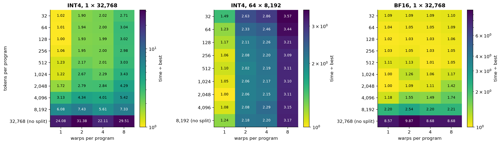
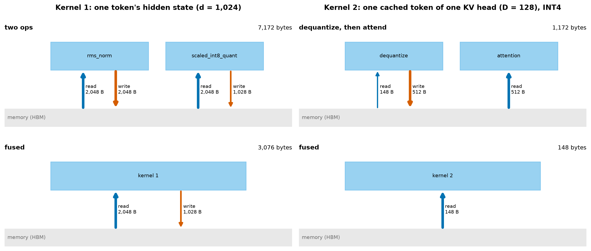
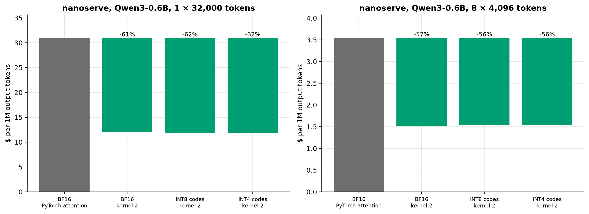

# Gate Report: M7, custom Triton kernels

## What was built

- **The profile first** ([docs/04-kernels.md](../04-kernels.md), section 1): where nanoserve's decode step
  goes at each context length; vLLM's own norm and INT8-quantization ops timed inside a CUDA graph; and
  vLLM's fusion pass read from source (it fuses RMSNorm with FP8 quantization only).
- **A reference for everything** ([`kernels/reference.py`](../../src/fastserve/kernels/reference.py)):
  RMSNorm + INT8 quantization; a KV cache that really holds 4- or 8-bit codes in KIVI's layout; decode
  attention in parts, with an exact merge. Checked against nanoserve's own norm, quantizer and attention,
  and against M5's simulated storage.
- **Kernel 1** ([`kernels/norm_quant.py`](../../src/fastserve/kernels/norm_quant.py)): RMSNorm fused with
  per-token INT8 quantization. One program per token, one read, one write.
- **Kernel 2** ([`kernels/kv_attention.py`](../../src/fastserve/kernels/kv_attention.py)): decode attention
  that reads the codes directly. The keys' grid is folded into the query and the values' grid into the
  attention weights, so nothing is dequantized; both query heads of a KV head share a program; split-KV
  with online softmax gives one long sequence enough programs.
- **Both inside nanoserve** ([`integration/`](../../src/fastserve/integration/)): `QuantizedKVCache` stores
  codes, keeps an incomplete key group in a full-precision tail, and merges kernel and tail on decode
  steps. `NormQuantInt8` puts kernel 1 behind every pre-norm.
- **Tests:** 26 CPU tests of the references and the cache's bookkeeping, 44 GPU tests of the kernels over
  odd widths and lengths, empty rows, one and two query heads per KV head, three dtypes and 32,768 tokens.
- **The campaign** ([config](../../benchmarks/configs/m7_kernels.yaml), `make bench-kernels`): profile,
  kernel 1 against vLLM's ops (eagerly and in a CUDA graph), kernel 2's tuning sweep, kernel 2 against
  PyTorch's attention and FlashInfer (cold, eager, CUDA graph), nanoserve end to end, and KL and needle
  recall through the real codes.
- **Docs:** [docs/04-kernels.md](../04-kernels.md) (the engineering record, with the vLLM integration path)
  and the [M7 learning doc](../learning/M7-triton-kernels.md). Predictions were committed in `eb13c86`,
  after the profile and before either kernel was timed.

## Key results

Kernel 1 against vLLM's two ops and vLLM's own fused FP8 op, replayed from a CUDA graph:

<!-- BEGIN GENERATED: m7_norm_quant -->
| Tokens × width | PyTorch (µs) | vLLM, two ops (µs) | vLLM fused FP8 (µs) | **Kernel 1 (µs)** | vs two ops | vs fused FP8 | Kernel 1: GB/s moved |
|---|---|---|---|---|---|---|---|
| 1 × 1,024 | 22.7 | 3.1 | 2.6 | 1.6 | 1.97× | 1.61× | 2 |
| 16 × 1,024 | 27.0 | 3.2 | 2.6 | 1.6 | 2.00× | 1.62× | 31 |
| 256 × 1,024 | 36.3 | 4.1 | 10.0 | 2.3 | 1.82× | 4.45× | 350 |
| 4,096 × 1,024 | 468.0 | 29.0 | 136.4 | 13.2 | 2.19× | 10.33× | 954 |
| 32,768 × 1,024 | 13,179.8 | 990.2 | 1,254.3 | 405.4 | 2.44× | 3.09× | 249 |
| 1 × 2,048 | 23.9 | 3.3 | 2.8 | 1.7 | 1.88× | 1.62× | 4 |
| 16 × 2,048 | 30.4 | 3.3 | 2.8 | 1.8 | 1.86× | 1.57× | 55 |
| 256 × 2,048 | 52.2 | 4.9 | 11.1 | 3.0 | 1.64× | 3.68× | 521 |
| 4,096 × 2,048 | 1,941.6 | 52.3 | 160.7 | 20.9 | 2.50× | 7.68× | 1,203 |
| 32,768 × 2,048 | 26,370.2 | 2,000.1 | 1,641.1 | 853.8 | 2.34× | 1.92× | 236 |
<!-- END GENERATED: m7_norm_quant -->

Kernel 2: one layer's decode attention (cold cache):

<!-- BEGIN GENERATED: m7_attention -->
| Batch × context | PyTorch attention, BF16 (µs) | FlashInfer, FP16 (µs) | Dequantize then attend, INT4 (µs) | **Kernel 2, BF16** (µs) | **Kernel 2, INT8** (µs) | **Kernel 2, INT4** (µs) | INT4 kernel vs PyTorch | INT4 kernel vs FlashInfer |
|---|---|---|---|---|---|---|---|---|
| 1 × 512 | 52 | 17 | 148 | 41 | 38 | 40 | 1.31× | 0.44× |
| 1 × 2,048 | 148 | 40 | 318 | 58 | 47 | 45 | 3.30× | 0.89× |
| 1 × 8,192 | 714 | 139 | 3,402 | 175 | 105 | 86 | 8.30× | 1.62× |
| 1 × 32,768 | 3,199 | 539 | 15,751 | 580 | 319 | 205 | 15.62× | 2.63× |
| 4 × 512 | 110 | — | 338 | 57 | 45 | 44 | 2.49× | — |
| 4 × 2,048 | 658 | — | 3,178 | 177 | 108 | 87 | 7.56× | — |
| 4 × 8,192 | 3,038 | — | 15,056 | 580 | 317 | 204 | 14.91× | — |
| 4 × 32,768 | 12,354 | — | 63,440 | 2,291 | 1,232 | 788 | 15.67× | — |
| 16 × 512 | 632 | — | 3,207 | 178 | 109 | 88 | 7.17× | — |
| 16 × 2,048 | 2,756 | — | 15,078 | 582 | 321 | 205 | 13.46× | — |
| 16 × 8,192 | 11,244 | — | 60,772 | 2,298 | 1,232 | 813 | 13.83× | — |
| 16 × 32,768 | 44,427 | — | — | 9,000 | 4,689 | 3,259 | 13.63× | — |
| 64 × 512 | 2,766 | — | 14,988 | 588 | 321 | 210 | 13.18× | — |
| 64 × 2,048 | 10,811 | — | 60,972 | 2,308 | 1,232 | 800 | 13.52× | — |
| 64 × 8,192 | 44,236 | — | — | 9,099 | 4,711 | 3,296 | 13.42× | — |
<!-- END GENERATED: m7_attention -->

The real model in nanoserve, with quality next to speed:

<!-- BEGIN GENERATED: m7_nanoserve -->
| Batch × context | KV cache and reader | Step (ms) | vs before M7 | KV cache (MiB) | $ per 1M tokens | KL of the next token vs BF16 | Same top token |
|---|---|---|---|---|---|---|---|
| 1 × 512 | BF16 + PyTorch attention (before M7) | 31.2 | 1.00× | 56 | 6.93 | — | — |
| 1 × 512 | BF16 + kernel 2 | 43.7 | 0.71× | 56 | 9.71 | 0.0002 | 100% |
| 1 × 512 | INT8 codes + kernel 2 | 44.5 | 0.70× | 30 | 9.88 | 0.0006 | 100% |
| 1 × 512 | INT4 codes + kernel 2 | 42.7 | 0.73× | 16 | 9.49 | 0.0257 | 100% |
| 1 × 512 | INT4 codes, dequantize then attend | 58.1 | 0.54× | 16 | 12.91 | 0.0259 | 100% |
| 1 × 4,096 | BF16 + PyTorch attention (before M7) | 30.1 | 1.00× | 448 | 6.68 | — | — |
| 1 × 4,096 | BF16 + kernel 2 | 43.3 | 0.69× | 448 | 9.63 | 0.0004 | 100% |
| 1 × 4,096 | INT8 codes + kernel 2 | 43.5 | 0.69× | 242 | 9.68 | 0.0006 | 100% |
| 1 × 4,096 | INT4 codes + kernel 2 | 44.1 | 0.68× | 130 | 9.81 | 0.0155 | 100% |
| 1 × 4,096 | INT4 codes, dequantize then attend | 58.6 | 0.51× | 130 | 13.03 | 0.0153 | 100% |
| 1 × 16,384 | BF16 + PyTorch attention (before M7) | 74.5 | 1.00× | 1,792 | 16.56 | — | — |
| 1 × 16,384 | BF16 + kernel 2 | 54.6 | 1.37× | 1,792 | 12.13 | 0.0003 | 100% |
| 1 × 16,384 | INT8 codes + kernel 2 | 55.1 | 1.35× | 966 | 12.25 | 0.0004 | 100% |
| 1 × 16,384 | INT4 codes + kernel 2 | 53.5 | 1.39× | 518 | 11.88 | 0.0135 | 100% |
| 1 × 16,384 | INT4 codes, dequantize then attend | 219.2 | 0.34× | 518 | 48.71 | 0.0133 | 100% |
| 1 × 32,000 | BF16 + PyTorch attention (before M7) | 139.4 | 1.00× | 3,500 | 30.99 | — | — |
| 1 × 32,000 | BF16 + kernel 2 | 54.4 | 2.56× | 3,500 | 12.10 | 0.0004 | 100% |
| 1 × 32,000 | INT8 codes + kernel 2 | 53.4 | 2.61× | 1,887 | 11.87 | 0.0005 | 100% |
| 1 × 32,000 | INT4 codes + kernel 2 | 53.5 | 2.60× | 1,012 | 11.90 | 0.0152 | 100% |
| 1 × 32,000 | INT4 codes, dequantize then attend | 441.3 | 0.32× | 1,012 | 98.07 | 0.0163 | 100% |
| 8 × 4,096 | BF16 + PyTorch attention (before M7) | 127.7 | 1.00× | 3,584 | 3.55 | — | — |
| 8 × 4,096 | BF16 + kernel 2 | 54.6 | 2.34× | 3,584 | 1.52 | 0.0004 | 100% |
| 8 × 4,096 | INT8 codes + kernel 2 | 55.6 | 2.30× | 1,932 | 1.54 | 0.0006 | 100% |
| 8 × 4,096 | INT4 codes + kernel 2 | 55.6 | 2.29× | 1,036 | 1.55 | 0.0261 | 88% |
| 8 × 4,096 | INT4 codes, dequantize then attend | 440.8 | 0.29× | 1,036 | 12.24 | 0.0252 | 88% |
<!-- END GENERATED: m7_nanoserve -->

<!-- BEGIN GENERATED: m7_quality -->
| KV cache and reader | KL vs BF16 cache (nats) | Same top token | Perplexity | BF16 perplexity | M5's simulated KL | Needle recall | M5's simulated recall |
|---|---|---|---|---|---|---|---|
| BF16 + kernel 2 | 0.0011 | 98.3% | 29.29 | 29.28 | — | — | — |
| INT8 codes + kernel 2 | 0.0012 | 98.2% | 29.30 | 29.28 | 0.0014 | — | 100% |
| INT4 codes + kernel 2 | 0.011 | 94.4% | 29.55 | 29.28 | 0.032 | 100% | 100% |
<!-- END GENERATED: m7_quality -->

| | |
|---|---|
|  |  |
|  |  |
|  |  |

Honest framing of the claims:
- Kernel 1 is faster than vLLM's two ops inside a CUDA graph at every size measured, and no faster when
  launched from Python on small inputs. In vLLM's decode step it could save a percent or two.
- Kernel 2 on a full-precision cache is slightly slower than FlashInfer on the same bytes. On INT4 codes it
  is faster than FlashInfer on full precision from a few thousand tokens of context, and slower below.
- Neither kernel is integrated into vLLM. nanoserve's end-to-end gain comes from fusing its own wasteful
  attention path, not from the fewer bytes.

## Predicted vs measured

<!-- BEGIN GENERATED: m7_prediction_score -->
**21 of 29 predictions in range.**
<!-- END GENERATED: m7_prediction_score -->

<!-- BEGIN GENERATED: m7_predictions -->
*Predictions written in commit `eb13c86`, before the first measurement.*

| Quantity | Predicted | Measured | Verdict |
|---|---|---|---|
| Kernel 1 vs vLLM's two ops, 1 token × 2,048, in a CUDA graph (x faster) | 1.4 – 2.1 | 1.88 | within range |
| Kernel 1 vs vLLM's two ops, 4,096 tokens × 2,048 (data resident in L2), in a CUDA graph (x faster) | 1.2 – 2.3 | 2.5 | above range |
| Kernel 1 vs vLLM's two ops, 32,768 tokens × 2,048, in a CUDA graph (x faster) | 1.9 – 2.4 | 2.34 | within range |
| Kernel 1's bytes moved ÷ time at 32,768 × 2,048, as a share of M0's read bandwidth | 0.75 – 1 | 0.899 | within range |
| Kernel 1 vs vLLM's fused RMSNorm + FP8 op, 32,768 tokens × 2,048, in a CUDA graph (x faster) | 1.5 – 2 | 1.92 | within range |
| Kernel 1 vs vLLM's two ops, 1 token × 2,048, launched from Python (x faster) | 0.7 – 1.8 | 0.95 | within range |
| Kernel 1's codes identical to the reference's (share, worst shape) | 0.999 – 1 | 1 | within range |
| Kernel 1's codes identical to vLLM's norm-then-quantize (share, worst shape) | 0.9 – 0.995 | 0.966 | within range |
| Kernel 2 vs nanoserve's PyTorch attention, same BF16 cache, 1 × 32,768 tokens (x faster) | 2.7 – 6 | 5.52 | within range |
| Kernel 2 on INT4 codes vs on BF16, 1 × 32,768 (x faster; bytes say 3.46) | 1.5 – 3.4 | 2.83 | within range |
| Kernel 2 on INT8 codes vs on BF16, 1 × 32,768 (x faster; bytes say 1.86) | 1.2 – 1.9 | 1.82 | within range |
| Kernel 2 on BF16 vs FlashInfer on FP16, 1 × 32,768 (x faster) | 0.5 – 1.1 | 0.929 | within range |
| Kernel 2 on INT4 vs FlashInfer on FP16, 1 × 32,768 (x faster) | 1.1 – 3.5 | 2.63 | within range |
| Kernel 2 vs dequantize-then-attend on the same INT4 codes, 1 × 32,768 (x faster) | 30 – 200 | 76.9 | within range |
| Kernel 2 on BF16: cache bytes ÷ time, as a share of M0's read bandwidth, 1 × 32,768 | 0.4 – 0.85 | 0.882 | above range |
| Kernel 2 on INT4: cache bytes ÷ time, as a share of M0's read bandwidth, 1 × 32,768 | 0.3 – 0.7 | 0.722 | above range |
| Kernel 2 on INT4 vs nanoserve's PyTorch attention, 1 × 512 tokens (x faster) | 0.5 – 1.3 | 1.31 | above range |
| Kernel 2 vs the reference on the same INT4 codes, worst relative error over shapes | 0 – 0.001 | 3.53e-06 | within range |
| Best tokens per program, INT4, 1 × 32,768 | 512 – 2,048 | 128 | below range |
| No splitting (8 programs) ÷ the best split, INT4, 1 × 32,768 (x slower) | 4 – 20 | 22.1 | above range |
| nanoserve decode step, INT4 codes + kernel 2 vs BF16 + PyTorch attention, 1 × 512 (x faster) | 0.75 – 1 | 0.73 | below range |
| nanoserve decode step, INT4 codes + kernel 2 vs BF16 + PyTorch attention, 1 × 32,000 (x faster) | 1.8 – 2.6 | 2.6 | above range |
| nanoserve decode step, INT4 codes + kernel 2 vs BF16 + PyTorch attention, 8 × 4,096 (x faster) | 1.7 – 2.8 | 2.29 | within range |
| nanoserve decode step, INT4 codes read the unfused way vs BF16 + PyTorch attention, 1 × 32,000 (x faster) | 0.08 – 0.5 | 0.316 | within range |
| KV bytes per token as allocated, INT4 cache ÷ BF16 cache | 0.28 – 0.3 | 0.289 | within range |
| KL vs the BF16 cache, BF16 cache read by kernel 2, token-by-token decode (nats) | 0 – 0.002 | 0.00113 | within range |
| KL vs the BF16 cache, INT8 codes read by kernel 2 (nats; M5's simulation: 0.0014) | 0.0003 – 0.003 | 0.00121 | within range |
| KL vs the BF16 cache, INT4 codes read by kernel 2 (nats; M5's simulation: 0.032) | 0.008 – 0.04 | 0.0115 | within range |
| Needle recall, INT4 codes read by kernel 2 (M5's simulation: 100%) | 0.95 – 1 | 1 | within range |
<!-- END GENERATED: m7_predictions -->

| Gap | Explained by |
|---|---|
| Kernel 1 at 4,096 tokens: above range | It keeps pace with vLLM's ops at cache speed; I assumed a per-row Triton program would lag there. |
| Kernel 2's share of the bandwidth: above range, both formats | Generic Triton gets closer to hand-written CUDA on a streaming read than I guessed. Also, the eviction method changed after the predictions (below); timed the original way both are in range. |
| Kernel 2 vs PyTorch at 512 tokens: above range | The cold timing hides Python behind the eviction. On GPU time the kernel wins; called from Python it loses. |
| Best split: below range; no-split penalty: above | Throughput is memory requests in flight: many small programs, one warp each. |
| nanoserve at 512 tokens: below range | A launch-bound step, and the new cache adds launches. |
| nanoserve at 32,000 tokens: just above range | Fusion removed more than attention: nanoserve's old path also copied the cache out and expanded it per query head. |

## Surprises and dead ends

- **M4's explanation of the INT8 gap was incomplete.** M4 said W8A8-INT8 is slower than its bytes predict
  because of the separate quantization op. Measured now: those launches cover under half of the gap. The
  rest is unexplained.

<!-- BEGIN GENERATED: m7_m4_gap -->
| Model | TPOT from bytes (ms) | Measured TPOT (ms) | Unexplained (ms) | Quantization launches per step | Their cost (ms) | Share of the gap | Fusable with a norm: share of TPOT |
|---|---|---|---|---|---|---|---|
| Qwen3-0.6B | 4.13 | 4.50 | 0.37 | 112 × 1.59 µs | 0.18 | 47% | 2.0% |
| Qwen3-1.7B | 9.35 | 9.97 | 0.62 | 112 × 1.64 µs | 0.18 | 29% | 0.9% |
<!-- END GENERATED: m7_m4_gap -->

- **The project's "cold" timings carried an artifact.** Evicting L2 by overwriting a scratch buffer leaves
  modified lines that the timed call must write back. It added the same kind of extra to every contender.
  Found because cold timings were slower than warm replays of data far too big for L2. Evicting by reading
  fixes it, and the projection below confirms which is right. M0's cold matmuls and M1's decode points used
  the write flush and carry this bias; they were not re-measured.

<!-- BEGIN GENERATED: m7_flush -->
| Batch × context | PyTorch attention, BF16: read · write flush (µs) | FlashInfer, FP16: read · write flush (µs) | Kernel 2, BF16: read · write flush (µs) | Kernel 2, INT4: read · write flush (µs) |
|---|---|---|---|---|
| 1 × 512 | 52 · 79 (+27) | 17 · 29 (+11) | 41 · 46 (+5) | 40 · 43 (+3) |
| 1 × 2,048 | 148 · 219 (+71) | 40 · 58 (+18) | 58 · 77 (+18) | 45 · 52 (+7) |
| 1 × 8,192 | 714 · 881 (+167) | 139 · 194 (+54) | 175 · 234 (+59) | 86 · 102 (+16) |
| 1 × 32,768 | 3,199 · 3,503 (+303) | 539 · 691 (+152) | 580 · 739 (+160) | 205 · 265 (+60) |
<!-- END GENERATED: m7_flush -->

- **The INT4 kernel is instruction-bound, not memory-bound.** Its cache at 32,768 tokens fits in L2, and a
  warm replay is no faster than a cold run. The roofline's "far left of the ridge, so memory-bound" held
  for BF16 and INT8 and not for INT4.
- **In nanoserve the BF16 cache read by kernel 2 is as fast as INT4 codes.** After fusion the GPU works a
  small part of the step; the rest is Python between launches.
- **A fused kernel is not automatically fast**: vLLM's own fused RMSNorm + FP8 op is slower than its two
  separate INT8 ops at thousands of tokens.
- **Lost run:** the first nanoserve run died at the timeline step (a decode step called outside inference
  mode after its maker had returned) and recorded nothing. Fixed and rerun.
- **Dead end, by decision:** tensor cores for the INT4 inner products (`tl.dot` needs half-precision
  operands, and the scaled queries lose precision there). Not attempted; it is the obvious next step for
  the instruction bound.

## What the measurements imply for vLLM (a projection, not a result)

<!-- BEGIN GENERATED: m7_projection -->
*Short-context step: 5.8 ms; 28 layers.*

| Attention kernel and cache | One layer (µs) | Projected vLLM step (ms) | Measured in vLLM (ms) | Projection error |
|---|---|---|---|---|
| FlashInfer, full-precision cache | 539 | 20.9 | 20.6 | 1.4% |
| FlashInfer, timed with the write flush | 691 | 25.1 | 20.6 | 22.0% |
| Kernel 2, BF16 cache | 580 | 22.0 | — | — |
| Kernel 2, INT8 codes | 319 | 14.7 | — | — |
| Kernel 2, INT4 codes | 205 | 11.5 | — | — |
| vLLM's FP8 cache (measured only) | — | — | 13.8 | — |
<!-- END GENERATED: m7_projection -->

The first row checks the method against a step vLLM really ran. The kernel 2 rows are what the same sum
predicts for an attention backend that does not exist yet.

## What you should now understand

- A kernel is a program run by many instances; the grid decides how many, and everything an instance
  touches is computed from its id.
- Fusion saves trips to memory, so it helps memory-bound work, and for tiny inputs it saves only launches.
- A quantization grid can be moved to the small side of a product: the keys' onto the query, the values'
  onto the attention weights.
- Online softmax and the split merge are exact, which is why two storage formats can share one attention.
- "Memory-bound" is a claim to test: compare a cold run with a warm one that fits in cache.
- A faster kernel only shortens a step that is waiting on the GPU.

## Explain it back (answer before we continue)

1. Walk through kernel 2: what does one program compute, and where does each piece of data live?
2. Kernel 2 reaches a higher share of the bandwidth on BF16 than on INT4. Why, and what measurement shows it?
3. Why is kernel 1 about twice as fast as vLLM's two ops inside a CUDA graph, and no faster from Python?
4. In nanoserve, why does reading the BF16 cache with kernel 2 give the same step time as INT4 codes?
5. Why were the cold timings wrong, and how did we decide which eviction method to trust?

## Proposed next steps

- **M8: the full stack.** The ablation ladder on every workload, leave-one-out runs, the interaction matrix,
  the analytical performance model, tokens per joule, and the final cost table.
- **Changes to the plan that M7 suggests, for you to decide:**
  - The custom-kernels step of the ladder cannot be measured in vLLM: neither kernel is integrated. I
    propose M8 reports it as nanoserve's measured step plus the projection above, labeled as such, rather
    than attempting a vLLM attention backend.
  - Re-measure M0's cold matmul and M1's decode points with the read flush, so the performance model is
    fitted on unbiased numbers. About ten minutes of L4 time.
- Still open: the Hugging Face checkpoints (waiting for the `huggingface` Modal secret); the remainder of
  M4's INT8 gap; the INT4 drafter that is slower inside vLLM's speculative loop (M6).
