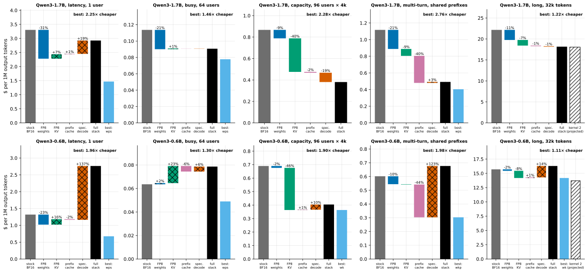
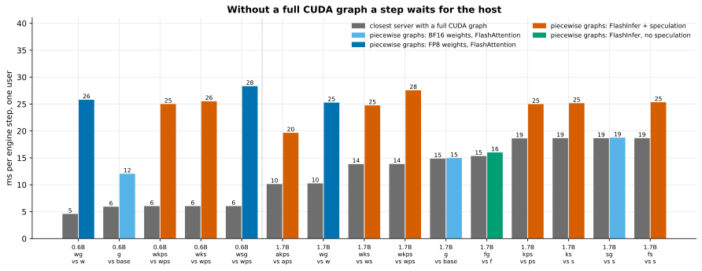
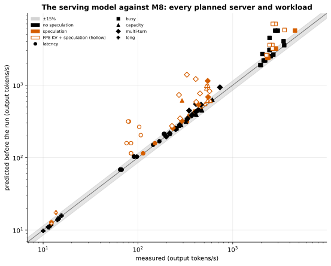

# Gate Report: M8, the full stack

> **Awaiting the owner's decision.** Not tagged. Two things need an answer before M9 (last section).

## What was built

- **The ablation plan as data** ([`serving/ablation.py`](../../src/fastserve/serving/ablation.py),
  [config](../../benchmarks/configs/m8_ablation.yaml)): techniques are letters, a server's label is the
  letters that are on, and the plan is a factorial plus named combinations. "One change at a time" is then
  checkable: two labels that differ by one letter differ by one technique.
- **The campaign** (`make bench-ablation`): 30 planned servers and 10 controls, one L4 container each, five
  workloads on each, GPU power sampled during every load
  ([`hw/telemetry.py`](../../src/fastserve/hw/telemetry.py)). Quality of the lossy part of the stack (FP8
  weights + FP8 KV) measured in vLLM: perplexity, the needle grid, the task suite.
- **The serving performance model** ([`perfmodel/serving.py`](../../src/fastserve/perfmodel/serving.py),
  [`fit.py`](../../src/fastserve/perfmodel/fit.py)): a decode step, a prefill and a closed loop from bytes
  and FLOPs, M0's measured ceilings, and constants each fitted on a named group of M2–M6 measurements.
  Its predictions for every planned server were frozen in `benchmarks/predictions/m8_model.json` before any
  server ran.
- **The analysis** ([`report/m8.py`](../../src/fastserve/report/m8.py)): ladder, leave-one-out, every
  pair's interaction, the best measured stack per workload, energy, cost, the frozen predictions against
  the measurements, and the model again with M8's measured inputs.
- **The investigation's tools**, built when the results needed explaining:
  - which CUDA graphs vLLM captured, parsed from every server's startup log
    ([`experiments/m2.py`](../../src/fastserve/experiments/m2.py), `cuda_graphs`);
  - FlashInfer's plan and attention calls, made as vLLM makes them and timed alone
    ([`experiments/m8.py`](../../src/fastserve/experiments/m8.py), `plan_cost`);
  - vLLM's own PyTorch profiler on a running server, reduced to self time per host call and GPU kernel
    (`summarize_trace`);
  - a reader for the installed libraries' source (`serving_library_facts`), because the explanation was in
    vLLM's code, not its docs.
- **Seven figures** ([`viz/m8_figures.py`](../../src/fastserve/viz/m8_figures.py)): the final waterfall,
  interaction matrix, the host's chain, recommendation map, quality against cost, predicted against
  measured, leave-one-out. Each caption is computed from the data.
- **Checkpoints on the Hub**: eight repos under `ishita-codes-ai/`, with model cards
  (`results/model_cards/`). The M4–M6 configs now name them.
- **Docs:** [docs/06-results-analysis.md](../06-results-analysis.md),
  [docs/07-performance-model.md](../07-performance-model.md), the
  [M8 learning doc](../learning/M8-full-stack.md).
- **Tests** for all of it on hand-made data: the plan's expansion, the model on a toy configuration whose
  every number can be checked by hand, calibration recovering known constants, every table on a campaign
  where exactly one pair competes, every figure's caption, the trace reduction, and the startup-log parser.

## Key results

<!-- BEGIN GENERATED: m8_findings -->
- **The best measured stack, Qwen3-1.7B on one L4, against stock BF16 vLLM:** latency `wps` 2.25×, busy `wps` 1.46×, capacity `wkps` 2.28×, multi-turn `wps` 2.76×, long `wkps` 1.22×. With INT4 weights allowed (lower quality, M4): latency `aps` 3.08×, busy `aps` 1.49×, multi-turn `aps` 3.13×.
- **The full stack (`wkps`: FP8 weights, FP8 KV, prefix caching, speculation) is the best stack on 2 of 5 workloads on Qwen3-1.7B and 0 of 5 on Qwen3-0.6B.** At one user it gives 1.13× where `wps` gives 2.25×; on Qwen3-0.6B it is slower than stock (0.48×).
- **Why: one pair collides.** With an FP8 KV cache and speculation together, vLLM 0.30 gives up its full CUDA graph on this GPU, and a step then waits for the host instead of the GPU: 25.8 ms per step against 4.6 with the graph, for the same GPU work (Qwen3-0.6B, FP8 weights, piecewise graphs forced on a control server).
- **Everything else nearly multiplies:** 17 of 24 pair × workload interactions are within 5% of 1. FP8 KV × speculation is 0.77 at one user.
- **Quality of the lossy part of the stack** (FP8 weights + FP8 KV, Qwen3-1.7B, in vLLM): perplexity ×0.996, needle recall 100%, GSM8K -1.3, MMLU -0.4 and HumanEval -6.1 points. Prefix caching does not change outputs; speculation is lossless in distribution (M6).
- **The serving model, frozen before any M8 server ran:** median error 6.4% over 125 predictions (66% within 15%), 3.5% on servers without speculation. Its large misses are the colliding servers: it had no term for the host. With that one constant fitted on M8, the same points come to 5.1% (71% within 15%).
<!-- END GENERATED: m8_findings -->

<!-- BEGIN GENERATED: caption-m8_waterfall -->
*The best measured stack serves Qwen3-1.7B at 1.2–2.8× lower cost per token than stock BF16 vLLM on the same L4 (most on multi-turn, least on long); on 8 of 10 model–workload pairs it is not the full stack, because the last technique added made serving dearer (hatched steps).*
<!-- END GENERATED: caption-m8_waterfall -->

The best measured stack per workload, Qwen3-1.7B:

<!-- BEGIN GENERATED: m8_best_large -->
| Workload | Stock BF16 (tokens/s) | Full stack `wkps` | Best measured stack | Its speedup | Its perplexity vs BF16 | Best with INT4 weights, if faster | Its speedup |
|---|---|---|---|---|---|---|---|
| Latency (1 user, real prompts) | 67 | 1.13× | `wps` | 2.25× | +0.0% | `aps` | 3.08× |
| Busy (64 users, real prompts) | 1,955 | 1.25× | `wps` | 1.46× | +0.0% | `aps` | 1.49× |
| Capacity (96 users, 4k-token prompts) | 256 | 2.28× | `wkps` | 2.28× | -0.4% | — | — |
| Multi-turn (8 users, shared prefixes) | 199 | 2.27× | `wps` | 2.76× | +0.0% | `aps` | 3.13× |
| Long (1 user, 32k tokens) | 10 | 1.22× | `wkps` | 1.22× | -0.4% | — | — |
<!-- END GENERATED: m8_best_large -->

Why the full stack is not the best one:

<!-- BEGIN GENERATED: caption-m8_host_chain -->
*12 of 15 servers on piecewise graphs are slower than their full-graph twin, by up to 5.6× (`wg` on Qwen3-0.6B: 26 ms per step against 5). The 3 that are not are the ones whose GPU already needs 15 ms or more per step: the host's time hides behind the GPU's.*
<!-- END GENERATED: caption-m8_host_chain -->

Interactions:

<!-- BEGIN GENERATED: m8_interactions -->
| Pair | Server | Latency (1 user, real prompts) | Busy (64 users, real prompts) | Capacity (96 users, 4k-token prompts) | Multi-turn (8 users, shared prefixes) |
|---|---|---|---|---|---|
| FP8 weights + FP8 KV cache | `wk` | 0.97 | 0.91 | 1.03 | 1.02 |
| FP8 weights + prefix caching | `wp` | 1.00 | 1.01 | 1.03 | 1.03 |
| FP8 weights + speculative decoding | `ws` | 0.92 | 0.97 | 1.04 | 0.99 |
| FP8 KV cache + prefix caching | `kp` | 1.00 | 1.03 | 1.02 | 1.03 |
| FP8 KV cache + speculative decoding | `ks` | 0.77 | 0.93 | 0.84 | 0.90 |
| prefix caching + speculative decoding | `ps` | 1.00 | 1.01 | 1.01 | 1.11 |
<!-- END GENERATED: m8_interactions -->

The model:

<!-- BEGIN GENERATED: caption-m8_predicted -->
*Frozen before any M8 server ran, the model's 125 predictions have a median error of 6% (66% within 15%): 3% without speculation, 11% with it, and 45% where FP8 KV meets speculation, which the model had no term for.*
<!-- END GENERATED: caption-m8_predicted -->

Quality:

<!-- BEGIN GENERATED: m8_quality -->
| Model | Stack | Perplexity | Needle recall | GSM8K (%) | MMLU (%) | HumanEval pass@1 (%) |
|---|---|---|---|---|---|---|
| Qwen3-0.6B | BF16 | 19.54 | 100% | 41.7 | 49.6 | 18.9 |
| Qwen3-0.6B | FP8 weights (`w`) | 19.85 | — | 40.4 | 46.5 | 20.1 |
| Qwen3-0.6B | FP8 KV cache (`k`) | 19.78 | 100% | — | — | — |
| Qwen3-0.6B | FP8 weights + FP8 KV (`wk`) | 20.26 | 100% | 38.4 | 46.0 | 19.5 |
| Qwen3-1.7B | BF16 | 15.55 | 100% | 69.0 | 62.8 | 40.2 |
| Qwen3-1.7B | FP8 weights (`w`) | 15.56 | — | 67.4 | 62.0 | 36.6 |
| Qwen3-1.7B | FP8 KV cache (`k`) | 15.23 | 100% | — | — | — |
| Qwen3-1.7B | FP8 weights + FP8 KV (`wk`) | 15.49 | 100% | 67.7 | 62.4 | 34.1 |
<!-- END GENERATED: m8_quality -->

## Predicted vs measured

Written before any server ran:

<!-- BEGIN GENERATED: m8_predictions -->
*Predictions written in commit `d4b75a2`, before the first measurement.*

| Quantity | Predicted | Measured | Verdict |
|---|---|---|---|
| Full stack (wkps) on latency (x) | 1.8 – 2.5 | 1.13 | below range |
| Full stack on busy (x) | 1.5 – 2.1 | 1.25 | below range |
| Full stack on capacity (x) | 1.6 – 2.6 | 2.28 | within range |
| Full stack on multi-turn (x) | 2.8 – 4.3 | 2.27 | below range |
| Full stack on long (x) | 1.15 – 1.5 | 1.22 | within range |
| Full stack with INT4 weights ÷ with FP8 weights, latency (x) | 1.1 – 1.4 | 1.41 | above range |
| Full stack with INT4 weights ÷ with FP8 weights, busy (x) | 0.8 – 1.05 | 1.07 | above range |
| FP8 weights + speculation on latency: combined ÷ product of the two alone | 0.8 – 1 | 0.919 | within range |
| FP8 weights + FP8 KV on busy: combined ÷ product | 0.95 – 1.15 | 0.914 | below range |
| FP8 KV + speculation on capacity: combined ÷ product | 0.7 – 1 | 0.841 | within range |
| Prefix caching + speculation on multi-turn: combined ÷ product | 1 – 1.35 | 1.11 | within range |
| FP8 weights + prefix caching on multi-turn: combined ÷ product | 0.95 – 1.15 | 1.03 | within range |
| FP8 KV + prefix caching on multi-turn: combined ÷ product | 0.9 – 1.15 | 1.03 | within range |
| Full stack ÷ full stack without speculation, latency (x) | 1.25 – 1.7 | 0.838 | below range |
| Full stack ÷ full stack without FP8 weights, latency (x) | 1.2 – 1.5 | 0.897 | below range |
| Full stack ÷ full stack without FP8 KV, capacity (x) | 1.2 – 1.6 | 1.46 | within range |
| Full stack ÷ full stack without prefix caching, multi-turn (x) | 1.7 – 2.5 | 1.62 | below range |
| Prefix caching where nothing is shared: wp ÷ w on latency (x) | 0.97 – 1.03 | 0.995 | within range |
| Share of the FP8-KV step's gain on capacity that FlashInfer alone gives: (wf − w) ÷ (wk − w) | 0.1 – 0.4 | 0.21 | within range |
| Tokens per target pass with EAGLE-3 on capacity's random-token prompts (assumed 2.1 in the model) | 1.3 – 2.8 | 2.42 | within range |
| Serving model, frozen predictions vs M8: median error in tokens/s, all servers and workloads | 0.03 – 0.15 | 0.0635 | within range |
| Serving model: share of M8 points predicted within 15% | 0.5 – 0.9 | 0.664 | within range |
| Serving model: median error on M8 servers without speculation | 0.02 – 0.1 | 0.0348 | within range |
| Largest difference in tokens/s between two runs of the same server, any workload | 0 – 0.05 | 0.0889 | above range |
| Tokens per joule, full stack ÷ base, latency (x) | 1.6 – 2.6 | 1.38 | below range |
| Mean GPU power of the base server at 64 users (W; the L4's limit is 72) | 60 – 72 | 69.7 | within range |
| Qwen3-0.6B: full stack on latency (x; a community EAGLE-3 head) | 1.3 – 2 | 0.478 | below range |
| Qwen3-0.6B: full stack on busy (x) | 1.4 – 2.2 | 0.809 | below range |
| Qwen3-0.6B: full stack on multi-turn (x) | 2.5 – 4 | 0.889 | below range |
| Perplexity, FP8 weights + FP8 KV ÷ BF16 (WikiText-2, in vLLM) | 0.99 – 1.03 | 0.996 | within range |
| Needle recall, FP8 weights + FP8 KV | 0.95 – 1 | 1 | within range |
| GSM8K, FP8 weights + FP8 KV minus BF16 (points of accuracy) | -0.06 – 0.03 | -0.0129 | within range |
<!-- END GENERATED: m8_predictions -->
<!-- BEGIN GENERATED: m8_prediction_score -->
**18 of 32 predictions in range.**
<!-- END GENERATED: m8_prediction_score -->

What explains the gaps:

| Predictions that missed | Explained by |
|---|---|
| Full stack on latency, busy, multi-turn (both models); the two leave-one-out rows; tokens per joule at one user | One cause: FP8 KV with speculation loses the full CUDA graph and waits for the host ([06, section 6](../06-results-analysis.md#6-the-pair-that-collides)) |
| Largest difference between two runs of a server | The same: a server that waits for its host inherits the host's variability. The stock server repeats closely |
| INT4 instead of FP8 in the full stack, at 64 users | Predicted slower, measured slightly faster. Both full stacks are held back by the collision, which hides M4's crossover |
| FP8 weights × FP8 KV at 64 users | Slightly below the range: FlashInfer costs a busy, short-context server more with FP8 weights ([06, section 6.7](../06-results-analysis.md#67-every-server-on-piecewise-graphs)); consistent with the same mechanism, not shown directly |
| Qwen3-0.6B's full stack | The collision, and a drafter that keeps few tokens on two of the workloads |

The investigation's own predictions, round by round (each committed before its servers ran):

Round 1: the FP8 bytes, or the graph mode?

<!-- BEGIN GENERATED: m8_controls_1_score -->
**5 of 8 predictions in range.**
<!-- END GENERATED: m8_controls_1_score -->

Round 2: FlashInfer alone, in and out of the full graph.

<!-- BEGIN GENERATED: m8_controls_2_score -->
**3 of 4 predictions in range.**
<!-- END GENERATED: m8_controls_2_score -->

FlashInfer's calls, timed alone.

<!-- BEGIN GENERATED: m8_controls_plan_score -->
**2 of 5 predictions in range.**
<!-- END GENERATED: m8_controls_plan_score -->

Round 3: piecewise graphs where the GPU's pass is short.

<!-- BEGIN GENERATED: m8_controls_3_score -->
**0 of 3 predictions in range.**
<!-- END GENERATED: m8_controls_3_score -->

Round 4: do FP8 weights lengthen the host's work?

<!-- BEGIN GENERATED: m8_controls_4_score -->
**2 of 2 predictions in range.**
<!-- END GENERATED: m8_controls_4_score -->

## Surprises and dead ends

- **The full stack is not the best stack**, and on the small model it is slower than stock at one user.
  Nothing in M4–M6 suggested it: each technique had been measured alone.
- **My first explanation was wrong and looked confirmed.** vLLM's log names the fallback to piecewise
  graphs. I forced that mode on a control server, saw no loss, and cleared it. The control ran on a model
  whose GPU work per pass is longer than the host's, so it could not show a host-side loss. Two more rounds
  were spent on FlashInfer before the profiler put the question back.
- **Dead end: FlashInfer's planning.** I predicted its calls would make up most of a pass. Timed alone,
  they are a small fraction of it.
- **FP8 weights double the host's time on piecewise graphs.** Confirmed by swapping the weights on both
  models. **I did not find out why**: the profiles show the same launches and slower Python per call.
- **Power is not a utilization meter, until it is.** The stock server draws the L4's limit with one user.
  The only servers below the limit were the ones waiting for their host.
- **The model's inputs failed before its physics did** on the small model: its drafter keeps few tokens on
  prompts it had not been measured on.
- **Process:** one control run was started with two test files uncommitted. It was stopped before anything
  was timed and relaunched from a clean tree. Recording which graphs each server captured needed a server
  start per server; that cost more than it was worth and should have been logged from the first run.
- **Cost:** M8 took several times the GPU time I estimated. The plan was 30 servers; the explanation
  took 10 more, six profiles and 29 extra server starts. See "Proposed next steps".
- **Not done:**
  - the CPU model of each container is not recorded (Modal's sandbox hides it), so host-bound results
    cannot be normalized by CPU;
  - open-loop load and an SLO sweep for the stacks (M2 has them for the stock server);
  - quality of INT4 weights with an FP8 cache;
  - the GPU test suite was not re-run for this gate: M8 changed no kernel or engine code, and the budget is
    spent (below). The CPU suite and lint were.

## What you should now understand

- **Ablation**: a ladder, leave-one-out and pairs from one factorial design; a technique's gain alone and
  its worth inside a stack are different numbers.
- **Interaction**: combined gain ÷ product of the single gains, and why techniques that act on different
  terms of a step multiply.
- **CUDA graphs**: what a full graph removes, what a piecewise graph leaves in Python, and why a server can
  be bound by its host while its GPU idles.
- **Hidden effects**: a step takes the longer of what the GPU and the host need, so a slow GPU pass hides a
  slow host, and a null result from a control depends on what the control could have seen.
- **A performance model's boundary**: bytes and FLOPs bound the GPU. They say nothing about the host.
- **Energy per token** follows time per token on a GPU that sits at its power limit.

## Explain it back (answer before we continue)

1. FP8 KV gives a gain at 96 users and speculation gives a gain at one user. Together, at one user, the
   server is slower than with speculation alone. Walk through why, naming what vLLM cannot do and what the
   GPU is doing meanwhile.
2. The first control (`sg`) showed no loss from piecewise graphs. Why was that result true and the
   conclusion drawn from it false? What made the later control (`wg` on the small model) able to see it?
3. Interaction for FP8 weights × speculation is a little below 1 at one user and about 1 at capacity.
   Explain both from which term of a step each technique changes.
4. The model's median error on M8 was inside the range predicted for it, yet it missed the headline number
   by a large factor. How can both be true, and what does that say about summarizing a model by its median?
5. A customer has 500 concurrent users with 16k-token contexts. Using
   [the worked example](../07-performance-model.md#5-using-it-which-stack-for-which-traffic), what do you
   tell them first, and which stack per GPU?

## Proposed next steps

**M9 (presentation):** README polish, the static dashboard with the interactive calculator (the serving
model is stdlib-only for this reason), the blog draft, `reproduce_all.sh` and a quick-reproduce subset, the
glossary and interview prep.

**Two things that need your decision:**

1. **Budget.** What Modal has billed so far:

<!-- BEGIN GENERATED: compute_spend_month -->
   **$22.04** in 2026-10, billed through 2026-10-02 08:00 UTC.
<!-- END GENERATED: compute_spend_month -->

   Modal's billing lags by hours, and most of M8's controls and profiles ran after the hour shown. I expect
   the month to end near or slightly above the monthly credit, which means the start of your reserve. The
   exact figure will be in `results/compute_log.csv` once the billing catches up. M9 needs almost no GPU
   (figures and docs render on CPU), except `reproduce_all.sh`: a full reproduction would cost roughly what
   the milestones did. I propose that M9's "quick reproduce" regenerates the headline figure from the
   committed raw results (no GPU), and that the full reproduction is documented but not run.
2. **The open question.** Why FP8 weights double the host's time on piecewise graphs is unexplained. One
   more profile with Python stacks on the 1.7B model would probably answer it (a few minutes of L4). I have
   not run it because of item 1. Say if you want it.

**Changed in the plan:** nothing structural. The H100 runs AGENTS.md describes remain out of scope (ADR
001), and M8 adds a reason they would matter: the collision found here should not exist on Hopper.
