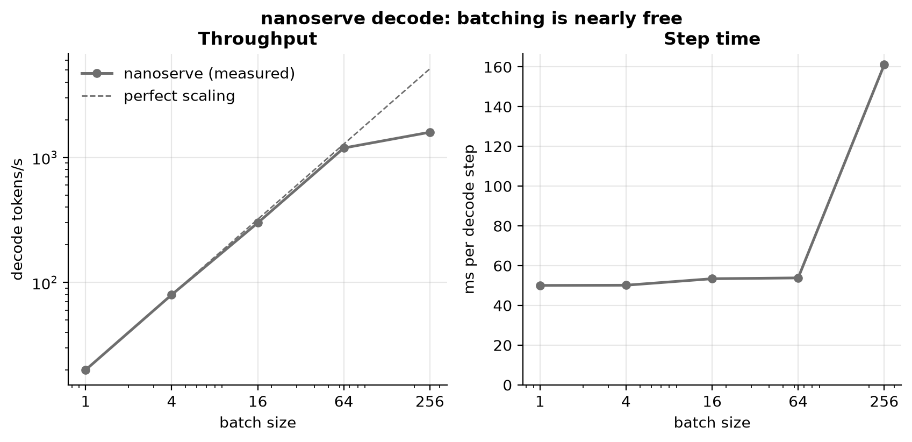
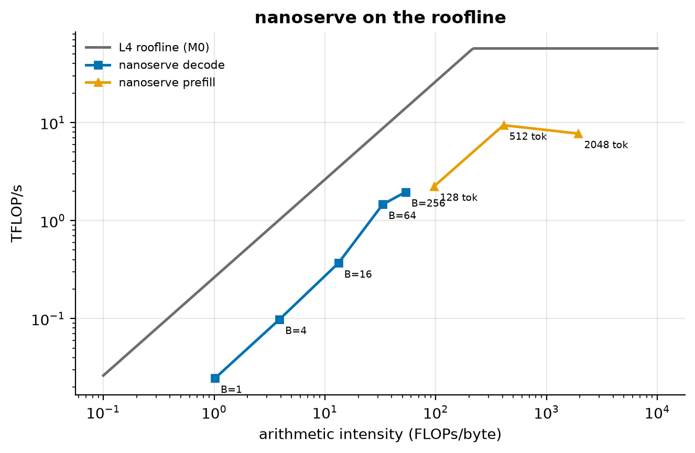
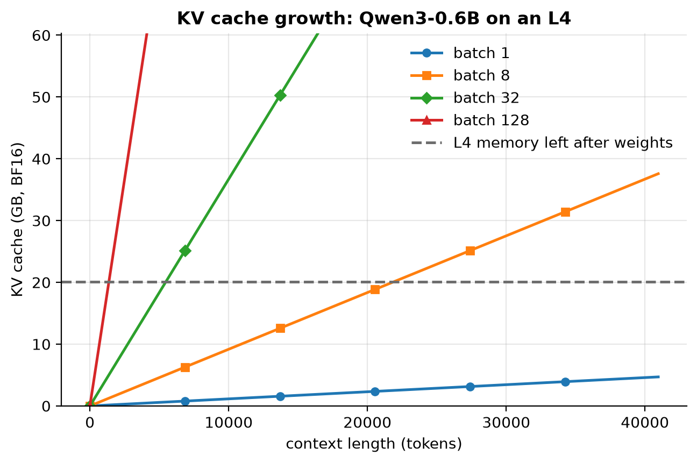
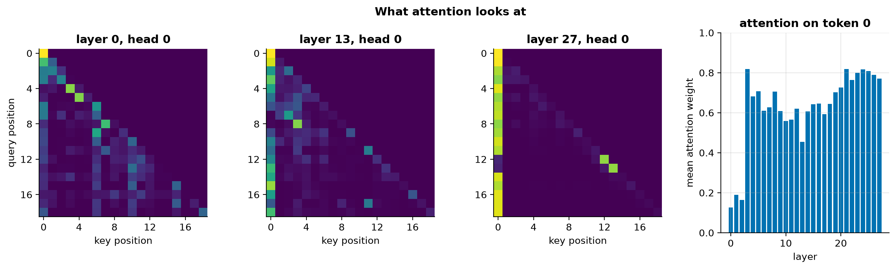
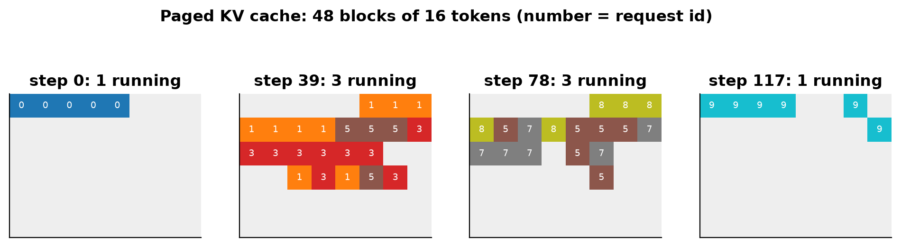

# M1: nanoserve, inference from scratch

M1 builds a small inference engine for Qwen3 in plain PyTorch: **nanoserve** (`src/fastserve/engine/`). It
serves two purposes:
1. It makes every step of inference visible: embeddings, attention, the KV cache, sampling, batching.
2. It's the testbed where every later technique is first built and checked.

It isn't meant to be fast. It's meant to be *correct and readable*, and then to show exactly where the time goes.

## 1. Intuition

Generating text is a loop: **run the whole model to produce one token, append it, repeat.** Two ideas make that
loop affordable:

- **The KV cache.** Every token's keys and values are computed once and kept, so each step only processes the one
  new token. Without it, step *n* would redo the work of all *n* previous tokens.
- **Batching.** One step reads *all* the weights from memory to produce *one* token per sequence. Serving 16
  sequences together reads those same weights once for 16 tokens, which is the same memory traffic for 16× the
  work.

**The paged KV cache** is like virtual memory: instead of reserving the longest possible buffer for every
sequence, the cache hands out small fixed-size blocks as sequences grow and takes them back when they finish.
**Continuous batching** is like a restaurant that seats a new guest the moment a table frees up, instead of
waiting for the whole room to finish.

## 2. The math

For Qwen3 with L layers, hidden size d, H query heads, H_kv KV heads, head size D and vocabulary V:

| Quantity | Formula |
|---|---|
| FLOPs per token (matmuls) | ≈ 2 × parameters |
| Bytes read per decode step (batch B, BF16) | weights + B × context × KV bytes per token |
| KV bytes per token | 2 × L × H_kv × D × 2 |
| Batch-1 decode ceiling | memory bandwidth ÷ bytes per step |
| Arithmetic intensity of a decode matmul at batch B | ≈ B FLOPs/byte |

**The facts for our model** (generated from `config.json` and the M0 bandwidth):

<!-- BEGIN GENERATED: m1_model_facts -->
*Qwen3-0.6B, from config.json; bandwidth from the M0 probe.*

| Quantity | Value |
|---|---|
| Parameters | 596 M |
| Weights in BF16 | 1.192 GB |
| Embedding / LM head share of weights | 26% |
| Bytes read per decode step (batch 1, weights only) | 1.192 GB |
| KV cache per token (BF16) | 112 KiB |
| Batch-1 ceiling = measured read bandwidth ÷ bytes per step | 220 tokens/s |
<!-- END GENERATED: m1_model_facts -->

## 3. What was built

| File | What it does |
|---|---|
| `engine/config.py` | Model dimensions from `config.json`, handling both transformers 4.x and 5.x layouts |
| `engine/rope.py` | Rotary embeddings, matching Hugging Face bit for bit (cos/sin in float32, then cast) |
| `engine/attention.py` | Causal mask *by absolute position*, grouped-query attention, fp32 softmax |
| `engine/kv_cache.py` | `ContiguousKVCache` and `PagedKVCache` (block pool + block tables) behind one interface |
| `engine/model.py` | The forward pass, with Hugging Face's parameter names, so checkpoints load directly |
| `engine/loader.py` | safetensors → model built on the meta device, so there's no double memory |
| `engine/sampler.py` | Greedy, temperature, top-p |
| `engine/generate.py` | Static batching, and `ContinuousBatcher` with "reserve a budget, allocate lazily" admission |

**Correctness checks** (CPU, tiny random-weight models, no downloads):
- logits equal Hugging Face's
- both caches equal a full forward pass
- batched and continuous-batched greedy output equals each prompt run alone

## 4. Prediction (written before running the real model)

The numbers below come from the model facts above plus M0's measurements.

**Memory time.** A decode step reads ~1.19 GB of weights. At the measured 262 GB/s that's 4.6 ms, a ceiling of
~220 tokens/s. But M0 showed that *small* matmuls can't stream at full bandwidth:
- A Qwen3-0.6B layer is seven matrices of 2–6 MiB, streaming at ~110–150 GB/s → about 0.24 ms per layer →
  about 6.8 ms for 28 layers.
- The 311 MB LM head streams faster, ~1.5 ms.

So **GPU memory time is ~8 ms per step** even with perfect execution.

**Kernel count.** Counted by hand from `model.py`, one layer launches roughly:

| Piece | Kernels |
|---|---|
| RMSNorm × 2 (fp32 cast, pow, mean, add, rsqrt, mul, cast back, weight) | ~16 |
| QK-norm (the same, for q and k) | ~16 |
| RoPE for q and k (mul, neg, cat, mul, add) | ~10 |
| q/k/v/o projections, MLP (3 matmuls + SiLU + mul) | ~9 |
| KV-cache write and read, causal mask | ~6 |
| Attention (repeat_kv copies, matmul, scale, mask, softmax, cast, matmul) | ~9 |
| Reshapes that copy, residual adds | ~3 |

That's ~69 per layer × 28 ≈ **1,900 kernels per decode step** (range 1,500–2,500).

**Launch-bound.** M0 measured ~9 µs per eager launch for the simplest op. nanoserve's ops go through more Python,
so figure ~10 µs. 1,900 × 10 µs ≈ 19 ms of CPU work per step, versus ~8 ms of GPU work. The CPU can't queue work
as fast as the GPU finishes it, so:

| Quantity | Prediction | Why |
|---|---|---|
| Batch-1 decode | **35–65 tokens/s** | ~15–30 ms per step, set by launch overhead, not memory |
| GPU busy fraction of a step | **25–60%** | ~8 ms of GPU work inside a ~15–30 ms step |
| Batch 16 vs batch 1 throughput | **12–16×** | The CPU time per step barely changes with batch size, and GPU time stays below it |
| Batch 64 vs batch 1 throughput | **40–64×** | Decode matmuls at M=64 are still memory-bound (64 ≪ ridge 217) |
| Prefill, 512 tokens | **15–35 ms** | ~0.5 TFLOP at ~50 TFLOP/s ≈ 10 ms, but launches still cost ~19 ms |
| Prefill, 2048 tokens | **50–90 ms** | ~2.8 TFLOP (attention grows with length²): compute-bound at last |
| BF16 top-1 agreement with Hugging Face | **99–100%** | Same math and order; BF16 rounding can flip near-ties |
| BF16 max \|logit difference\| | **≤ 0.5** | BF16 has ~3 significant digits, and logits reach ±20 or so |

## 5. Result

### Prediction vs measurement

<!-- BEGIN GENERATED: m1_predictions -->
*Predictions written in commit `1042ea5`, before the first measurement.*

| Quantity | Predicted | Measured | Verdict |
|---|---|---|---|
| BF16 top-1 agreement with Hugging Face (%) | 99 – 100 | 100 | within range |
| BF16 max |logit difference| vs Hugging Face | 0 – 0.5 | 0 | within range |
| GPU kernels per batch-1 decode step | 1,500 – 2,500 | 1,990 | within range |
| Batch-1 decode speed, eager nanoserve (tokens/s) | 35 – 65 | 20 | below range |
| GPU busy fraction of a batch-1 decode step (%) | 25 – 60 | 17.1 | below range |
| Decode throughput, batch 16 / batch 1 (x) | 12 – 16 | 15 | within range |
| Decode throughput, batch 64 / batch 1 (x) | 40 – 64 | 59.5 | within range |
| Prefill of a 512-token prompt (ms) | 15 – 35 | 54.4 | above range |
| Prefill of a 2048-token prompt (ms) | 50 – 90 | 359 | above range |
<!-- END GENERATED: m1_predictions -->

### Correctness: nanoserve vs Hugging Face (BF16, real weights)

<!-- BEGIN GENERATED: m1_parity -->
| HF attention | Prompt | Tokens | Top-1 | Max \|Δlogit\| | Mean \|Δlogit\| | KL(HF ‖ ours) |
|---|---|---|---|---|---|---|
| eager | The capital of France is | 5 | 100.0% | 0.000 | 0.0000 | 0.00e+00 |
| eager | def fibonacci(n):… | 13 | 100.0% | 0.000 | 0.0000 | 0.00e+00 |
| eager | Q: If a train travels 60 km in 45 minute… | 27 | 100.0% | 0.000 | 0.0000 | 0.00e+00 |
| eager | Photosynthesis is the process by which p… | 8 | 100.0% | 0.000 | 0.0000 | 0.00e+00 |
| eager | Translate to French: The weather is beau… | 10 | 100.0% | 0.000 | 0.0000 | 0.00e+00 |
| eager | Once upon a time, in a small village at … | 18 | 100.0% | 0.000 | 0.0000 | 0.00e+00 |
| eager | SELECT name, COUNT(*) FROM orders GROUP … | 9 | 100.0% | 0.000 | 0.0000 | 0.00e+00 |
| eager | 人工智能是 | 2 | 100.0% | 0.000 | 0.0000 | 0.00e+00 |
| sdpa | The capital of France is | 5 | 100.0% | 0.383 | 0.0413 | 8.17e-04 |
| sdpa | def fibonacci(n):… | 13 | 92.3% | 0.430 | 0.0418 | 5.59e-04 |
| sdpa | Q: If a train travels 60 km in 45 minute… | 27 | 100.0% | 1.312 | 0.0609 | 1.03e-03 |
| sdpa | Photosynthesis is the process by which p… | 8 | 87.5% | 0.406 | 0.0415 | 1.02e-03 |
| sdpa | Translate to French: The weather is beau… | 10 | 100.0% | 0.516 | 0.0478 | 1.65e-03 |
| sdpa | Once upon a time, in a small village at … | 18 | 100.0% | 0.703 | 0.0551 | 1.43e-03 |
| sdpa | SELECT name, COUNT(*) FROM orders GROUP … | 9 | 100.0% | 0.453 | 0.0481 | 1.76e-03 |
| sdpa | 人工智能是 | 2 | 100.0% | 0.242 | 0.0209 | 6.33e-04 |
<!-- END GENERATED: m1_parity -->

Against Hugging Face's *eager* attention, which does the same math in the same order, nanoserve's logits are
**identical to the last bit**. That looks too good to be true, so the SDPA rows are the **negative control**. There,
Hugging Face uses PyTorch's fused attention kernel, which sums in a different order. Its logits differ slightly, and
occasionally the top token too. So the comparison *can* see small differences, and the eager match is genuine.

### Speed

<!-- BEGIN GENERATED: m1_speed -->
| Workload | Time per step (ms) | Tokens/s | vs batch 1 |
|---|---|---|---|
| decode, batch 1 | 50.1 | 20 | 1.0× |
| decode, batch 4 | 50.2 | 80 | 4.0× |
| decode, batch 16 | 53.4 | 299 | 15.0× |
| decode, batch 64 | 53.8 | 1,189 | 59.5× |
| decode, batch 256 | 161.1 | 1,589 | 79.6× |
| prefill, 128 tokens | 52.2 | 2,451 | — |
| prefill, 512 tokens | 54.4 | 9,405 | — |
| prefill, 2048 tokens | 358.7 | 5,710 | — |
<!-- END GENERATED: m1_speed -->

<!-- BEGIN GENERATED: caption-m1_decode_scaling -->
*Batch 1 decodes 20 tokens/s; batch 64 reaches 1,189 (60×) while each step takes only 1.1× longer.*
<!-- END GENERATED: caption-m1_decode_scaling -->

### Where the time goes

<!-- BEGIN GENERATED: m1_profile -->
| Step | GPU kernels | GPU busy (ms) | Step time (ms) | GPU busy | Step time per kernel (µs) | Top kernel types |
|---|---|---|---|---|---|---|
| decode, batch 1 | 1,990 | 8.58 | 50.07 | 17% | 25.2 | matmul 5.4 ms (253), elementwise 1.6 ms (1021), copy / index / cat 1.3 ms (573) |
| prefill, 512 tokens | 2,212 | 24.82 | 54.44 | 46% | 24.6 | matmul 12.1 ms (253), copy / index / cat 5.3 ms (796), elementwise 5.1 ms (1021) |
| prefill, 2048 tokens | 2,184 | 353.86 | 358.65 | 99% | 164.2 | copy / index / cat 139.7 ms (768), elementwise 78.7 ms (1021), matmul 67.3 ms (253) |
<!-- END GENERATED: m1_profile -->

<!-- BEGIN GENERATED: caption-m1_anatomy -->
*In a decode, batch 1 step, the attention block takes 61% of the time; tiny ops like RMSNorm cost far more than their arithmetic, because every launch has a fixed cost.*
<!-- END GENERATED: caption-m1_anatomy -->

(The component split uses CUDA events recorded from forward hooks, which add some overhead of their own, so compare
shares rather than absolute milliseconds.)

<!-- BEGIN GENERATED: caption-m1_roofline -->
*At batch 1, nanoserve decode reaches 1/11 of what the roofline allows at its intensity: launch overhead, not memory or compute, limits it.*
<!-- END GENERATED: caption-m1_roofline -->

### Explaining every gap

1. **Correctness landed exactly where predicted**, and better: an exact match with the same math in the same order.
2. **The kernel count landed in range.** The per-layer hand count in §4 was close to the profiler's count.
3. **Batch-1 decode is well below my range, and the GPU is even less busy than predicted.** The step is
   CPU-bound as expected, but each kernel costs *far* more CPU time than the M0 probe's simplest op (see
   "Step time per kernel"). Real PyTorch ops pay for argument checking, dispatch, advanced indexing and
   module calls, and Modal's sandbox adds cost to every call into the GPU driver. *Lesson: predict launch
   overhead from ops like the real ones, not from the cheapest possible op.*
4. **Batching landed in range: it's nearly free.** From batch 1 to batch 64, the step time barely moves while
   throughput scales almost linearly. Only at batch 256 does the GPU work finally outgrow the CPU's launch time,
   and the step gets slower.
5. **The 512-token prefill is above range** for the same reason as 3: a prefill launches about as many kernels as
   a decode step, so it hits the same CPU floor even though its GPU work is larger.
6. **The 2048-token prefill is far above range.** The reference attention builds the full length × length score
   matrix, then writes and re-reads it for scaling, masking, softmax (in fp32) and casting. That traffic grows with
   length², and at 2048 tokens it dominates: compare the prefill rows of the profile table. This is exactly the
   problem **FlashAttention** solves (it never writes the score matrix to memory). We'll write our own
   attention kernel in M7.

**The big lesson of M1:** nanoserve is limited by **lever 3** (waste between bytes and math), not by memory or
compute. The anatomy figure shows it plainly: the LM head moves a quarter of all the bytes yet takes a sliver of
the step, while RMSNorm, with almost no math, takes a large share because of its many small launches. **Lever 1
(quantization) would do nothing for nanoserve today**, because shrinking bytes doesn't help a CPU-bound loop. That
ordering matters for the ablation in M8, and it's why vLLM (M2) uses CUDA graphs.

### Memory and attention

<!-- BEGIN GENERATED: caption-m1_kv_growth -->
*Each token costs 112 KiB of KV cache: at batch 32 the L4's free memory fills at about 5,477 tokens of context.*
<!-- END GENERATED: caption-m1_kv_growth -->

<!-- BEGIN GENERATED: caption-m1_attention -->
*Most layers pour attention onto the first token (an attention sink): layer 3 puts 82% of its weight there on average (63% across all 28 layers).*
<!-- END GENERATED: caption-m1_attention -->

The first token acts as a "no-op" parking spot for attention in most layers. That's the **attention sink**, and it
matters later: evicting the first token from the KV cache breaks the model (M5).

### Continuous batching on the paged cache

<!-- BEGIN GENERATED: caption-m1_block_table -->
*10 requests shared 48 KV blocks over 119 steps; blocks freed by finished requests were handed to new ones 37 times.*
<!-- END GENERATED: caption-m1_block_table -->

An interactive, step-by-step animation is in `results/figures/m1_block_table.html` (open it in a browser). It will
be on the project dashboard in M9.

## 6. Check your understanding

1. Why does decode at batch 1 read ~1.19 GB per token, even though the embedding table alone is 311 MB?
   

Answer
The embedding *lookup* reads one row, but the LM head (the same matrix,
   because the weights are tied) is a full matmul over all 151,936 rows. Every weight of every layer is read once
   per step.

2. Why does nanoserve mask attention by *absolute position* rather than by the row's length?
   

Answer
Rows in a batch have different lengths, and padded or not-yet-written cache
   slots hold junk. A key slot j is valid for a query at position p exactly when j ≤ p, so one rule covers
   prefill, decode, padding and paged gathers.

3. What does the paged KV cache buy over the contiguous one, and what does our reference version pay for it?
   

Answer
Memory is allocated per block as sequences grow and returned when they
   finish, so no memory is reserved up front and finished sequences free space immediately. Our reference version
   *gathers* the blocks into a contiguous copy each step, which costs extra memory traffic. A real paged-attention
   kernel reads the blocks in place (M7).

4. If a decode step is launch-bound, what happens to its time when the batch grows from 1 to 16? Why?
   

Answer
It barely changes: the same kernels are launched regardless of batch size,
   and the GPU work, though bigger, still finishes before the CPU queues the next kernel. So throughput grows
   almost 16×.

5. What two fixes would make nanoserve's batch-1 decode approach the ~220 tokens/s ceiling?
   

Answer
Remove launch overhead (CUDA graphs, or fusing small ops like RMSNorm and
   RoPE into single kernels), and stream the small weight matrices closer to full bandwidth (better GEMV kernels,
   or fewer bytes via quantization).

## 7. Further reading

- Kwon et al., *Efficient Memory Management for LLM Serving with PagedAttention* (vLLM), 2023.
- Yu et al., *Orca: A Distributed Serving System for Transformer-Based Generative Models*, 2022.
- Qwen team, *Qwen3 Technical Report*, 2025.
- PyTorch docs: *torch.profiler*; *CUDA semantics: asynchronous execution*.
