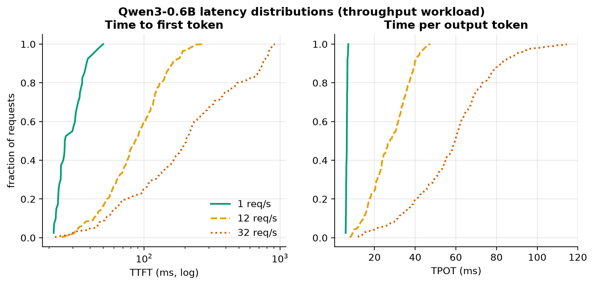
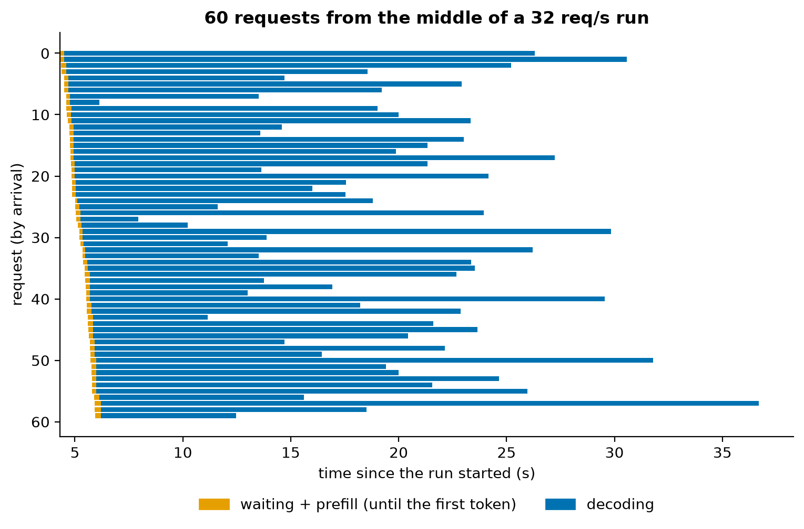
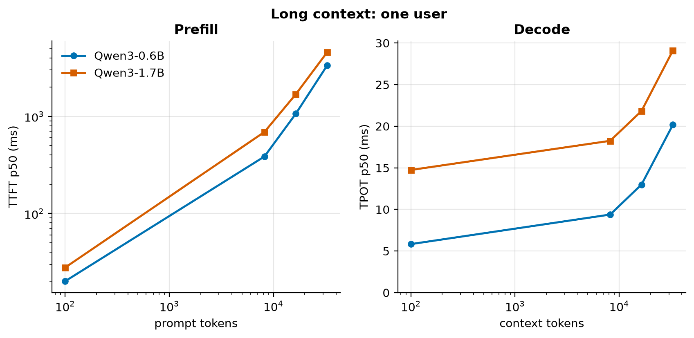

# M2: Baselines, stock vLLM under load

M2 measures the **"before" picture**: how a production engine (vLLM, BF16) serves Qwen3-0.6B and Qwen3-1.7B on
one L4, under realistic traffic. Every later optimization is judged against these numbers.

## 1. Intuition

Serving isn't one user running one prompt. It's a **queue**. Requests arrive whenever users send them, wait if the
server is busy, get prefilled, then decode token by token, in a batch with everyone else who's running.
- **At light load** each request is almost alone: latency is as good as it gets, but the GPU is under-used.
- **As load grows** the batch grows, which is nearly free (M1), so throughput climbs while latency barely moves.
- **Past capacity** requests arrive faster than they finish, the queue grows without bound, and time to first
  token explodes.

Where that happens is the **knee**. Service-level objectives (SLOs) turn "fast enough" into numbers, and
**goodput** counts only the requests that meet them.

## 2. The math

| Metric | Definition |
|---|---|
| TTFT | first token arrives − request sent (queueing + prefill + one decode step + network) |
| TPOT | (last token − first token) ÷ (output tokens − 1) |
| ITL | every gap between consecutive tokens (a distribution: p50, p90, p99) |
| Throughput | output tokens ÷ wall time, across all requests |
| Goodput | requests meeting *both* SLOs (TTFT ≤ 500 ms, TPOT ≤ 50 ms) ÷ wall time |
| Cost | ($ per GPU-hour) ÷ (output tokens/s × 3600) × 10⁶ = $ per 1M output tokens |
| Little's law | requests in the system = arrival rate × time in the system |

**A decode step at batch B** reads the weights once, plus every running sequence's KV cache:

```
bytes per step ≈ weights + B × (average context) × KV bytes per token
time per step  ≈ max(bytes ÷ bandwidth, FLOPs ÷ peak) + overheads
throughput     = B ÷ time per step
```

For Qwen3-0.6B the KV cost per token (112 KiB) is as large as for an 8B model, so at high batch the **KV reads**,
not the weights, dominate the bytes.

**The average context of a running sequence** isn't that of a typical request. A request holds a place in the
batch for every token it generates, and its context grows from prompt to prompt + output. So, weighted by time
in the batch:

```
average context while decoding = Σ (out·prompt + out·(out − 1)/2) ÷ Σ out
```

Long answers stay longest, so they dominate the batch at any moment. It's the inspection paradox: pick a random
moment, and you're more likely to land inside a long request than a short one.

## 3. Setup

- **Engine:** vLLM 0.30.0 in its own image (`infra/serving.lock`), BF16, default settings except **prefix caching
  off** (it's a technique we add in M5). Its defaults include CUDA graphs, torch.compile, chunked prefill,
  FlashAttention, and up to 256 running sequences.
- **Client:** our async streaming load generator (`serving/client.py`). Prompts are seeded random token ids, and
  output lengths are forced (`ignore_eos`), so every configuration does exactly the same work.
- **Server timeline:** during every load point, vLLM's own `/metrics` is sampled four times a second (running and
  waiting requests, KV-cache use, token and step counters). The client sees requests; only the server sees the
  batch.
- **Workloads** (`benchmarks/workloads/serving.yaml`):

| Workload | Prompt | Output | Load |
|---|---|---|---|
| chat | ~100 tokens (log-normal) | 256 | one user (closed loop) |
| throughput | ~256 tokens, long tail to 4k | ~190, long tail to 1k | open loop at 1–32 req/s; closed loop 1–256 users |
| long_8k / 16k / 32k | 8k / 16k / 32k | 64 | one user |
| shared_prefix | 2,048 shared + ~64 own | 64 | open loop at 2–24 req/s |

## 4. Prediction (written before the first run)

| Quantity | Prediction | Reasoning |
|---|---|---|
| Chat TPOT p50, 0.6B | **5.5–8 ms** | CUDA graphs remove nanoserve's launch overhead. What's left is GPU time: nanoserve's matmul kernels streamed the 1.19 GB of weights in ~5.4 ms (M1 profile), plus a little for attention, norms and sampling. |
| Chat TTFT p50, 0.6B | **10–30 ms** | A ~100-token prefill is tiny (~0.1 TFLOP ≈ 2 ms). Scheduling, HTTP and the first decode step dominate. |
| vLLM vs nanoserve, batch-1 decode | **6–9×** | ~1000 ÷ 6.5 ms ≈ 150 tok/s, vs nanoserve's 20 tok/s |
| Peak output throughput, 0.6B | **3,000–6,000 tok/s** | At 256 running sequences × ~450 tokens of context, each step reads ~13 GB of KV plus 1.2 GB of weights: ~55 ms per step → ~4,600 tok/s, minus prefill work |
| Knee: highest arrival rate with ≥ 90% of requests within the SLO, 0.6B | **12–25 req/s** | Peak throughput ÷ ~260 tokens per request ≈ 17 req/s |
| Chat TPOT, 1.7B ÷ 0.6B | **2.2–2.9×** | 2.9× the weight bytes, but some fixed per-step costs don't scale |
| Peak throughput, 1.7B ÷ 0.6B | **0.6–0.9×** | At high batch the KV reads dominate, and they're the *same* per token for both models. Only the weights and FLOPs differ. |
| TTFT with a 32k-token prompt, 0.6B | **0.5–1.2 s** | ~29 TFLOP of matmuls + ~4 TFLOP of attention at ~50 TFLOP/s |
| TPOT at 32k context ÷ chat TPOT, 0.6B | **2–4×** | Each step reads 1.19 GB of weights + 3.7 GB of KV (vs ~0.01 GB of KV in chat) |
| Peak request rate, shared-prefix workload, 0.6B, no prefix caching | **12–25 req/s** | Every request re-prefills 2,048 shared tokens (~1.8 TFLOP ≈ 36 ms of compute) |

### Quality baselines (predicted before the quality run)

BF16 is the reference: these numbers aren't "good" or "bad" on their own. They're the bar every later
optimization must not fall below. The ranges are wide because they come from what's typical for models of this
size, not from measurements.

| Quantity | Prediction |
|---|---|
| WikiText-2 perplexity (2,048-token windows) | 0.6B: **12–30**; 1.7B: **9–20** |
| GSM8K 5-shot | 0.6B: **25–55%**; 1.7B: **50–75%** |
| MMLU 5-shot (20 questions per subject) | 0.6B: **35–55%**; 1.7B: **50–65%** |
| HumanEval pass@1 | 0.6B: **10–40%**; 1.7B: **25–55%** |
| Needle-in-a-haystack pass rate, 1k–32k tokens | 0.6B: **70–100%**; 1.7B: **85–100%** |

## 5. Result

### Prediction vs measurement: speed

<!-- BEGIN GENERATED: m2_predictions -->
*Predictions written in commit `19c9be1`, before the first measurement.*

| Quantity | Predicted | Measured | Verdict |
|---|---|---|---|
| Chat TPOT p50, Qwen3-0.6B (ms) | 5.5 – 8 | 5.83 | within range |
| Chat TTFT p50, Qwen3-0.6B (ms) | 10 – 30 | 20.1 | within range |
| Batch-1 decode speed, vLLM / nanoserve (x) | 6 – 9 | 8.58 | within range |
| Peak output throughput, Qwen3-0.6B (tokens/s) | 3,000 – 6,000 | 2,122 | below range |
| Knee: highest rate with >= 90% of requests in SLO, 0.6B (req/s) | 12 – 25 | 12 | within range |
| Chat TPOT, 1.7B / 0.6B (x) | 2.2 – 2.9 | 2.53 | within range |
| Peak throughput, 1.7B / 0.6B (x) | 0.6 – 0.9 | 0.701 | within range |
| TTFT with a 32k-token prompt, 0.6B (s) | 0.5 – 1.2 | 3.33 | above range |
| TPOT at 32k context / chat TPOT, 0.6B (x) | 2 – 4 | 3.46 | within range |
| Peak request rate, shared-prefix workload, 0.6B (req/s) | 12 – 25 | 6.39 | below range |
<!-- END GENERATED: m2_predictions -->

### Prediction vs measurement: quality

<!-- BEGIN GENERATED: m2_quality_predictions -->
*Predictions written in commit `3909257`, before the first measurement.*

| Quantity | Predicted | Measured | Verdict |
|---|---|---|---|
| WikiText-2 perplexity, Qwen3-0.6B | 12 – 30 | 19.6 | within range |
| WikiText-2 perplexity, Qwen3-1.7B | 9 – 20 | 15.6 | within range |
| GSM8K 5-shot, Qwen3-0.6B (%) | 25 – 55 | 41.7 | within range |
| GSM8K 5-shot, Qwen3-1.7B (%) | 50 – 75 | 69 | within range |
| MMLU 5-shot slice, Qwen3-0.6B (%) | 35 – 55 | 49.6 | within range |
| MMLU 5-shot slice, Qwen3-1.7B (%) | 50 – 65 | 62.8 | within range |
| HumanEval pass@1, Qwen3-0.6B (%) | 10 – 40 | 18.9 | within range |
| HumanEval pass@1, Qwen3-1.7B (%) | 25 – 55 | 40.2 | within range |
| Needle pass rate up to 32k, Qwen3-0.6B (%) | 70 – 100 | 100 | within range |
| Needle pass rate up to 32k, Qwen3-1.7B (%) | 85 – 100 | 100 | within range |
<!-- END GENERATED: m2_quality_predictions -->

### The baseline at a glance

<!-- BEGIN GENERATED: m2_summary -->
| Model | Chat TTFT p50 (ms) | Chat TPOT p50 (ms) | Single-stream tokens/s | Sweep peak tokens/s (run average) | Knee (req/s) | $ / 1M tokens at that peak | KV cache (tokens) |
|---|---|---|---|---|---|---|---|
| Qwen3-0.6B | 20.1 | 5.83 | 171 | 2,122 | 12 | 0.105 | 172,640 |
| Qwen3-1.7B | 27.8 | 14.74 | 68 | 1,486 | 4 | 0.150 | 142,928 |
<!-- END GENERATED: m2_summary -->

<!-- BEGIN GENERATED: m2_quality -->
| Model | WikiText-2 perplexity | GSM8K (%) | MMLU (%) | HumanEval pass@1 (%) | Needle (%) |
|---|---|---|---|---|---|
| Qwen3-0.6B | 19.56 | 41.7 | 49.6 | 18.9 | 100 |
| Qwen3-1.7B | 15.57 | 69.0 | 62.8 | 40.2 | 100 |
<!-- END GENERATED: m2_quality -->

### Qwen3-0.6B under rising load (throughput workload)

<!-- BEGIN GENERATED: m2_load_small -->
| Offered load | Achieved req/s | Output tok/s | TTFT p50 (ms) | TTFT p99 (ms) | TPOT p50 (ms) | TPOT p99 (ms) | Within SLO | $ / 1M tokens |
|---|---|---|---|---|---|---|---|---|
| 1 req/s | 0.8 | 215 | 26 | 48 | 6.4 | 7.1 | 100% | 1.031 |
| 2 req/s | 1.7 | 437 | 26 | 61 | 6.9 | 9.1 | 100% | 0.509 |
| 4 req/s | 3.5 | 892 | 31 | 70 | 8.0 | 11.7 | 100% | 0.249 |
| 8 req/s | 6.0 | 1,566 | 60 | 167 | 17.5 | 23.0 | 100% | 0.142 |
| 12 req/s | 7.1 | 1,850 | 86 | 232 | 27.7 | 45.6 | 100% | 0.120 |
| 16 req/s | 7.5 | 1,967 | 121 | 420 | 40.2 | 60.8 | 84% | 0.113 |
| 20 req/s | 7.7 | 2,016 | 143 | 447 | 48.3 | 81.0 | 53% | 0.110 |
| 24 req/s | 7.9 | 2,065 | 175 | 595 | 53.9 | 92.2 | 42% | 0.108 |
| 32 req/s | 8.1 | 2,122 | 204 | 882 | 59.7 | 108.1 | 24% | 0.105 |
| 1 users | 0.5 | 165 | 19 | 35 | 6.0 | 6.3 | 100% | 1.350 |
| 8 users | 3.2 | 803 | 27 | 78 | 7.9 | 8.7 | 100% | 0.277 |
| 32 users | 5.9 | 1,574 | 56 | 375 | 15.3 | 18.8 | 100% | 0.141 |
| 128 users | 8.4 | 2,076 | 283 | 1,938 | 44.7 | 54.0 | 54% | 0.107 |
| 256 users | 7.6 | 1,939 | 588 | 5,550 | 105.5 | 135.6 | 2% | 0.115 |
<!-- END GENERATED: m2_load_small -->


<!-- BEGIN GENERATED: caption-m2_pareto -->
*Qwen3-0.6B reaches 2,122 output tokens/s; as load rises its TPOT p50 grows from 6.4 to 59.7 ms, the price of bigger batches.*
<!-- END GENERATED: caption-m2_pareto -->


<!-- BEGIN GENERATED: caption-m2_goodput -->
*Qwen3-0.6B keeps at least 90% of requests within the SLO up to 12 req/s; past that the queue grows and goodput falls even though requests keep completing.*
<!-- END GENERATED: caption-m2_goodput -->


<!-- BEGIN GENERATED: caption-m2_cdfs -->
*TTFT p99 goes from 48 ms at 1 req/s to 882 ms at 32 req/s: averages hide the queueing tail.*
<!-- END GENERATED: caption-m2_cdfs -->


<!-- BEGIN GENERATED: caption-m2_swimlane -->
*Mid-run at 32 req/s, up to 59 of these 60 requests decode together, and waits for a first token reach 300 ms (median 192 ms).*
<!-- END GENERATED: caption-m2_swimlane -->

### Is the ceiling the GPU, or the serving stack?

<!-- BEGIN GENERATED: m2_offline -->
| Model | Engine alone (tokens/s) | Served peak (tokens/s) | Served / engine |
|---|---|---|---|
| Qwen3-0.6B | 1,977 | 2,122 | 107% |
| Qwen3-1.7B | 1,488 | 1,486 | 100% |
<!-- END GENERATED: m2_offline -->

The HTTP server and our client add nothing measurable: the engine alone isn't faster. Both numbers are whole-run
averages, though, and that turns out to matter.

### What saturates the engine?

The sweep's "peak" is an average over a whole run: at the highest rates, all 300 requests arrive within seconds,
the batch fills, and then the run drains for much longer while the batch shrinks. That's neither the engine's
capacity nor a steady state. So a second experiment ([`m2_saturation.yaml`](../../benchmarks/configs/m2_saturation.yaml))
keeps 512 closed-loop users on the server, so requests keep waiting for minutes. It also samples vLLM's own
Prometheus `/metrics` four times a second ([`serving/server_metrics.py`](../../src/fastserve/serving/server_metrics.py)):
running and waiting requests, KV-cache use, prompt and output tokens, and engine steps.

- **Saturated** means requests are waiting: the engine runs as many sequences as vLLM lets it.
- **Rates** are counter differences over the saturated intervals: output tokens/s = Δ tokens ÷ Δt, and step
  time = Δt ÷ Δ steps.
- **Averages** of the running count and KV usage are weighted per engine step.

<!-- BEGIN GENERATED: m2_peak_definition -->
| Model | Sweep peak: whole-run average (tok/s) | Average decoding in that run | Saturated plateau (tok/s) | Running on the plateau |
|---|---|---|---|---|
| Qwen3-0.6B | 2,122 (32 req/s) | 105 | 1,849 | 252 |
| Qwen3-1.7B | 1,486 (256 users) | 165 | 1,581 | 233 |
<!-- END GENERATED: m2_peak_definition -->

<!-- BEGIN GENERATED: m2_saturation -->
| Model | Saturated for (s) | Running sequences | Context per sequence: predicted / measured | KV cache used | Output tok/s | Memory-bound ceiling (tok/s) | Measured / ceiling |
|---|---|---|---|---|---|---|---|
| Qwen3-0.6B | 252 | 252 | 647 / 628 | 92% | 1,849 | 3,415 | 54% |
| Qwen3-1.7B | 299 | 233 | 647 / 631 | 96% | 1,581 | 3,008 | 53% |
<!-- END GENERATED: m2_saturation -->

- **The KV cache is nearly full, and the running set is dominated by long requests** because they stay longest.
  The token-weighted average context (§2) predicts the context per sequence from request lengths alone. The
  server's KV usage confirms it.
- **The memory-bound ceiling** is the output rate if every step took only the time to stream its bytes (weights +
  every cached token's K and V) at the M0 bandwidth.


<!-- BEGIN GENERATED: caption-m2_saturation -->
*Held full for 252 s, Qwen3-0.6B decodes 1,849 tokens/s with 252 sequences running, at 54% of the memory-bound ceiling; once the queue drains and no new prompts arrive, steps run at 88% of it.*
<!-- END GENERATED: caption-m2_saturation -->

Where does the rest of each step go? The same comparison for every kind of decode step we measured:

<!-- BEGIN GENERATED: m2_decode_efficiency -->
| Model | Decoding | Sequences | Context per sequence | Prompt tokens per step | Bytes per step (GB) | Step at memory speed (ms) | Measured step (ms) | Memory efficiency |
|---|---|---|---|---|---|---|---|---|
| Qwen3-0.6B | one user, chat | 1 | 256 | 0 | 1.22 | 4.7 | 5.8 | 80% |
| Qwen3-0.6B | one user, 8k prompt | 1 | 8,224 | 0 | 2.14 | 8.1 | 9.4 | 87% |
| Qwen3-0.6B | one user, 16k prompt | 1 | 16,416 | 0 | 3.07 | 11.7 | 13.0 | 90% |
| Qwen3-0.6B | one user, 32k prompt | 1 | 32,800 | 0 | 4.95 | 18.9 | 20.2 | 94% |
| Qwen3-0.6B | saturated, queue waiting | 252 | 628 | 432 | 19.32 | 73.6 | 136.0 | 54% |
| Qwen3-0.6B | saturated, queue drained | 125 | 817 | 0 | 12.90 | 49.1 | 55.9 | 88% |
| Qwen3-1.7B | one user, chat | 1 | 256 | 0 | 3.47 | 13.2 | 14.7 | 90% |
| Qwen3-1.7B | one user, 8k prompt | 1 | 8,224 | 0 | 4.38 | 16.7 | 18.2 | 92% |
| Qwen3-1.7B | one user, 16k prompt | 1 | 16,416 | 0 | 5.32 | 20.3 | 21.8 | 93% |
| Qwen3-1.7B | one user, 32k prompt | 1 | 32,800 | 0 | 7.20 | 27.4 | 29.1 | 94% |
| Qwen3-1.7B | saturated, queue waiting | 233 | 631 | 397 | 20.31 | 77.4 | 147.2 | 53% |
| Qwen3-1.7B | saturated, queue drained | 119 | 816 | 2 | 14.60 | 55.6 | 65.0 | 86% |
<!-- END GENERATED: m2_decode_efficiency -->

- **One user** decodes close to the memory speed, and closer as the context grows: the fixed per-step costs
  matter less.
- **A full batch with no new prompts** (after the queue drains) also comes close.
- **A full batch with prompt chunks in every step** is far slower. Its bytes are already in the memory-speed
  column; what's left is the prompt tokens per step.

**Chunked prefill** is how vLLM mixes the two. It splits prompts into pieces and adds them to decode steps, so no
decode ever waits for a whole prompt. The price shows up here: while requests keep arriving, every step carries a
few hundred prompt tokens, and the step takes far longer than those tokens' matmuls alone would need.

### Qwen3-1.7B under rising load

<!-- BEGIN GENERATED: m2_load_large -->
| Offered load | Achieved req/s | Output tok/s | TTFT p50 (ms) | TTFT p99 (ms) | TPOT p50 (ms) | TPOT p99 (ms) | Within SLO | $ / 1M tokens |
|---|---|---|---|---|---|---|---|---|
| 1 req/s | 0.8 | 208 | 57 | 106 | 16.5 | 17.0 | 100% | 1.067 |
| 2 req/s | 1.5 | 386 | 60 | 155 | 17.4 | 19.6 | 100% | 0.576 |
| 4 req/s | 3.0 | 755 | 73 | 195 | 23.0 | 27.5 | 100% | 0.294 |
| 8 req/s | 4.6 | 1,204 | 141 | 358 | 44.0 | 65.2 | 71% | 0.185 |
| 12 req/s | 5.2 | 1,345 | 210 | 684 | 62.8 | 108.5 | 28% | 0.165 |
| 16 req/s | 5.4 | 1,419 | 261 | 996 | 74.0 | 142.3 | 15% | 0.157 |
| 20 req/s | 5.6 | 1,457 | 326 | 1,347 | 81.8 | 165.6 | 7% | 0.153 |
| 24 req/s | 5.6 | 1,465 | 391 | 4,112 | 87.6 | 161.8 | 4% | 0.152 |
| 32 req/s | 5.7 | 1,478 | 635 | 7,013 | 94.9 | 187.0 | 1% | 0.150 |
| 1 users | 0.2 | 67 | 31 | 77 | 14.8 | 15.2 | 100% | 3.328 |
| 8 users | 1.4 | 355 | 58 | 177 | 17.5 | 18.6 | 100% | 0.626 |
| 32 users | 3.2 | 868 | 101 | 806 | 26.6 | 30.9 | 89% | 0.256 |
| 128 users | 5.6 | 1,373 | 387 | 3,816 | 62.8 | 90.7 | 11% | 0.162 |
| 256 users | 5.8 | 1,486 | 1,993 | 9,795 | 139.0 | 178.6 | 0% | 0.150 |
<!-- END GENERATED: m2_load_large -->

### Long context

<!-- BEGIN GENERATED: m2_long_context -->
| Model | Prompt tokens | TTFT p50 (ms) | TPOT p50 (ms) |
|---|---|---|---|
| Qwen3-0.6B | ~100 (chat) | 20 | 5.83 |
| Qwen3-0.6B | 8k | 386 | 9.38 |
| Qwen3-0.6B | 16k | 1,062 | 12.99 |
| Qwen3-0.6B | 32k | 3,334 | 20.17 |
| Qwen3-1.7B | ~100 (chat) | 28 | 14.74 |
| Qwen3-1.7B | 8k | 690 | 18.25 |
| Qwen3-1.7B | 16k | 1,686 | 21.83 |
| Qwen3-1.7B | 32k | 4,561 | 29.09 |
<!-- END GENERATED: m2_long_context -->


<!-- BEGIN GENERATED: caption-m2_long_context -->
*With a 32k-token prompt, Qwen3-0.6B takes 3,334 ms to its first token, and each later token is 3.5× slower than in chat: every step re-reads the whole KV cache.*
<!-- END GENERATED: caption-m2_long_context -->

How efficiently is prefill using the GPU? TTFT for a single long prompt is almost entirely prefill:

<!-- BEGIN GENERATED: m2_prefill -->
| Model | Prompt tokens | TTFT p50 (ms) | Prefill TFLOP | Effective TFLOP/s | % of M0 BF16 peak |
|---|---|---|---|---|---|
| Qwen3-0.6B | 8,192 | 386 | 14.9 | 38.7 | 68% |
| Qwen3-0.6B | 16,384 | 1,062 | 45.2 | 42.6 | 75% |
| Qwen3-0.6B | 32,768 | 3,334 | 152.0 | 45.6 | 80% |
| Qwen3-1.7B | 8,192 | 690 | 30.8 | 44.6 | 78% |
| Qwen3-1.7B | 16,384 | 1,686 | 77.0 | 45.7 | 80% |
| Qwen3-1.7B | 32,768 | 4,561 | 215.5 | 47.3 | 83% |
<!-- END GENERATED: m2_prefill -->

### Shared prefix (prefix caching off)

<!-- BEGIN GENERATED: m2_shared_prefix -->
| Offered load | Achieved req/s | Output tok/s | TTFT p50 (ms) | TTFT p99 (ms) | TPOT p50 (ms) | TPOT p99 (ms) | Within SLO | $ / 1M tokens |
|---|---|---|---|---|---|---|---|---|
| 2 req/s | 1.8 | 113 | 82 | 133 | 8.2 | 11.4 | 100% | 1.967 |
| 4 req/s | 3.4 | 220 | 96 | 194 | 11.7 | 20.5 | 100% | 1.011 |
| 8 req/s | 6.4 | 409 | 269 | 2,939 | 55.5 | 134.1 | 39% | 0.543 |
| 12 req/s | 5.8 | 370 | 8,846 | 23,576 | 168.1 | 168.7 | 1% | 0.601 |
| 16 req/s | 5.7 | 365 | 12,952 | 30,669 | 168.8 | 169.2 | 0% | 0.609 |
| 24 req/s | 5.7 | 366 | 16,290 | 36,857 | 168.5 | 169.1 | 0% | 0.607 |
<!-- END GENERATED: m2_shared_prefix -->

What limits it? The server timeline at 16 req/s:

<!-- BEGIN GENERATED: m2_prefill_budget -->
| Model | Tokens per step | Tokens per request (prompt + output) | Running: Little's law | Running: measured | Step (ms) | Requests/s |
|---|---|---|---|---|---|---|
| Qwen3-0.6B | 2,056 | 2,128 + 64 | 60 | 58 | 166 | 5.3 |
| Qwen3-1.7B | 2,055 | 2,128 + 64 | 60 | 56 | 249 | 3.4 |
<!-- END GENERATED: m2_prefill_budget -->

Each engine step has a **token budget** (vLLM's `max_num_batched_tokens`), and the measured tokens per step show
it's 2,048 here. Decodes take one token each; the rest of the budget goes to prompts. Every request
brings a 2,048-token shared prefix, so roughly **one new request fits per step**. It then stays for about 64 steps
(one per output token). **Little's law in steps** then fixes the batch size:

```
running R = (requests admitted per step) × (steps each one stays)
          = (B − R) / P × O          →   R = B·O / (P + O)
```

B is the budget, P the prompt tokens per request and O the output tokens. Only the budget and the lengths
appear, not the model: both models settle at the same batch. The model only sets how long each step takes.

### Long-context recall


<!-- BEGIN GENERATED: caption-m2_needle -->
*In BF16, both models retrieve the needle in 100% of cells up to 32k tokens: the bar that KV-cache compression must not lower.*
<!-- END GENERATED: caption-m2_needle -->

### Do repeated runs agree?

The saturation run repeated one baseline load point in a fresh container with a fresh server:

<!-- BEGIN GENERATED: m2_repeat -->
| Model | Load point | Output tok/s: run 1 / run 2 | TPOT p50 (ms) | TTFT p50 (ms) | Largest difference |
|---|---|---|---|---|---|
| Qwen3-0.6B | shared_prefix, 16 req/s | 365 / 357 | 169 / 172 | 12,952 / 13,402 | 3% |
| Qwen3-1.7B | shared_prefix, 16 req/s | 245 / 233 | 247 / 259 | 25,474 / 27,676 | 9% |
<!-- END GENERATED: m2_repeat -->

Throughput and TPOT agree within a few percent. TTFT under overload moves more, because it's dominated by how
long the queue happens to grow. Note also that vLLM sized the 1.7B's KV cache differently in the two runs (compare
`kv_cache_tokens` in the two `server_start` records): it profiles free memory at every start.

### Explaining every gap

Most predictions landed in range. The three that didn't, in order of how much they teach:

1. **Peak throughput is below range, for two reasons my prediction missed.**
   - **The running set skews long.** I priced each sequence at a *typical* request's context. But a request
     holds a place in the batch for every token it generates, so long answers stay longest and dominate the
     batch at any moment (§2, token-weighted context). The server's KV usage matches that prediction. The cache
     is nearly full, and each step reads about a third more KV than I assumed, which alone lowers the ceiling.
   - **The engine reaches only about half of that ceiling while requests keep arriving.** Decode-only steps run
     close to the memory speed, both for one user and for a full batch once the queue drains. Steps that also
     carry prompt chunks (chunked prefill) take about twice as long. Those extra prompt tokens are a small
     amount of matmul work, so the cost of *mixing* prefill into decode steps is larger than their FLOPs.
     Finding out exactly where that time goes needs a profiler; it's on M8's list.
   - **The measured quantity is a whole-run average.** A first version of this analysis compared a modeled
     ceiling with it, and got a misleading ratio. The saturation run replaced both with measurements. The
     verdict in the table stays as it was defined before the run.
2. **TTFT for a 32k-token prompt is above range because my arithmetic was wrong.** Causal attention costs
   2 · heads · head_dim · length² FLOPs *per layer*, and I left out the ×28 layers: my attention estimate was
   28× too small. Prefill actually runs at a high fraction of the M0 BF16 peak (the prefill table), so vLLM is
   doing well. *Lesson: FLOP counts go in tested code ([`report/m2.py`](../../src/fastserve/report/m2.py),
   `prefill_flops`), not in my head.*
3. **The shared-prefix rate is below range because I priced the compute, not the scheduler.** I assumed each
   request costs the compute of re-prefilling 2,048 tokens. But each step has a 2,048-token budget, so about one
   request enters per step, and Little's law fixes the batch (the prefill-budget table). Each step then carries a
   full prompt chunk *plus* the decodes of a batch whose KV caches are each over 2k tokens. **This is what prefix
   caching (M5) removes:** with the prefix already cached, a request brings only its ~64 own prompt tokens, and
   a couple of dozen requests fit into one step's budget.

**Quality: every prediction landed in range**, but two caveats limit what these baselines can detect:
- The MMLU numbers come from a slice of 20 questions per subject, so small differences between configurations
  are noise.
- The needle test is easy: a salient sentence in templated filler text. Both models pass every cell, so it can
  show that something *broke* (e.g. under KV compression), not a subtle loss. Perplexity and KL against BF16 are
  the sensitive measures.

**The big lessons of M2:**
- **For these small models, a busy decode step is mostly KV cache.** At saturation Qwen3-0.6B reads over ten
  times as many KV bytes as weight bytes, and even the 1.7B several times as many (the decode-efficiency table). Weight quantization (M4) mainly helps
  latency at low load. Throughput needs KV-cache engineering (M5): smaller KV, and prefix caching.
- **Prefill interference, not bandwidth, halves saturated decode.** Decode-only steps already run near the memory
  speed, so faster kernels help less than doing fewer mixed steps.
- **Measure capacity at a steady state, with the server's own counters.** Whole-run averages mix ramp-up, steady
  state and drain, and a short burst looks better than the sustained rate.

## 6. Check your understanding

1. Why can throughput go up while TPOT gets worse?
   <details><summary>Answer</summary>A bigger batch makes each step slower (more KV to read, more compute), but
   every step now produces B tokens. Throughput is B ÷ step time and grows as long as B grows faster than the
   step time.</details>
2. What is goodput, and why is it more honest than throughput?
   <details><summary>Answer</summary>Goodput counts only requests that met the latency SLO. Past the knee,
   throughput keeps looking fine while TTFT explodes for everyone. Goodput falls, showing the service is really
   failing its users.</details>
3. Why can a closed-loop benchmark make an overloaded server look healthy?
   <details><summary>Answer</summary>In a closed loop, users wait for their answer before sending again, so a slow
   server automatically receives fewer requests. The queue never runs away. Real public traffic doesn't slow down
   when the server does, and that's what open-loop (Poisson) load models.</details>
4. Why might a 3× bigger model lose much less than 3× peak throughput?
   <details><summary>Answer</summary>At high batch, each step's memory traffic is dominated by the KV cache, which
   depends on layers × KV heads × head size. That's identical for Qwen3-0.6B and 1.7B. Only the smaller part (the
   weights) grows.</details>
5. Why is prefix caching off in the baseline, even though vLLM turns it on by default?
   <details><summary>Answer</summary>To attribute gains honestly. Prefix caching is one of the techniques we
   measure (M5). Leaving it on in the baseline would silently fold its gain into "stock vLLM".</details>
6. The typical request in the throughput workload has a few hundred tokens of context, yet the running sequences
   average more. Why?
   <details><summary>Answer</summary>A request occupies a batch slot once per output token, so long answers stay
   in the batch longest. At any moment the batch over-represents long requests, whose contexts are also the
   longest: the inspection paradox. Weight each request by its output tokens to predict the batch's average.
   </details>
7. On the shared-prefix workload, Qwen3-0.6B and Qwen3-1.7B settle at the same number of running sequences,
   although one is about 3× bigger. Why, and what differs between them?
   <details><summary>Answer</summary>The batch size comes from Little's law in steps: each step's token budget
   admits about one 2k-token prompt, and each request stays for its 64 output tokens. Neither depends on the
   model. The model sets how long each step takes, so the bigger one completes fewer requests per second.
   </details>

## 7. Further reading

- Kwon et al., *Efficient Memory Management for LLM Serving with PagedAttention* (vLLM), 2023.
- Agrawal et al., *Taming Throughput-Latency Tradeoff in LLM Inference with Sarathi-Serve* (chunked prefill), 2024.
- Zhong et al., *DistServe* (goodput, prefill/decode interference), 2024.
- The vLLM documentation: *Optimization and Tuning*; *Benchmarking*.
