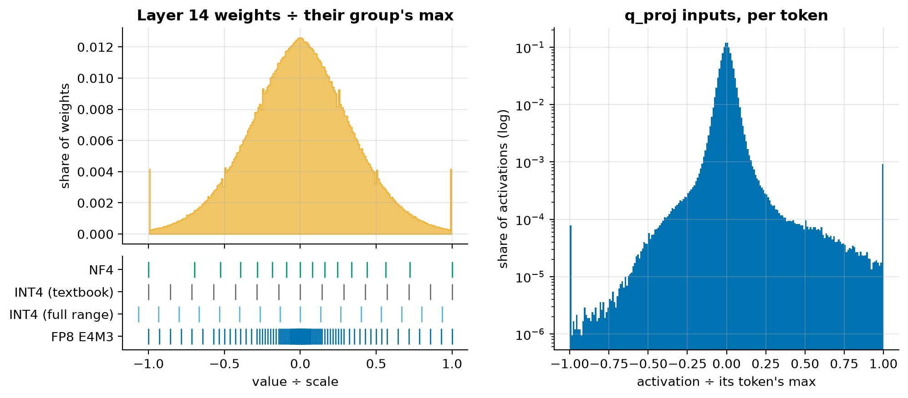
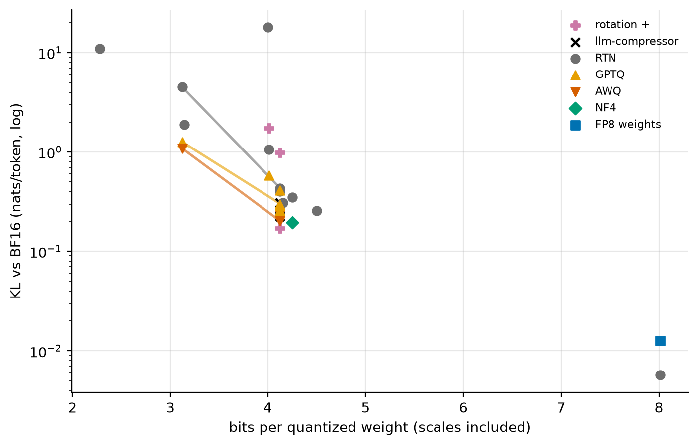
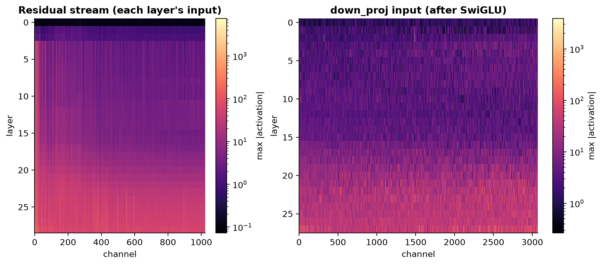
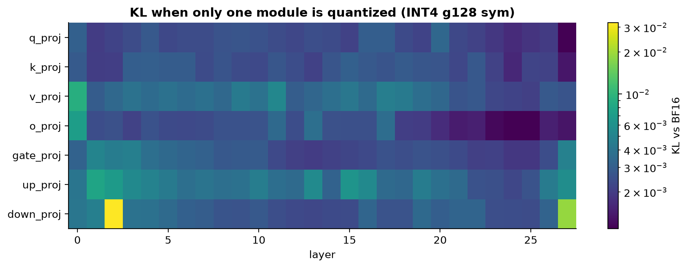
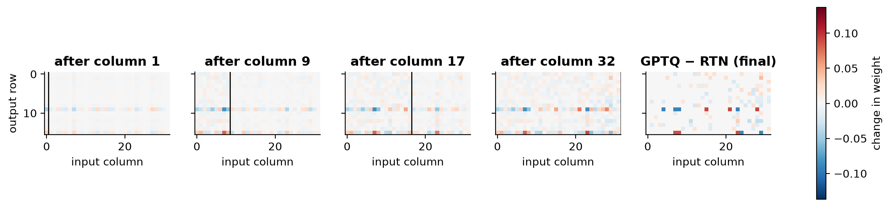
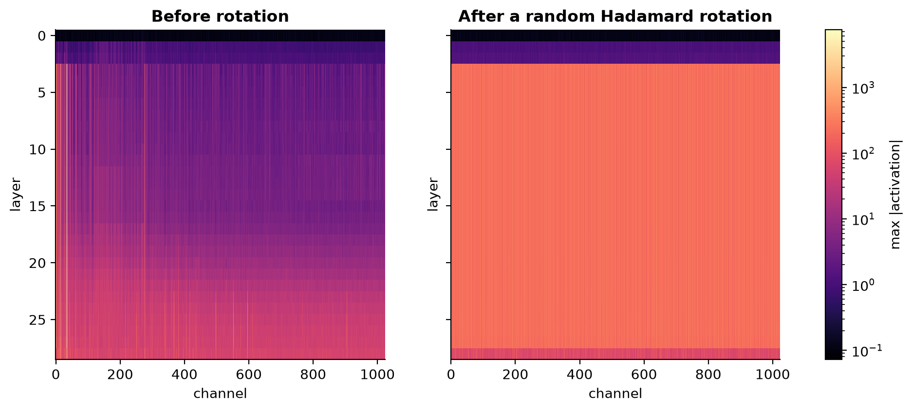
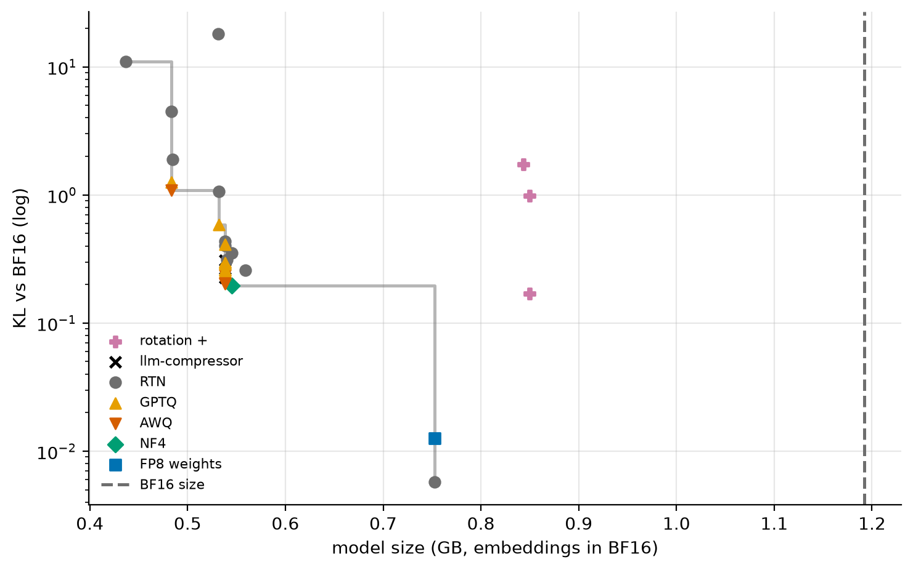

# M3: Quantization from scratch

M3 builds the main quantization methods ourselves, in plain PyTorch, and measures what each one costs in
quality on Qwen3-0.6B (and 1.7B): round-to-nearest, FP8 and NF4 formats, GPTQ, AWQ, Hadamard rotation, and W8A8
with SmoothQuant. Two library implementations (llm-compressor's GPTQ and AWQ) check that ours are right.

M3 is about **quality only**. Every method here is simulated ("fake quantization": round, then store the
rounded value back in BF16), which reproduces the exact error of low-bit storage but not its speed. Real low-bit
kernels, and what they buy, are M4.

## 1. Intuition

A weight is a number stored in 16 bits. Quantizing it means **snapping it to a coarse ruler**: 4 bits give 16
marks, and each group of weights gets its own ruler (a *scale*). The model then computes with the snapped values.

Three ideas carry the whole milestone:

1. **Every weight pays for its group's largest value.** The ruler has to reach the biggest weight in the group, so
   one outlier stretches the marks apart for everyone. Hence small groups (one ruler per 128 weights), and
   formats whose marks crowd where weights actually are (NF4, FP8).
2. **Only the output matters.** Rounding errors that cancel out in the layer's *output* are harmless. GPTQ uses
   this: after rounding one column of weights, it nudges the columns not yet rounded to compensate, guided by how
   the inputs correlate. AWQ uses it differently: it gives the weights that meet large inputs a finer ruler.
3. **Outliers can be moved, not just endured.** A few activation channels are 100–1000× larger than the rest.
   You can shift that difficulty into the weights (SmoothQuant), or rotate the whole space so no single channel
   stands out (Hadamard rotation). Neither changes what the model computes before rounding.

## 2. The math

### Grids

For b bits and a group of values x, with `qmax = 2^(b−1) − 1`:

```
symmetric     s = max|x| / qmax              q = clamp(round(x / s), −qmax − 1, qmax)      x̂ = s · q
asymmetric    s = (max − min) / (2^b − 1)    q = clamp(round(x / s) + z, 0, 2^b − 1)       x̂ = s · (q − z)
              z = round(−min / s)            (the integer that stands for a real 0)
```

- **Rounding error** is uniform in [−s/2, s/2], so its mean square is **s²/12**.
- **The textbook symmetric grid wastes a code.** INT4 has 16 codes (−8…7), but `s = max|x|/7` never uses −8.
  compressed-tensors (llm-compressor's format) uses `s = max|x| / 7.5` instead. Its step is 7% finer, and the
  largest positive value is clipped by half a step. We implement both (`full_range`).

**Granularity and storage.** Every group stores its scale in 16 bits (and, if asymmetric, a b-bit zero-point):

```
bits per weight = b + (16 + b·[asymmetric]) / (weights per scale)        INT4 g128 symmetric: 4.125
```

### Non-uniform formats

- **FP8** stores a sign, an exponent and a mantissa: `value = ±(1 + m/2^M) · 2^(e − bias)`. Each power of two
  holds the same number of points, so the *relative* error is about the same at any size. **E4M3** (M = 3, max
  448) is used for weights and activations; **E5M2** (M = 2, max 57,344) trades precision for range.
- **NF4** is a 16-value codebook at quantiles of a normal distribution (QLoRA). Weights are roughly bell-shaped,
  so each code covers about the same number of weights: every code is used equally often. (It isn't the
  codebook with the lowest squared error, which would be a Lloyd–Max quantizer, but it's close.)

### GPTQ, derived

**Objective.** Keep the layer's *outputs* on calibration inputs X [in, n] close, not the weights:

```
minimize ‖W X − Ŵ X‖²
```

Rows of W don't interact, so take one row w. Its error is a quadratic form in Δ = w − ŵ:

```
‖(w − ŵ) X‖² = Δ (X Xᵀ) Δᵀ = ½ · Δ H Δᵀ        with the Hessian  H = 2 X Xᵀ  [in, in]
```

H is the same for every row, and it only depends on the inputs. Its diagonal says how active each input is. Its
off-diagonals say which inputs move together.

**Rounding one weight, and compensating (Optimal Brain Surgeon).** Rounding weight q moves it by −e, where
e = w_q − ŵ_q. Let every weight not yet rounded (the set F, q included) move by δ, with δ_q = −e forced. The
smallest output error ½ δ H_F δᵀ under that one constraint (a Lagrange multiplier) is at

```
δ = − e / [H_F⁻¹]_qq · [H_F⁻¹]_q,F          (H_F: H restricted to F; check: δ_q = −e)
```

Weights whose inputs correlate with input q absorb most of its error. If H is diagonal (uncorrelated inputs),
[H⁻¹]_q,F is zero outside q and **GPTQ reduces to round-to-nearest**.

**Three tricks make this practical:**
1. **One order for every row.** Rounding columns left to right for all rows at once means every row uses the
   same sequence of H_F⁻¹: F shrinks by one column each step.
2. **Cholesky.** The rows [H_F⁻¹]_q,F for q = 1, 2, … are, up to a scale, exactly the rows of the upper Cholesky
   factor U of H⁻¹ (H⁻¹ = Uᵀ U). With d = U_qq, the update becomes `δ = −(e / d) · U_q,q:`. One factorization
   replaces an inverse per column.
3. **Lazy batches.** Updates inside a block of 128 columns are applied at once; the rest of W is updated once per
   block. Same arithmetic, far fewer passes over memory.

Plus **dampening** (add 1% of the mean diagonal to H so it's invertible), and **act-order** (process the most
active inputs first, while the most weights remain free to compensate). With act-order and groups, *static*
groups fix each group's grid from the original weights, so every group still maps to contiguous columns.

**Worked example** (4 inputs, 1 row, generated by `report/m3.py` from the actual `gptq_quantize`):

<!-- BEGIN GENERATED: m3_gptq_worked_example -->
Weights w = [+0.550, +0.550, -0.400, +1.200], grid INT3 per-channel sym (step 0.40).

H = 2 XᵀX / n from six input samples; inputs 0 and 1 move together, 2 and 3 in opposite directions:

```
[+1.047, +0.990, -0.253, +0.267]
[+0.990, +0.951, -0.195, +0.210]
[-0.253, -0.195, +0.893, -0.927]
[+0.267, +0.210, -0.927, +0.980]
```

| Step | Column rounded | Its rounding error | Weights after the update |
|---|---|---|---|
| 1 | 0 | +0.150 | [+0.400, +0.705, -0.443, +1.167] |
| 2 | 1 | -0.095 | [+0.400, +0.800, -0.463, +1.128] |
| 3 | 2 | -0.063 | [+0.400, +0.800, -0.400, +1.187] |
| 4 | 3 | -0.013 | [+0.400, +0.800, -0.400, +1.200] |

- RTN: [+0.400, +0.400, -0.400, +1.200], output error ½ΔHΔᵀ = 0.0447
- GPTQ: [+0.400, +0.800, -0.400, +1.200], output error 0.0044 (10.3× smaller)
<!-- END GENERATED: m3_gptq_worked_example -->

### AWQ

For any per-channel s > 0, `x Wᵀ = (x / s)(W · s)ᵀ` exactly. The division is folded into whatever produced x (an
RMSNorm's γ, or the previous linear's output rows), so it's free. Scaling up the weights that read large
activations gives them a finer effective grid:

```
s = x̄^α / w̄^(1−α)         x̄: mean |activation| per channel, w̄: mean |weight| per channel (relative to its group)
α* = argmin_α ‖ parent(Q(W · s) / s) − parent(W) ‖²      "parent": the attention block, the MLP, or the linear
```

### SmoothQuant

For W8A8 the *activations* are the problem, so move range from activations to weights with the same identity:

```
s_j = max|x_j|^α / max|W_j|^(1−α)          α = 0.5 splits each channel's difficulty evenly
```

### Rotation

For an orthogonal R (R Rᵀ = I): `x Wᵀ = (x R)(W R)ᵀ`. Rotating the residual stream mixes every channel into every
other, so a single huge channel becomes many moderate ones. It can be applied to the whole residual stream once
RMSNorm's per-channel γ is folded into the next linears, because `RMS(x R) = RMS(x)`. The LM head then needs its own
copy of the embedding (see `quant/rotation.py`).

## 3. Setup

- **Models:** Qwen3-0.6B and Qwen3-1.7B, BF16, in nanoserve (bit-exact with Hugging Face, M1).
- **What gets quantized:** the seven linear layers of every decoder layer. Embeddings and the LM head stay in BF16,
  as production recipes do. Qwen3 ties them, so quantizing the head would quantize the embedding too. For
  Qwen3-0.6B the embedding is a quarter of all weights, which caps how small the model can get.
- **Quality:** KL divergence from BF16 per token (teacher-forced), top-1 agreement and perplexity, on the same
  WikiText-2 test windows as M2 (`quality/perplexity.py`).
- **Calibration:** 128 sequences of 2,048 tokens of C4, the standard GPTQ/AWQ calibration set
  (`quality/text.py`). The calibration study swaps in WikiText (train), code, math and German.
- **Library check:** llm-compressor 0.14.0 quantizes the same model with the same calibration tokens. Its
  installed defaults, read from the source before writing the comparison:
  - GPTQ: act-order "static", block 128, dampening 0.01, and the full-range INT4 grid (`s = max|w| / 7.5`)
  - AWQ: duo scaling, a 20-point grid, the loss on each parent module's output, and no clipping

## 4. Prediction (written before quantizing a real model)

| Quantity | Prediction | Reasoning |
|---|---|---|
| BF16 perplexity in nanoserve | **19.3–19.8** | Same windows as M2's Hugging Face run, and nanoserve matches HF bit for bit (M1). Only attention kernels differ. |
| KL, RTN INT8 per-channel | **5e-5–2e-3** | Step = row max / 127: about 1% of a typical weight. Errors this small barely move the output distribution. |
| KL, RTN INT4 g128 | **0.05–0.25** | Step ≈ group max / 7: about 10% of a typical weight. Small models are fragile: published 4-bit perplexity increases for sub-1B models are 10–25%, i.e. ~0.1–0.2 nats. |
| INT4 per-channel / g128 | **1.5–10×** | A row spans 1,024+ inputs, and its max is set by the rare columns that read outlier channels. Groups of 128 contain the damage. |
| KL, RTN INT3 g128 | **0.25–2** | The step doubles, so squared error ×4, and 3-bit results in the literature degrade much faster than that. |
| KL, RTN INT2 g64 asymmetric | **2–12** | Four levels per group: the model stops being a language model. KL approaches the gap between its distribution and near-noise. |
| INT4 full-range / textbook grid | **0.8–1.0×** | A 7% finer step (squared error −13%) minus a little clipping at the positive extreme. |
| NF4 / INT4 at block 64 | **0.5–0.95×** | NF4 uses all 16 codes and places them where normal weights are dense. |
| KL, FP8 E4M3 weights | **5e-4–1e-2** | 3 mantissa bits: ~2% relative error per weight, about twice INT8 per-channel's, and far below INT4's. |
| GPTQ / RTN at INT4 g128 | **0.35–0.85×** | Error compensation on correlated inputs. For 4-bit g128 on larger models, GPTQ removes roughly half of RTN's perplexity increase. |
| AWQ / RTN at INT4 g128 | **0.4–0.9×** | Similar gains to GPTQ at 4 bits in the AWQ paper, from protecting the channels that meet large activations. |
| Our GPTQ / llm-compressor's | **0.85–1.15×** | Same algorithm, calibration tokens and grid. Differences: accumulation order and dtype details. |
| Our AWQ / llm-compressor's | **0.8–1.25×** | Same scale formula and loss, but our α search runs on a subset of the calibration sequences. |
| Rotated / plain RTN INT4 per-channel | **0.15–0.7×** | Rotation spreads outlier columns over every column, so row maxima stop being set by a few extreme weights. Only the residual-stream side is rotated here. |
| KL, W8A8 FP8 per-token | **2e-3–3e-2** | FP8 weights (above) plus FP8 activations at a similar relative error. |
| KL, W8A8 INT8 static per-tensor | **0.5–10** | One activation scale must cover channels 100–1000× larger than typical, so ordinary values round to a handful of levels. |
| SmoothQuant / plain INT8 static | **0.02–0.5×** | α = 0.5 takes the square root of each channel's range: a 1,000× outlier becomes ~30×. |
| Outlier ratio in the residual stream | **100–10,000×** | "Massive activations": a few channels in the residual stream reach thousands, while typical channels stay near 1. |
| down_proj's share of single-module INT4 KL | **25–60%** | Its input (after SwiGLU) has the largest outliers, and it writes straight into the residual stream. 7 module types → 14% if uniform. |
| First two + last layers' share | **15–60%** | Edge layers set up and read out the residual stream (and host the massive activations). 3 of 28 layers → 11% if uniform. |
| GPTQ with 8 / 128 calibration sequences | **1.0–1.4×** | H needs enough tokens to be well estimated. Past a few thousand tokens per 1,024-dim input, returns flatten. |
| GPTQ calibrated on code / on C4 | **1.0–1.4×** | Code has different activation statistics than the prose we evaluate on. GPTQ is known to be fairly robust to this. |
| GPTQ calibrated on WikiText / on C4 | **0.8–1.0×** | Calibrating on the evaluation's own domain can only help, a little. |
| Qwen3-1.7B / 0.6B, RTN INT4 g128 | **0.3–0.9×** | Bigger models have more redundancy and quantize more gracefully. |

## 5. Result

### Prediction vs measurement

<!-- BEGIN GENERATED: m3_predictions -->
*Predictions written in commit `16766ba`, before the first measurement.*

| Quantity | Predicted | Measured | Verdict |
|---|---|---|---|
| BF16 perplexity in nanoserve (vs Hugging Face in M2) | 19.3 – 19.8 | 19.6 | within range |
| KL, RTN INT8 per-channel | 5e-05 – 0.002 | 0.00572 | above range |
| KL, RTN INT4 g128 | 0.05 – 0.25 | 0.434 | above range |
| KL ratio, RTN INT4 per-channel / g128 (x) | 1.5 – 10 | 2.45 | within range |
| KL, RTN INT3 g128 | 0.25 – 2 | 4.5 | above range |
| KL, RTN INT2 g64 asymmetric | 2 – 12 | 11 | within range |
| KL ratio, INT4 g128 full-range / textbook grid (x) | 0.8 – 1 | 0.926 | within range |
| KL ratio, NF4 / INT4 at block 64 (x) | 0.5 – 0.95 | 0.553 | within range |
| KL, FP8 E4M3 weights per-channel | 0.0005 – 0.01 | 0.0126 | above range |
| KL ratio, GPTQ / RTN at INT4 g128 (x) | 0.35 – 0.85 | 0.753 | within range |
| KL ratio, AWQ / RTN at INT4 g128 (x) | 0.4 – 0.9 | 0.586 | within range |
| KL ratio, our GPTQ / llm-compressor's (x) | 0.85 – 1.15 | 0.978 | within range |
| KL ratio, our AWQ / llm-compressor's (x) | 0.8 – 1.25 | 1.04 | within range |
| KL ratio, rotated / plain RTN INT4 per-channel (x) | 0.15 – 0.7 | 1.63 | above range |
| KL, W8A8 FP8 with per-token activations | 0.002 – 0.03 | 0.0205 | within range |
| KL, W8A8 INT8 with a static per-tensor activation scale | 0.5 – 10 | 1.11 | within range |
| KL ratio, SmoothQuant / plain W8A8 INT8 static per-tensor (x) | 0.02 – 0.5 | 0.297 | within range |
| Largest / median channel max in the residual stream (x) | 100 – 10,000 | 1,295 | within range |
| Share of single-module INT4 KL from down_proj (%) | 25 – 60 | 20.3 | below range |
| Share of single-module INT4 KL from the first two and last layers (%) | 15 – 60 | 15.2 | within range |
| KL ratio, GPTQ calibrated on 8 / 128 sequences (x) | 1 – 1.4 | 0.983 | below range |
| KL ratio, GPTQ calibrated on code / on C4 (x) | 1 – 1.4 | 1.36 | within range |
| KL ratio, GPTQ calibrated on WikiText / on C4 (x) | 0.8 – 1 | 0.823 | within range |
| KL ratio, RTN INT4 g128 on Qwen3-1.7B / 0.6B (x) | 0.3 – 0.9 | 0.781 | within range |
<!-- END GENERATED: m3_predictions -->

### Grids and formats (no calibration)

<!-- BEGIN GENERATED: m3_grids -->
| Configuration | Bits per weight | Model (GB) | KL vs BF16 | Top-1 agreement | Perplexity | KL vs RTN INT4 g128 |
|---|---|---|---|---|---|---|
| BF16 (reference) | 16.00 | 1.19 | 0.000 | 100.0% | 19.56 (+0.0%) | 0.00× |
| RTN INT8 per-channel | 8.01 | 0.75 | 5.72e-03 | 96.1% | 19.65 (+0.5%) | 0.01× |
| RTN INT4 per-tensor | 4.00 | 0.53 | 17.992 | 0.0% | 4.88e+08 (×2.49e+07) | 41.43× |
| RTN INT4 per-channel | 4.01 | 0.53 | 1.062 | 54.6% | 44.65 (×2.28) | 2.45× |
| RTN INT4 g128 | 4.12 | 0.54 | 0.434 | 68.9% | 27.28 (+39.5%) | 1.00× |
| RTN INT4 g64 | 4.25 | 0.55 | 0.352 | 71.3% | 25.46 (+30.2%) | 0.81× |
| RTN INT4 g32 | 4.50 | 0.56 | 0.257 | 75.6% | 23.31 (+19.2%) | 0.59× |
| RTN INT4 g128, asymmetric | 4.16 | 0.54 | 0.311 | 73.4% | 23.75 (+21.4%) | 0.72× |
| RTN INT4 g128, full range | 4.12 | 0.54 | 0.402 | 69.5% | 26.98 (+37.9%) | 0.93× |
| RTN INT3 g128 | 3.12 | 0.48 | 4.500 | 13.6% | 1.12e+03 (×57.5) | 10.36× |
| RTN INT3 g128, asymmetric | 3.15 | 0.48 | 1.888 | 42.9% | 92.68 (×4.74) | 4.35× |
| RTN INT2 g64, asymmetric | 2.28 | 0.44 | 11.014 | 0.5% | 6.59e+05 (×3.37e+04) | 25.36× |
| NF4, blocks of 64 | 4.25 | 0.55 | 0.195 | 78.6% | 22.13 (+13.1%) | 0.45× |
| FP8 E4M3 weights, per-channel | 8.01 | 0.75 | 0.013 | 94.3% | 19.71 (+0.8%) | 0.03× |
<!-- END GENERATED: m3_grids -->


<!-- BEGIN GENERATED: caption-m3_grids -->
*55% of weights sit within a quarter of their group's max from zero: NF4 puts 6 of its 16 levels there, uniform INT4 only 3; activations are harsher, with a token's typical value 43× below its max.*
<!-- END GENERATED: caption-m3_grids -->

- **Granularity is the first lever.** Per-tensor INT4 destroys the model and per-channel INT4 is poor. Every
  halving of the group size helps.
- **Asymmetric grids help a lot on this model.** Its weight groups are skewed, so a symmetric grid wastes levels
  on the empty side. The gap is widest at 3 bits.
- **NF4 beats uniform INT4** at the same block size, because its levels sit where the weights are.
- **8 bits is nearly free** for weights alone, in either format.


<!-- BEGIN GENERATED: caption-m3_error_vs_bits -->
*Going from 4 to 3 bits multiplies round-to-nearest's KL by 10×; at 4 bits GPTQ keeps 75% of it on the same grid.*
<!-- END GENERATED: caption-m3_error_vs_bits -->

### Where the outliers live


<!-- BEGIN GENERATED: caption-m3_outlier_atlas -->
*A handful of residual channels (35, 13, 1) reach 1,295× the median channel's maximum; down_proj's input peaks at 629× its median.*
<!-- END GENERATED: caption-m3_outlier_atlas -->

The residual stream jumps at layer 3's input, which is the output of layer 2. A few channels become "massive"
there and stay massive to the end. Most of the brightest spots in down_proj's input are in layer 2 (the rest
in the last layer): layer 2's MLP writes those channels. Quantizing one module at a time shows what this means
for quality:


<!-- BEGIN GENERATED: caption-m3_sensitivity -->
*The single most fragile module is layer 2's down_proj; summed over layers, down_proj accounts for 20% of the damage.*
<!-- END GENERATED: caption-m3_sensitivity -->

<!-- BEGIN GENERATED: m3_sensitivity -->
| Module type | Summed KL (INT4 g128 sym, one module at a time) | Share |
|---|---|---|
| down_proj | 0.129 | 20% |
| up_proj | 0.120 | 19% |
| v_proj | 0.102 | 16% |
| gate_proj | 0.080 | 13% |
| k_proj | 0.070 | 11% |
| o_proj | 0.067 | 11% |
| q_proj | 0.066 | 10% |

Most sensitive single modules: layer 2 down_proj (0.032), layer 27 down_proj (0.019), layer 0 v_proj (9.09e-03), layer 1 up_proj (7.89e-03), layer 0 o_proj (7.19e-03).
<!-- END GENERATED: m3_sensitivity -->

### Calibrated methods, and the library check

<!-- BEGIN GENERATED: m3_calibrated -->
| Configuration | Bits per weight | Model (GB) | KL vs BF16 | Top-1 agreement | Perplexity | KL vs RTN INT4 g128, full range |
|---|---|---|---|---|---|---|
| RTN INT4 g128, full range | 4.12 | 0.54 | 0.402 | 69.5% | 26.98 (+37.9%) | 1.00× |
| GPTQ INT4 g128, full range | 4.12 | 0.54 | 0.303 | 74.3% | 25.20 (+28.8%) | 0.75× |
| GPTQ INT4 g128, full range, true-sequential | 4.12 | 0.54 | 0.296 | 74.6% | 24.65 (+26.0%) | 0.74× |
| llm-compressor GPTQ INT4 g128, full range | 4.12 | 0.54 | 0.309 | 74.0% | 25.42 (+30.0%) | 0.77× |
| AWQ INT4 g128, full range (duo scaling) | 4.12 | 0.54 | 0.236 | 77.1% | 22.81 (+16.6%) | 0.59× |
| AWQ INT4 g128, full range (duo scaling, clip search) | 4.12 | 0.54 | 0.203 | 78.8% | 23.41 (+19.7%) | 0.51× |
| AWQ INT4 g128, full range (paper scaling, clip search) | 4.12 | 0.54 | 0.206 | 78.4% | 23.48 (+20.0%) | 0.51× |
| llm-compressor AWQ INT4 g128, full range | 4.12 | 0.54 | 0.226 | 77.4% | 22.54 (+15.2%) | 0.56× |
| RTN INT4 per-channel | 4.01 | 0.53 | 1.062 | 54.6% | 44.65 (×2.28) | 2.64× |
| GPTQ INT4 per-channel, full range | 4.01 | 0.53 | 0.586 | 66.5% | 33.44 (+71.0%) | 1.46× |
| RTN INT3 g128 | 3.12 | 0.48 | 4.500 | 13.6% | 1.12e+03 (×57.5) | 11.19× |
| GPTQ INT3 g128, full range | 3.12 | 0.48 | 1.262 | 54.0% | 60.42 (×3.09) | 3.14× |
| AWQ INT3 g128, full range (duo scaling, clip search) | 3.12 | 0.48 | 1.087 | 54.2% | 53.20 (×2.72) | 2.70× |
<!-- END GENERATED: m3_calibrated -->

- **Our GPTQ and AWQ match llm-compressor's** within a few percent of KL, on the same grid and calibration
  tokens. That validates both reference implementations.
- **AWQ beats GPTQ at 4 bits on this model,** and clipping helps it further.
- **GPTQ helps most where RTN is worst:** the per-channel and 3-bit grids.
- **"True sequential" GPTQ** (re-measuring each sublayer after the previous one is quantized) barely changes the
  result.


<!-- BEGIN GENERATED: caption-m3_gptq_motion -->
*On a 16×32 slice of layer 1's q_proj (INT3 per-channel sym), each rounded column's error is pushed onto the columns to its right; the output error ends 3.7× lower than round-to-nearest's.*
<!-- END GENERATED: caption-m3_gptq_motion -->

An interactive version, one frame per column, is in
[`results/figures/m3_gptq_motion.html`](../../results/figures/m3_gptq_motion.html).

### Rotation


<!-- BEGIN GENERATED: caption-m3_rotation -->
*Rotating the residual stream spreads its outlier channels over all channels: the largest channel maximum drops from 1,295× to 1.3× the median.*
<!-- END GENERATED: caption-m3_rotation -->

<!-- BEGIN GENERATED: m3_rotation -->
| Configuration | Bits per weight | Model (GB) | KL vs BF16 | Top-1 agreement | Perplexity |
|---|---|---|---|---|---|
| RTN INT4 per-channel | 4.01 | 0.53 | 1.062 | 54.6% | 44.65 (×2.28) |
| rotated, RTN INT4 per-channel | 4.01 | 0.84 | 1.735 | 45.5% | 98.83 (×5.05) |
| RTN INT4 g128 | 4.12 | 0.54 | 0.434 | 68.9% | 27.28 (+39.5%) |
| rotated, RTN INT4 g128 | 4.12 | 0.85 | 0.984 | 58.4% | 46.45 (×2.37) |
| GPTQ INT4 g128, full range | 4.12 | 0.54 | 0.303 | 74.3% | 25.20 (+28.8%) |
| rotated, GPTQ INT4 g128, full range | 4.12 | 0.85 | 0.171 | 80.3% | 22.72 (+16.2%) |
| W8A8 INT8, static per-tensor activations | 8.01 | 0.75 | 1.105 | 54.6% | 48.94 (×2.5) |
| rotated, W8A8 INT8, static per-tensor activations | 8.01 | 1.06 | 0.853 | 58.7% | 37.08 (+89.5%) |
<!-- END GENERATED: m3_rotation -->

Rotation flattened the activations as intended. Yet it made round-to-nearest *worse* and GPTQ *better*. A
second, small run separated the pieces. (The rotated models are larger because they also pay for an untied LM
head.)

<!-- BEGIN GENERATED: m3_rotation_diagnosis -->
| Configuration | Bits per weight | Model (GB) | KL vs BF16 | Top-1 agreement | Perplexity |
|---|---|---|---|---|---|
| RTN INT4 g128 | 4.12 | 0.54 | 0.434 | 68.9% | 27.28 (+39.5%) |
| BF16, γ folded | 16.00 | 1.19 | 2.00e-03 | 97.7% | 19.56 (-0.0%) |
| BF16, rotated | 16.00 | 1.50 | 2.86e-03 | 97.2% | 19.66 (+0.5%) |
| BF16, rotated, FP32 copy | 16.00 | 1.50 | 1.19e-03 | 97.6% | 19.55 (-0.1%) |
| γ folded, RTN INT4 g128 | 4.12 | 0.54 | 1.291 | 49.0% | 52.59 (×2.69) |
| rotated, RTN INT4 g128, FP32 copy | 4.12 | 0.85 | 0.965 | 59.0% | 46.06 (×2.35) |
| rotated, RTN INT4 g128 | 4.12 | 0.85 | 0.984 | 58.4% | 46.45 (×2.37) |
<!-- END GENERATED: m3_rotation_diagnosis -->

### Weights and activations (W8A8)

<!-- BEGIN GENERATED: m3_w8a8 -->
| Configuration | Bits per weight | Model (GB) | KL vs BF16 | Top-1 agreement | Perplexity | KL vs W8A8 INT8, static per-tensor activations |
|---|---|---|---|---|---|---|
| W8A8 FP8, static per-tensor activations | 8.01 | 0.75 | 0.022 | 92.5% | 19.82 (+1.3%) | 0.02× |
| W8A8 FP8, dynamic per-tensor activations | 8.01 | 0.75 | 0.022 | 92.4% | 19.80 (+1.2%) | 0.02× |
| W8A8 FP8, dynamic per-token activations | 8.01 | 0.75 | 0.021 | 92.7% | 19.83 (+1.4%) | 0.02× |
| W8A8 INT8, static per-tensor activations | 8.01 | 0.75 | 1.105 | 54.6% | 48.94 (×2.5) | 1.00× |
| W8A8 INT8, dynamic per-token activations | 8.01 | 0.75 | 0.032 | 90.8% | 19.89 (+1.7%) | 0.03× |
| SmoothQuant + W8A8 INT8, static per-tensor activations | 8.01 | 0.75 | 0.328 | 73.5% | 24.80 (+26.8%) | 0.30× |
| SmoothQuant + W8A8 INT8, dynamic per-token activations | 8.01 | 0.75 | 0.015 | 93.6% | 19.72 (+0.8%) | 0.01× |
<!-- END GENERATED: m3_w8a8 -->

- **FP8 doesn't care how its activation scale is chosen.** Static per-tensor, dynamic per-tensor and per-token
  scales land within a hair of each other: the logarithmic grid keeps small values precise under a large scale.
- **INT8 does care:**
  - one static scale per tensor breaks the model
  - per-token scales fix most of the damage
  - SmoothQuant fixes more

  SmoothQuant with per-token INT8 is the best 8-bit configuration measured.

### Calibration data

<!-- BEGIN GENERATED: m3_calibration -->
| Configuration | Bits per weight | Model (GB) | KL vs BF16 | Top-1 agreement | Perplexity | KL vs GPTQ INT4 g128, full range |
|---|---|---|---|---|---|---|
| GPTQ INT4 g128, full range | 4.12 | 0.54 | 0.303 | 74.3% | 25.20 (+28.8%) | 1.00× |
| GPTQ INT4 g128, full range, calibrated on c4 × 8 | 4.12 | 0.54 | 0.298 | 74.7% | 24.87 (+27.1%) | 0.98× |
| GPTQ INT4 g128, full range, calibrated on c4 × 32 | 4.12 | 0.54 | 0.290 | 74.8% | 24.51 (+25.3%) | 0.96× |
| GPTQ INT4 g128, full range, calibrated on wikitext | 4.12 | 0.54 | 0.249 | 76.6% | 24.40 (+24.7%) | 0.82× |
| GPTQ INT4 g128, full range, calibrated on code | 4.12 | 0.54 | 0.411 | 70.5% | 27.32 (+39.7%) | 1.36× |
| GPTQ INT4 g128, full range, calibrated on math | 4.12 | 0.54 | 0.258 | 76.3% | 24.35 (+24.5%) | 0.85× |
| GPTQ INT4 g128, full range, calibrated on german | 4.12 | 0.54 | 0.261 | 75.8% | 23.73 (+21.3%) | 0.86× |
<!-- END GENERATED: m3_calibration -->

### Model size

<!-- BEGIN GENERATED: m3_model_size -->
| Configuration | 0.6B perplexity | 0.6B KL | 1.7B perplexity | 1.7B KL | KL, 1.7B / 0.6B |
|---|---|---|---|---|---|
| BF16 (reference) | 19.56 → 19.56 | 0.000 | 15.59 → 15.59 | 0.000 | — |
| RTN INT8 per-channel | 19.56 → 19.65 | 5.72e-03 | 15.59 → 15.32 | 5.87e-03 | 1.03× |
| RTN INT4 g128 | 19.56 → 27.28 | 0.434 | 15.59 → 20.20 | 0.339 | 0.78× |
| RTN INT4 g128, full range | 19.56 → 26.98 | 0.402 | 15.59 → 20.66 | 0.323 | 0.80× |
| GPTQ INT4 g128, full range | 19.56 → 25.20 | 0.303 | 15.59 → 17.56 | 0.167 | 0.55× |
| AWQ INT4 g128, full range (duo scaling) | 19.56 → 22.81 | 0.236 | 15.59 → 17.92 | 0.197 | 0.84× |
| W8A8 FP8, dynamic per-token activations | 19.56 → 19.83 | 0.021 | 15.59 → 15.68 | 0.020 | 0.97× |
| SmoothQuant + W8A8 INT8, static per-tensor activations | 19.56 → 24.80 | 0.328 | 15.59 → 17.77 | 0.356 | 1.09× |
<!-- END GENERATED: m3_model_size -->

The larger model loses less at 4 bits, and GPTQ helps it more. One row shows why this project measures KL
rather than trusting perplexity alone. INT8 *lowers* Qwen3-1.7B's perplexity below BF16's, yet its KL is as large
as the 0.6B's. The model changed, and happened to change in a direction this text rewards.


<!-- BEGIN GENERATED: caption-m3_pareto -->
*At about 4 bits per weight the method decides the damage, from KL 18 (RTN INT4 per-tensor) down to 0.171 (rotated, GPTQ INT4 g128, full range); the smallest configuration still weighs 0.44 GB, mostly its BF16 embedding.*
<!-- END GENERATED: caption-m3_pareto -->

### Explaining every gap

Most predictions landed in range. The misses, in order of what they teach:

1. **Round-to-nearest hurt more than predicted at every width** (INT8, FP8, INT4 and INT3). My ranges came from
   larger models, but this one has **massive activations**. Residual channels reach over a thousand times the
   median, and down_proj inputs hundreds of times (the atlas). A linear layer's output error is Σ x_j Δw_j, so a
   column that reads a 1,000× channel turns an ordinary rounding error into a 1,000× output error. Three
   measurements back this up:
   - AWQ, which exists to protect exactly those columns, beats GPTQ here.
   - The most fragile single module is layer 2's down_proj. Its input holds the brightest outliers, and it
     writes the massive channels.
   - Asymmetric grids help far more than they do on typical weights, a sign of skewed groups.
2. **Rotation made round-to-nearest worse, not better.** The diagnosis pins the damage on the step before the
   rotation:
   - **Folding is required.** A rotation only commutes with RMSNorm once each norm's per-channel γ is folded
     into the next weights.
   - **This model's γ is very uneven:** up to 61× between the largest and the median channel, in the last
     layer's post-attention norm.
   - **Folding alone plants those as outlier *columns*,** and makes RTN three times worse.
   - **The rotation then spreads them** over every group. That helps, but not back to plain RTN's level.
   - **BF16 rounding isn't the cause:** rounding the rotated weights costs almost nothing.

   GPTQ's compensation absorbs the folded columns, while the flattened activations remain. So **rotation + GPTQ
   is the best INT4 result measured**, which is why QuaRot and SpinQuant pair rotation with GPTQ. *Lesson: a
   rotation removes activation outliers, but its folding step can create weight outliers.*
3. **down_proj's summed share is below range,** though down_proj *is* the most damaging module type. The damage
   is spread widely over module types, while the two worst *single* modules are both down_projs (layers 2 and
   27). Summing over layers diluted a concentrated effect; the per-module map is the better view.
4. **8 calibration sequences were as good as 128.** With 16k tokens, the Hessian of a 1,024- to 3,072-wide input
   is already well estimated. What matters is the *domain*. Calibrating on code makes GPTQ no better than RTN on
   prose, while WikiText (the evaluation's own domain), math and German all help.

**The big lessons of M3:**
- **At 4 bits, the method decides the quality.** At the same storage cost, KL spans two orders of magnitude.
  Rotation + GPTQ, AWQ with clipping, and NF4 are the best INT4 options measured, and all of them are still far
  from lossless on a 0.6B model.
- **8-bit is nearly free** in every format that handles activations sensibly: FP8, or INT8 with per-token
  scales.
- **The BF16 embedding caps compression:** even INT2 leaves most of a 0.44 GB model.
- **For M4:** 4-bit weights should pay off in speed at low batch, where the weights are most of the bytes (M2).
  The question is whether that speed is worth this much quality.

## 6. Check your understanding

1. Why does quantizing in groups of 128 make 4 bits viable, and what does it cost in bits?
   <details><summary>Answer</summary>Each group's scale only has to reach its own largest weight, so an outlier
   stretches the step for 127 neighbours instead of a whole row. Each group stores a 16-bit scale: 16 / 128 =
   0.125 extra bits per weight (more with a zero-point).</details>
2. GPTQ rounds each weight to the nearest grid point, like RTN. So where does its advantage come from?
   <details><summary>Answer</summary>From the weights it hasn't rounded yet. After rounding one column, it moves
   the remaining columns to cancel that column's error in the layer's output, weighted by how the inputs
   correlate (H⁻¹). Those moved weights are then rounded from their new values. With uncorrelated inputs there is
   nothing to cancel, and GPTQ equals RTN.</details>
3. Why does a Hadamard rotation remove outliers without changing the model's output?
   <details><summary>Answer</summary>It's orthogonal: x Wᵀ = (x R)(W R)ᵀ, so rotating inputs and weights
   together changes nothing. But x R mixes all channels, so one huge channel becomes many moderate ones, and
   grids fit better. RMSNorm's γ has to be folded into the next weights first, because only the pure RMS
   normalization commutes with a rotation.</details>
4. Why does INT8 per-tensor activation quantization fail on Qwen3 while FP8 per-tensor mostly survives?
   <details><summary>Answer</summary>INT8's 256 evenly spaced levels must span the largest outlier, so ordinary
   activations, hundreds of times smaller, land on a few levels near zero. FP8's levels are spaced
   logarithmically: small values still get fine steps, with about the same *relative* error as large
   ones.</details>
5. AWQ scales channels up; SmoothQuant scales them down. How can both be right?
   <details><summary>Answer</summary>They solve different problems with the same identity x Wᵀ = (x/s)(W·s)ᵀ. AWQ
   quantizes only weights: it scales up the weights that meet large activations, so their rounding error shrinks
   relative to their size. SmoothQuant quantizes activations too: it scales down the outlier activation
   channels so one scale can fit them, and the weights absorb the range.</details>

## 7. Further reading

- Frantar et al., *GPTQ: Accurate Post-Training Quantization for Generative Pre-trained Transformers*, 2022.
- Hassibi & Stork, *Second order derivatives for network pruning: Optimal Brain Surgeon*, 1993.
- Lin et al., *AWQ: Activation-aware Weight Quantization for LLM Compression and Acceleration*, 2023.
- Xiao et al., *SmoothQuant: Accurate and Efficient Post-Training Quantization for LLMs*, 2022.
- Dettmers et al., *QLoRA* (NF4), 2023; *LLM.int8()* (outlier features), 2022.
- Ashkboos et al., *QuaRot*, 2024; Liu et al., *SpinQuant*, 2024.
- Sun et al., *Massive Activations in Large Language Models*, 2024.
- Micikevicius et al., *FP8 Formats for Deep Learning*, 2022.
