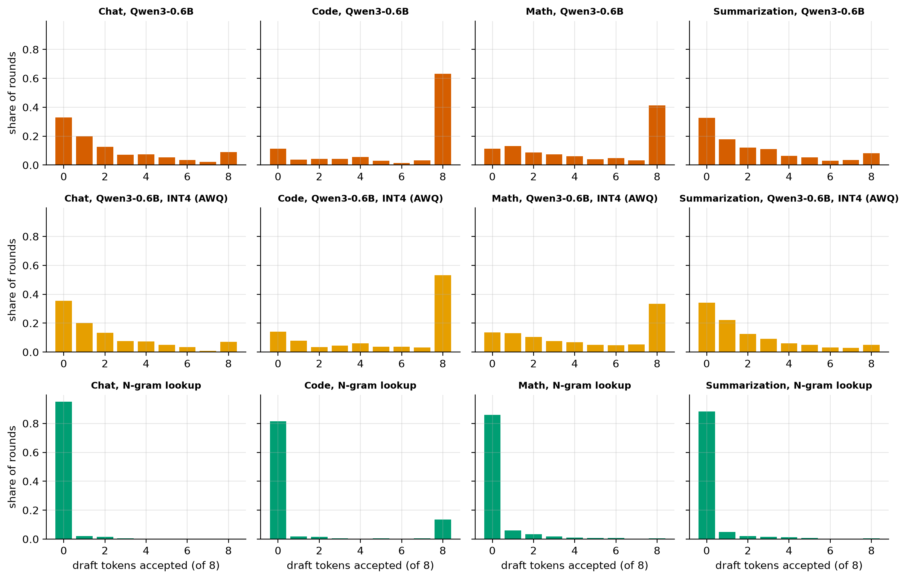
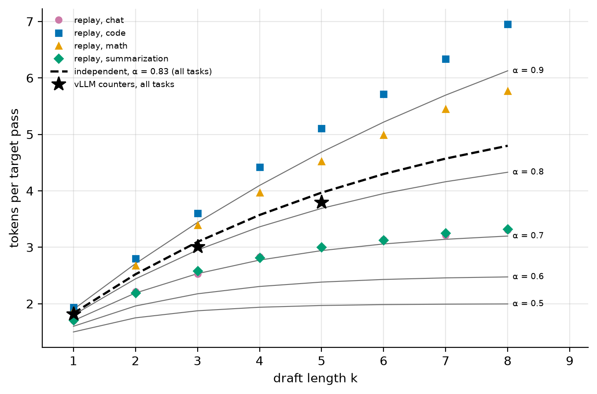
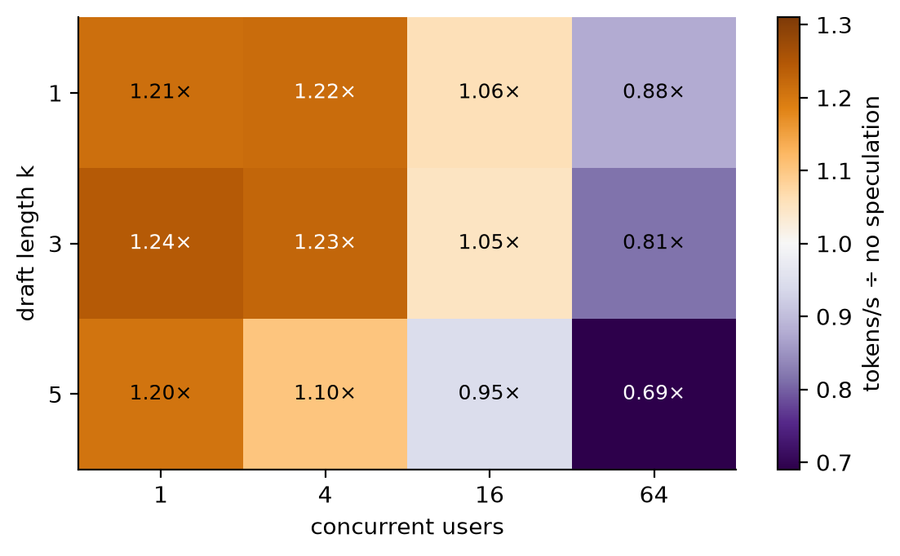

# M6: Speculative decoding

M4 and M5 moved fewer bytes per token. M6 uses the second lever: **more tokens per byte moved**. A decode step
streams the whole model to produce one token. Speculative decoding makes that one pass check several guessed
tokens at once, and keeps the ones the model itself would have produced.

Two claims are tested here:
1. **It is lossless.** The output has exactly the distribution the target model alone would give. This is
   proved, then tested statistically.
2. **It only pays when there is slack.** A lightly loaded GPU has spare compute during every memory-bound
   step. A busy GPU doesn't, and speculation then costs more than it gives.

## 1. Intuition

**The waiter and the chef.** A chef (the target model) can only confirm one dish at a time, and each
confirmation means a walk to the pantry (streaming the weights). A waiter (the drafter) who knows the menu
guesses the next few orders. The chef checks all the guesses in one walk. Every correct guess saves a walk; a
wrong guess wastes nothing but the waiter's effort, because the chef says what it should have been.

**Why checking k tokens costs about one step.** At batch 1 a decode step is memory-bound (M1): its time is the
time to stream the weights. Feeding k + 1 tokens through that same pass reads the weights once, as before.
The extra math fits in compute the GPU wasn't using.

**Why nothing is lost.** With greedy decoding it's obvious: a guessed token is kept only if it is the token
the target would pick. With sampling it takes a rule (section 2): accept a guess with probability
min(1, p/q), otherwise resample from what the drafter under-represented. The guesses change *when* tokens are
computed, never *which* tokens are likely.

**Drafters**, from most to least expensive:
- **A smaller model** (Qwen3-0.6B for Qwen3-1.7B): good guesses, but each guessed token costs a small-model
  step.
- **A head on the target's own features** (EAGLE): one extra layer reusing the target's last hidden state.
  Much cheaper per guess, and it sees what the target "thinks".
- **N-gram prompt lookup**: no model. If the last few tokens appeared earlier in the context, guess that what
  followed them will follow again. Free, and only right when the output repeats the input.

**Where it stops working.** With many sequences in the batch, the step is no longer waiting on memory: the
compute is in use. Verifying k + 1 tokens per sequence then multiplies the step's work, and the drafter's own
steps come on top.

## 2. The math

**The acceptance rule.** The drafter draws token x from its distribution q. The target's distribution for
that position is p.

```
accept x with probability min(1, p(x) / q(x))
if rejected: draw the replacement from  norm(max(0, p − q))
```

**Why the output follows p.** For any token x:

```
P(output = x) = P(drafted x and accepted) + P(rejected) · P(replacement = x)
              = q(x) · min(1, p(x)/q(x))  +  R · max(0, p(x) − q(x)) / Z
              = min(p(x), q(x))           +  max(0, p(x) − q(x))              (R = Z, see below)
              = p(x)
```

R = P(rejected) = 1 − Σ min(p, q), and Z = Σ max(0, p − q). They are equal: the probability mass where p
exceeds q is the same as the mass where q exceeds p, since both sum to 1.

**Tokens per target pass.** If each draft token is accepted independently with probability α, a round with k
drafted tokens yields

```
E(α, k) = 1 + α + α² + … + α^k = (1 − α^(k+1)) / (1 − α)        tokens
```

(the "1" is the token the target always contributes: the replacement, or a bonus token after k acceptances).

**Speedup.** Let c = (one drafter step) ÷ (one target step) and v = (a target pass over k + 1 tokens) ÷ (a
pass over 1). A round costs k·c + v target-steps and yields E tokens:

```
speedup = E(α, k) / (k·c + v)
```

- Memory-bound (one user): v ≈ 1, so speedup ≈ E / (k·c + 1). It needs a cheap drafter (small c) and good
  guesses (high α).
- Busy server: v grows toward k + 1 (every verified token is real compute), and the drafter's steps are no
  longer free. Speedup falls below 1.

**The greedy case and the replay.** Under greedy decoding the output is the target's own text y. A drafted
token at position j is accepted iff it equals y[j], and while the drafts match, the drafter has seen exactly
the target's context. So one pass of the drafter over y gives a bit per position, "would the drafter have
guessed y[j]?", and those bits determine the speculative run for *every* k
([`spec/simulate.py`](../../src/fastserve/spec/simulate.py)). M6 measures agreement once and replays it.

## 3. Setup

- **Reference (nanoserve):**
  - the rejection sampler: [`spec/rejection_sampler.py`](../../src/fastserve/spec/rejection_sampler.py)
  - drafters (a model, n-gram lookup): [`spec/drafters.py`](../../src/fastserve/spec/drafters.py)
  - the draft-verify loop: [`spec/generate.py`](../../src/fastserve/spec/generate.py)
  - One interface serves real models (with a KV cache that rolls back rejected drafts by overwriting them)
    and a toy bigram model whose exact output distribution is known.
- **Losslessness test** ([`tests/test_spec_lossless.py`](../../tests/test_spec_lossless.py), in CI):
  speculative samples against the *exact* target distribution on the toy model and on tiny Qwen3 models
  (chi-square). A negative control, a drafter whose tokens are always accepted, must fail the same test.
  On the GPU the same measurement runs on the real models at temperature 1.
- **Models:** target Qwen3-1.7B. Drafters:
  - Qwen3-0.6B (same tokenizer)
  - M4's INT4 (AWQ) Qwen3-0.6B
  - n-gram lookup (match the last 2–4 tokens)
  - in vLLM only: the public EAGLE-3 head `AngelSlim/Qwen3-1.7B_eagle3`
- **Prompts:** real text, 4 tasks ([`quality/prompts.py`](../../src/fastserve/quality/prompts.py)): chat
  (Dolly), code (HumanEval), math (GSM8K), summarization (CNN/DailyMail). Greedy decoding, thinking off, up
  to 192 new tokens.
- **Production (vLLM 0.30.0, L4):** `--speculative-config` with `draft_model` (k = 1, 3, 5), `ngram`
  (k = 3, 6), `eagle3` (k = 3). Loads: one user per task, then mixed tasks at 4, 16 and 64 users. vLLM's own
  counters give the acceptance per draft position. A checksum of each output checks that speculation didn't
  change the text.
- **Interaction experiment:** the same drafter against M4's FP8 and INT4 targets, in nanoserve (agreement) and
  in vLLM (speed).

## 4. Prediction (written before any M6 measurement)

Inputs from earlier milestones (vLLM, one user): a Qwen3-1.7B step takes 14.7 ms, a Qwen3-0.6B step 5.8 ms
(INT4: 3.4 ms). So **c ≈ 0.39** for the BF16 drafter. That is expensive: published setups use c < 0.1.

| Quantity | Prediction | Reasoning |
|---|---|---|
| Per-token agreement, drafter vs target | **0.55–0.80** | Same family and training data; a third of the parameters. |
| Agreement, code − chat | **+0.03 to +0.30** | Code has boilerplate and repeated identifiers; open-ended prose doesn't. |
| Burstiness: P(agree after agree) − P(agree after miss) | **0.05–0.30** | Easy stretches come in runs. |
| Tokens per pass at k = 3 | **2.0–2.9** | E(0.65, 3) = 2.35 if acceptances were independent. |
| Tokens per pass ÷ the independent formula | **0.9–1.15×** | Runs help long drafts and hurt after a miss; roughly a wash at k = 3. |
| N-gram tokens per pass, k = 6, summarization | **1.15–1.9** | Summaries reuse names and phrases, but only in short runs. |
| N-gram, code ÷ chat | **1.1–2.5×** | "Reply with the whole function" makes the model copy the stub. Chat has nothing to copy. |
| INT4 drafter's agreement ÷ BF16 drafter's | **0.85–0.98×** | AWQ INT4 0.6B has KL ≈ 0.23 from BF16 (M4): its guesses are a little worse. |
| Agreement with FP8 target ÷ with BF16 target | **0.97–1.01×** | The FP8 target is nearly the same model (KL ≈ 0.02). |
| Agreement with INT4 target ÷ with BF16 target | **0.88–0.99×** | The INT4 target's own choices are noisier (KL ≈ 0.18), and the drafter guesses the *unquantized* behaviour. |
| Verifying 4 tokens ÷ 1 token, one sequence | **1.0–1.3×** | Memory-bound: the weights are read once either way. |
| Real-loop greedy outputs identical to plain | **0.75–1.0** | Exact in exact arithmetic. In BF16, a k+1-token pass and a 1-token pass round differently, which can flip near-ties. |
| Worst chi-square ÷ its limit (temperature 1) | **0.3–1.0** | A correct sampler stays under the limit. |
| Worst TV(spec, plain) ÷ TV(plain, plain) | **0.7–1.3×** | Indistinguishable from the noise between two plain samples. |
| vLLM acceptance − replay acceptance (k = 3) | **−0.06 to +0.06** | Same models, same prompts, same rule. |
| Speedup, drafter k = 1, one user | **0.95–1.3×** | E ≈ 1.65 over a cost of 0.39 + 1.05 = 1.44 → 1.15×. |
| Speedup, drafter k = 3, one user | **0.85–1.35×** | E ≈ 2.35 over 3 × 0.39 + 1.05 = 2.22 → 1.06×. |
| Speedup, drafter k = 5, one user | **0.7–1.1×** | E ≈ 2.64 over 5 × 0.39 + 1.05 = 3.0 → 0.88×. Long drafts from an expensive drafter lose. |
| INT4 drafter ÷ BF16 drafter, k = 3 | **1.05–1.35×** | c drops from 0.39 to 0.23; agreement drops a little. |
| Speedup, n-gram k = 6, summarization | **1.1–1.6×** | The drafter is free, so the speedup is about its tokens per pass. |
| Speedup, n-gram k = 6, chat | **0.95–1.1×** | Few matches: nothing gained, little lost. |
| Speedup, EAGLE-3 k = 3 | **1.4–2.3×** | One extra layer per guess (c ≈ 0.05–0.1) with acceptance like a small model's. |
| Speedup, drafter k = 3, 16 users | **0.6–1.0×** | Verifying 64 tokens costs like a 64-sequence step (M4: 27 ms vs 18 ms), plus 3 drafter steps. |
| Speedup, drafter k = 3, 64 users | **0.4–0.8×** | Verifying 256 tokens ≈ 65 ms vs 27 ms plain, plus ~47 ms of drafting, for ~2.35 tokens: ≈ 0.56×. |
| Speedup, n-gram k = 3, 64 users | **0.8–1.15×** | It only verifies when it has a match, so little compute is wasted. |
| Speedup of the drafter on the FP8 target | **0.7–1.05×** | The target got faster (10.1 ms), the drafter didn't: c = 0.57. |
| Speedup of the drafter on the INT4 target | **0.5–0.85×** | c = 0.86: drafting three tokens costs more than the passes it saves. |
| vLLM outputs identical to no speculation | **0.5–0.95** | Lossless in distribution; in BF16 a near-tie can flip, and the text diverges from there. |

## 5. Result

### Prediction vs measurement

<!-- BEGIN GENERATED: m6_predictions -->
*Predictions written in commit `995a42e`, before the first measurement.*

| Quantity | Predicted | Measured | Verdict |
|---|---|---|---|
| Per-token agreement, drafter vs target, all tasks (nanoserve) | 0.55 – 0.8 | 0.831 | above range |
| Agreement on code minus agreement on chat (points of probability) | 0.03 – 0.3 | 0.227 | within range |
| P(agree | previous agreed) − P(agree | previous missed) | 0.05 – 0.3 | 0.135 | within range |
| Tokens per target pass at k=3, all tasks (replay) | 2 – 2.9 | 2.99 | above range |
| Tokens per pass at k=3 ÷ the independent-acceptance formula at the same agreement (x) | 0.9 – 1.15 | 0.965 | within range |
| Tokens per target pass, n-gram drafter at k=6, summarization (replay) | 1.15 – 1.9 | 1.3 | within range |
| N-gram tokens per pass at k=6, code ÷ chat (x) | 1.1 – 2.5 | 1.9 | within range |
| Agreement of the INT4 (AWQ) drafter ÷ the BF16 drafter (x) | 0.85 – 0.98 | 0.967 | within range |
| Agreement with an FP8 target ÷ with the BF16 target (x) | 0.97 – 1.01 | 1 | within range |
| Agreement with an INT4 (AWQ) target ÷ with the BF16 target (x) | 0.88 – 0.99 | 0.986 | within range |
| Target pass over 4 new tokens ÷ over 1, one sequence (nanoserve) (x) | 1 – 1.3 | 1.05 | within range |
| Share of real-loop greedy outputs identical to plain greedy (nanoserve) | 0.75 – 1 | 0.688 | below range |
| Largest chi-square ÷ its 5σ limit over the four prompts (temperature 1) | 0.3 – 1 | 0.586 | within range |
| Largest TV(speculative, plain) ÷ TV(plain, plain) over prompts and prefixes (x) | 0.7 – 1.3 | 25.2 | above range |
| vLLM's acceptance rate at k=3, one user, minus the replay's (points of probability) | -0.06 – 0.06 | 0.00224 | within range |
| Speedup, drafter k=1, one user, mean over tasks (x) | 0.95 – 1.3 | 1.21 | within range |
| Speedup, drafter k=3, one user, mean over tasks (x) | 0.85 – 1.35 | 1.24 | within range |
| Speedup, drafter k=5, one user, mean over tasks (x) | 0.7 – 1.1 | 1.2 | above range |
| Throughput with the INT4 drafter ÷ with the BF16 drafter, k=3, one user (x) | 1.05 – 1.35 | 0.892 | below range |
| Speedup, n-gram k=6, one user, summarization (x) | 1.1 – 1.6 | 1.05 | below range |
| Speedup, n-gram k=6, one user, chat (x) | 0.95 – 1.1 | 0.862 | below range |
| Speedup, EAGLE-3 head k=3, one user, mean over tasks (x) | 1.4 – 2.3 | 1.7 | within range |
| Speedup, drafter k=3, 16 users, mixed tasks (x) | 0.6 – 1 | 1.05 | above range |
| Speedup, drafter k=3, 64 users, mixed tasks (x) | 0.4 – 0.8 | 0.814 | above range |
| Speedup, n-gram k=3, 64 users, mixed tasks (x) | 0.8 – 1.15 | 0.974 | within range |
| Speedup of drafter k=3 on the FP8 target, one user (x) | 0.7 – 1.05 | 0.793 | within range |
| Speedup of drafter k=3 on the INT4 (AWQ) target, one user (x) | 0.5 – 0.85 | 0.501 | within range |
| Share of vLLM outputs with drafter k=3 identical to no speculation, one user | 0.5 – 0.95 | 0.438 | below range |
<!-- END GENERATED: m6_predictions -->

The misses fall into four groups, each explained below:
1. **The drafter is better than I guessed.** Agreement, tokens per pass and the k = 5 speedup all came out
   above range.
2. **BF16 arithmetic is not exact.** Identical outputs and the losslessness statistics missed for this
   reason. Speculation turned out to be a sensitive detector of it.
3. **Costs inside vLLM differ from standalone costs.** The INT4 drafter and n-gram lookup were slower than
   predicted.
4. **A busy server hurts less than my worst case.** The 16- and 64-user speedups were above range.

### How often is the drafter right?

<!-- BEGIN GENERATED: m6_agreement -->
| Drafter | Task | Agreement | After an agreement | After a miss | Tokens per pass, k = 1 | Tokens per pass, k = 3 | Tokens per pass, k = 5 | Tokens per pass, k = 8 |
|---|---|---|---|---|---|---|---|---|
| Qwen3-0.6B | Chat | 72.1% | 74.1% | 67.1% | 1.71 | 2.53 | 3.00 | 3.30 |
| Qwen3-0.6B | Code | 94.8% | 95.3% | 86.8% | 1.93 | 3.60 | 5.10 | 6.95 |
| Qwen3-0.6B | Math | 89.6% | 90.0% | 86.6% | 1.89 | 3.39 | 4.52 | 5.77 |
| Qwen3-0.6B | Summarization | 72.7% | 75.2% | 65.8% | 1.71 | 2.58 | 3.01 | 3.32 |
| Qwen3-0.6B | All tasks | 83.1% | 85.4% | 71.9% | 1.81 | 2.99 | 3.77 | 4.46 |
| Qwen3-0.6B, INT4 (AWQ) | Chat | 69.2% | 71.5% | 64.1% | 1.67 | 2.42 | 2.81 | 3.05 |
| Qwen3-0.6B, INT4 (AWQ) | Code | 92.7% | 93.7% | 80.7% | 1.91 | 3.47 | 4.74 | 6.38 |
| Qwen3-0.6B, INT4 (AWQ) | Math | 87.6% | 87.9% | 85.8% | 1.87 | 3.29 | 4.32 | 5.39 |
| Qwen3-0.6B, INT4 (AWQ) | Summarization | 68.2% | 69.6% | 65.2% | 1.67 | 2.41 | 2.76 | 3.01 |
| Qwen3-0.6B, INT4 (AWQ) | All tasks | 80.4% | 82.9% | 70.1% | 1.78 | 2.86 | 3.53 | 4.11 |
| N-gram lookup | Chat | — | — | — | 1.07 | 1.11 | 1.11 | 1.12 |
| N-gram lookup | Code | — | — | — | 1.45 | 1.87 | 2.07 | 2.22 |
| N-gram lookup | Math | — | — | — | 1.19 | 1.30 | 1.32 | 1.34 |
| N-gram lookup | Summarization | — | — | — | 1.17 | 1.26 | 1.29 | 1.31 |
| N-gram lookup | All tasks | — | — | — | 1.20 | 1.32 | 1.36 | 1.39 |
<!-- END GENERATED: m6_agreement -->


<!-- BEGIN GENERATED: caption-m6_highlight -->
*Blue tokens were drafted and accepted; bold orange ones the target wrote itself. Qwen3-0.6B drafted 75% of the code answer; N-gram lookup drafted 14% of the chat answer.*
<!-- END GENERATED: caption-m6_highlight -->

(The whole outputs are in [the HTML version](../../results/figures/m6_highlight.html).)

- **The small model guesses most tokens of code and math.** Structure, repeated identifiers and arithmetic
  steps are predictable. Free prose and summaries are harder, but still mostly guessed.
- **N-gram lookup is a different tool.** It proposes nothing unless the last tokens appeared before. On code
  it copies the function stub the prompt contains. On chat it almost never fires.
- **The INT4 drafter guesses a little worse** than the BF16 one, as its KL from M4 suggests.


<!-- BEGIN GENERATED: caption-m6_accepted_lengths -->
*With 8 tokens drafted, a round of the small model accepts none on chat 33% of the time; n-gram lookup accepts none 95% of the time there, because it rarely has anything to propose.*
<!-- END GENERATED: caption-m6_accepted_lengths -->


<!-- BEGIN GENERATED: caption-m6_theory -->
*Measured tokens per target pass against the independent-acceptance formula: at k = 8 the replay yields -7% versus the formula at the measured agreement. Agreements aren't independent: every round starts right after a miss, where the drafter is least reliable.*
<!-- END GENERATED: caption-m6_theory -->

The formula E(α, k) assumes every draft token is accepted independently. It isn't: the drafter agrees more
often right after an agreement than right after a miss (the table's two middle columns). Every speculative
round starts right after a miss, so its first guesses are the least reliable ones. That pulls the measured
tokens per pass a little below the formula. vLLM's own counters (the stars) land on the replay: the same
models and prompts, counted by a different engine.

### Is it lossless?

**In the test suite**: yes, against exact distributions, and the negative control is caught
([`tests/test_spec_lossless.py`](../../tests/test_spec_lossless.py)).

**The real loop, greedy:**

<!-- BEGIN GENERATED: m6_loop -->
| Arithmetic | Prompts | Outputs identical to plain greedy | Rounds identical to the replay | Tokens per pass, real loop | Tokens per pass, replay |
|---|---|---|---|---|---|
| BF16 | 16 | 11 of 16 | 8 of 16 | 3.26 | 3.27 |
| float32 (control) | 16 | 16 of 16 | 16 of 16 | 3.32 | 3.32 |
<!-- END GENERATED: m6_loop -->

In float32 the real loop reproduces plain greedy decoding on every prompt, and its rounds equal the replay's.
In BF16 some outputs differ, from one token onward. The loop's logic is the same in both rows; only the
arithmetic changed. So the BF16 differences are rounding: a verification pass over k + 1 tokens and a decode
step over 1 token compute "the same" logits with different rounding, and when two tokens are nearly tied,
the winner can flip. From there the two texts are different (and equally valid) greedy continuations.

**The real models, sampling at temperature 1:**

<!-- BEGIN GENERATED: m6_lossless -->
| Arithmetic | Prompt | Samples × tokens | TV between the two samplers' passes | χ², speculative vs its own pass | χ², plain vs its own pass | χ², speculative vs the reference pass | 5σ limit | TV, speculative vs plain samples | TV, plain vs plain samples |
|---|---|---|---|---|---|---|---|---|---|
| BF16 | Chat | 600 × 3 | 0.179 | 0 | 1 | 7 | 12 | 0.168 | 0.020 |
| BF16 | Code | 600 × 3 | 0.000 | 0 | 0 | 0 | 8 | 0.003 | 0.003 |
| BF16 | Math | 600 × 3 | 0.034 | 2 | 2 | 6 | 12 | 0.068 | 0.052 |
| BF16 | Summarization | 600 × 3 | 0.000 | 0 | 0 | 0 | 8 | 0.000 | 0.000 |
| float32 (control) | Chat | 3,000 × 1 | 0.000 | 3 | 2 | 3 | 12 | 0.022 | 0.004 |
| float32 (control) | Code | 600 × 3 | 0.000 | 3 | 1 | 3 | 8 | 0.010 | 0.003 |
| float32 (control) | Math | 600 × 3 | 0.000 | 2 | 0 | 2 | 12 | 0.037 | 0.035 |
| float32 (control) | Summarization | 600 × 3 | 0.000 | 0 | 0 | 0 | 8 | 0.000 | 0.000 |
<!-- END GENERATED: m6_lossless -->

The first run of this measurement looked like a failure: on the chat prompt, speculative and plain samples
disagreed far beyond the noise, and *plain* sampling failed the chi-square test against the exact
distribution. Plain sampling can't be wrong about itself, so the measurement was. The column "TV between the
two samplers' passes" shows what was happening, with no sampling involved: in BF16, the speculative
verifier's pass and the plain sampler's pass compute visibly different first-token distributions for the
same prompt. Three things follow:
- **Each sampler is correct for the distribution its own pass computes** (the two "own pass" columns stay
  under the limit).
- **The samples differ by about as much as the passes do** (compare "TV between the two samplers' passes"
  with "TV, speculative vs plain samples").
- **In float32 the passes agree, and the differences vanish.**

Two notes on reading the table:
- The chi-square columns compare a sample with an *exact* distribution, so they are the strict test. The
  distance between two samples is itself noisy; "plain vs plain" shows how noisy.
- With 600 samples, the float32 chat run scored right at the limit. A real bias grows in proportion to the
  sample size and chance doesn't, so that prompt was rerun with five times the samples (the row shown). It
  landed well inside.

So speculative decoding is lossless with respect to the distribution the target computes during
verification. In BF16, that distribution itself depends on the shape of the pass: batch size, tokens per
pass, cached or not. It moves most when the top tokens are nearly tied. Qwen3's massive activations (M3)
plausibly make this worse: BF16 keeps 8 bits of precision, and a residual stream with channels a thousand
times the median rounds coarsely. That link wasn't tested here.

### Speed for one user

<!-- BEGIN GENERATED: m6_one_user -->
| Method | Chat | Code | Math | Summarization | Mean | Draft tokens accepted | Tokens per drafted pass | Outputs identical to no speculation |
|---|---|---|---|---|---|---|---|---|
| No speculation | 1.00× | 1.00× | 1.00× | 1.00× | 1.00× | — | — | — |
| Qwen3-0.6B drafter, k = 1 | 1.13× | 1.30× | 1.29× | 1.13× | 1.21× | 82% | 1.82 | 44% |
| Qwen3-0.6B drafter, k = 3 | 1.05× | 1.48× | 1.37× | 1.08× | 1.24× | 67% | 3.01 | 44% |
| Qwen3-0.6B drafter, k = 5 | 0.93× | 1.54× | 1.42× | 0.93× | 1.20× | 56% | 3.80 | 41% |
| INT4 Qwen3-0.6B drafter, k = 3 | 0.90× | 1.32× | 1.24× | 0.98× | 1.11× | 63% | 2.90 | 44% |
| EAGLE-3 head, k = 3 | 1.46× | 2.10× | 1.83× | 1.43× | 1.70× | 38% | 2.13 | 41% |
| N-gram lookup, k = 3 | 0.91× | 1.70× | 1.07× | 1.09× | 1.19× | 45% | 2.35 | 56% |
| N-gram lookup, k = 6 | 0.86× | 1.74× | 1.04× | 1.05× | 1.17× | 29% | 2.75 | 44% |
<!-- END GENERATED: m6_one_user -->

<!-- BEGIN GENERATED: m6_round_costs -->
| Target | Drafter | Plain decode step (ms) | Target pass with drafting (ms) | Added per drafted token (ms) | Effective c (÷ plain step) | Tokens per pass | Measured speedup |
|---|---|---|---|---|---|---|---|
| BF16 | Qwen3-0.6B drafter, k = 1 | 14.6 | 21.2 | 6.6 | 0.45 | 1.82 | 1.21× |
| BF16 | Qwen3-0.6B drafter, k = 3 | 14.6 | 33.6 | 6.3 | 0.43 | 2.99 | 1.24× |
| BF16 | Qwen3-0.6B drafter, k = 5 | 14.6 | 43.9 | 5.9 | 0.40 | 3.76 | 1.20× |
| BF16 | INT4 Qwen3-0.6B drafter, k = 3 | 14.6 | 36.7 | 7.4 | 0.50 | 2.88 | 1.11× |
| BF16 | EAGLE-3 head, k = 3 | 14.6 | 18.1 | 1.2 | 0.08 | 2.13 | 1.70× |
| INT4 W4A16 (AWQ) | Qwen3-0.6B drafter, k = 3 | 6.7 | 39.0 | 10.8 | 1.60 | 2.97 | 0.50× |
| FP8 W8A8 | Qwen3-0.6B drafter, k = 3 | 10.1 | 36.8 | 8.9 | 0.88 | 2.99 | 0.79× |
<!-- END GENERATED: m6_round_costs -->

The second table applies the formula `speedup = tokens per pass ÷ (k·c + 1)` with measured parts:
- **The Qwen3-0.6B drafter is expensive**: each drafted token costs close to half a target step. It gets many
  tokens per pass, but pays for them. Longer drafts add tokens per pass slower than they add cost, so the
  speedup is flat from k = 1 to k = 5 on average. Per task, long drafts win on code and math (high agreement)
  and lose on chat and summarization.
- **The EAGLE-3 head accepts far fewer of its guesses and is the fastest by a wide margin.** Its drafted token
  costs a small fraction of a target step: one extra layer on features the target already computed.
  Cheap guesses beat good guesses.
- **The INT4 drafter is slower than the BF16 drafter.** Standalone it decodes faster (M4), but inside vLLM's
  speculative loop its drafted token costs *more*. vLLM did select the Marlin kernel for it. Why the
  standalone advantage disappears there isn't established. With slightly worse guesses on top, it loses.
- **N-gram lookup pays on code and costs on chat.** Where it fires, its guesses are free. Where it rarely
  does, nothing is gained, and the lookup and its wrong guesses still cost something.
- **Outputs are often not byte-identical to the unspeculated server's**, for the BF16 reason above: over a
  couple of hundred tokens, a near-tie somewhere is likely.

### The busy server


<!-- BEGIN GENERATED: caption-m6_speedup_vs_users -->
*The best method for one user (EAGLE-3 head, k = 3, 1.70×) gives 1.21× at 64 users, and 6 of the 7 setups fall below no speculation there: speculation spends spare compute, and a busy server has little.*
<!-- END GENERATED: caption-m6_speedup_vs_users -->

<!-- BEGIN GENERATED: m6_batch -->
| Method | KV cache (tokens) | 1 user | 4 users | 16 users | 64 users |
|---|---|---|---|---|---|
| No speculation | 152,800 | 1.00× | 245 tok/s | 820 tok/s | 1,991 tok/s |
| Qwen3-0.6B drafter, k = 1 | 66,096 | 1.21× | 1.22× | 1.06× | 0.88× |
| Qwen3-0.6B drafter, k = 3 | 63,728 | 1.24× | 1.23× | 1.05× | 0.81× |
| Qwen3-0.6B drafter, k = 5 | 63,776 | 1.20× | 1.10× | 0.95× | 0.69× |
| INT4 Qwen3-0.6B drafter, k = 3 | 68,448 | 1.11× | 1.08× | 1.08× | 0.80× |
| EAGLE-3 head, k = 3 | 136,512 | 1.70× | 1.70× | 1.50× | 1.21× |
| N-gram lookup, k = 3 | 138,432 | 1.19× | 1.14× | 1.02× | 0.97× |
| N-gram lookup, k = 6 | 138,272 | 1.17× | 1.11× | 0.97× | 0.92× |
<!-- END GENERATED: m6_batch -->


<!-- BEGIN GENERATED: caption-m6_speedup_surface -->
*With the Qwen3-0.6B drafter the best cell is k = 3 for 1 user (1.24×) and the worst k = 5 for 64 users (0.69×): longer drafts and busier servers both waste more verified tokens.*
<!-- END GENERATED: caption-m6_speedup_surface -->

- **Every method loses ground as users are added.** The gain came from compute that was idle while a step
  waited on memory. A batch of 64 uses that compute, so verifying extra tokens is no longer free.
- **The model drafter falls below no speculation.** The collapse is gentler than I predicted: I had modeled
  a 64-user verification pass as costing like a 256-sequence decode step, and it costs less.
- **A draft model also takes KV cache** (the table's second column): its own weights, and its own keys and
  values for every token. With Qwen3-0.6B, whose cache is as large per token as the target's, more than half
  the capacity goes. M5 showed what capacity is worth on a busy server. The EAGLE head and n-gram lookup cost
  little.
- **vLLM can vary k with the batch size** (`num_speculative_tokens_per_batch_size`). The surface above is the
  case for it: the best k shrinks as the server fills. Not measured here.

### Interaction with quantization

<!-- BEGIN GENERATED: m6_interaction -->
| Target | Drafter agreement (nanoserve) | Tokens per pass, k = 3 (replay) | Tokens/s without speculation (vLLM) | Draft tokens accepted (vLLM) | Speedup with the drafter, k = 3 |
|---|---|---|---|---|---|
| BF16 | 83.1% | 2.99 | 68 | 67% | 1.24× |
| FP8 W8A8 | 83.1% | 3.01 | 97 | 67% | 0.79× |
| INT4 W4A16 (AWQ) | 82.0% | 2.96 | 145 | 66% | 0.50× |
<!-- END GENERATED: m6_interaction -->

- **Quantizing the target barely changes how often the drafter is right.** FP8 is the same model for this
  purpose; INT4 costs about a point of agreement.
- **It changes the speedup a lot.** The quantized target's step is shorter, the drafter's isn't, so the same
  drafted token costs a larger share of a target step (the "effective c" above). On the INT4 target,
  drafting three tokens costs more than the passes it saves, and speculation halves the throughput.
- **Both techniques spend the same slack.** Weight quantization shortens the memory-bound step.
  Speculation fills the idle compute inside that step. The shorter the step, the less there is to fill.
  This is the first measured case of M8's theme: gains that don't multiply.

### Cost: waterfall v3


<!-- BEGIN GENERATED: caption-m6_waterfall -->
*Waterfall v3: speculative decoding against BF16 on Qwen3-1.7B: for one user the best method changes cost by -41%; at 64 users every method lands between -17% and +45%.*
<!-- END GENERATED: caption-m6_waterfall -->

### Explaining every gap

| Observation | Explanation (lever) |
|---|---|
| The drafter agrees more than predicted | A same-family model a third the size predicts most tokens of structured text; I underestimated how predictable code and step-by-step math are. |
| Tokens per pass sit below E(α, k) | Acceptances aren't independent: rounds start after a miss, where agreement is lowest. |
| Greedy outputs differ in BF16, never in float32 | Passes of different shapes round differently; near-ties flip. Not a property of speculation: any change of batch shape does it. |
| Plain and speculative samples differ on one prompt | The two samplers' passes compute different BF16 distributions for a near-tie. Each sampler is exact for its own. |
| EAGLE-3 wins with the lowest acceptance | *More tokens per byte moved* needs cheap guesses first: c ≈ 0.08 against ≈ 0.43. |
| The INT4 drafter is slower than the BF16 one | Inside vLLM's speculative loop its drafted token costs more than BF16's. Cause not established. |
| N-gram lookup slows chat | Nothing to copy, so nothing is gained, while the lookup and its wrong guesses still cost. |
| Speculation hurts at 64 users, and on quantized targets | No idle compute left to spend (busy server), or less of it per step (faster target). |
| A draft model halves the KV cache | It keeps its own keys and values for every token, plus its weights. |

### When speculative decoding is worth it

- **Latency for one user or a lightly loaded server:** yes, with a cheap drafter. The EAGLE-3 head is the
  clear choice here: fastest, small memory cost.
- **A separate draft model:** only if it is much cheaper than the target (c well under 0.2). At c ≈ 0.4 it
  gives a modest gain at best, costs half the KV cache, and loses on a busy server.
- **N-gram lookup:** for workloads that copy from the prompt (code editing, extraction, RAG answers that
  quote). It needs no model and little memory. Don't enable it for open-ended chat.
- **A busy server:** turn it down or off as the batch grows, or use a batch-dependent k.
- **With a quantized target:** re-measure. A drafter that paid for itself on BF16 can cost throughput on
  INT4.
- **If byte-identical outputs matter** (caching, regression tests): speculation changes the shapes of the
  passes, and in BF16 that changes some outputs, as batching itself does.

## 6. Check your understanding

1. Why does verifying k drafted tokens cost about the same as generating one, for a single user?
   <details><summary>Answer</summary>A decode step at batch 1 is memory-bound: its time is the time to stream
   the weights (and the sequence's KV cache) once. Passing k + 1 tokens through the same step reads those
   bytes once too; the extra arithmetic uses compute that was idle. It stops being true when the batch is
   large enough that the step is compute-bound.</details>
2. Show, informally, that speculative sampling doesn't change the output distribution.
   <details><summary>Answer</summary>A token x comes out either by being drafted and accepted, with
   probability q(x)·min(1, p(x)/q(x)) = min(p(x), q(x)), or as a replacement after a rejection, with
   probability max(0, p(x) − q(x)) (the rejection probability and the normalizer of the replacement
   distribution are the same number, so they cancel). The two add up to p(x).</details>
3. A drafter is right 70% of the time and costs 0.4 target-steps per token. Is k = 5 better than k = 1?
   <details><summary>Answer</summary>k = 1: E = 1.7 tokens for 0.4 + 1 = 1.4 steps → 1.21×. k = 5:
   E = (1 − 0.7⁶)/0.3 ≈ 2.94 tokens for 2 + 1 = 3 steps → 0.98×. The later draft tokens are rarely reached
   (0.7⁵ ≈ 17%) but always paid for. With an expensive drafter, short drafts win.</details>
4. Why does speculative decoding help less, or hurt, when the server is busy?
   <details><summary>Answer</summary>The gain came from idle compute during memory-bound steps. With a large
   batch the compute is busy: verifying k + 1 tokens per sequence multiplies the work of each step, and the
   drafter's steps take real time too. The same GPU time would have produced more tokens by just decoding.
   </details>
5. Why might quantizing the target lower the acceptance rate, and why does it lower the *speedup* even if
   acceptance stays the same?
   <details><summary>Answer</summary>Acceptance: the quantized target's choices deviate from the original's
   at uncertain positions, and the drafter was trained to imitate the original. Speedup: a quantized target
   is faster per step, so the drafter's unchanged cost is a larger fraction of it (c grows). Both techniques
   spend the same slack: the idle time of a memory-bound step.</details>

## 7. Further reading

- Leviathan, Kalman, Matias, *Fast Inference from Transformers via Speculative Decoding*, 2023.
- Chen et al., *Accelerating Large Language Model Decoding with Speculative Sampling*, 2023.
- Li et al., *EAGLE: Speculative Sampling Requires Rethinking Feature Uncertainty*, 2024, and *EAGLE-3*, 2025.
- Saxena, *Prompt Lookup Decoding*, 2023 (n-gram drafting).
- Cai et al., *Medusa: Simple LLM Inference Acceleration Framework with Multiple Decoding Heads*, 2024.
- The vLLM documentation: *Speculative Decoding*.
